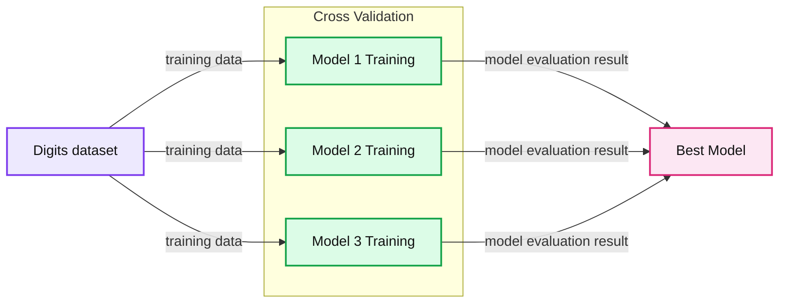

# Auto-scaling scikit-learn with Apache Spark

- Source: https://www.databricks.com/blog/2016/02/08/auto-scaling-scikit-learn-with-apache-spark.html
- Published: 2016-02-08
- Authors: Tim Hunter, Joseph Bradley
- Categories: engineering, data-science-machine-learning, open-source
- Images: 4 total, 3 extracted as architecture

Data scientists often spend hours or days tuning models to get the highest accuracy. This tuning typically involves running a large number of independent Machine Learning (ML) tasks coded in Python or R. Following some work presented at Spark Summit Europe 2015, we are excited to release [scikit-learn integration package for Apache Spark](https://spark-packages.org/package/databricks/spark-sklearn) that dramatically simplifies the life of data scientists using Python. This package automatically distributes the most repetitive tasks of model tuning on a Spark cluster, without impacting the workflow of data scientists:

- When used on a single machine, Spark can be used as a substitute to the default multithreading framework used by [scikit-learn](http://scikit-learn.org/).
- If a need comes to spread the work across multiple machines, no change is required in the code between the single-machine case and the cluster case.

## Scale data science effortlessly

Python is one of the most popular programming languages for data exploration and data science, and this is in no small part due to high quality libraries such as [Pandas](https://pandas.pydata.org/) for data exploration or [scikit-learn](http://scikit-learn.org/) for machine learning. Scikit-learn provides fast and robust implementations of standard ML algorithms such as clustering, classification, and regression.

Scikit-learn's strength has typically been in the realm of computing on a single node, though. For some common scenarios, such as parameter tuning, a large number of small tasks can be run in parallel. These scenarios are perfect use cases for Spark.

We explored how to integrate Spark with scikit-learn, and the result is the Scikit-learn integration package for Spark. It combines the strengths of Spark and scikit-learn *with no changes to users’ code*. It re-implements some components of scikit-learn that benefit the most from distributed computing. Users will find a Spark-based cross-validator class that is fully compatible with scikit-learn's cross-validation tools. By swapping out a single class import, users can distribute cross-validation for their existing scikit-learn workflows.

## Distribute tuning of Random Forests

Consider a classical example of identifying digits in images. Here are a few examples of images taken from the popular digits dataset, with their labels:

We are going to train a [random forest classifier](https://scikit-learn.org/stable/modules/generated/sklearn.ensemble.RandomForestClassifier.html) to recognize the digits. This classifier has a number of parameters to adjust, and there is no easy way to know which parameters work best, other than trying out many different combinations. Scikit-learn provides GridSearchCV, a search algorithm that explores many parameter settings automatically. [GridSearchCV](https://scikit-learn.org/stable/modules/grid_search.html) uses selection by cross-validation, illustrated below. Each parameter setting produces one model, and the best-performing model is selected.

**Summary:** Cross-validation trains multiple models on a digits dataset and selects the best-performing model.

**Components:**

- Digits dataset: digit image data
- Cross Validation: model selection process
- Model 1 Training: trained candidate model
- Model 2 Training: trained candidate model
- Model 3 Training: trained candidate model
- Best Model: selected model

**Flows:**

- Digits dataset -> Model 1 Training: training data
- Digits dataset -> Model 2 Training: training data
- Digits dataset -> Model 3 Training: training data
- Model 1 Training -> Best Model: model evaluation result
- Model 2 Training -> Best Model: model evaluation result
- Model 3 Training -> Best Model: model evaluation result

**Numbers:** 0, 1, 2, 3, 4, 5, 6, 7, Model #1, Model #2, Model #3

source image: https://www.databricks.com/wp-content/uploads/2016/02/scikit-learn-without-spark-training-diagram.png

The [original code](https://scikit-learn.org/stable/auto_examples/classification/plot_digits_classification.html#example-classification-plot-digits-classification-py), using only scikit-learn, is as follows:

The dataset is small (in the hundreds of kilobytes), but exploring all the combinations takes about 5 minutes on a single core. The scikit-learn package for Spark provides an alternative implementation of the cross-validation algorithm that distributes the workload on a Spark cluster. Each node runs the training algorithm using a local copy of the scikit-learn library, and reports the best model back to the master:

**Summary:** Spark distributes cross-validation across multiple scikit-learn model-training workers and selects the best model.

**Components:**

- Input dataset containing handwritten digits
- Spark distributed cross-validation
- Model 1 training using scikit-learn
- Model 2 training using scikit-learn
- Model 3 training using scikit-learn
- Best Model output

**Flows:**

- Input dataset -> Model 1 training: training data
- Input dataset -> Model 2 training: training data
- Input dataset -> Model 3 training: training data
- Model 1 training -> Best Model: candidate model result
- Model 2 training -> Best Model: candidate model result
- Model 3 training -> Best Model: candidate model result

**Numbers:** 0, 1, 2, 3, 4, 5, 6, 7, Model 1, Model 2, Model 3

```mermaid
%% Distributed cross validation with Spark and scikit learn
flowchart LR
    D[Input dataset digits 0 to 7]
    M1[Model 1 training scikit learn]
    M2[Model 2 training scikit learn]
    M3[Model 3 training scikit learn]
    B[Best Model]

    D -->|training data| M1
    D -->|training data| M2
    D -->|training data| M3
    M1 -->|candidate model result| B
    M2 -->|candidate model result| B
    M3 -->|candidate model result| B

    classDef client fill:#dbeafe,stroke:#2563eb,stroke-width:2px,color:#111
    classDef service fill:#dcfce7,stroke:#16a34a,stroke-width:2px,color:#111
    classDef store fill:#ede9fe,stroke:#7c3aed,stroke-width:2px,color:#111
    classDef cache fill:#fef3c7,stroke:#d97706,stroke-width:2px,color:#111
    classDef queue fill:#cffafe,stroke:#0891b2,stroke-width:2px,color:#111
    classDef critical fill:#fee2e2,stroke:#dc2626,stroke-width:4px,color:#111
    classDef external fill:#e5e7eb,stroke:#6b7280,stroke-width:2px,color:#111,stroke-dasharray:4 3
    classDef decision fill:#fce7f3,stroke:#db2777,stroke-width:2px,color:#111

    class D client
    class M1,M2,M3 service
    class B decision

    subgraph Legend
        L1[client clients edge gateway LB]
        L2[service stateless compute]
        L3[store databases durable storage]
        L4[cache Redis CDN losable data]
        L5[queue Kafka streams async pipes]
        L6[critical bottleneck or SPOF]
        L7[external third party]
        L8[decision trade off point]
    end
```

source image: https://www.databricks.com/wp-content/uploads/2016/02/scikit-learn-with-spark-training-diagram.png

The code is the same as before, except for a one-line change:

This example runs under 30 seconds on a 4-node cluster (which has 16 CPUs). For larger datasets and more parameter settings, the difference is even more dramatic.

**Summary:** Benchmark chart showing processing time decreasing as Spark cluster size increases.

**Components:**

- Baseline using 1 core
- Spark cluster using 1 node and 4 cores
- Spark cluster using 2 nodes and 8 cores
- Spark cluster using 4 nodes and 16 cores
- Time axis measured in seconds

**Flows:**

- None visible.

**Numbers:** 0, 100, 200, 300, 400, 1 core, 1 node, 4 cores, 2 nodes, 8 cores, 4 nodes, 16 cores

```mermaid
%% Benchmark processing time by Spark cluster size
flowchart LR
    A[Baseline 1 core]
    B[1 node 4 cores]
    C[2 nodes 8 cores]
    D[4 nodes 16 cores]
    A --- B --- C --- D

    classDef client   fill:#dbeafe,stroke:#2563eb,stroke-width:2px,color:#111
    classDef service  fill:#dcfce7,stroke:#16a34a,stroke-width:2px,color:#111
    classDef store    fill:#ede9fe,stroke:#7c3aed,stroke-width:2px,color:#111
    classDef cache    fill:#fef3c7,stroke:#d97706,stroke-width:2px,color:#111
    classDef queue    fill:#cffafe,stroke:#0891b2,stroke-width:2px,color:#111
    classDef critical fill:#fee2e2,stroke:#dc2626,stroke-width:4px,color:#111
    classDef external fill:#e5e7eb,stroke:#6b7280,stroke-width:2px,color:#111,stroke-dasharray:4 3
    classDef decision fill:#fce7f3,stroke:#db2777,stroke-width:2px,color:#111

    class A,B,C,D service
```

source image: https://www.databricks.com/wp-content/uploads/2016/02/scikit-learn-results.png

## Get started

If you would like to try out this package yourself, it is available as a [Spark package](https://spark-packages.org/package/databricks/spark-sklearn) and as a [PyPI library](https://pypi.org/project/spark-sklearn/). To get started, [check out this example notebook on Databricks](https://www.databricks.com/).

In addition to distributing ML tasks in Python across a cluster, Scikit-learn integration package for Spark provides additional tools to export data from Spark to python and vice-versa. You can find methods to convert Spark DataFrames to [Pandas dataframes](https://www.databricks.com/glossary/pandas-dataframe) and numpy arrays. More details can be found in this [Spark Summit Europe presentation](https://www.slideshare.net/databricks/spark-summit-europe-2015-combining-the-strengths-of-mllib-scikitlearn-and-r).

We welcome feedback and contributions to our open-source [implementation on Github](https://github.com/databricks/spark-sklearn) (Apache 2.0 license).
