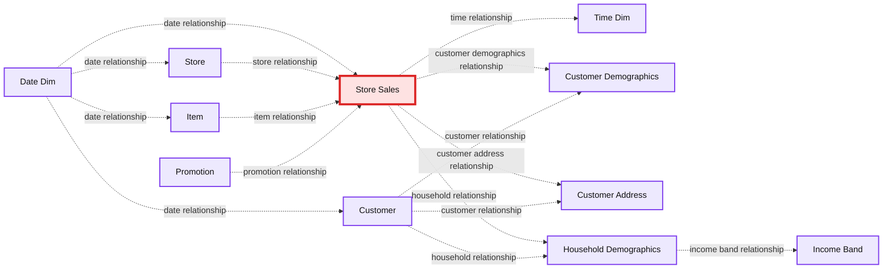

# Reshaping Data with Pivot in Apache Spark

- Source: https://www.databricks.com/blog/2016/02/09/reshaping-data-with-pivot-in-apache-spark.html
- Published: 2016-02-09
- Authors: Andrew Ray
- Categories: engineering, open-source
- Images: 1 total, 1 extracted as architecture

[Spark Summit East](https://www.databricks.com/dataaisummit) is just around the corner! If you haven’t registered yet, you can get tickets and here’s a promo code for 20% off: *Databricks20*

This is a guest blog from our friend at Silicon Valley Data Science. Dr. Andrew Ray is passionate about big data and has extensive experience working with Apache Spark. Andrew is an active contributor to the Apache Spark project including SparkSQL and GraphX.

---

One of the many new features added in Spark 1.6 was the ability to pivot data, creating pivot tables, with a DataFrame (with Scala, Java, or Python). A pivot is an aggregation where one (or more in the general case) of the grouping columns has its distinct values transposed into individual columns. Pivot tables are an essential part of data analysis and reporting. Many popular data manipulation tools (pandas, reshape2, and Excel) and databases (MS SQL and Oracle 11g) include the ability to pivot data. I went over this briefly in a [past post](http://www.svds.com/pivoting-data-in-sparksql/), but will be giving you a deep dive into the details here. Code for this post is available.

## Syntax

In the course of doing the pull request for pivot, one of the pieces of research I did was to look at the syntax of many of the competing tools. I found a wide variety of syntax options. The two main competitors were pandas (Python) and reshape2 (R).

**Original DataFrame (df)**

| **A** | **B** | **C** | **D** |
|---|---|---|---|
| foo | one | small | 1 |
| foo | one | large | 2 |
| foo | one | large | 2 |
| foo | two | small | 3 |
| foo | two | small | 3 |
| bar | one | large | 4 |
| bar | one | small | 5 |
| bar | two | small | 6 |
| bar | two | large | 7 |

**Pivoted DataFrame**

| **A** | **B** | **large** | **small** |
|---|---|---|---|
| foo | two | null | 6 |
| bar | two | 7 | 6 |
| foo | one | 4 | 1 |
| bar | one | 4 | 5 |

For example, say we wanted to group by two columns A and B, pivot on column C, and sum column D. In pandas the syntax would be `pivot_table(df, values='D', index=['A', 'B'], columns=['C'], aggfunc=np.sum)`. This is somewhat verbose, but clear. With reshape2, it is `dcast(df, A + B ~ C, sum)`, a very compact syntax thanks to the use of an R formula. Note that we did not have to specify the value column for reshape2; its inferred as the remaining column of the DataFrame (although it can be specified with another argument).

We came up with our own syntax that fit in nicely with the existing way to do aggregations on a DataFrame. To do the same group/pivot/sum in Spark the syntax is `df.groupBy("A", "B").pivot("C").sum("D")`. Hopefully this is a fairly intuitive syntax. But there is a small catch: to get better performance you need to specify the distinct values of the pivot column. If, for example, column C had two distinct values “small” and “large,” then the more preformant version would be `df.groupBy("A", "B").pivot("C", Seq("small", "large")).sum("D")`. Of course this is the Scala version, there are similar methods that take Java and Python lists.

## Reporting

Let’s look at examples of real-world use cases. Say you are a large retailer (like my former employer) with sales data in a fairly standard transactional format, and you want to make some summary pivot tables. Sure, you could aggregate the data down to a manageable size and then use some other tool to create the final pivot table (although limited to the granularity of your initial aggregation). But now you can do it all in Spark (and you could before it just took a lot of IF’s). Unfortunately, since no large retailers want to share their raw sales data with us we will have to use a synthetic example. A good one that I have used previously is the [TPC-DS](http://www.tpc.org/tpcds/) dataset. Its schema approximates what you would find in an actual retailer.

**Summary:** TPC-DS retail schema relationships centered on the Store_Sales fact table and connected dimension tables.

**Components:**

- Date_Dim - TPC-DS date dimension
- Store - TPC-DS store dimension
- Item - TPC-DS item dimension
- Store_Sales - TPC-DS store sales fact table
- Time_Dim - TPC-DS time dimension
- Promotion - TPC-DS promotion dimension
- Customer_Demographics - TPC-DS customer demographics dimension
- Customer_Address - TPC-DS customer address dimension
- Household_Demographics - TPC-DS household demographics dimension
- Customer - TPC-DS customer dimension
- Income_Band - TPC-DS income band dimension

**Flows:**

- Date_Dim -> Store_Sales: date relationship
- Date_Dim -> Store: date relationship
- Date_Dim -> Item: date relationship
- Date_Dim -> Customer: date relationship
- Store -> Store_Sales: store relationship
- Item -> Store_Sales: item relationship
- Promotion -> Store_Sales: promotion relationship
- Store_Sales -> Time_Dim: time relationship
- Store_Sales -> Customer_Demographics: customer demographics relationship
- Store_Sales -> Customer_Address: customer address relationship
- Store_Sales -> Household_Demographics: household demographics relationship
- Customer -> Customer_Demographics: customer relationship
- Customer -> Customer_Address: customer relationship
- Customer -> Household_Demographics: household relationship
- Household_Demographics -> Income_Band: income band relationship

**Numbers:** none

source image: https://www.databricks.com/wp-content/uploads/2016/02/pivot-blog-image-1.png

Since TPC-DS is a synthetic dataset that is used for benchmarking “big data” databases of various sizes, we are able to generate it in many “scale factors” that determine how large the output dataset is. For simplicity we will use scale factor 1, corresponding to about a 1GB dataset. Since the requirements are a little complicated I have a docker image that you can follow along with. Say we wanted to summarize sales by category and quarter with the later being columns in our pivot table. Then we would do the following (a more realistic query would probably have a few more conditions like time range).

Note that we put the sales numbers in millions to two decimals to keep this easy to look at. We notice a couple of things. First is that Q4 is crazy, this should come as no surprise for anyone familiar with retail. Second, most of these values within the same quarter with the exception of the null category are about the same. Unfortunately, even this great synthetic dataset is not completely realistic. Let me know if you have something better that is publicly available.

## Feature Generation

For a second example, let’s look at feature generation for predictive models. It is not uncommon to have datasets with many observations of your target in the format of one per row (referred to as long form or [narrow data](https://en.wikipedia.org/wiki/Wide_and_narrow_data)). To build models, we need to first reshape this into one row per target; depending on the context this can be accomplished in a few ways. One way is with a pivot. This is potentially something you would not be able to do with other tools (like pandas, reshape2, or Excel), as the result set could be millions or billions of rows.

To keep the example easily reproducible, I’m going to use the relatively small MovieLens 1M dataset. This has about 1 million movie ratings from 6040 users on 3952 movies. Let’s try to predict the gender of a user based on their ratings of the 100 most popular movies. In the below example the ratings table has three columns: user, movie, and rating.

To come up with one row per user we pivot as follows:

Here, popular is a list of the most popular movies (by number of ratings) and we are using a default rating of 3. For user 11 this gives us something like:

Which is the wide form data that is required for modeling. Some notes: I only used the 100 most popular movies because currently pivoting on thousands of distinct values is not particularly fast in the current implementation. More on this later.

## Tips and Tricks

For the best performance, specify the distinct values of your pivot column (if you know them). Otherwise, a job will be immediately launched to determine them{fn this is a limitation of other SQL engines as well as Spark SQL as the output columns are needed for planning}. Additionally, they will be placed in sorted order. For many things this makes sense, but for some, like the day of the week, this will not (Friday, Monday, Saturday, etc).

Pivot, just like normal aggregations, supports multiple aggregate expressions, just pass multiple arguments to the agg method. For example: `df.groupBy("A", "B").pivot("C").agg(sum("D"), avg("D"))`

Although the syntax only allows pivoting on one column, you can combine columns to get the same result as pivoting multiple columns. For example:

Finally, you may be interested to know that there is a maximum number of values for the pivot column if none are specified. This is mainly to catch mistakes and avoid OOM situations. The config key is `spark.sql.pivotMaxValues` and its default is 10,000. You should probably not change it.

## Implementation

The implementation adds a new logical operator `(o.a.s.sql.catalyst.plans.logical.Pivot)`. That logical operator is translated by a new analyzer rule `(o.a.s.sql.catalyst.analysis.Analyzer.ResolvePivot)` that currently translates it into an aggregation with lots of if statements, one expression per pivot value.

For example, `df.groupBy("A", "B").pivot("C", Seq("small", "large")).sum("D")` would be translated into the equivalent of` df.groupBy("A", "B").agg(expr(“sum(if(C = ‘small’, D, null))”), expr(“sum(if(C = ‘large’, D, null))”))`. You could have done this yourself but it would get long and possibly error prone quickly.

## Future Work

There is still plenty that can be done to improve pivot functionality in Spark:

- Make it easier to do in the user's language of choice by adding pivot to the R API and to the SQL syntax (similar to Oracle 11g and MS SQL).
- Add support for unpivot which is roughly the reverse of pivot.
- Speed up the implementation of pivot when there are many distinct values in the pivot column. I’m already working on an idea for this.
