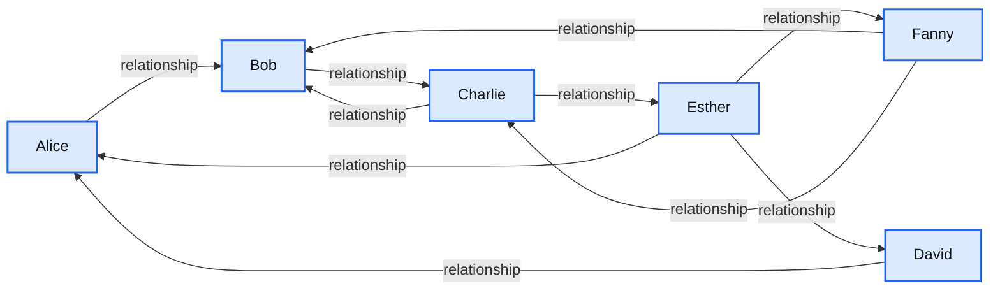
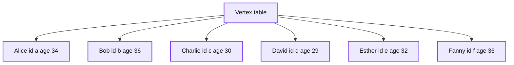
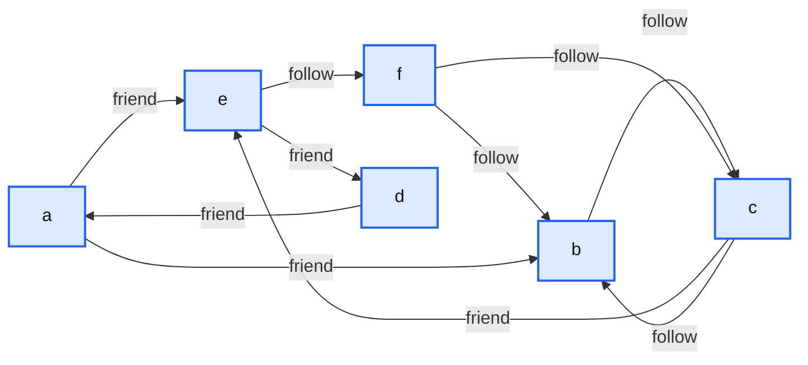
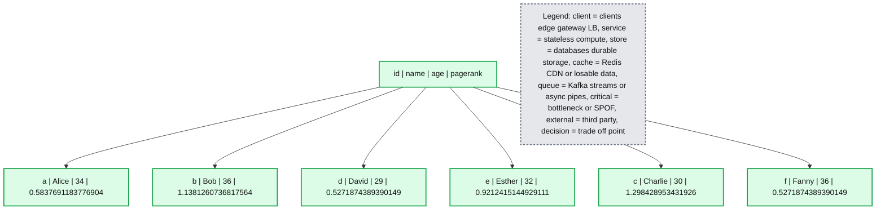
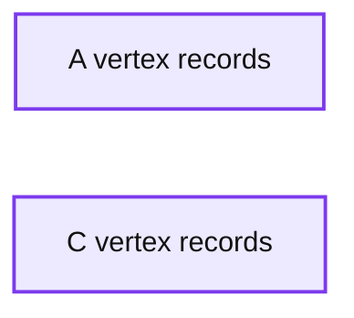

# Introducing GraphFrames

- Source: https://www.databricks.com/blog/2016/03/03/introducing-graphframes.html
- Published: 2016-03-03
- Authors: Ankur Dave, Joseph Bradley, Tim Hunter
- Categories: engineering, open-source
- Images: 5 total, 5 extracted as architecture

*Free Edition has replaced Community Edition, offering enhanced features at no cost. Start using *[*Free Edition *](https://login.databricks.com/?intent=SIGN_UP&amp;signup_experience_step=EXPRESS&amp;provider=DB_FREE_TIER&amp;dbx_source=www)*today.*
 

*We would like to thank Ankur Dave from UC Berkeley AMPLab for his contribution to this blog post.*

---

Databricks is excited to announce the release of GraphFrames, a graph processing library for Apache Spark. Collaborating with UC Berkeley and MIT, we have built a graph library based on DataFrames. GraphFrames benefit from the scalability and high performance of DataFrames, and they provide a uniform API for graph processing available from Scala, Java, and Python.

## What are GraphFrames?

GraphFrames support general graph processing, similar to Apache Spark’s GraphX library. However, GraphFrames are built on top of Spark DataFrames, resulting in some key advantages:

- **Python, Java & Scala APIs:** GraphFrames provide uniform APIs for all 3 languages. For the first time, all algorithms in GraphX are available from Python & Java.
- **Powerful queries:** GraphFrames allow users to phrase queries in the familiar, powerful APIs of [Spark SQL](https://www.databricks.com/glossary/what-is-spark-sql) and DataFrames.
- **Saving & loading graphs:** GraphFrames fully support [DataFrame data sources](https://spark.apache.org/docs/latest/sql-programming-guide.html#data-sources), allowing writing and reading graphs using many formats like Parquet, JSON, and CSV.

In GraphFrames, vertices and edges are represented as DataFrames, allowing us to store arbitrary data with each vertex and edge.

## An example social network

Say we have a social network with users connected by relationships. We can represent the network as a [graph](https://en.wikipedia.org/wiki/Graph_(discrete_mathematics)), which is a set of vertices (users) and edges (connections between users). A toy example is shown below.

**Summary:** A social network graph showing directed relationships among six users.

**Components:**

- Alice: user, technology not specified
- Bob: user, technology not specified
- Fanny: user, technology not specified
- Charlie: user, technology not specified
- Esther: user, technology not specified
- David: user, technology not specified

**Flows:**

- Alice -> Bob: social relationship
- Fanny -> Bob: social relationship
- Bob -> Charlie: social relationship
- Charlie -> Bob: social relationship
- Fanny -> Charlie: social relationship
- Charlie -> Esther: social relationship
- David -> Alice: social relationship
- Esther -> Alice: social relationship
- Esther -> Fanny: social relationship
- Esther -> David: social relationship

**Numbers:** none

source image: https://www.databricks.com/wp-content/uploads/2016/03/social-network-graph-diagram.png

*Click on the image to see the full example notebook*

We might then ask questions such as “Which users are most influential?” or “Users A and B do not know each other, but should they be introduced?” These types of questions can be answered using graph queries and algorithms.

GraphFrames can store data with each vertex and edge. In a social network, each user might have an age and name, and each connection might have a relationship type.

**Summary:** A table lists six social graph vertices with their IDs, names, and ages.

**Components:**

- Vertex table with columns id, name, and age
- Rows for Alice, Bob, Charlie, David, Esther, and Fanny

**Flows:**

- none

**Numbers:** 34, 36, 30, 29, 32, 36

source image: https://www.databricks.com/wp-content/uploads/2016/03/social-network-graph-verticies.png

**Summary:** A table shows social graph edges, including source users, destination users, and relationship types.

**Components:**

- Source user
- Destination user
- Relationship type

**Flows:**

- a -> e: friend
- f -> b: follow
- c -> e: friend
- a -> b: friend
- b -> c: follow
- c -> b: follow
- f -> c: follow
- e -> f: follow
- e -> d: friend
- d -> a: friend

**Numbers:** none

source image: https://www.databricks.com/wp-content/uploads/2016/03/social-network-graph-edges.png

*Click on the table to see the full example notebook*

## Simple queries are simple

GraphFrames make it easy to express queries over graphs. Since GraphFrame vertices and edges are stored as DataFrames, many queries are just DataFrame (or SQL) queries.

**Example:**
*How many users in our social network have “age” > 35?*
We can query the `vertices` DataFrame:
`g.vertices.filter("age > 35")`

**Example:**
*How many users have at least 2 followers?*
We can combine the built-in inDegrees method with a DataFrame query.
`g.inDegrees.filter("inDegree >= 2")`

## Graph algorithms support complex workflows

GraphFrames support the full set of algorithms available in GraphX, in all 3 language APIs. Results from graph algorithms are either DataFrames or GraphFrames. For example, what are the most important users? We can run PageRank:

results = g.pageRank(resetProbability=0.15, maxIter=10)
display(results.vertices)

**Summary:** PageRank results are presented in a table of six users with their IDs, names, ages, and PageRank scores.

**Components:**

- ID column - vertex identifiers
- Name column - user names
- Age column - user ages
- PageRank column - PageRank scores
- User rows - Alice, Bob, David, Esther, Charlie, and Fanny

**Flows:**

- none

**Numbers:** 34, 36, 29, 32, 30, 36, 0.5837691183776904, 1.1381260736817564, 0.5271874389390149, 0.9212415144929111, 1.298428953431926, 0.5271874389390149

source image: https://www.databricks.com/wp-content/uploads/2016/03/PageRank-results.png

*Click on the table to see the full example notebook*

GraphFrames also support new algorithms:

- Breadth-first search (BFS): Find shortest paths from one set of vertices to another
- Motif finding: Search for structural patterns in a graph

Motif finding lets us make powerful queries. For example, to recommend whom to follow, we might search for triplets of users A,B,C where A follows B and B follows C, but A does not follow C.

### Motif: A->B->C but not A->C

results = g.find("(A)-[]->(B); (B)-[]->(C); !(A)-[]->(C)")

### Filter out loops (with DataFrame operation)

results = results.filter("A.id != C.id")

### Select recommendations for A to follow C

results = results.select("A", "C")
display(results)

**Summary:** Motif findings are displayed as paired vertex records in columns A and C.

**Components:**

- A: vertex records with id, name, and age
- C: vertex records with id, name, and age

**Flows:**

- none visible

**Numbers:** 32, 30, 36, 34, 29

source image: https://www.databricks.com/wp-content/uploads/2016/03/GraphFrames-motif-findings.png

*Click on the table to see the full example notebook*

The full set of GraphX algorithms supported by GraphFrames is:

- PageRank: Identify important vertices in a graph
- Shortest paths: Find shortest paths from each vertex to landmark vertices
- Connected components: Group vertices into connected subgraphs
- Strongly connected components: Soft version of connected components
- Triangle count: Count the number of triangles each vertex is part of
- Label Propagation Algorithm (LPA): Detect communities in a graph

## GraphFrames integrate with GraphX

GraphFrames fully integrate with GraphX via conversions between the two representations, without any data loss. We can convert our social network to a GraphX graph and back to a GraphFrame.

val gx: Graph[Row, Row] = g.toGraphX()
val g2: GraphFrame = GraphFrame.fromGraphX(gx)

## What's next?

Graph-specific optimizations for DataFrames are under active research and development. Watch Ankur Dave’s [Spark Summit East 2016 talk](https://www.databricks.com/dataaisummit) to learn more. We plan to include some of these optimizations in GraphFrames for its next release!

**Get started** with these tutorial notebooks in [Scala](https://www.databricks.com/) and [Python](https://www.databricks.com/) in the free [Databricks Community Edition](https://www.databricks.com/try-databricks).
**Download** the GraphFrames package from the [Spark Packages website](https://spark-packages.org/package/graphframes/graphframes). GraphFrames are compatible with Spark 1.4, 1.5, and 1.6.

The code is available on [Github](https://github.com/graphframes/graphframes) under the Apache 2.0 license. We welcome contributions! Check the [Github issues](https://github.com/graphframes/graphframes/issues) for ideas to work on.
