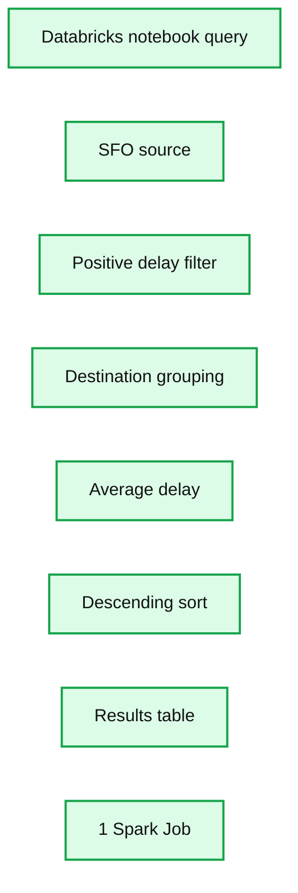

# On-Time Flight Performance with GraphFrames for Apache Spark

- Source: https://www.databricks.com/blog/2016/03/16/on-time-flight-performance-with-graphframes-for-apache-spark.html
- Published: 2016-03-16
- Authors: Joseph Bradley, Bill Chambers, Denny Lee
- Categories: engineering, open-source
- Images: 4 total, 2 extracted as architecture

---

## Introduction

Graph structures are a more intuitive approach to many classes of data problems.  Whether traversing social networks, restaurant recommendations, or flight paths, it is easier to understand these data problems within the context of graph structures: vertices, edges, and properties.  For example, the analysis of flight data is a classic graph problem as airports are represented by *vertices* and flights are represented by *edges*.  As well, there are numerous *properties* associated with these flights including but not limited to departure delays, plane type, and carrier.

In this post, we will use GraphFrames (as recently announced in [Introducing GraphFrames](https://www.databricks.com/blog/2016/03/03/introducing-graphframes.html)) within Databricks notebooks to quickly and easily analyze flight performance data organized in graph structures.  Because we’re using graph structures, we can easily ask a number of questions that are not as intuitive as tabular structures such as finding structural motifs, airport ranking using PageRank, and shortest paths between cities. GraphFrames leverage the distribution and expression capabilities of the DataFrame API to both simplify your queries and leverage the performance optimizations of the Apache Spark SQL engine.  In addition, with GraphFrames, graph analysis is available in Python, Scala, and Java.

## Install the GraphFrames Spark Package

To use GraphFrames, you will first need to install the [GraphFrames Spark Packages](https://spark-packages.org/package/graphframes/graphframes).  Installing packages in Databricks is a few simple steps ([join the beta waitlist here](https://www.databricks.com/)  to try for yourself).

Note, to reference GraphFrames within spark-shell, pyspark, or spark-submit:

 

## Preparing the Flight Datasets

The two sets of data that make up our graphs are the `airports` dataset (vertices) which can be found at [OpenFlights Airport, airline and route data](https://openflights.org/) and the `departuredelays` dataset (edges) which can be found at  [Airline On-Time Performance and Causes of Flight Delays: On_Time Data](https://www.bts.gov/explore-topics-and-geography/topics/airline-time-performance-and-causes-flight-delays).

After installing the [GraphFrames Spark Package](https://spark-packages.org/package/graphframes/graphframes), you can import it and create your vertices, edges, and GraphFrame (in PySpark) as noted below.

# Import graphframes (from Spark-Packages)
 from graphframes import *

# Create Vertices (airports) and Edges (flights)
 tripVertices = airports.withColumnRenamed("IATA", "id").distinct()
 tripEdges = departureDelays.select("tripid", "delay", "src", "dst", "city_dst", "state_dst")

# This GraphFrame builds upon the vertices and edges based on our trips (flights)
 tripGraph = GraphFrame(tripVertices, tripEdges)

For example, the tripEdges contains the flight data identifying the *origin* IATA airport code (src) and the *destination* IATA airport code (dst), city (city_dst), and state (state_dst) as well as the departure delays (delay).

## Simple Queries against the tripGraph GraphFrame

Now that you have created your tripGraph GraphFrame, you can run a number of simple queries to quickly traverse and understand your GraphFrame.    For example, to **understand the number of airports and trips** in your GraphFrame, run the PySpark code below.

print "Airports: %d" % tripGraph.vertices.count()
 print "Trips: %d" % tripGraph.edges.count()

Which returns the output:

Because GraphFrames are DataFrame-based Graphs in Spark, you can write highly expressive queries leveraging the DataFrame API.  For example, the query below allows us to filter flights (edges) for delayed flights (delay > 0) originating from SFO airport where we calculate and sort by the average delay, i.e. **What flights departing from SFO are most likely to have significant delays?**

tripGraph.edges\
 .filter("src = 'SFO' and delay > 0")\
 .groupBy("src", "dst")\
 .avg("delay")\
 .sort(desc("avg(delay)"))

Reviewing the output, you will quickly identify there are significant average delays to Will Rogers World Airport (OKC), Jackson Hole (JAC), and Colorado Springs (COS) from SFO in this dataset.

**Summary:** Databricks displays average positive flight delays from SFO grouped by destination and sorted descending.

**Components:**

- Databricks notebook query
- Source airport SFO
- Destination airport column
- Delay filter
- Average delay aggregation
- Descending sort
- Results table
- Spark Jobs indicator

**Flows:**

- None visible

**Numbers:**

- 1 Spark Job
- 0 delay threshold
- 59.073170731707314
- 57.13333333333333
- 53.976190476190474
- 48.09090909090909
- 47.625
- 46.80952380952381

source image: https://www.databricks.com/wp-content/uploads/2016/03/SFO-significant-delays-1024x550.png

With Databricks notebooks, we can also quickly visualize geographically: **What destination states tend to have significant delays departing from SEA**?

 

## Using Motif Finding to understand flight delays

To more easily understand the complex relationship of city airports and their flights with each other, we can use motifs to find patterns of airports (i.e. vertices) connected by flights (i.e. edges). The result is a DataFrame in which the column names are given by the motif keys.

For example, to ask the question **What delays might we blame on SFO?**,** **you can generate the simplified motif below.

motifs = tripGraphPrime.find("(a)-[ab]->(b); (b)-[bc]->(c)")\
 .filter("(b.id = 'SFO') and (ab.delay > 500 or bc.delay > 500) and bc.tripid > ab.tripid and bc.tripid > ab.tripid + 10000")
 display(motifs)

With SFO as the connecting city (b), we are looking for all flights [ab] from any origin city (a) that will connect to SFO (b) prior to flying [bc] to any destination city (c). We are filtering it such that the delay for either flight ([ab] or [bc]) is greater than 500 minutes and the second flight (bc) occurred within approximately a day of the first flight (ab).

Below is an abridged subset from this query where the columns are the respective motif keys.

| **a** | **ab** | **b** | **bc** | **c** |
|---|---|---|---|---|
| Houston (IAH) | IAH -> SFO (-4) [1011126] | San Francisco (SFO) | SFO -> JFK (536) [1021507] | New York (JFK) |
| Tuscon (TUS) | TUS -> SFO (-5) [1011126] | San Francisco (SFO) | SFO -> JFK (536) [1021507] | New York (JFK) |

With this motif finding query, we have quickly determined that passengers in this dataset left Houston and Tuscon for San Francisco on time or a little early [1011126].  But for any of those passengers that were flying to New York through this connecting flight in SFO [1021507], they were delayed by 536 minutes.

## Using PageRank to find the most important airport

Because GraphFrames is built on GraphX, there are a number of built-in algorithms that we can leverage right away. PageRank was popularized by the Google Search Engine and created by Larry Page. To quote Wikipedia:

*PageRank works by counting the number and quality of links to a page to determine a rough estimate of how important the website is. The underlying assumption is that more important websites are likely to receive more links from other websites.*

While the above example refers to web pages, what’s awesome about this concept is that it readily applies to any graph structure whether it is created from web pages, bike stations, or airports and the interface is as simple as calling a method. You’ll also notice that GraphFrames will return the PageRank results as a new column appended to the vertices DataFrame for a simple way to continue our analysis after running the algorithm!

As there are a large number of flights and connections through the various airports included in this dataset, we can use the PageRank algorithm to have Spark traverse the graph iteratively to compute a rough estimate of how important each airport is.

# Determining Airport ranking of importance using pageRank
 ranks = tripGraph.pageRank(resetProbability=0.15, maxIter=5)

display(ranks.vertices.orderBy(ranks.vertices.pagerank.desc()).limit(20))

As noted in the chart below, using the PageRank algorithm, Atlanta is considered one of the most important airports based on the quality of connections (i.e. flights) between the different vertices (i.e. airports); corresponding to the fact that [Atlanta is the busiest airport in the world by passenger traffic](https://en.wikipedia.org/wiki/List_of_the_world%27s_busiest_airports_by_passenger_traffic#2015_statistics).

**Summary:** Bar chart ranking airports by PageRank, with ATL highest at approximately 10.1.

**Components:**

- PageRank metric
- Airport IDs: ATL, DFW, ORD, DEN, LAX, IAH, SFO, SLC, PHX, LAS, SEA, DTW, MSP, MCO, EWR, CLT, LGA, BOS, BWI, MIA
- Bar ranking visualization
- Job indicator showing 6 Spark jobs

**Flows:**

- Airport IDs -> PageRank bars: ranked airport scores

**Numbers:** 6; PageRank axis 0 through 11; approximate bar values: ATL 10.1, DFW 7.3, ORD 7.2, DEN 5.0, LAX 4.2, IAH 4.0, SFO 3.5, SLC 3.3, PHX 3.1, LAS 2.4, SEA 2.3, DTW 2.1, MSP 2.1, MCO 2.0, EWR 2.0, CLT 1.9, LGA 1.9, BOS 1.7, BWI 1.7, MIA 1.6

source image: https://www.databricks.com/wp-content/uploads/2016/03/airport-ranking-pagerank-id-1024x335.png

## Determining flight connections

With so many flights between various cities, you can use the `GraphFrames.bfs` (Breadth First Search) method to find the paths between two cities.  The query below attempts to find the path between San Francisco (SFO) and Buffalo (BUF) with a maximum path length of 1 (i.e direct flight).  The results set is empty (i.e. no direct flights between SFO and BUF).

filteredPaths = tripGraph.bfs(
 fromExpr = "id = 'SFO'",
 toExpr = "id = 'BUF'",
 maxPathLength = 1)
 display(filteredPaths)

So let’s extend the query to have a `maxPathLength = 2`, that is having one connecting flight between SFO and BUF.

filteredPaths = tripGraph.bfs(
 fromExpr = "id = 'SFO'",
 toExpr = "id = 'BUF'",
 maxPathLength = 2)
 display(filteredPaths)

An abridged subset of the paths from SFO to BUF can be seen in the table below.

| **from** | **v1** | **to** |
|---|---|---|
| SFO | MSP (Minneapolis) | BUF |
| SFO | EWR (Newark) | BUF |
| SFO | JFK (New York) | BUF |
| SFO | ORD (Chicago) | BUF |
| SFO | ATL (Atlanta) | BUF |
| SFO | LAS (Las Vegas) | BUF |
| SFO | BOS (Boston) | BUF |
| ... | ... | ... |

## Visualizing Flights Using D3

To get a powerful visualization of the flight paths and connections in this dataset, we can leverage the [Airports D3 visualization](https://mbostock.github.io/d3/talk/20111116/airports.html) within our Databricks notebook.  By connecting our GraphFrames, DataFrames, and D3 visualizations, we can visualize the scope of all of the flight connections as noted below for all on-time or early departing flights within this dataset.  The blue circles represent the vertices i.e. airports where the size of the circle represents the number of edges i.e. flights in and out of those airports.  The black lines are the edges themselves i.e. flights and their respective connections to the other vertices i.e. airports.  Note for any edges that go offscreen, they are representing vertices i.e. airports in the states of Hawaii and Alaska.

https://www.youtube.com/watch?v=riJGOmKF3Bs
