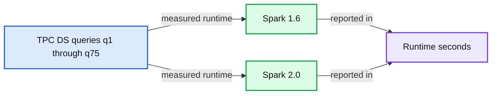

# Technical Preview of Apache Spark 2.0 Now on Databricks

- Source: https://www.databricks.com/blog/2016/05/11/apache-spark-2-0-technical-preview-easier-faster-and-smarter.html
- Published: 2016-05-11
- Authors: Reynold Xin
- Categories: engineering, open-source
- Images: 3 total, 1 extracted as architecture

For the past few months, we have been busy contributing to the next major release of the big data open source software we love: Apache Spark 2.0. Since Spark 1.0 came out two years ago, we have heard praises and complaints. Spark 2.0 builds on what the community has learned in the past two years, doubling down on what users love and improving on what users lament. While this blog summarizes the three major thrusts and themes—easier, faster, and smarter—that comprise Spark 2.0, the themes highlighted here deserve deep-dive discussions that we will follow up with in-depth blogs in the next few weeks.

Before we dive in, we are happy to announce the availability of the Apache Spark 2.0 technical preview in [Databricks](https://www.databricks.com/try-databricks). This preview package is based on the upstream [2.0.0-preview release](https://spark.apache.org/news/spark-2.0.0-preview.html). Using the preview package is as simple as selecting the “2.0 (branch preview)” version when launching a cluster:

Whereas the final Apache Spark 2.0 release is still a few weeks away, this technical preview is intended to provide early access to the features in Spark 2.0 based on the upstream codebase. This way, you can satisfy your curiosity to try the shiny new toy, while we get feedback and bug reports early before the final release.

Now, let’s take a look at the new developments.

### Easier: SQL and Streamlined APIs

One thing we are proud of in Spark is creating APIs that are simple, intuitive, and expressive. Spark 2.0 continues this tradition, with focus on two areas: (1) standard SQL support and (2) unifying DataFrame/Dataset API.

On the SQL side, we have significantly expanded the SQL capabilities of Spark, with the introduction of a new ANSI SQL parser and support for subqueries. **Spark 2.0 can run all the 99 TPC-DS queries, which require many of the SQL:2003 features.** Because SQL has been one of the primary interfaces Spark applications use, this extended SQL capabilities drastically reduce the porting effort of legacy applications over to Spark.

On the programming API side, we have streamlined the APIs:

- **Unifying DataFrames and Datasets in Scala/Java:** Starting in Spark 2.0, DataFrame is just a type alias for Dataset of Row. Both the typed methods (e.g. `map`, `filter`, `groupByKey`) and the untyped methods (e.g. `select`, `groupBy`) are available on the Dataset class. Also, this new combined Dataset interface is the abstraction used for Structured Streaming. Since compile-time type-safety in Python and R is not a language feature, the concept of Dataset does not apply to these languages’ APIs. Instead, DataFrame remains the primary programing abstraction, which is analogous to the single-node data frame notion in these languages.
- **SparkSession:** a new entry point that replaces the old SQLContext and HiveContext. For users of the DataFrame API, a common source of confusion for Spark is which “context” to use. Note that the old SQLContext and HiveContext are still kept for backward compatibility.
- **Simpler, more performant Accumulator API:** We have designed a new Accumulator API that has a simpler type hierarchy and support specialization for primitive types. The old Accumulator API has been deprecated but retained for backward compatibility
- **DataFrame-based Machine Learning API emerges as the primary ML API:** With Spark 2.0, the spark.ml package, with its “pipeline” APIs, will emerge as the primary machine learning API. While the original spark.mllib package is preserved, future development will focus on the DataFrame-based API.
- **Distributed algorithms in R:** Added support for Generalized Linear Models (GLM), Naive Bayes, Survival Regression, and K-Means in R.

### Faster: Spark as a Compiler

According to our [2015 Spark Survey](https://www.databricks.com/blog/2015/09/24/spark-survey-2015-results-are-now-available.html), 91% of users consider performance as the most important aspect of Spark. As a result, performance optimizations have always been a focus in our Spark development. Before we started planning our contributions to Spark 2.0, we asked ourselves a question: **Spark is already pretty fast, but can we push the boundary and make Spark 10X faster?**

This question led us to fundamentally rethink the way we build Spark’s physical execution layer. When you look into a modern data engine (e.g. Spark or other MPP databases), majority of the CPU cycles are spent in useless work, such as making virtual function calls or reading/writing intermediate data to CPU cache or memory. Optimizing performance by reducing the amount of CPU cycles wasted in these useless work has been a long time focus of modern compilers.

Spark 2.0 ships with the second generation Tungsten engine. **This engine builds upon ideas from modern compilers and MPP databases and applies them to data processing.** The main idea is to emit optimized bytecode at runtime that collapses the entire query into a single function, eliminating virtual function calls and leveraging CPU registers for intermediate data. We call this technique “whole-stage code generation.”

To give you a teaser, we have measured the amount of time (in nanoseconds) it would take to process a row on one core for some of the operators in Spark 1.6 vs. Spark 2.0, and the table below is a comparison that demonstrates the power of the new Tungsten engine. Spark 1.6 includes expression code generation technique that is also in use in some state-of-the-art commercial databases today. As you can see, many of the core operators are becoming an order of magnitude faster with whole-stage code generation.

cost per row (single thread)

| primitive | Spark 1.6 | Spark 2.0 |
|---|---|---|
| filter | 15ns | 1.1ns |
| sum w/o group | 14ns | 0.9ns |
| sum w/ group | 79ns | 10.7ns |
| hash join | 115ns | 4.0ns |
| sort (8-bit entropy) | 620ns | 5.3ns |
| sort (64-bit entropy) | 620ns | 40ns |
| sort-merge join | 750ns | 700ns |

 

How does this new engine work on end-to-end queries? We did some preliminary analysis using TPC-DS queries to compare Spark 1.6 and Spark 2.0:

**Summary:** Benchmark chart comparing TPC-DS query runtime in Spark 1.6 and Spark 2.0, where lower runtime is better.

**Components:**

- TPC-DS queries, labeled q1 through q75
- Spark 1.6 benchmark series
- Spark 2.0 benchmark series
- Runtime in seconds axis

**Flows:**

- TPC-DS queries -> Spark 1.6 benchmark series: query runtime measurements
- TPC-DS queries -> Spark 2.0 benchmark series: query runtime measurements

**Numbers:** 1.6, 2.0, 0, 100, 200, 300, 400, 500, 600, q1, q2, q3, q5, q7, q9, q12, q13, q15, q16, q18, q19, q20, q21, q22, q24, q25, q26, q27, q28, q30, q31, q32, q33, q34, q35, q36, q37, q38, q39, q40, q41, q42, q43, q44, q45, q46, q47, q48, q49, q50, q51, q52, q53, q54, q55, q56, q57, q58, q59, q60, q61, q62, q63, q64, q65, q66, q67, q68, q69, q70, q71, q72, q73, q74, q75

source image: https://www.databricks.com/wp-content/uploads/2016/05/preliminary-tpc-ds-spark-2-0-vs-1-6.png

Beyond whole-stage code generation to improve performance, a lot of work has also gone into improving the Catalyst optimizer for general query optimizations such as nullability propagation, as well as a new vectorized Parquet decoder that has improved Parquet scan throughput by 3X.

### Smarter: Structured Streaming

Spark Streaming has long led the big data space as one of the first attempts at unifying batch and streaming computation. As a first streaming API called DStream and introduced in Spark 0.7, it offered developers with several powerful properties: exactly-once semantics, fault-tolerance at scale, and high throughput.

However, after working with hundreds of real-world deployments of Spark Streaming, we found that applications that need to make decisions in real-time often require more than just a streaming engine. They require deep integration of the batch stack and the streaming stack, integration with external storage systems, as well as the ability to cope with changes in business logic. As a result, enterprises want more than just a streaming engine; instead they need a full stack that enables them to develop end-to-end “continuous applications.”

One school of thought is to treat everything like a stream; that is, adopt a single programming model integrating both batch and streaming data.

A number of problems exist with this single model. First, operating on data as it arrives in can be very difficult and restrictive. Second, varying data distribution, changing business logic, and delayed data—all add unique challenges. And third, most existing systems, such as MySQL or Amazon S3, do not behave like a stream and many algorithms (including most off-the-shelf machine learning) do not work in a streaming setting.

Spark 2.0's Structured Streaming APIs is a novel way to approach streaming. It stems from the realization that **the simplest way to compute answers on streams of data is to *not having to reason* about the fact that it is a stream**. This realization came from our experience with programmers who already know how to program static data sets (aka batch) using Spark’s powerful DataFrame/Dataset API. The vision of Structured Streaming is to utilize the Catalyst optimizer to discover when it is possible to transparently turn a static program into an incremental execution that works on dynamic, infinite data (aka a stream). When viewed through this structured lens of data—as discrete table or an infinite table—you simplify streaming.

As the first step towards realizing this vision, Spark 2.0 ships with an initial version of the Structured Streaming API, a (surprisingly small!) extension to the DataFrame/Dataset API. This unification should make adoption easy for existing Spark users, allowing them to leverage their knowledge of Spark batch API to answer new questions in real-time. Key features here will include support for event-time based processing, out-of-order/delayed data, sessionization and tight integration with non-streaming data sources and sinks.

Streaming is clearly a pretty broad topic, so stay tuned to this blog for more details on Structured Streaming in Spark 2.0, including details on what is possible in this release and what is on the roadmap for the near future.

### Conclusion

Spark users initially came to Spark for its ease-of-use and performance. Spark 2.0 doubles down on these while extending it to support an even wider range of workloads. We hope you will enjoy the preview, and look forward to your feedback.

Of course, until the upstream Apache Spark 2.0 release is finalized, we do not recommend fully migrating any production workload onto this preview package. **This technical preview version is now available on Databricks.** To get access to Databricks, sign up [here](https://www.databricks.com/try-databricks).

### Read More

If you missed our webinar for Apache Spark 2.0: Easier, Faster, and Smarter, you can download slides and attached notebooks.
