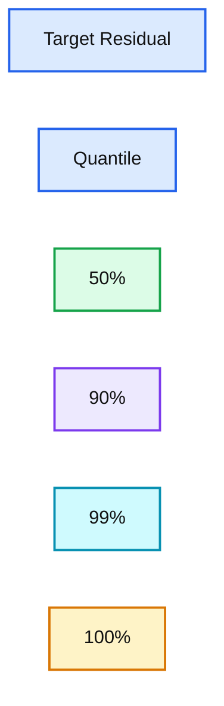
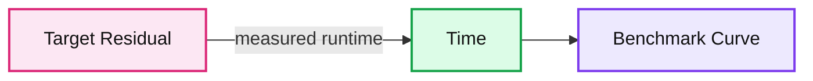

# Approximate Algorithms in Apache Spark: HyperLogLog and Quantiles

- Source: https://www.databricks.com/blog/2016/05/19/approximate-algorithms-in-apache-spark-hyperloglog-and-quantiles.html
- Published: 2016-05-19
- Authors: Tim Hunter, Hossein Falaki, Joseph Bradley
- Categories: solutions, engineering, open-source, data-engineering
- Images: 4 total, 4 extracted as architecture

## Introduction

[Apache Spark](https://spark.apache.org/) is fast, but applications such as preliminary data exploration need to be even faster and are willing to sacrifice some accuracy for a faster result. Since version 1.6, Spark implements *approximate algorithms* for some common tasks: counting the number of distinct elements in a set, finding if an element belongs to a set, computing some basic statistical information for a large set of numbers. Eugene Zhulenev, from Collective, has already [blogged in these pages about the use of approximate counting in the advertising business](https://www.databricks.com/blog/2015/10/13/interactive-audience-analytics-with-apache-spark-and-hyperloglog.html).

The following algorithms have been implemented against [DataFrames](https://www.databricks.com/blog/2015/02/17/introducing-dataframes-in-spark-for-large-scale-data-science.html) and [Datasets](https://www.databricks.com/blog/2016/01/04/introducing-apache-spark-datasets.html) and committed into Apache Spark’s branch-2.0, so they will be available in Apache Spark 2.0 for Python, R, and Scala:

- **approxCountDistinct:** returns an estimate of the number of distinct elements
- **approxQuantile:** returns approximate percentiles of numerical data

Researchers have looked at such algorithms for a long time. Spark strives at implementing approximate algorithms that are deterministic (they do not depend on random numbers to work) and that have proven theoretical error bounds: for each algorithm, the user can specify a target error bound, and the result is guaranteed to be within this bound, either exactly (deterministic error bounds) or with very high confidence (probabilistic error bounds). Also, it is important that this algorithm works well for the wealth of use cases seen in the Spark community.

In this blog, we are going to present details on the implementation of **approxCountDistinct** and **approxQuantile** algorithms and showcase its implementation in a Databricks notebook.

## Approximate count of distinct elements

In ancient times, imagine [Cyrus the Great](https://en.wikipedia.org/wiki/Cyrus_the_Great), emperor of Persia and Babylon, having just completed a census of all his empire, fancied to know how many different first names were used throughout his empire, and he put his vizier to the task. The vizier knew that his lord was impatient and wanted an answer fast, even if just an approximate.

There was an issue, though; some names such as Darius, Atusa or Ardumanish were very popular and appeared often on the census records. Simply counting how many people were living within the empire would give a poor answer, and the emperor would not be fooled.

However, the vizier had some modern and profound knowledge of mathematics. He assembled all the servants of the palace, and said: “Servants, each of you will take a clay tablet from the census record. For each first name that is inscribed on the tablet, you will take the first 3 letters of the name, called l1, l2 and l3, and compute the following number:

For example, for Darius (D = 3, A = 0, R = 17), you will get N = 16340.

This will give you a number for each name of the tablet. For each number, you will count the number of zeros that end this number. In the case of Hossein (N=17739), this will give you no zero. After each of you does that for each name on his or her tablet, you will convene and you will tell me what is the greatest number of zeros you have observed. Now proceed with great haste and make no calculation mistake, lest you want to endure my wrath!”

At the end of the morning, one servant came back, and said they had found a number with four zeros, and that was the largest they all observed across all the census records. The vizier then announced to his master that he was the master of a population with about 1.3 * 10^4 = 13000 different names. The emperor was highly impressed and he asked the vizier how he had accomplished this feat. To which the vizier uttered one word: “hyper-log-log”.

The HyperLogLog algorithm (and its variant HyperLogLog++ implemented in Spark) relies on a clever observation: if the numbers are spread uniformly across a range, then the count of distinct elements can be approximated from the largest number of leading zeros in the binary representation of the numbers. For example, if we observe a number whose digits in binary form are of the form 0…(k times)...01...1, then we can estimate that there are in the order of 2^k elements in the set. This is a very crude estimate but it can be refined to great precision with a sketching algorithm.

From the example above with the vizier and his servants, this algorithm does not need to perform shuffling, just map (each servant works on a tablet) and combine (the servants can make pairs and decide which one has the greatest number, until there is only one servant). There is no need move data around, only small statistics about each block of data, which makes it very useful in a large dataset setting such as Spark.

Now, in modern times, how well does this technique work, where datasets are much larger and when servants are replaced with a Spark cluster? We considered a dataset of 25 millions online reviews from an online retail vendor, and we set out to approximate the number of customers behind these reviews. Since customers write multiple reviews, it is a good fit for approximate distinct counting.

Here is how to get an approximate count of users in [PySpark](https://www.databricks.com/glossary/pyspark), within 1% of the true value and with high probability:

## users: DataFrame[user: string]

users.select(approxCountDistinct("user", rsd = 0.01)).show()

This plot (fig. 1) shows how the number of distinct customers varies by the error margin. As expected, the answer becomes more and more precise as the requested error margin decreases.

*Fig. 1*

**Summary:** The chart shows normalized distinct customer counts across different target residual error margins.

**Components:**

- Target Residual axis
- Normalized distinct count axis
- Approximate distinct count series

**Flows:**

- Target residual 0.002 -> 0.005: normalized count rises slightly
- Target residual 0.005 -> 0.009: normalized count rises
- Target residual 0.009 -> 0.013: normalized count rises
- Target residual 0.013 -> 0.025: normalized count rises
- Target residual 0.025 -> 0.050: normalized count rises
- Target residual 0.050 -> 0.070: normalized count falls slightly
- Target residual 0.070 -> 0.110: normalized count rises sharply
- Target residual 0.110 -> 0.160: normalized count falls
- Target residual 0.160 -> 0.310: normalized count falls sharply

**Numbers:** 0.002, 0.005, 0.009, 0.013, 0.025, 0.050, 0.070, 0.110, 0.160, 0.310, 0.95, 1.00, 1.05, 1.10, 1.15

source image: https://www.databricks.com/wp-content/uploads/2016/05/hyperloglog-plot-figure-4.png

Fig. 1

How long does it take to compute? For the analysis above, this plot (fig 2.) presents the running time of the approximate counting against the requested precision. For errors above 1%, the running time is just a minute fraction of computing the exact answer. For precise answers, however, the running time increases very fast and it is better to directly compute the exact answer.

*Fig. 2*

**Summary:** Benchmark chart showing normalized runtime versus target residual for approximate counting.

**Components:**

- Target Residual x-axis
- Time normalized y-axis
- Approximate counting runtime series
- Exact-answer baseline at normalized time 1.0

**Flows:**

- Target residual increases -> normalized runtime generally decreases
- Approximate counting runtime -> crosses the exact-answer baseline near 1% residual

**Numbers:** 2.5, 2.0, 1.5, 1.0, 0.5, 0.005, 0.010, 0.100, 0.300

```mermaid
%% Shows normalized approximate-counting runtime across target residual values
flowchart LR
    A[Residual 0.003] -->|runtime 2.45| B[Residual 0.005]
    B -->|runtime 1.25| C[Residual 0.010]
    C -->|runtime 0.60| D[Residual 0.020]
    D -->|runtime 0.32| E[Residual 0.040]
    E -->|runtime 0.18| F[Residual 0.060]
    F -->|runtime 0.14| G[Residual 0.080]
    G -->|runtime 0.15| H[Residual 0.100]
    H -->|runtime 0.13| I[Residual 0.150]
    I -->|runtime 0.11| J[Residual 0.300]

    K[Exact baseline 1.0]

    classDef client   fill:#dbeafe,stroke:#2563eb,stroke-width:2px,color:#111
    classDef service  fill:#dcfce7,stroke:#16a34a,stroke-width:2px,color:#111
    classDef store    fill:#ede9fe,stroke:#7c3aed,stroke-width:2px,color:#111
    classDef cache    fill:#fef3c7,stroke:#d97706,stroke-width:2px,color:#111
    classDef queue    fill:#cffafe,stroke:#0891b2,stroke-width:2px,color:#111
    classDef critical fill:#fee2e2,stroke:#dc2626,stroke-width:4px,color:#111
    classDef external fill:#e5e7eb,stroke:#6b7280,stroke-width:2px,color:#111,stroke-dasharray:4 3
    classDef decision fill:#fce7f3,stroke:#db2777,stroke-width:2px,color:#111

    class A,B,C,D,E,F,G,H,I,J service
    class K critical
```

source image: https://www.databricks.com/wp-content/uploads/2016/05/hyperloglog-plot-figure-1.png

Fig. 2

As a conclusion, when using approxCountDistinct, you should keep in mind the following:

- When the requested error on the result is high (> 1%), approximate distinct counting is very fast and returns results for a fraction of the cost of computing the exact result. In fact, the performance is more or less the same for a target error of 20% or 1%.
- For higher precisions, the algorithm hits a wall and starts to take more time than exact counting.

## Approximate quantiles

Quantiles (percentiles) are useful in a lot of contexts. For example, when a web service is performing a large number of requests, it is important to have performance insights such as the latency of the requests. More generally, when faced with a large quantity of numbers, one is often interested in some aggregate information such as the mean, the variance, the min, the max, and the percentiles. Also, it is useful to just have the extreme quantiles: the top 1%, 0.1%, 0.01%, and so on.

Spark implements a robust, well-known algorithm that originated in the streaming database community. Like HyperLogLog, it computes some statistics in each node and then aggregates them on the Spark driver. The current algorithm in Spark can be adjusted to trade accuracy against computation time and memory. Based on the same example as before, we look at the length of the text in each review. Most reviewers express their opinions in a few words, but some customers are prolific writers: the longest review in the dataset is more than 1500 words, while there are several thousand 1-word reviews with various degrees of grammatical freedom.

We plot (fig 3.) here the median length of a review (the 50th percentile) as well as more extreme percentiles. This graph shows that there are few very long reviews and that most of them are below 300 characters.

*Fig. 3*

**Summary:** The chart shows estimated review-length quantiles across target residual values for the 50th, 90th, 99th, and 100th percentiles.

**Components:**

- Target Residual axis
- Quantile axis
- 50% estimated percentile
- 90% estimated percentile
- 99% estimated percentile
- 100% estimated percentile

**Flows:**

- none

**Numbers:** 1e-05, 1e-04, 1e-03, 1e-02, 1e-01, 1000, 10000, 50%, 90%, 99%, 100%

source image: https://www.databricks.com/wp-content/uploads/2016/05/hyperloglog-plot-figure-3.png

Fig. 3

The behavior of approximate quantiles is the same as HyperLogLog: when asking for a rough estimate within a few percent of the exact answer, the algorithm is much faster than an exact computation (fig 4.). For a more precise answer, an exact computation is necessary.

*Fig. 4*

**Summary:** Benchmark showing execution time versus target residual for approximate quantile computation.

**Components:**

- Target Residual: requested approximation error on a logarithmic scale
- Time: measured execution time
- Benchmark curve: plotted runtime measurements

**Flows:**

- Target Residual -> Time: measured runtime at each requested residual

**Numbers:** 0, 50, 100, 150, 200, 1e-05, 1e-04, 1e-03, 1e-02, 1e-01

source image: https://www.databricks.com/wp-content/uploads/2016/05/hyperloglog-plot-figure-2.png

Fig. 4

## Conclusion

We demonstrated details on the implementation of **approxCountDistinct** and **approxQuantile** algorithms. Though Spark is lighting-fast, sometimes exploratory data applications need even faster results at the expense of sacrificing accuracy. And these two algorithms achieve faster execution.

Apache Spark 2.0 will include some state-of-the art approximation algorithms for even faster results. Users will be able to pick between fast, inexact answers and slower, exact answers. Are there some other approximate algorithms you would like to see? Let us know.

These algorithms are now implemented in a Databricks notebook. To try it out yourself, sign up for an account with Databricks [here](https://www.databricks.com/try-databricks).

## Further Reading

- [Interactive Audience Analytics with Spark and HyperLogLog](https://www.databricks.com/blog/2015/10/13/interactive-audience-analytics-with-apache-spark-and-hyperloglog.html)
