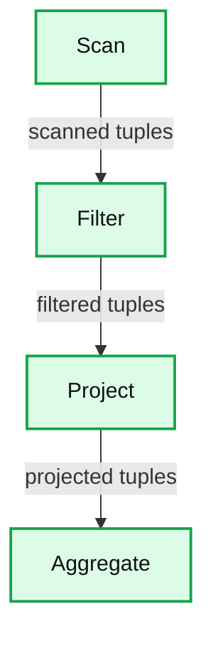
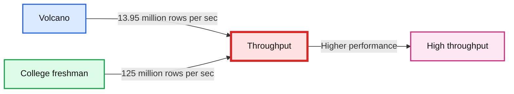
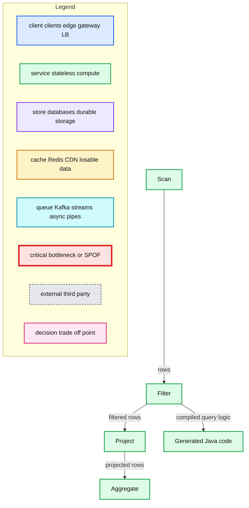
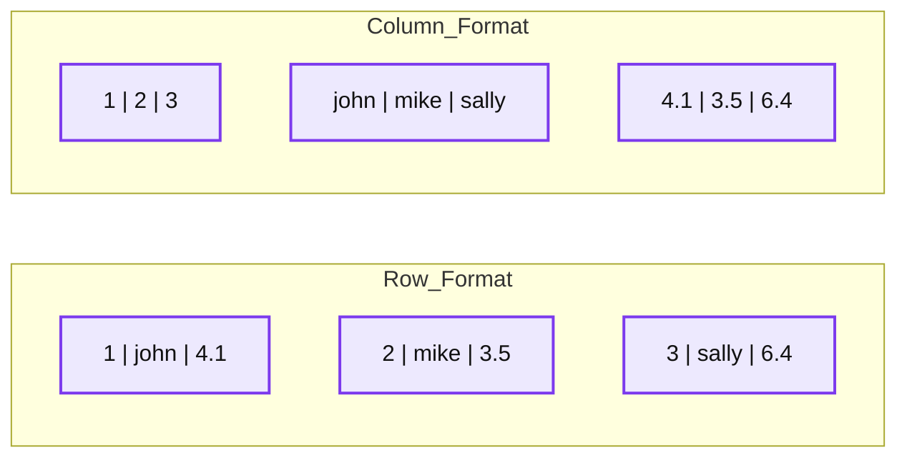
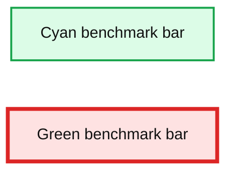
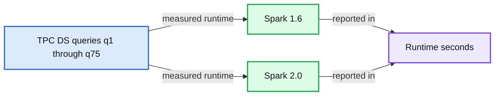

# Apache Spark as a Compiler: Joining a Billion Rows per Second on a Laptop

*Deep dive into the new Tungsten execution engine*

- Source: https://www.databricks.com/blog/2016/05/23/apache-spark-as-a-compiler-joining-a-billion-rows-per-second-on-a-laptop.html
- Published: 2016-05-23
- Authors: Sameer Agarwal, Davies Liu, Reynold Xin
- Categories: engineering, open-source
- Images: 6 total, 6 extracted as architecture

*Free Edition has replaced Community Edition, offering enhanced features at no cost. Start using *[*Free Edition *](https://login.databricks.com/?intent=SIGN_UP&amp;signup_experience_step=EXPRESS&amp;provider=DB_FREE_TIER&amp;dbx_source=www)*today.*
 

When our team at Databricks planned our contributions to the upcoming Apache Spark 2.0 release, we set out with an ambitious goal by asking ourselves: **Apache Spark is already pretty fast, but can we make it 10x faster**?

This question led us to fundamentally rethink the way we built Spark’s physical execution layer. When you look into a modern data engine (e.g. Spark or other MPP databases), a majority of the CPU cycles are spent in useless work, such as making virtual function calls or reading or writing intermediate data to CPU cache or memory. Optimizing performance by reducing the amount of CPU cycles wasted in this useless work has been a long-time focus of modern compilers.

Apache Spark 2.0 will ship with the [second generation Tungsten engine](https://www.databricks.com/blog/2015/04/28/project-tungsten-bringing-spark-closer-to-bare-metal.html). Built upon ideas from modern compilers and MPP databases and applied to data processing queries, Tungsten emits (SPARK-12795) optimized bytecode at runtime that collapses the entire query into a single function, eliminating virtual function calls and leveraging CPU registers for intermediate data. As a result of this streamlined strategy, called “whole-stage code generation,” we significantly improve CPU efficiency and gain performance.

## The Past: Volcano Iterator Model

Before we dive into the details of whole-stage code generation, let us revisit how Spark (and most database systems) work currently. Let us illustrate this with a simple query that scans a single table and counts the number of elements with a given attribute value:

**Summary:** A Volcano iterator query pipeline flows from Scan through Filter and Project to Aggregate.

**Components:**

- Scan - table scan operator
- Filter - predicate filter operator
- Project - projection operator
- Aggregate - aggregation operator

**Flows:**

- Scan -> Filter: scanned tuples
- Filter -> Project: filtered tuples
- Project -> Aggregate: projected tuples

**Numbers:** none

source image: https://www.databricks.com/wp-content/uploads/2016/05/volcano-iterator-model.png

To evaluate this query, older versions (1.x) of Spark leveraged a popular classic query evaluation strategy based on an iterator model (commonly referred to as the [Volcano model](http://paperhub.s3.amazonaws.com/dace52a42c07f7f8348b08dc2b186061.pdf)). In this model, a query consists of multiple operators, and each operator presents an interface, `next()`, that returns a tuple at a time to the next operator in the tree. For instance, the Filter operator in the above query roughly translates into the code below:

class Filter(child: Operator, predicate: (Row => Boolean))
extends Operator {
def next(): Row = {
var current = child.next()
while (current != null && !predicate(current)) {
current = child.next()
}
return current
}
}

Having each operator implement an iterator interface allowed query execution engines to elegantly compose arbitrary combinations of operators without having to worry about what opaque data type each operator provides. As a result, the Volcano model became the standard for database systems in the last two decades, and is also the architecture used in Spark.

## Volcano vs Hand-written Code

To digress a little, what if we ask a college freshman and give her 10 minutes to implement the above query in Java? It’s quite likely she’d come up with iterative code that loops over the input, evaluates the predicate and counts the rows:

var count = 0
for (ss_item_sk in store_sales) {
if (ss_item_sk == 1000) {
count += 1
}
}

The above code was written specifically to answer a given query, and is obviously not “composable.” But how would the two—Volcano generated and hand-written code—compare in performance? On one side, we have the architecture chosen for composability by Spark and majority of the database systems. On the other, we have a simple program written by a novice in 10 minutes. We ran a simple benchmark that compared the “college freshman” version of the program and a Spark program executing the above query using a single thread against Parquet data on disk:

**Summary:** Benchmark chart comparing Volcano execution with hand-written code by throughput.

**Components:**

- Volcano execution model
- College freshman hand-written code
- High throughput indicator

**Flows:**

- Volcano -> Throughput: 13.95 million rows/sec
- College freshman -> Throughput: 125 million rows/sec
- Throughput -> High throughput: performance direction

**Numbers:** 13.95 million rows/sec; 125 million rows/sec

source image: https://www.databricks.com/wp-content/uploads/2016/05/volcano-vs-hand-written-code-1024x397.png

As you can see, the “college freshman” hand-written version is an order of magnitude faster than the Volcano model. It turns out that the 6 lines of Java code are optimized, for the following reasons:

1. **No virtual function dispatches:** In the Volcano model, to process a tuple would require calling the `next()` function at least once. These function calls are implemented by the compiler as virtual function dispatches (via vtable). The hand-written code, on the other hand, does not have a single function call. Although virtual function dispatching has been an area of focused optimization in modern computer architecture, it still costs multiple CPU instructions and can be quite slow, especially when dispatching billions of times.
2. **Intermediate data in memory vs CPU registers:** In the Volcano model, each time an operator passes a tuple to another operator, it requires putting the tuple in memory (function call stack). In the hand-written version, by contrast, the compiler (JVM JIT in this case) actually places the intermediate data in CPU registers. Again, the number of cycles it takes the CPU to access data in memory is orders of magnitude larger than in registers.
3. **Loop unrolling and SIMD:** Modern compilers and CPUs are incredibly efficient when compiling and executing simple for loops. Compilers can often unroll simple loops automatically, and even generate SIMD instructions to process multiple tuples per CPU instruction. CPUs include features such as pipelining, prefetching, and instruction reordering that make executing simple loops efficient. These compilers and CPUs, however, are not great with optimizing complex function call graphs, which the Volcano model relies on.

The key take-away here is that the **hand-written code is written specifically to run that query and nothing else, and as a result it can take advantage of all the information that is known**, leading to optimized code that eliminates virtual function dispatches, keeps intermediate data in CPU registers, and can be optimized by the underlying hardware.

## The Future: Whole-stage Code Generation

From the above observation, a natural next step for us was to explore the possibility of automatically generating this handwritten code at runtime, which we are calling “whole-stage code generation.” This idea is inspired by Thomas Neumann’s seminal VLDB 2011 paper on [Efficiently Compiling Efficient Query Plans for Modern Hardware](http://www.vldb.org/pvldb/vol4/p539-neumann.pdf). For more details on the paper, Adrian Colyer has coordinated with us to publish a [review on The Morning Paper blog](https://blog.acolyer.org/2016/05/23/efficiently-compiling-efficient-query-plans-for-modern-hardware//) today.

The goal is to leverage whole-stage code generation so **the engine can achieve the performance of hand-written code, yet provide the functionality of a general purpose engine**. Rather than relying on operators for processing data at runtime, these operators together generate code at runtime and collapse each fragment of the query, where possible, into a single function and execute that generated code instead.

For instance, in the query above, the entire query is a single stage, and Spark would generate the the following JVM bytecode (in the form of Java code illustrated here). More complicated queries would result in multiple stages and thus multiple different functions generated by Spark.

**Summary:** The diagram shows Spark whole-stage code generation, combining scan, filter, projection, and aggregation into generated code.

**Components:**

- Scan: Spark data scan operator
- Filter: Spark filter operator
- Project: Spark projection operator
- Aggregate: Spark aggregation operator
- Generated Java code: JVM bytecode represented as Java code

**Flows:**

- Scan -> Filter: rows
- Filter -> Project: filtered rows
- Project -> Aggregate: projected rows
- Filter -> Generated Java code: compiled query logic

**Numbers:** 0, 1000, 1

source image: https://www.databricks.com/wp-content/uploads/2016/05/whole-stage-code-generation-model.png

The `explain()` function in the expression below has been extended for whole-stage code generation. In the explain output, when an operator has a star around it (*), whole-stage code generation is enabled. In the following case, Range, Filter, and the two Aggregates are both running with whole-stage code generation. Exchange, however, does not implement whole-stage code generation because it is sending data across the network.

Those of you that have been following Spark’s development closely might ask the following question: “I’ve heard about code generation since Apache Spark 1.1 in [this blog post](https://www.databricks.com/blog/2014/06/02/exciting-performance-improvements-on-the-horizon-for-spark-sql.html). How is it different this time?” In the past, similar to other MPP query engines, Spark only applied code generation to expression evaluation and was limited to a small number of operators (e.g. Project, Filter). That is, code generation in the past only sped up the evaluation of expressions such as “1 + a”, whereas today whole-stage code generation actually generates code for the entire query plan.

## Vectorization

Whole-stage code-generation techniques work particularly well for a large spectrum of queries that perform simple, predictable operations over large datasets. There are, however, cases where it is infeasible to generate code to fuse the entire query into a single function. Operations might be too complex (e.g. CSV parsing or Parquet decoding), or there might be cases when we’re integrating with third party components that can’t integrate their code into our generated code (examples can range from calling out to Python/R to offloading computation to the GPU).

To improve performance in these cases, we employ another technique called “vectorization.” The idea here is that instead of processing data one row at a time, the engine batches multiples rows together in a columnar format, and each operator uses simple loops to iterate over data within a batch. Each `next()` call would thus return a batch of tuples, amortizing the cost of virtual function dispatches. These simple loops would also enable compilers and CPUs to execute more efficiently with the benefits mentioned earlier.

As an example, for a table with three columns (id, name, score), the following illustrates the memory layout in row-oriented format and column-oriented format.

**Summary:** The image compares row-oriented and column-oriented memory layouts for a three-column table.

**Components:**

- Row format: each record stores id, name, and score together.
- Column format: each column stores its values contiguously.
- Id values: 1, 2, 3.
- Name values: john, mike, sally.
- Score values: 4.1, 3.5, 6.4.

**Flows:**

- none

**Numbers:** 1, 2, 3, 4.1, 3.5, 6.4

source image: https://www.databricks.com/wp-content/uploads/2016/05/memory-layout-in-row-and-column-formats.png

This style of processing, invented by columnar database systems such as MonetDB and C-Store, would achieve two of the three points mentioned earlier (almost no virtual function dispatches and automatic loop unrolling/SIMD). It, however, still requires putting intermediate data in-memory rather than keeping them in CPU registers. As a result, we use vectorization only when it is not possible to do whole-stage code generation.

For example, we have implemented a new vectorized Parquet reader that does decompression and decoding in column batches. When decoding integer columns (on disk), this new reader is roughly 9 times faster than the non-vectorized one:

**Summary:** A two-bar benchmark chart comparing an unlabeled cyan result with a longer unlabeled green result.

**Components:**

- Cyan benchmark bar
- Green benchmark bar

**Flows:**

- none

**Numbers:** none

source image: https://www.databricks.com/wp-content/uploads/2016/05/parquet-vs-vectorized-parquet.png

In the future, we plan to use vectorization in more code paths such as UDF support in Python/R.

## Performance Benchmarks

We have measured the amount of time (in nanoseconds) it would take to process a tuple on one core for some of the operators in Apache Spark 1.6 vs. Apache Spark 2.0, and the table below is a comparison that demonstrates the power of the new Tungsten engine. Spark 1.6 includes expression code generation technique that is also in use in some state-of-the-art commercial databases today.

**cost per row (in nanoseconds, single thread)**

| primitive | Spark 1.6 | Spark 2.0 |
|---|---|---|
| filter | 15 ns | 1.1 ns |
| sum w/o group | 14 ns | 0.9 ns |
| sum w/ group | 79 ns | 10.7 ns |
| hash join | 115 ns | 4.0 ns |
| sort (8-bit entropy) | 620 ns | 5.3 ns |
| sort (64-bit entropy) | 620 ns | 40 ns |
| sort-merge join | 750 ns | 700 ns |
| Parquet decoding (single int column) | 120 ns | 13 ns |

We have surveyed our customers’ workloads and implemented whole-stage code generation for the most frequently used operators, such as filter, aggregate, and hash joins. As you can see, many of the core operators are an order of magnitude faster with whole-stage code generation. Some operators such as sort-merge join, however, are inherently slower and more difficult to optimize.

It takes less than one second to perform the hash join operation on 1 billion tuples on both the Databricks platform (with Intel Haswell processor 3 cores) as well as on a 2013 Macbook Pro (with mobile Intel Haswell i7).

How does this new engine work on end-to-end queries? Beyond whole-stage code generation and vectorization, a lot of work has also gone into improving the Catalyst optimizer for general query optimizations such as nullability propagation. We did some preliminary analysis using TPC-DS queries to compare Spark 1.6 and the upcoming Spark 2.0:

**Summary:** Benchmark chart comparing TPC-DS query runtime in Spark 1.6 and Spark 2.0, where lower runtime is better.

**Components:**

- TPC-DS queries, labeled q1 through q75
- Spark 1.6 benchmark series
- Spark 2.0 benchmark series
- Runtime in seconds axis

**Flows:**

- TPC-DS queries -> Spark 1.6 benchmark series: query runtime measurements
- TPC-DS queries -> Spark 2.0 benchmark series: query runtime measurements

**Numbers:** 1.6, 2.0, 0, 100, 200, 300, 400, 500, 600, q1, q2, q3, q5, q7, q9, q12, q13, q15, q16, q18, q19, q20, q21, q22, q24, q25, q26, q27, q28, q30, q31, q32, q33, q34, q35, q36, q37, q38, q39, q40, q41, q42, q43, q44, q45, q46, q47, q48, q49, q50, q51, q52, q53, q54, q55, q56, q57, q58, q59, q60, q61, q62, q63, q64, q65, q66, q67, q68, q69, q70, q71, q72, q73, q74, q75

source image: https://www.databricks.com/wp-content/uploads/2016/05/preliminary-tpc-ds-spark-2-0-vs-1-6.png

Does this mean your workload will magically become ten times faster once you upgrade to Spark 2.0? Not necessarily. While we believe the new Tungsten engine implements the best architecture for performance engineering in data processing, it is important to understand that not all workloads can benefit to the same degree. For example, variable-length data types such as strings are naturally more expensive to operate on, and some workloads are bounded by other factors ranging from I/O throughput to metadata operations. Workloads that were previously bounded by CPU efficiency would observe the largest gains, and shift towards more I/O bound, whereas workloads that were previously I/O bound are less likely to observe gains.

## Conclusion

Most of the work described in this blog post has been committed into Apache Spark’s code base and is slotted for the upcoming Spark 2.0 release. The JIRA ticket for whole-stage code generation can be found in SPARK-12795, while the ticket for vectorization can be found in SPARK-12992.

To recap, this blog post described the second generation Tungsten execution engine. Through a technique called whole-stage code generation, the engine will (1) eliminate virtual function dispatches (2) move intermediate data from memory to CPU registers and (3) exploit modern CPU features through loop unrolling and SIMD. Through a technique called vectorization, the engine will also speed up operations that are too complex for code generation. For many core operators in data processing, the new engine is orders of magnitude faster. In the future, given the efficiency of the execution engine, bulk of our performance work will shift towards optimizing I/O efficiency and better query planning.

We are excited about the progress made, and hope you will enjoy the improvements. To try some of these out for free, [sign up for an account](https://www.databricks.com/) on Databricks Community Edition.

## Further Reading

- Watch Webinar: [Apache Spark 2.0: Easier, Faster, and Smarter](https://www.databricks.com/)
- [Technical Preview of Apache Spark 2.0 Now on Databricks](https://www.databricks.com/blog/2016/05/11/apache-spark-2-0-technical-preview-easier-faster-and-smarter.html)
- [Approximate Algorithms in Apache Spark: HyperLogLog and Quantiles](https://www.databricks.com/blog/2016/05/19/approximate-algorithms-in-apache-spark-hyperloglog-and-quantiles.html)
