# Genome Sequencing in a Nutshell

- Source: https://www.databricks.com/blog/2016/05/24/genome-sequencing-in-a-nutshell.html
- Published: 2016-05-24
- Authors: Deborah Siegel
- Categories: engineering, open-source, data-science-machine-learning
- Images: 6 total, 2 extracted as architecture

*Free Edition has replaced Community Edition, offering enhanced features at no cost. Start using *[*Free Edition *](https://login.databricks.com/?intent=SIGN_UP&amp;signup_experience_step=EXPRESS&amp;provider=DB_FREE_TIER&amp;dbx_source=www)*today.*
 

*This is a guest post from Deborah Siegel from the Northwest Genome Center and the University of Washington with Denny Lee from Databricks on their collaboration on genome variant analysis with ADAM and Spark.*

This is part 1 of the 3 part series Genome Variant Analysis using K-Means, ADAM, and Apache Spark:

1. [Genome Sequencing in a Nutshell](https://stage.databricks.com/blog/2016/05/24/genome-sequencing-in-a-nutshell.html)
2. [Parallelizing Genome Variant Analysis](https://stage.databricks.com/blog/2016/05/24/parallelizing-genome-variant-analysis.html)
3. [Predicting Geographic Population using Genome Variants and K-Means](https://stage.databricks.com/blog/2016/05/24/predicting-geographic-population-using-genome-variants-and-k-means.html)

## Introduction

Over the last few years, we have seen a rapid reduction in costs and time of genome sequencing.  The potential of understanding the variations in genome sequences range from assisting us in identifying people who are predisposed to common diseases, solving rare diseases, and enabling clinicians to personalize prescription and dosage to the individual.

In this three-part blog, we will provide a primer of genome sequencing and its potential.  We will focus on genome variant analysis - that is the differences between genome sequences - and how it can be accelerated by making use of Apache Spark and ADAM (a scalable API and CLI for genome processing) using Databricks Community Edition. Finally, we will execute a k-means clustering algorithm on genomic variant data and build a model that will predict the individual’s geographic population of origin based on those variants.

This first post will provide a primer on genome sequencing.  You can also skip ahead to the second post [Parallelizing Genome Variant Analysis](https://www.databricks.com/blog/2016/05/24/parallelizing-genome-variant-analysis.html) focusing on parallel bioinformatic analysis or the third post on [Predicting Geographic Population using Genome Variants and K-Means](https://www.databricks.com/blog/2016/05/24/predicting-geographic-population-using-genome-variants-and-k-means.html).

## Genome Sequencing

### A very simple language analogy

Imagine one long string composed of 3 billion characters and containing roughly 25,000 words interspersed with other characters. Some of the words even make sentences. Changing, adding, or deleting characters or groups of characters could change the structure or meaning of the words and sentences.

Each long string has very roughly 10-30 million places where such differences may occur. And this makes things interesting. Of course, everything is more complicated. But this has shown itself to be a useful abstraction of genome data.

In the genome, we have been building knowledge about where the words (genes) are located in the string of characters (bases), and we have been discovering the places where they differ (the variants). But we don’t know everything.  We are still learning about what the effect of the variants are, how the genes are related to each other, and how they may be expressed in different forms and in different quantities under certain circumstances.

### Genome Sequencing in a Nutshell

Genome sequencing involves using chemistry and a recording technique to read the characters which code the genome (A,G, C, T) in order (in sequence).

**Summary:** The diagram shows a genome sequencing data pipeline from preprocessing through variant evaluation, highlighting an opportunity to distribute the downstream stages.

**Components:**

- Sequencing data input - technology not specified
- Pre-processing - technology not specified
- Alignment - technology not specified
- Variant calling - technology not specified
- Variant filtering - technology not specified
- Variant evaluation - technology not specified
- Opportunity knocks: distribute me - distribution opportunity, technology not specified

**Flows:**

- Sequencing data input -> Pre-processing: sequencing reads
- Pre-processing -> Alignment: preprocessed reads
- Alignment -> Variant calling: aligned sequences
- Variant calling -> Variant filtering: called variants
- Variant filtering -> Variant evaluation: filtered variants

**Numbers:** none

```mermaid
%% Genome sequencing pipeline from preprocessing through variant evaluation
flowchart LR
    A[Sequencing data input] -->|sequencing reads| B[Pre-processing]
    B -->|preprocessed reads| C[Alignment]
    C -->|aligned sequences| D[Variant calling]
    D -->|called variants| E[Variant filtering]
    E -->|filtered variants| F[Variant evaluation]
    G[Opportunity knocks distribute me]

    classDef client fill:#dbeafe,stroke:#2563eb,stroke-width:2px,color:#111
    classDef service fill:#dcfce7,stroke:#16a34a,stroke-width:2px,color:#111
    classDef store fill:#ede9fe,stroke:#7c3aed,stroke-width:2px,color:#111
    classDef cache fill:#fef3c7,stroke:#d97706,stroke-width:2px,color:#111
    classDef queue fill:#cffafe,stroke:#0891b2,stroke-width:2px,color:#111
    classDef critical fill:#fee2e2,stroke:#dc2626,stroke-width:4px,color:#111
    classDef external fill:#e5e7eb,stroke:#6b7280,stroke-width:2px,color:#111,stroke-dasharray:4 3
    classDef decision fill:#fce7f3,stroke:#db2777,stroke-width:2px,color:#111

    class A external
    class B,C,D,E,F service
    class G decision
```

source image: https://www.databricks.com/wp-content/uploads/2016/05/distribute_me-1024x243.png

The data is initially read in the form of short strings. For a 30x coverage of a person’s genome (30x is a common goal), there may be approximately 600 million short strings of 150 characters each. During data preprocessing, the strings will be mapped/aligned, typically to a reference sequence. There are many different approaches to alignment. Ultimately, this gives every base a defined position. Variant analysis of aligned sequence data finds code differences by comparing the sequence to the reference or to other aligned sequences and assigns genotypes to a person’s variants.

Some of the detected variants will be based on noise, and can be filtered with rigid thresholds on parameters such as coverage, quality, and domain-specific biases. Rather than hard filtering, some analysts threshold the variants by fitting a Gaussian mixture model.  Even further downstream, analysts quantify and explore the data, try and identify highly significant variants (a small number given the input size), and try to predict what their functional effect might be.

### Why sequence?

Genome sequence (and exome sequence, which is a subset) is interesting data from a data science perspective. We can use our knowledge of sequences to gain hints at how and why the [code has evolved](https://www.science.org/content/337/6090/64.long) over long periods of time.  Knowledge from genome sequencing studies is becoming more integrated into medicine. Genome sequencing is now used for [non-invasive prenatal diagnostics](https://misuse.ncbi.nlm.nih.gov/error/abuse.shtml).  Genome sequencing will soon be used in [clinical screening and diagnostic tests](https://misuse.ncbi.nlm.nih.gov/error/abuse.shtml), with much ongoing work to expand [genomic medicine](https://secure.jbs.elsevierhealth.com/action/getSharedSiteSession?redirect=https%3A%2F%2Fwww.cell.com%2Fajhg%2Fabstract%2FS0002-9297%2816%2930106-9&rc=0&cookieSet=1).

On the research and discovery side, large cohort and population-scale genome sequencing studies find variants or patterns of variance which may predispose people to common diseases such as [autism](https://secure.jbs.elsevierhealth.com/action/getSharedSiteSession?redirect=https%3A%2F%2Fwww.cell.com%2Fajhg%2Fabstract%2FS0002-9297%2815%2900494-2&rc=0&cookieSet=1), [heart disease](https://idp.nature.com/authorize?response_type=cookie&client_id=grover&redirect_uri=https%3A%2F%2Fwww.nature.com%2Farticles%2Fnature13917), and specific [cancers](https://idp.nature.com/authorize?response_type=cookie&client_id=grover&redirect_uri=https%3A%2F%2Fwww.nature.com%2Fnature%2Farticles).  Sequencing studies also indicate variants influencing [drug metabolism](https://misuse.ncbi.nlm.nih.gov/error/abuse.shtml), enabling clinicians to personalize prescriptions and dosage to each individual.  In the case of rare heritable diseases, sequencing certain members of a family often leads to finding the [causal variants](https://secure.jbs.elsevierhealth.com/action/getSharedSiteSession?redirect=https%3A%2F%2Fwww.cell.com%2Fajhg%2Fabstract%2FS0002-9297%2815%2900245-1&rc=0&cookieSet=1).

(image credit: Frederic Reinier, used with permission)

In the past five years, [sequencing experiments have linked genomic variants to hundreds of rare diseases](https://www.genome.gov/news/news-release/Centers-for-Mendelian-Genomics-uncovering-the-genomic-basis-of-hundreds-of-rare-conditions):

> “Individually, a rare disease may affect only a handful of families. Collectively, rare diseases impact 20 to 30 million people in the U.S. alone.”

For these reasons, there are resources going towards the reading and analysis of sequences. The National Health Service of the UK has a project to sequence 100,000 genomes of families with members who have rare diseases or cancer by 2017. In the US, The National Human Genome Research Institute (NHGRI)  plans to fund common disease research for $240 million and rare disease research for $40 million over the next 4 years. There are also other kinds of sequencing which will benefit from efforts to scale bioinformatics and lower the barrier to applying data science to a large amount of sequence data, such as RNA-seq, microbiome sequencing, and immune system and cancer profile sequencing.

**Summary:** The timeline shows the evolution of DNA sequencing from Sanger sequencing in 1977 to Illumina X Ten gigabase sequencing in 2014, alongside falling genome sequencing costs.

**Components:**

- Sanger radioactive gels - radioactive gel sequencing
- Sanger fluorescent dye - fluorescent dye sequencing
- Sanger capillary - capillary sequencing
- Human Genome Project - first human genome sequencing
- Illumina GA II - massively parallel next generation sequencing
- Illumina X Ten - high throughput next generation sequencing
- Sequencing scale - hundreds to kilobase, megabase, and gigabase output
- Cost milestones - $2.8 B and $1,000 genome sequencing costs

**Flows:**

- Sanger radioactive gels -> Sanger fluorescent dye: sequencing technology advances
- Sanger fluorescent dye -> Sanger capillary: sequencing technology advances
- Sanger capillary -> Human Genome Project: enables human genome sequencing
- Human Genome Project -> Illumina GA II: transition to next generation sequencing
- Illumina GA II -> Illumina X Ten: increased massively parallel throughput
- 1977 -> 2014: sequencing scale increases from 100’s to gigabase
- $2.8 B -> $1,000: genome sequencing cost decreases

**Numbers:** 1977, 1987, 1998, 2001, 2004, 2007, 2010, 2014, 100’s, Kilobase, Megabase, Gigabase, $2.8 B, $1,000, 3 days, 2009 dollars, $240 million, $40 million, 4 years

```mermaid
%% Shows the evolution of sequencing technology, scale, and cost
flowchart LR
    A[Sanger radioactive gels<br/>1977<br/>100s] -->|technology advances| B[Sanger fluorescent dye<br/>1987]
    B -->|technology advances| C[Sanger capillary<br/>1998]
    C -->|enables genome sequencing| D[Human Genome Project<br/>2001<br/>$2.8 B]
    D -->|next generation sequencing| E[Illumina GA II<br/>2004 to 2007<br/>Megabase]
    E -->|higher throughput| F[Illumina X Ten<br/>2010 to 2014<br/>Gigabase]
    D -.->|cost falls| G[Genome sequencing cost<br/>$1,000]
    A -.->|scale increases| H[Sequencing output<br/>Kilobase]

    classDef client   fill:#dbeafe,stroke:#2563eb,stroke-width:2px,color:#111
    classDef service  fill:#dcfce7,stroke:#16a34a,stroke-width:2px,color:#111
    classDef store    fill:#ede9fe,stroke:#7c3aed,stroke-width:2px,color:#111
    classDef cache    fill:#fef3c7,stroke:#d97706,stroke-width:2px,color:#111
    classDef queue    fill:#cffafe,stroke:#0891b2,stroke-width:2px,color:#111
    classDef critical fill:#fee2e2,stroke:#dc2626,stroke-width:4px,color:#111
    classDef external fill:#e5e7eb,stroke:#6b7280,stroke-width:2px,color:#111,stroke-dasharray:4 3
    classDef decision fill:#fce7f3,stroke:#db2777,stroke-width:2px,color:#111

    class A,B,C,E,F service
    class D critical
    class G,H store
```

source image: https://www.databricks.com/wp-content/uploads/2016/05/sequencing_technology.png

Sequencing technology has been an object of accelerated growth. Between 1998 and 2001, the first human genome was sequenced. It cost $2.8 Billion of 2009 dollars. Today, a genome can be sequenced in 3 days for around $1,000 (for more information, please review National Institutes of Health: National Human Genome Research Institute > [DNA Sequencing Costs](https://www.genome.gov/about-genomics/fact-sheets/Sequencing-Human-Genome-cost)). During roughly the first 25 years of sequencing experiments, the chemistry allowed only one stretch of DNA to be sequenced at a time, making it laborious, slow, and expensive. The next-generation of sequencing has become massively parallel, enabling sequencing to occur on many stretches of DNA within the same experiment.  Also, with molecular indexing, multiple individual’s DNA can be sequenced together and the data can be separated out during analysis. It is not implausible to speculate that most people on the planet who opt-in will have their genomes sequenced in the not-so-distant future. To find out more detail about next-generation sequencing, see [Coming of age: ten years of next-generation sequencing technologies](https://idp.nature.com/authorize?response_type=cookie&client_id=grover&redirect_uri=https%3A%2F%2Fwww.nature.com%2Farticles%2Fnrg.2016.49)

Depending on the application and settings, current sequencing instruments can read ~600 gigabases per day. A medium to large size sequencing center has several such instruments running concurrently. As we will see later on  in detail, one of the challenges facing bioinformatics is that downstream software for analyzing variants had been previously optimized for specific, non-extensible file formats, rather than on the data models themselves. The result is that there exist pipeline fragility and obstacles to scalability. Now that we have massively parallel sequencing, many are looking towards parallel bioinformatic analysis.

### Public Data

Genome sequence data is generally private. Between 2007 and 2013, The 1000 genomes project was an initial effort for public “population level sequencing”. By its final phase, it provided some sequencing coverage data for 2,504 individuals from 26 populations. We used the easily accessible data from this project as a resource to build a notebook in Databricks Community Edition.

## Next Steps

In the next blog [Parallelizing Genome Variant Analysis](https://www.databricks.com/blog/2016/05/24/parallelizing-genome-variant-analysis.html) we will look into parallel bioinformatic analysis.  You can also skip ahead to [Predicting Geographic Population using Genome Variants  and K-Means](https://www.databricks.com/blog/2016/05/24/predicting-geographic-population-using-genome-variants-and-k-means.html).

## Attribution

We wanted to give a particular call out to the following resources that helped us create the notebook

- [ADAM: Genomics Formats and Processing Patterns for Cloud Scale Computing (Berkeley AMPLab)](https://amplab.cs.berkeley.edu/publication/adam-genomics-formats-and-processing-patterns-for-cloud-scale-computing/)
- Andy Petrella’s [Lightning Fast Genomics with Spark and ADAM](https://www.slideshare.net/noootsab/lightning-fast-genomics-with-spark-adam-and-scala) and associated [GitHub repo](https://github.com/andypetrella).
- Neil Ferguson [Population Stratification Analysis on Genomics Data Using Deep Learning](https://github.com/nfergu/popstrat).
- Matthew Conlen [Lightning-Viz project](http://lightning-viz.org/).
- [Timothy Danford’s SlideShare presentations](https://www.slideshare.net/TimothyDanford) (on Genomics with Spark)
- [Centers for Mendelian Genomics uncovering the genomic basis of hundreds of rare conditions](https://www.genome.gov/news/news-release/Centers-for-Mendelian-Genomics-uncovering-the-genomic-basis-of-hundreds-of-rare-conditions)
- NIH genome sequencing program targets the genomic bases of common, rare disease
- [The 1000 Genomes Project](https://www.internationalgenome.org/)

As well, we’d like to thank for additional contributions and reviews by Anthony Joseph, Xiangrui Meng, Hossein Falaki, and Tim Hunter.
