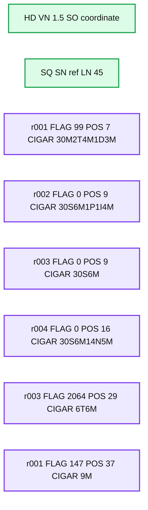
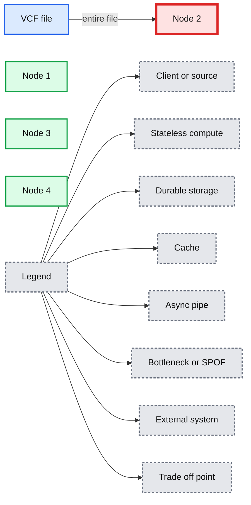
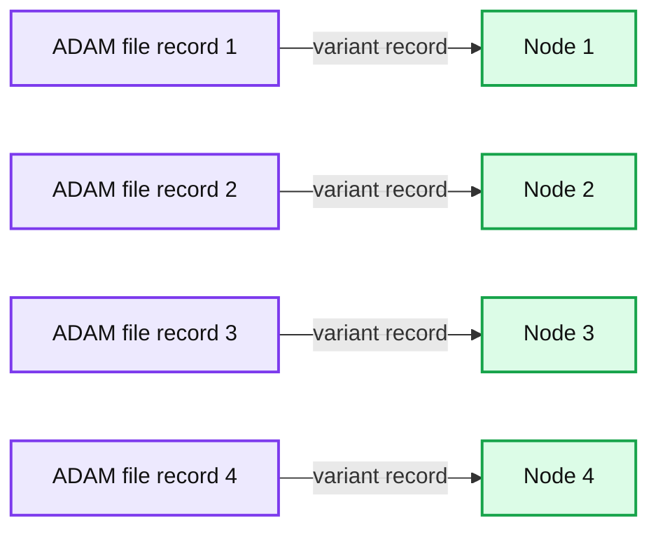

# Parallelizing Genome Variant Analysis

- Source: https://www.databricks.com/blog/2016/05/24/parallelizing-genome-variant-analysis.html
- Published: 2016-05-24
- Authors: Deborah Siegel
- Categories: engineering, open-source, data-science-machine-learning
- Images: 7 total, 5 extracted as architecture

*Free Edition has replaced Community Edition, offering enhanced features at no cost. Start using *[*Free Edition *](https://login.databricks.com/?intent=SIGN_UP&amp;signup_experience_step=EXPRESS&amp;provider=DB_FREE_TIER&amp;dbx_source=www)*today.*
 

*This is a guest post from Deborah Siegel from the Northwest Genome Center and the University of Washington with Denny Lee from Databricks on their collaboration on genome variant analysis with ADAM and Spark.*

This is part 2 of the 3 part series Genome Variant Analysis using K-Means, ADAM, and Apache Spark:

1. [Genome Sequencing in a Nutshell](https://stage.databricks.com/blog/2016/05/24/genome-sequencing-in-a-nutshell.html)
2. [Parallelizing Genome Variant Analysis](https://stage.databricks.com/blog/2016/05/24/parallelizing-genome-variant-analysis.html)
3. [Predicting Geographic Population using Genome Variants and K-Means](https://stage.databricks.com/blog/2016/05/24/predicting-geographic-population-using-genome-variants-and-k-means.html)

## Introduction

Over the last few years, we have seen a rapid reduction in costs and time of genome sequencing.  The potential of understanding the variations in genome sequences range from assisting us in identifying people who are predisposed to common diseases, solving rare diseases, and enabling clinicians to personalize prescription and dosage to the individual.

In this three-part blog, we will provide a primer of genome sequencing and its potential.  We will focus on genome variant analysis - that is the differences between genome sequences - and how it can be accelerated by making use of Apache Spark and ADAM (a scalable API and CLI for genome processing) using Databricks Community Edition.  Finally, we will execute a k-means clustering algorithm on genomic variant data and build a model that will predict the individual’s geographic population of origin  based on those variants.

This post will focus on Parallelizing Genome Sequence Analysis; for a refresher on genome sequencing, you can review [Genome Sequencing in a Nutshell](https://www.databricks.com/blog/2016/05/24/genome-sequencing-in-a-nutshell.html).  You can also skip ahead to the third post on [Predicting Geographic Population using Genome Variants and K-Means](https://www.databricks.com/blog/2016/05/24/predicting-geographic-population-using-genome-variants-and-k-means.html).

## Parallelizing Genome Variant  Analysis

As noted in [Genome Sequencing in a Nutshell](https://www.databricks.com/blog/2016/05/24/genome-sequencing-in-a-nutshell.html), there are many steps and stages of the analysis that can be distributed and parallelized in the hopes of significantly improving performance and possibly improving results on very large data Apache Spark is well suited for sequence data because it not only executes many tasks in a distributed parallel fashion, but can do so primarily in-memory with decreased need for intermediate files.

Benchmarks of ADAM + Spark (sorting genome reads and marking duplicate reads for removal) have shown scalable speedups, from 1.5 days on a single node to less than one hour on a commodity cluster ([ADAM: Genomics Formats and Processing Patterns for Cloud Scale Computing](https://www2.eecs.berkeley.edu/Pubs/TechRpts/2013/EECS-2013-207.html)).

One of the primary issues alluded to when working with current genomic sequence data formats is that they are not easily parallelizable.  Fundamentally, the current set of tools and genomic data formats (e.g. SAM, BAM, VCF, etc.) are not well designed for distributed computing environments.  To provide context, the next sections provide a simplified background of the workflow from genomic sequence to variant workflow.

## Simplified Genome Sequence to Variant Workflow

There are a number of quality control and pre-processing steps that must be initially performed prior to analyzing variants.  A simplified workflow can be seen in the image below.

**Summary:** The diagram shows a simplified genome sequence-to-variant workflow from sequencing through FASTQ, SAM, BAM, and VCF formats.

**Components:**

- Sequencer: genome sequencing machine
- FASTQ: raw sequence and quality-score data
- SAM: sequence alignment data
- BAM: binary alignment data
- VCF: variant call data
- BWA: sequence alignment tool
- SAM tools: alignment processing tools
- BCF tools: variant calling tools

**Flows:**

- Sequencer -> FASTQ: raw data
- FASTQ -> SAM: BWA alignment
- SAM -> BAM: SAM tools processing
- BAM -> VCF: BCF tools variant calling

**Numbers:** none

source image: https://www.databricks.com/wp-content/uploads/2016/05/Simplified-Sequence-to-Variant-Workflow-1024x396.png

```mermaid
%% Simplified genome sequence to variant workflow
flowchart LR
    sequencer[Sequencer] -->|raw data| fastq[FASTQ]
    fastq -->|BWA| sam[SAM]
    sam -->|SAM tools| bam[BAM]
    bam -->|BCF tools| vcf[VCF]

    classDef client   fill:#dbeafe,stroke:#2563eb,stroke-width:2px,color:#111
    classDef service  fill:#dcfce7,stroke:#16a34a,stroke-width:2px,color:#111
    classDef store    fill:#ede9fe,stroke:#7c3aed,stroke-width:2px,color:#111
    classDef cache    fill:#fef3c7,stroke:#d97706,stroke-width:2px,color:#111
    classDef queue    fill:#cffafe,stroke:#0891b2,stroke-width:2px,color:#111
    classDef critical fill:#fee2e2,stroke:#dc2626,stroke-width:4px,color:#111
    classDef external fill:#e5e7eb,stroke:#6b7280,stroke-width:2px,color:#111,stroke-dasharray:4 3
    classDef decision fill:#fce7f3,stroke:#db2777,stroke-width:2px,color:#111

    class sequencer external
    class fastq,sam,bam,vcf store
```

The output of the genome sequencer machine is in [FASTQ format](https://en.wikipedia.org/wiki/FASTQ_format) - text-based format storing both the short nucleotide sequence reads and their associated quality scores in ASCII format. The image below is an example of the data in FASTQ format.

A typical next step is to use a BWA (Burrows-Wheeler Alignment) sequence alignment tool such as [Bowtie](http://bowtie-bio.sourceforge.net/manual.shtml#what-is-bowtie) to align the large sets of short DNA sequences (reads) to a [reference genome](https://en.wikipedia.org/wiki/Reference_genome) and create a SAM file - a sequence alignment map file that stores mapped tags to a genome.   The image below (from the [Sequence Alignment/Map Format specification](https://samtools.github.io/hts-specs/SAMv1.pdf)) is an example of the SAM format.  This specification has a number of terminologies and concepts that are outside the scope of this blog post; for more information, please reference the [Sequence Alignment/Map Format specification](https://samtools.github.io/hts-specs/SAMv1.pdf).

**Summary:** The image shows an example SAM format containing header metadata and aligned sequencing records.

**Components:**

- SAM header with HD version 1.5 and SO coordinate
- SAM header with SQ sequence name ref and length 45
- Alignment record r001 with reference position 7 and CIGAR 30M2T4M1D3M
- Alignment record r002 with reference position 9 and CIGAR 30S6M1P1I4M
- Alignment record r003 with reference position 9 and CIGAR 30S6M
- Alignment record r004 with reference position 16 and CIGAR 30S6M14N5M
- Alignment record r003 with reference position 29 and CIGAR 6T6M
- Alignment record r001 with reference position 37 and CIGAR 9M

**Flows:**

- none

**Numbers:** 1.5, 45, 99, 7, 30, 2, 4, 1, 3, 37, 39, 9, 30, 36, 1, 1, 4, 9, 30, 16, 6, 14, 5, 29, 9, 37, 30, 7, 39, 6, 5, 17, 1

source image: https://www.databricks.com/wp-content/uploads/2016/05/Example-SAM-format-1024x254.png

Source: [Sequence Alignment/Map Format specification](https://samtools.github.io/hts-specs/SAMv1.pdf)

The next step  is to store the SAM into BAM (a binary version of SAM) typically by using [SAMtools](https://github.com/samtools/samtools) (a good reference for this process is Dave Tang’s [Learning BAM file](https://github.com/davetang/learning_bam_file)).  Finally, a Variant Call Format (VCF) file is generated by comparing the BAM file to a reference sequence (typically this is done using [BCFtools](https://github.com/samtools/bcftools)).  Note, a great short blog post describing this process is Kaushik Ghose’s [SAM! BAM! VCF! What?](https://kaushikghose.wordpress.com/2014/03/26/sam-bam-vcf-what/).

## Simplified Overview of VCF

With the VCF file, we can finally start performing variant analysis.  The VCF itself is a complicated specification so for a more detailed explanation, please reference the [1000 Genomes Project VCF (Variant Call Format) version 4.0 specification](https://www.internationalgenome.org/wiki/Analysis/vcf4.0).

Source: [1000 Genomes Project VCF (Variant Call Format) version 4.0 specification](https://www.internationalgenome.org/wiki/Analysis/vcf4.0)

While there are various tools which can process and analyze VCFs, they cannot be used in a distributed parallel fashion.  A simplified view of a VCF file is that it contains metadata, header, and the data. The metadata is often of interest and should be applied to each genotype.  As illustrated in the image below, even if you have four nodes (i.e. Node 1, Node 2, Node 3, Node 4) to process your genotype data, you cannot efficiently distribute the data to all four nodes.  With traditional variant analysis tools, the whole file including all of the data, metadata, and header must be sent to a single node. Additionally, the VCF file has more than one observation per row (variants and all their genotypes). This makes it impossible to analyze the genotypes in parallel without reformatting or using special tools.

**Summary:** A VCF file containing metadata and variant genotype data is sent entirely to Node 2 instead of being distributed across all four nodes.

**Components:**

- VCF file - Variant Call Format data source
- Header Metadata - VCF metadata and header
- Variant rows - Variants with many genotypes
- Node 1 - Distributed compute node
- Node 2 - Distributed compute node receiving the file
- Node 3 - Distributed compute node
- Node 4 - Distributed compute node

**Flows:**

- VCF file -> Node 2: Entire VCF file including metadata, header, variants, and genotypes

**Numbers:** 1, 2, 3, 4, one variant, many genotypes

source image: https://www.databricks.com/wp-content/uploads/2016/05/VCF-cannot-distribute.png

Another key issue complicating the analysis of VCFs is the level of complexity surrounding the VCF format specification.   Referring to the [1000 Genomes Project VCF (Variant Call Format) version 4.0 specification](https://www.internationalgenome.org/wiki/Analysis/vcf4.0), there are a number of rules surrounding how to interpret the lines within the VCF.  Therefore, any data scientist who wants to analyze variant data has to expend a large amount of effort to understand the specific VCFs they are working with and parsing.

## Introducing ADAM

Big Data Genomics ADAM project was designed to solve problems around distributing sequence data and parallelizing the processing of sequence data as noted in the technical report ADAM: Genomics Formats and Processing Patterns for Cloud Scale Computing.  ADAM is comprised of a CLI (tool kit for quickly processing genomics data), numerous APIs (interfaces to transform, analyze, and query genomic data), schemas, and file formats (columnar formats that allow for efficient parallel access to data).

### bdg-formats Schemas

To address the complexities of parsing common types of sequence data - such as reads, reference oriented data, variants, genotypes, and assemblies - ADAM utilizes , a set of extensible Apache Avro schemas that are built around data types themselves rather than a file format.   In other words, the schemas allows ADAM (or other any tools) to more easily query data instead of building custom code to parse each line of data depending on the file format.  These data formats are highly efficient - they are easily serializable, and the information about each particular schema, such as data types, does not have to be sent redundantly with each batch of data. The nodes in your cluster are made aware of what the schema is in an extensible way (data can be added with an extended schema, and analyzed together with data under the old schema).

### Parallel distribution via ADAM Parquet

ADAM Parquet files (when compared to binary or text VCF files) enable fast processing because they support parallel distribution of sequence data.  In the earlier image of the VCF file, we saw that the entire file must be sent to one node. With ADAM Parquet files, the metadata and header are incorporated into the data elements and schema, and the elements are “tidy” in that there is one observation per element (one genotype of one variant).

**Summary:** ADAM file records are distributed across four processing nodes, with each record assigned to a node.

**Components:**

- ADAM files: source data records containing variants
- Node 1: processing node
- Node 2: processing node
- Node 3: processing node
- Node 4: processing node
- Variant: one variant and one genotype for that variant

**Flows:**

- ADAM file record 1 -> Node 1: variant record
- ADAM file record 2 -> Node 2: variant record
- ADAM file record 3 -> Node 3: variant record
- ADAM file record 4 -> Node 4: variant record

**Numbers:** 1, 2, 3, 4, one

source image: https://www.databricks.com/wp-content/uploads/2016/05/ADAM-can-distribute.png

This enables the files to be distributed across multiple nodes. It also makes it simple to filter elements for just the data you want, such as genotypes for a certain panel, without using special tools.  ADAM files are stored in the [Parquet](https://parquet.apache.org/) columnar storage format which is designed for parallel processing.  As of GATK4, the [Genome Analysis Toolkit](https://gatk.broadinstitute.org/hc/en-us) is also able to read and write ADAM Parquet formatted data.

### Updated Simplified Genome Sequence to Variant Workflow

With defined schemas (bdg-format) and ADAM’s APIs, data scientists can focus on querying the data instead of parsing the data formats.

**Summary:** The diagram shows a genome sequencing pipeline from a sequencer through FASTQ, SAM, BAM, VCF, and ADAM Parquet formats.

**Components:**

- Sequencer: genome sequencing instrument
- FASTQ: raw sequencing read format
- SAM: sequence alignment format
- BAM: binary alignment format
- VCF: variant call format
- ADAM PQ: ADAM Parquet format
- Raw data: initial sequencer output
- BWA: FASTQ to SAM conversion tool
- SAM tools: SAM to BAM processing tools
- BCF tools: BAM to VCF variant processing tools
- ADAM tools: VCF to ADAM Parquet processing tools

**Flows:**

- Sequencer -> FASTQ: raw data
- FASTQ -> SAM: BWA processing
- SAM -> BAM: SAM tools processing
- BAM -> VCF: BCF tools processing
- VCF -> ADAM PQ: ADAM tools processing

**Numbers:** none

source image: https://www.databricks.com/wp-content/uploads/2016/05/Simplified-Sequence-to-Variant-Workflow-with-ADAM-1024x350.png

```mermaid
%% Genome sequencing format conversion workflow
flowchart LR
    A[Sequencer] -->|raw data| B[FASTQ]
    B -->|BWA| C[SAM]
    C -->|SAM tools| D[BAM]
    D -->|BCF tools| E[VCF]
    E -->|ADAM tools| F[ADAM PQ]

    classDef client   fill:#dbeafe,stroke:#2563eb,stroke-width:2px,color:#111
    classDef service  fill:#dcfce7,stroke:#16a34a,stroke-width:2px,color:#111
    classDef store    fill:#ede9fe,stroke:#7c3aed,stroke-width:2px,color:#111
    classDef cache    fill:#fef3c7,stroke:#d97706,stroke-width:2px,color:#111
    classDef queue    fill:#cffafe,stroke:#0891b2,stroke-width:2px,color:#111
    classDef critical fill:#fee2e2,stroke:#dc2626,stroke-width:4px,color:#111
    classDef external fill:#e5e7eb,stroke:#6b7280,stroke-width:2px,color:#111,stroke-dasharray:4 3
    classDef decision fill:#fce7f3,stroke:#db2777,stroke-width:2px,color:#111

    class A external
    class B,C,D,E service
    class F store
```

## Next Steps

In the next blog we will run a parallel bioinformatic analysis example [Predicting Geographic Population using Genome Variants and K-Means](https://www.databricks.com/blog/2016/05/24/predicting-geographic-population-using-genome-variants-and-k-means.html). You can also review a primer on genome sequencing: [Genome Sequencing in a Nutshell](https://www.databricks.com/blog/2016/05/24/genome-sequencing-in-a-nutshell.html).

## Attribution

We wanted to give a particular call out to the following resources that helped us create the notebook

- [ADAM: Genomics Formats and Processing Patterns for Cloud Scale Computing (Berkeley AMPLab)](https://amplab.cs.berkeley.edu/publication/adam-genomics-formats-and-processing-patterns-for-cloud-scale-computing/)
- Andy Petrella’s [Lightning Fast Genomics with Spark and ADAM](https://www.slideshare.net/noootsab/lightning-fast-genomics-with-spark-adam-and-scala) and associated [GitHub repo](https://github.com/andypetrella).
- Neil Ferguson [Population Stratification Analysis on Genomics Data Using Deep Learning](https://github.com/nfergu/popstrat).
- Matthew Conlen [Lightning-Viz project](http://lightning-viz.org/).
- [Timothy Danford’s SlideShare presentations](https://www.slideshare.net/TimothyDanford) (on Genomics with Spark)
- [Centers for Mendelian Genomics uncovering the genomic basis of hundreds of rare conditions](https://www.genome.gov/news/news-release/Centers-for-Mendelian-Genomics-uncovering-the-genomic-basis-of-hundreds-of-rare-conditions)
- NIH genome sequencing program targets the genomic bases of common, rare disease
- [The 1000 Genomes Project](https://www.internationalgenome.org/)

As well, we’d like to thank for additional contributions and reviews by Anthony Joseph, Xiangrui Meng, Hossein Falaki, and Tim Hunter.
