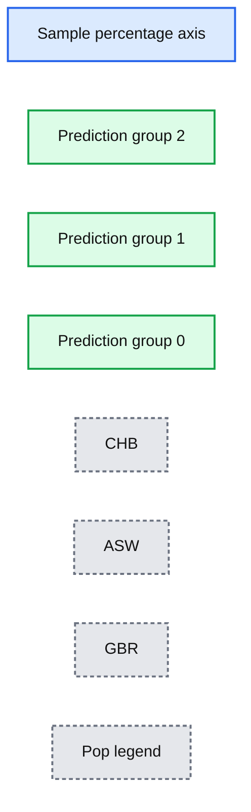

# Predicting Geographic Population using Genome Variants and K-Means

- Source: https://www.databricks.com/blog/2016/05/24/predicting-geographic-population-using-genome-variants-and-k-means.html
- Published: 2016-05-24
- Authors: Deborah Siegel
- Categories: engineering, open-source, data-science-machine-learning
- Images: 3 total, 1 extracted as architecture

*Free Edition has replaced Community Edition, offering enhanced features at no cost. Start using *[*Free Edition *](https://login.databricks.com/?intent=SIGN_UP&amp;signup_experience_step=EXPRESS&amp;provider=DB_FREE_TIER&amp;dbx_source=www)*today.*
 

*Spark Summit 2016 will be held in San Francisco on June 6–8. Check out the *[*full agenda*](https://www.databricks.com/dataaisummit)* and get your ticket*

---

*This is a guest post from Deborah Siegel from the Northwest Genome Center and the University of Washington with Denny Lee from Databricks on their collaboration on genome variant analysis with ADAM and Spark.*

*This is part 3 of the 3 part series Genome Variant Analysis using K-Means, ADAM, and Apache Spark:*

1. [Genome Sequencing in a Nutshell](https://stage.databricks.com/blog/2016/05/24/genome-sequencing-in-a-nutshell.html)
2. [Parallelizing Genome Variant Analysis](https://stage.databricks.com/blog/2016/05/24/parallelizing-genome-variant-analysis.html)
3. [Predicting Geographic Population using Genome Variants and K-Means](https://stage.databricks.com/blog/2016/05/24/predicting-geographic-population-using-genome-variants-and-k-means.html)

## *Introduction*

*Over the last few years, we have seen a rapid reduction in costs and time of genome sequencing.  The potential of understanding the variations in genome sequences range from assisting us in identifying people who are predisposed to common diseases, solving rare diseases, and enabling clinicians to personalize prescription and dosage to the individual.*

*In this three-part blog, we will provide a primer of genome sequencing and its potential.  We will focus on genome variant analysis - that is the differences between genome sequences - and how it can be accelerated by making use of Apache Spark and ADAM (a scalable API and CLI for genome processing) using Databricks Community Edition. Finally, we will execute a k-means clustering algorithm on genomic variant data and build a model that will predict the individual’s geographic population of origin  based on those variants.*

*This post will focus on predicting geographic population using genome variants and k-means.  You can also review the refresher *[*Genome Sequencing in a Nutshell*](https://www.databricks.com/blog/2016/05/24/genome-sequencing-in-a-nutshell.html)* or more details behind *[*Parallelizing Genome Variant Analysis*](https://www.databricks.com/blog/2016/05/24/parallelizing-genome-variant-analysis.html)*.*

## *Predicting Geographic Population using Genome Variants and K-Means*

*We will be demonstrating Genome Variant Analysis by performing K-Means on ADAM data using Apache Spark on *[*Databricks Community Edition*](https://www.databricks.com/)*. The notebook shows how to perform an analysis of public data from the *[*1000 genomes project*](http://1000genomes.org/)* using the Big Data Genomics ADAM Project (0.19.0 Release). We attempt k-means clustering to predict which geographic population each person is from and visualize the results.*

### *Preparation*

*As with most Data Sciences projects, there are a number of preparation tasks that must be completed first.  In this example, we will showcase from our example notebook:*

- *Converting a sample VCF file to ADAM parquet format*
- *Loading a panel file that describes the data within the sample VCF / ADAM parquet*
- *Read the ADAM data into RDDs and begin parallel processing of genotypes*

#### *Creating ADAM Parquet Files*

*To create an ADAM parquet file from VCF, we will first load the VCF file using the ADAM’s SparkContext loadGenotypes method.  By using the adamParquetSave method, we save the VCF in ADAM parquet format.*

*val gts:RDD[Genotype] = sc.loadGenotypes(vcf_path)*
*gts.adamParquetSave(tmp_path)*

#### *Loading the Panel File*

*While the VCF data contain sample IDs, they do not contain population codes that we will want to predict.  Although we are doing an unsupervised algorithm in this analysis, we still need the response variables in order to filter our samples and to estimate our prediction error. We can get the population codes for each sample from the *[`*integrated_call_samples_v3.20130502.ALL.panel*`](ftp://ftp.1000genomes.ebi.ac.uk/vol1/ftp/release/20130502/integrated_call_samples_v3.20130502.ALL.panel)* panel file from the *[*1000 genomes project*](https://www.internationalgenome.org/)*.*

*

*
 

*Source: *[*1000-genomes-map_11-6-12-2_750.jpg*](https://www.internationalgenome.org/sites/1000genomes.org/files/documents/1000-genomes-map_11-6-12-2_750.jpg)

The code snippet below loads panel file using the CSV reader for Spark to create the `panel` Spark DataFrame.

val panel = sqlContext.read
.format("com.databricks.spark.csv")
.option("header", "true")
.option("inferSchema", "true")
.option("delimiter", "\\t")
.load(panel_path)

For our k-means clustering algorithms, we will model for 3 clusters, so we will create a filter for 3 populations: British from England and Scotland (GBR), African Ancestry in Southwest US (ASW), and Han Chinese in Bejing, China (CHB).  We will do this by create a `filterPanel` DataFrame with only these three populations.  As this is a small panel, we are also broadcasting it to all the executors will result in less data shuffling when we do further operations, thus it will be more efficient.

// Create filtered panel of the three populations
val filterPanel = panel.select("sample", "pop").where("pop IN ('GBR', 'ASW', 'CHB')")

// Take filtered panel and broadcast it
val fpanel = filterPanel
.rdd
.map{x => x(0).toString -> x(1).toString}
.collectAsMap()
val bPanel = sc.broadcast(fpanel)

#### Parallel processing of genotypes

Using the command below, we will load the genotypes of our three populations.  This can be done more efficiently in parallel because the filtered panel is loaded in memory and broadcasted to all the nodes (i.e. bPanel) while the parquet files containing the genotype data enable predicate pushdown to the file level. Thus, only the records we are interested in are loaded from the file.

// Create filtered panel of the three populations
val popFilteredGts : RDD[Genotype] = sc.loadGenotypes(tmp_path).filter(genotype => {bPanel.value.contains(genotype.getSampleId)})

The notebook contains a number of additional steps including:

- Exploration of the data - our data has a small subset of variants of chromosome 6 covering about half a million base pairs.
- Cleaning and filtering of the data - missing data or if the variant is [triallelic](http://www.genetics.org/content/184/1/233).
- Preparation of the data for k-means clustering - create an ML vector for each sample (containing the  variants in the exact same order) and then pulling out the features vector to run the model against.

Ultimately, the genotypes for the 805 variants we have left in our data will be the features we use to predict the geographic population.  Our next step is to create a features vector and DataFrame to run k-means clustering.

### Running KMeans clustering

With the above preparation steps, running k-means clustering against the genome sequence data is similar to the [k-means example](https://spark.apache.org/docs/latest/mllib-clustering.html#k-means) in the Spark Programming Guide.

import org.apache.spark.mllib.clustering.{KMeans,KMeansModel}

// Cluster the data into three classes using KMeans
val numClusters = 3
val numIterations = 20
val clusters:KMeansModel = KMeans.train(features, numClusters, numIterations)

Now that we have our model - clusters - let’s predict the populations and compute the [confusion matrix](https://en.wikipedia.org/wiki/Confusion_matrix).  First, we perform the task of creating the `predictionRDD` which contains the original value (i.e. that points to the original geographic population location of CHB, ASW, and GBR) and utilizes `clusters.predict` to output the model’s prediction of the geo based on the features (i.e. the genome variants).  Next, we convert this into the `predictDF` DataFrame making it easier to query (e.g. using the `display()` command, running R commands in the subsequent cell, etc.).  Finally, we join back to the `filterPanel` to obtain the original labels (the actual geographic population location).

// Create predictionRDD that utilizes clusters.predict method to output the model's predicted geo location
val predictionRDD: RDD[(String, Int)] = dataPerSampleId.map(sd => {
(sd._1, clusters.predict(sd._2))
})

// Convert to DataFrame to more easily query the data
val predictDF = predictionRDD.toDF("sample","prediction")

// Join back to the filterPanel to get the original label
val resultsDF = filterPanel.join(predictDF, "sample")

// Register as temporary table
resultsDF.registerTempTable("results_table")

// Display results
display(resultsDF)

Below is the graphical representation of the output between the predicted value and actual value.

**Summary:** Stacked percentage chart comparing predicted populations CHB, ASW, and GBR across prediction groups 2, 1, and 0.

**Components:**

- Sample axis
- Prediction groups 2, 1, and 0
- CHB population segment
- ASW population segment
- GBR population segment
- Pop legend

**Flows:**

- none

**Numbers:** 100%, 90%, 80%, 70%, 60%, 50%, 40%, 30%, 20%, 10%, 0%, 2, 1, 0, 0:41.00

source image: https://www.databricks.com/wp-content/uploads/2016/05/confusion-matrix-1024x459.png

A quick example of how to calculate the [confusion matrix](https://en.wikipedia.org/wiki/Confusion_matrix) is to use R.  While this notebook was primarily written in Scala, we can add a new cell using %r indicating that we are using the R language for our query.

%r
resultsRDF  prediction_pop CHB GBR ASW
1              2  89  30   3
2              1  14  58  17
3              0   0   3  41

Within the notebook, there is also additional SQL code to join the original sample, geographic population, population code, and predicted code so you can map the predictions down to the individual samples.

### Visualizing the Clusters with a Force Graph on Lightning-Viz

A fun way to visualize these k-means cluster is to use the force graph via [Lightning-Viz](http://lightning-viz.org/).  The notebook contains the Python code used to create the lightning visualization.  In the animated gif below, you can see the three clusters representing the three populations (top left: 2, top right: 1, bottom: 0).  The predicted cluster memberships are the vertices of the cluster while the different colors represent the population. Clicking on the population shows the sampleID, color (actual population), and the predicted population (line to the vertices).

 

## Discussion

In this post, we have provided a primer of genome sequencing ([Genome Sequencing in a Nutshell](https://www.databricks.com/blog/2016/05/24/genome-sequencing-in-a-nutshell.html)) and the complexities surrounding variant analysis ([Parallelizing Genome Variant Analysis](https://www.databricks.com/blog/2016/05/24/parallelizing-genome-variant-analysis.html)).  With the introduction of ADAM, we can process variants in a distributed parallelizable manner significantly improving the performance and accuracy of the analysis.  This has been demonstrated in the Genome Variant Analysis by performing K-Means on ADAM data using Apache Spark notebook which you can run for yourself in [Databricks Community Edition](https://www.databricks.com/). The promise of genome variant analysis is that we can identify individuals who are predisposed to common diseases, solve rare diseases, and provide personalized treatments.  Just as we have seen the massive drop in cost and time with massively parallel sequencing, massively parallel bioinformatic analysis will help us to handle reproducible analysis of the rising deluge of sequence data, and may even contribute to methods of analysis that are currently not available. Ultimately, it will contribute to progress in medicine.

## Attribution

We wanted to give a particular call out to the following resources that helped us create the notebook

- Big Data Genomics ADAM project
- [ADAM: Genomics Formats and Processing Patterns for Cloud Scale Computing (Berkeley AMPLab)](https://amplab.cs.berkeley.edu/publication/adam-genomics-formats-and-processing-patterns-for-cloud-scale-computing/)
- Andy Petrella’s [Lightning Fast Genomics with Spark and ADAM](https://www.slideshare.net/noootsab/lightning-fast-genomics-with-spark-adam-and-scala) and associated [GitHub repo](https://github.com/andypetrella).
- Neil Ferguson [Population Stratification Analysis on Genomics Data Using Deep Learning](https://github.com/nfergu/popstrat).
- Matthew Conlen [Lightning-Viz project](http://lightning-viz.org/).
- [Timothy Danford’s SlideShare presentations](https://www.slideshare.net/TimothyDanford) (on Genomics with Spark)
- [Centers for Mendelian Genomics uncovering the genomic basis of hundreds of rare conditions](https://www.genome.gov/news/news-release/Centers-for-Mendelian-Genomics-uncovering-the-genomic-basis-of-hundreds-of-rare-conditions)
- NIH genome sequencing program targets the genomic bases of common, rare disease
- [The 1000 Genomes Project](https://www.internationalgenome.org/)

As well, we’d like to thank for additional contributions and reviews by Anthony Joseph, Xiangrui Meng, Hossein Falaki, and Tim Hunter.
