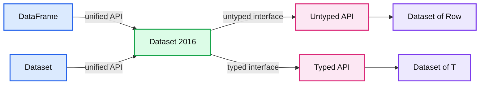
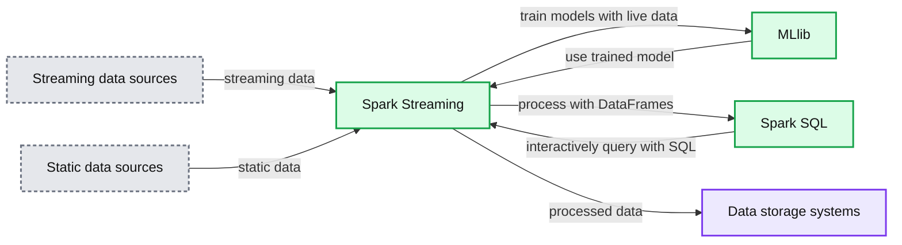
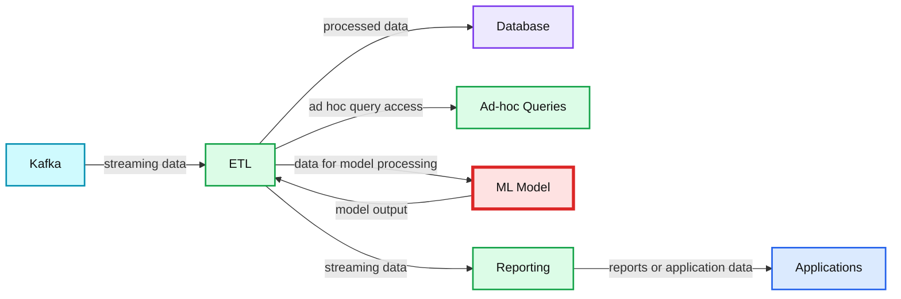

# Apache Spark Key Terms, Explained

- Source: https://www.databricks.com/blog/2016/06/22/apache-spark-key-terms-explained.html
- Published: 2016-06-22
- Authors: Jules Damji, Denny Lee
- Categories: engineering, solutions
- Images: 6 total, 5 extracted as architecture

*This article was originally [posted on KDnuggets](https://www.kdnuggets.com/2016/06/spark-key-terms-explained.html)*

*The Spark Summit Europe call for presentations is open, [submit your idea today](https://www.databricks.com/dataaisummit)*

---

As observed in the Fortune article [Survey shows huge popularity spike for Apache Spark](https://fortune.com/2015/09/25/apache-spark-survey/):

>  "Apache Spark is the Taylor Swift of big data software. The open source technology has been around and popular for a few years. But 2015 was the year Spark went from an ascendant technology to a bona fide superstar."

One of the reasons why Apache Spark has become so popular is because Spark provides data engineers and data scientists with a powerful, unified engine that is both fast (100x faster than Apache Hadoop for large-scale data processing) and easy to use. This allows data practitioners to solve their machine learning, graph computation, streaming, and real-time interactive query processing problems interactively and at much greater scale.

In this blog post, we will discuss some of the key terms one encounters when working with Apache Spark.

## 1. Apache Spark

Apache Spark is a powerful open-source processing engine built around speed, ease of use, and sophisticated analytics, with APIs in Java, Scala, Python, R, and SQL. Spark runs programs up to 100x faster than Hadoop MapReduce in memory, or 10x faster on disk. It can be used to build data applications as a library, or to perform ad-hoc data analysis interactively. Spark powers a stack of libraries including SQL, DataFrames, and Datasets, MLlib for machine learning, GraphX for graph processing, and Spark Streaming. You can combine these libraries seamlessly in the same application. As well, Spark runs on a laptop, Hadoop, Apache Mesos, standalone, or in the cloud. It can access diverse data sources including HDFS, Apache Cassandra, Apache HBase, and S3.

It was originally developed at UC Berkeley in 2009. (Note that Spark’s creator Matei Zaharia has since become CTO at Databricks and faculty member at MIT.) Since its release, Spark has seen rapid adoption by enterprises across a wide range of industries. Internet powerhouses such as Netflix, Yahoo, and Tencent have eagerly deployed Spark at massive scale, collectively processing multiple petabytes of data on clusters of over 8,000 nodes. It has quickly become the largest open source community in big data, with over 1000 code contributors and with over 187,000 members in 420 [Apache Spark Meetups](https://www.meetup.com/topics/apache-spark/) groups.

## 2. RDD

At the core of Apache Spark is the notion of data abstraction as distributed collection of objects. This data abstraction, called Resilient Distributed Dataset (RDD), allows you to write programs that transform these distributed datasets.

RDDs are immutable distributed collection of elements of your data that can be stored in memory or disk across a cluster of machines. The data is partitioned across machines in your cluster that can be operated in parallel with a low-level API that offers transformations and actions. RDDs are fault tolerant as they track data lineage information to rebuild lost data automatically on failure.

Below is an Apache Spark code snippet using Python and RDDs to perform a word count.

## 3. DataFrame

Like an RDD, a DataFrame is an immutable distributed collection of data. Unlike an RDD, data is organized into named columns, like a table in a relational database. Designed to make large data sets processing even easier, DataFrame allows developers to impose a structure onto a distributed collection of data, allowing higher-level abstraction; it provides a domain specific language API to manipulate your distributed data; and makes Spark accessible to a wider audience, beyond specialized data engineers.

Below is an Apache Spark code snippet using SQL and DataFrames to query and join different data sources.

## 4. Dataset

Introduced in Spark 1.6, the goal of Spark Datasets is to provide an API that allows users to easily express transformations on domain objects, while also providing the performance and benefits of the robust Spark SQL execution engine.

Note, starting in Spark 2.0, the DataFrame APIs will merge with Datasets APIs, unifying data processing capabilities across all libraries. Because of unification, developers now have fewer concepts to learn or remember, and work with a single high-level and **type-safe** API called Dataset. Conceptually, the Spark DataFrame is an *alias* for a collection of generic objects `Dataset[Row]`, where a Row is a generic **untyped** JVM object. Dataset, by contrast, is a collection of **strongly-typed** JVM objects, dictated by a case class you define, in Scala or Java.

**Summary:** The diagram shows Apache Spark 2.0 unifying DataFrame and Dataset concepts under the Dataset API, with untyped and typed interfaces.

**Components:**

- DataFrame: Spark untyped API alias for Dataset of Row
- Dataset: Spark 2016 unified API
- Untyped API: Dataset of Row
- Typed API: Dataset of T
- DataFrame and Dataset concept overlap

**Flows:**

- DataFrame and Dataset -> Dataset 2016: unified into one API
- Dataset 2016 -> Untyped API: exposes Dataset of Row
- Dataset 2016 -> Typed API: exposes Dataset of T

**Numbers:** 2.0, 2016

source image: https://www.databricks.com/wp-content/uploads/2016/06/Screen-Shot-2016-06-21-at-18.24.16.png

// Define a case class that represents our type-specific Scala JVM Object
 case class Person (email: String, iq: Long, name: String)

// Read JSON file and convert to Dataset using the case class
 val ds = spark.read.json("...").as[Person]

## 5. MLlib

Apache Spark provides a general machine learning library -- MLlib -- that is designed for simplicity, scalability, and easy integration with other tools. With the scalability, language compatibility, and speed of Spark, data scientists can solve and iterate through their data problems faster.

From the inception of the Apache Spark project, MLlib was considered foundational for Spark’s success. The key benefit of MLlib is that it allows data scientists to focus on their data problems and models instead of solving the complexities surrounding distributed data (such as infrastructure, configurations, and so on). The data engineers can focus on distributed systems engineering using Spark’s easy-to-use APIs, while the data scientists can leverage the scale and speed of Spark core. Just as important, Spark MLlib is a general-purpose library, providing algorithms for most use cases while at the same time allowing the community to build upon and extend it for specialized use cases. To review the key terms of machine learning, please refer to Matthew Mayo’s [Machine Learning Key Terms, Explained](https://www.kdnuggets.com/2016/05/machine-learning-key-terms-explained.html).

## 6. ML Pipelines

Typically when running machine learning algorithms, it involves a sequence of tasks including pre-processing, feature extraction, model fitting, and validation stages. For example, when classifying text documents might involve text segmentation and cleaning, extracting features, and training a classification model with cross-validation. Though there are many libraries we can use for each stage, connecting the dots is not as easy as it may look, especially with large-scale datasets. Most ML libraries are not designed for distributed computation or they do not provide native support for pipeline creation and tuning.

**Summary:** Spark ML pipeline showing datasets flowing through tokenization, hashing, and logistic regression stages to produce a final dataset.

**Components:**

- ds0, ds1, ds2, ds3: Datasets
- tokenizer: Spark ML Transformer
- hashingTF: Spark ML feature transformation stage
- lr: Spark ML Estimator
- lr.model: Trained logistic regression model
- pipeline model: Pipeline containing the stages

**Flows:**

- ds0 -> tokenizer: Dataset input
- tokenizer -> ds1: Tokenized dataset
- ds1 -> hashingTF: Dataset input
- hashingTF -> ds2: Feature-transformed dataset
- ds2 -> lr.model: Training dataset
- lr -> lr.model: Estimator trains model
- lr.model -> ds3: Predicted dataset

**Numbers:** none

source image: https://www.databricks.com/wp-content/uploads/2016/06/ML-pipelines-diagram.png

```mermaid
%% Spark ML pipeline data flow from input dataset to predicted dataset
flowchart LR
    ds0[(ds0)] -->|dataset input| tokenizer[tokenizer]
    tokenizer -->|tokenized dataset| ds1[(ds1)]
    ds1 -->|dataset input| hashingTF[hashingTF]
    hashingTF -->|feature transformed dataset| ds2[(ds2)]
    ds2 -->|training dataset| lrmodel[lr.model]
    lr[lr] -->|trains model| lrmodel
    lrmodel -->|predicted dataset| ds3[(ds3)]

    classDef client   fill:#dbeafe,stroke:#2563eb,stroke-width:2px,color:#111
    classDef service  fill:#dcfce7,stroke:#16a34a,stroke-width:2px,color:#111
    classDef store    fill:#ede9fe,stroke:#7c3aed,stroke-width:2px,color:#111
    classDef cache    fill:#fef3c7,stroke:#d97706,stroke-width:2px,color:#111
    classDef queue    fill:#cffafe,stroke:#0891b2,stroke-width:2px,color:#111
    classDef critical fill:#fee2e2,stroke:#dc2626,stroke-width:4px,color:#111
    classDef external fill:#e5e7eb,stroke:#6b7280,stroke-width:2px,color:#111,stroke-dasharray:4 3
    classDef decision fill:#fce7f3,stroke:#db2777,stroke-width:2px,color:#111

    class ds0,ds1,ds2,ds3 store
    class tokenizer,hashingTF,lrmodel service
    class lr client
```

The ML Pipelines is a High-Level API for MLlib that lives under the “spark.ml” package. A pipeline consists of a sequence of stages. There are two basic types of pipeline stages: Transformer and Estimator. A Transformer takes a dataset as input and produces an augmented dataset as output. E.g., a tokenizer is a Transformer that transforms a dataset with text into an dataset with tokenized words. An Estimator must be first fit on the input dataset to produce a model, which is a Transformer that transforms the input dataset. E.g., logistic regression is an Estimator that trains on a dataset with labels and features and produces a logistic regression model.

## 7. GraphX

GraphX is the component in Apache Spark for graphs and graph-parallel computation. At a high level, GraphX extends the Spark RDD via a Graph abstraction: a directed multigraph with properties attached to each vertex and edge. To support graph computation, GraphX exposes a set of fundamental operators (e.g., subgraph, joinVertices, and aggregateMessages) as well as an optimized variant of the Pregel API. In addition, GraphX includes a growing collection of graph algorithms and builders to simplify graph analytics tasks.

## 8. Spark Streaming

Spark Streaming is an extension of the core Spark API that allows data engineers and data scientists to process real-time data from various sources including (but not limited to) Kafka, Flume, and Amazon Kinesis. This processed data can be pushed out to filesystems, databases, and live dashboards. Its key abstraction is a Discretized Stream or, in short, a DStream, which represents a stream of data divided into small batches. DStreams are built on RDDs, Spark’s core data abstraction. This allows Spark Streaming to seamlessly integrate with any other Spark components like MLlib and Spark SQL.

**Summary:** Spark Streaming integrates streaming and static data sources with MLlib, Spark SQL, and data storage systems.

**Components:**

- Spark Streaming: stream processing
- MLlib: machine learning
- Spark SQL: SQL and DataFrames
- Streaming data sources: Akka, Flume, Kafka, Amazon Kinesis
- Static data sources: HBase, Cassandra, MongoDB, Elasticsearch, MySQL, PostgreSQL, Parquet
- Data storage systems: Elasticsearch, MemSQL, Cassandra, HBase, Parquet, Kafka

**Flows:**

- Streaming data sources -> Spark Streaming: streaming data
- Static data sources -> Spark Streaming: static data
- Spark Streaming -> MLlib: train models with live data
- MLlib -> Spark Streaming: use trained model
- Spark Streaming -> Spark SQL: process with DataFrames
- Spark SQL -> Spark Streaming: interactively query with SQL
- Spark Streaming -> Data storage systems: processed data

**Numbers:** none

source image: https://www.databricks.com/wp-content/uploads/2016/06/Apache-Spark-Streaming-ecosystem-diagram.png

This unification of disparate data processing capabilities is the key reason behind Spark Streaming’s rapid adoption. It makes it very easy for developers to use a single framework to satisfy all their processing needs.

## 9. Structured Streaming

Introduced as part of Apache Spark 2.0, structured streaming is a high-level streaming built on top of the Spark SQL engine. It is a declarative API that extends DataFrames and Datasets to support batch, interactive, and streaming queries. The advantage of this approach is that it allows programmers to apply their experience working with static data sets (i.e. batch) and easily apply this to infinite data sets (i.e. streaming).

## 10. [spark-packages.org](http://spark-packages.org)

[spark-packages.org](http://spark-packages.org) is a community package index to track the growing number of open source packages and libraries that work with Apache Spark. Spark Packages makes it easy for users to find, discuss, rate, and install packages for any version of Spark and makes it easy for developers to contribute packages.

Spark Packages features integrations with various data sources, management tools, higher level domain-specific libraries, machine learning algorithms, code samples, and other Spark content. Examples packages include Spark-CSV (which is now included in Spark 2.0) and Spark ML integration packages including GraphFrames and TensorFrames.

## 11. Catalyst Optimizer

Spark SQL is one of the most technically involved components of Apache Spark. It powers both SQL queries and the [DataFrame API](https://www.databricks.com/blog/2015/02/17/introducing-dataframes-in-spark-for-large-scale-data-science.html). At the core of Spark SQL is the Catalyst optimizer, which leverages advanced programming language features (e.g. Scala’s [pattern matching](https://docs.scala-lang.org/tour/pattern-matching.html) and [quasiquotes](https://docs.scala-lang.org/overviews/quasiquotes/intro.html)) in a novel way to build an extensible query optimizer.

Catalyst is based on functional programming constructs in Scala and designed with these key two purposes:

- Easily add new optimization techniques and features to Spark SQL
- Enable external developers to extend the optimizer (e.g. adding data source specific rules, support for new data types, etc.)

As well, Catalyst supports both rule-based and cost-based optimization.

**Summary:** The diagram shows Spark SQL processing queries and DataFrames through Catalyst analysis, optimization, physical planning, cost evaluation, and code generation into RDDs.

**Components:**

- SQL Query - Spark SQL query input
- DataFrame - Spark structured data input
- Unresolved Logical Plan - Catalyst analysis output before resolution
- Catalog - Metadata source for analysis
- Logical Plan - Resolved Catalyst plan
- Optimized Logical Plan - Catalyst optimized plan
- Physical Plans - Candidate execution plans
- Cost Model - Cost-based plan evaluator
- Selected Physical Plan - Chosen execution plan
- RDDs - Spark execution data structures

**Flows:**

- SQL Query -> Unresolved Logical Plan: query definition
- DataFrame -> Unresolved Logical Plan: structured data operation
- Catalog -> Logical Plan: metadata for resolution
- Unresolved Logical Plan -> Logical Plan: analyzed plan
- Logical Plan -> Optimized Logical Plan: logical optimization
- Optimized Logical Plan -> Physical Plans: physical planning candidates
- Physical Plans -> Cost Model: candidate plans for evaluation
- Cost Model -> Selected Physical Plan: selected lowest-cost plan
- Selected Physical Plan -> RDDs: generated execution code

**Numbers:** none

source image: https://www.databricks.com/wp-content/uploads/2016/06/Catalyst-Optimizer-diagram.png

```mermaid
%% Shows Spark SQL Catalyst processing from inputs to RDDs
flowchart LR
    SQL[SQL Query] -->|query definition| ULP[Unresolved Logical Plan]
    DF[DataFrame] -->|structured data operation| ULP
    CAT[Catalog] -->|metadata| LP[Logical Plan]
    ULP -->|analysis| LP
    LP -->|logical optimization| OLP[Optimized Logical Plan]
    OLP -->|physical planning| PP[Physical Plans]
    PP -->|candidate plans| CM[Cost Model]
    CM -->|selected plan| SPP[Selected Physical Plan]
    SPP -->|code generation| RDD[RDDs]

    class SQL,DF client
    class ULP,LP,OLP,PP,SPP service
    class CAT store
    class CM decision
    class RDD queue

    classDef client   fill:#dbeafe,stroke:#2563eb,stroke-width:2px,color:#111
    classDef service  fill:#dcfce7,stroke:#16a34a,stroke-width:2px,color:#111
    classDef store    fill:#ede9fe,stroke:#7c3aed,stroke-width:2px,color:#111
    classDef cache    fill:#fef3c7,stroke:#d97706,stroke-width:2px,color:#111
    classDef queue    fill:#cffafe,stroke:#0891b2,stroke-width:2px,color:#111
    classDef critical fill:#fee2e2,stroke:#dc2626,stroke-width:4px,color:#111
    classDef external fill:#e5e7eb,stroke:#6b7280,stroke-width:2px,color:#111,stroke-dasharray:4 3
    classDef decision fill:#fce7f3,stroke:#db2777,stroke-width:2px,color:#111

    %% Legend
    %% client = clients edge gateway or load balancer
    %% service = stateless compute
    %% store = databases or durable storage
    %% cache = losable cache
    %% queue = Kafka streams or asynchronous pipes
    %% critical = bottleneck or single point of failure
    %% external = third party
    %% decision = trade off point
```

For more information, please refer to [Deep Dive into Spark SQL’s Catalyst Optimizer](https://www.databricks.com/blog/2015/04/13/deep-dive-into-spark-sqls-catalyst-optimizer.html) and the webinar [Apache Spark DataFrames: Simple and Fast Analysis of Structured Data](https://www.databricks.com/).

## 12. Tungsten

[Tungsten](https://www.databricks.com/glossary/tungsten) is the codename for the umbrella project to make changes to Apache Spark’s execution engine that focuses on substantially improving the efficiency of memory and CPU for Spark applications, to push performance closer to the limits of modern hardware. This effort includes the following initiatives:

- *Memory Management and Binary Processing:* leveraging application semantics to manage memory explicitly and eliminate the overhead of JVM object model and garbage collection
- *Cache-aware computation:* algorithms and data structures to exploit memory hierarchy
- *Code generation:* using code generation to exploit modern compilers and CPUs
- *No virtual function dispatches:* this reduces multiple CPU calls which can have a profound impact on performance when dispatching billions of times.
- *Intermediate data in memory vs CPU registers:* Tungsten Phase 2 places intermediate data into CPU registers. This is an order of magnitudes reduction in the number of cycles to obtain data from the CPU registers instead of from memory
- *Loop unrolling and SIMD:* Optimize Apache Spark’s execution engine to take advantage of modern compilers and CPUs’ ability to efficiently compile and execute simple for loops (as opposed to complex function call graphs).

For more information, please reference [Project Tungsten: Bringing Apache Spark Closer to Bare Metal](https://www.databricks.com/blog/2015/04/28/project-tungsten-bringing-spark-closer-to-bare-metal.html), [Deep Dive into Spark SQL’s Catalyst Optimizer](https://www.databricks.com/blog/2015/04/13/deep-dive-into-spark-sqls-catalyst-optimizer.html), and [Apache Spark as a Compiler: Joining a Billion Rows per Second on a Laptop](https://www.databricks.com/blog/2016/05/23/apache-spark-as-a-compiler-joining-a-billion-rows-per-second-on-a-laptop.html).

## 13. Continuous Applications

In Apache Spark 2.0, adding structure to Spark, through use of high-level DataFrames and Datasets APIs, accommodates a novel approach to look at real-time streaming. That is, look at streaming not as streaming but as either a static table of data (where you know all the data) or a continuous table of data (where new data is continuously arriving).

As such you can build end-to-end **continuous applications**, in which you can issue the same queries to batch as to real-time data, perform ETL, generate reports, update or track specific data in the stream. This combined batch & real-time query-capabilities to a structured stream is a unique offering—not many streaming engines offer it yet.

**Summary:** The diagram shows Kafka feeding ETL for database storage, ad-hoc queries, machine learning, reporting, and applications in an end-to-end continuous application.

**Components:**

- Kafka, streaming technology
- ETL, data processing technology
- Database, durable storage
- Ad-hoc Queries, query processing
- ML Model, machine learning processing
- Reporting, reporting service
- Applications, downstream applications
- Traditional streaming, stream processing path
- Other processing types, alternate processing paths

**Flows:**

- Kafka -> ETL: streaming data
- ETL -> Database: processed data
- ETL -> Ad-hoc Queries: ad-hoc query access
- ETL -> ML Model: data for model processing
- ML Model -> ETL: model output
- ETL -> Reporting: streaming data
- Reporting -> Applications: reports or application data

**Numbers:** none

source image: https://www.databricks.com/wp-content/uploads/2016/06/example-apache-spark-continuous-application.png
