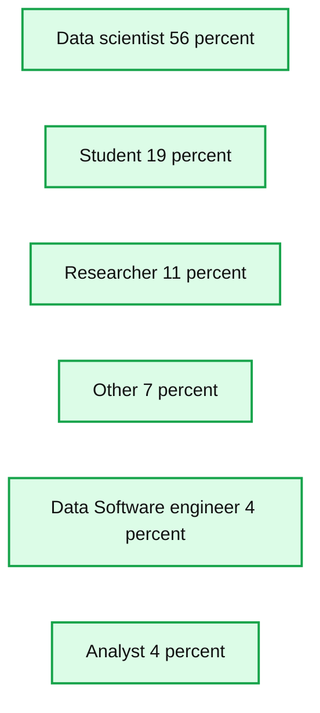
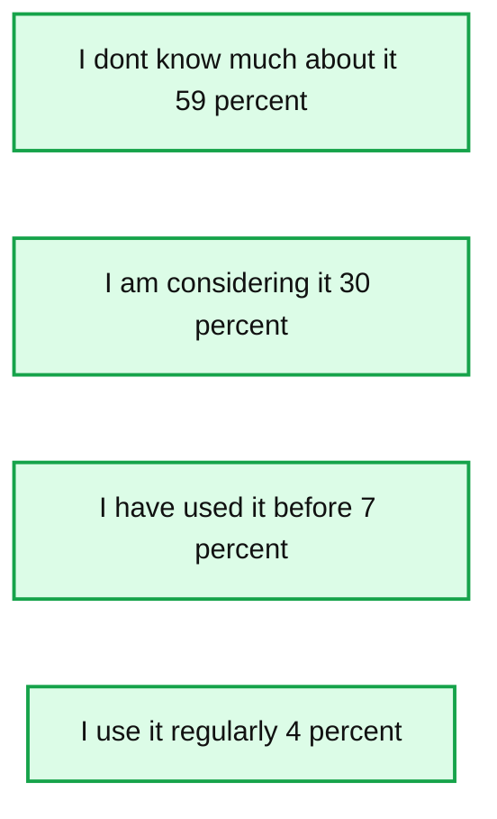

# SparkR Tutorial at useR 2016

- Source: https://www.databricks.com/blog/2016/07/07/sparkr-tutorial-at-user-2016.html
- Published: 2016-07-07
- Authors: Hossein Falaki, Shivaram Venkataraman
- Categories: solutions, engineering
- Images: 2 total, 2 extracted as architecture

*Free Edition has replaced Community Edition, offering enhanced features at no cost. Start using *[*Free Edition *](https://login.databricks.com/?intent=SIGN_UP&amp;signup_experience_step=EXPRESS&amp;provider=DB_FREE_TIER&amp;dbx_source=www)*today.*
 

AMPLab and Databricks gave a tutorial on SparkR at the useR conference. The conference was held from June 27 - June 30 at Stanford. In this blog post, we provide high-level introductions along with pointers to the training material and some findings from a survey we conducted during the tutorial.

## Part I: Data Exploration

The first part of the tutorial was about big data exploration with SparkR. We started the tutorial with a [presentation introducing SparkR](https://www.slideshare.net/databricks/use-r-tutorial-part1-introduction-to-sparkr). This included an overview of SparkR architecture and introduced three types of machine learning that is possible with [SparkR](https://www.databricks.com/blog/2016/12/28/10-things-i-wish-i-knew-before-using-apache-sparkr.html):

- Big Data, Small Learning
- Partition, Aggregate
- Large Scale Machine Learning

The hands-on exercise started with a brief overview of Databricks Workspace. We used R Notebooks in Databricks Community Edition to run R and SparkR commands. It is a free service that supports running Spark in Scala/Python and R.

Participants started by importing the [first notebook](https://databricks-prod-cloudfront.cloud.databricks.com/public/4027ec902e239c93eaaa8714f173bcfc/4445213449192764/3183285071251547/936056/latest.html) into their workspace. As you can see in this notebook, we started by reading the one million songs dataset as a Apache Spark DataFrame and visually explored it with two techniques:

- Summarizing and visualizing
- Sampling and visualizing

The notebook introduces both techniques with practical examples and ends with a few exercises.

## Part II: Advanced Analytics

In the [second part of the tutorial](https://docs.google.com/presentation/d/1parLAcwxT9Qsbxl-VAdBz0g9ATt3Kmyvor38wartxsc/edit?usp=sharing) we introduced machine learning algorithms that are available in SparkR. These include the SparkML algorithms that are exposed to R users through a natural R interface. For example, SparkR users can take advantage of a distributed GLM implementation just the same way they would use existing glmnet package. We also introduced two new powerful API that have been added to SparkR in Apache Spark 2.0.

- dapply used for applying an R function on all partitions of Spark DataFrame in parallel
- spark.lapply used for parallelizing R functions in multiple machines/workers

The [second notebook](https://databricks-prod-cloudfront.cloud.databricks.com/public/4027ec902e239c93eaaa8714f173bcfc/4445213449192764/306258535914851/936056/latest.html) again used the Million Songs dataset to do K-Means clustering and also built a predictive model using GLM. Like the first part, it ends with a few exercises for further practice.

## Survey Results

**Summary:** The chart shows SparkR tutorial participants by job title and percentage.

**Components:**

- Data scientist, technology not specified
- Student, technology not specified
- Researcher, technology not specified
- Other, technology not specified
- Data Software engineer, technology not specified
- Analyst, technology not specified

**Flows:**

- none

**Numbers:** 56%, 19%, 11%, 7%, 4%, 4%, 0, 20, 40, 60

source image: https://www.databricks.com/wp-content/uploads/2016/07/sparkr-tutorial-participants.png

Here is a short summary of survey responses. More than half of the attendees were data scientists, and about 20% were students. When asked about their use cases of R, every one listed “data cleaning and wrangling” as a use case. The majority (~80%) also included “data exploration” and “[predictive analytics](https://www.databricks.com/glossary/predictive-analytics)” as their uses for R. A large majority of participants indicated that they load their data into R, from local filesystem. Loading from RDBMS systems was second in popularity with 60%.

Majority of participants were dplyr users, and about 60% indicated that they prefer hadleyverse for data cleaning and wrangling. When asked about how they communicate their findings, the most popular method is publishing R plots in slides/documents and closely after is sharing rMarkdown files.

**Summary:** The chart shows survey results for attendees’ familiarity with SparkR.

**Components:**

- I don’t know much about it - SparkR familiarity response
- I am considering it - SparkR familiarity response
- I have used it before - SparkR familiarity response
- I use it regularly - SparkR familiarity response

**Flows:**

- none

**Numbers:** 59%, 30%, 7%, 4%

source image: https://www.databricks.com/wp-content/uploads/2016/07/familiarity-with-sparkr.png

More than half of the attendees had never used SparkR or MLLib and about 25% were actively considering both. We hope this tutorial was helpful to the attendees.

## What’s Next?

If you want to try these notebooks do the following:

1. Sign up for the Databricks Community Edition
2. Import SparkR tutorials [part-1](https://databricks-prod-cloudfront.cloud.databricks.com/public/4027ec902e239c93eaaa8714f173bcfc/4445213449192764/3183285071251547/936056/latest.html) and [part-2](https://databricks-prod-cloudfront.cloud.databricks.com/public/4027ec902e239c93eaaa8714f173bcfc/4445213449192764/306258535914851/936056/latest.html) into Databricks Community Edition
