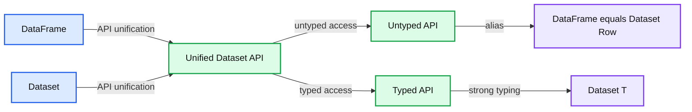
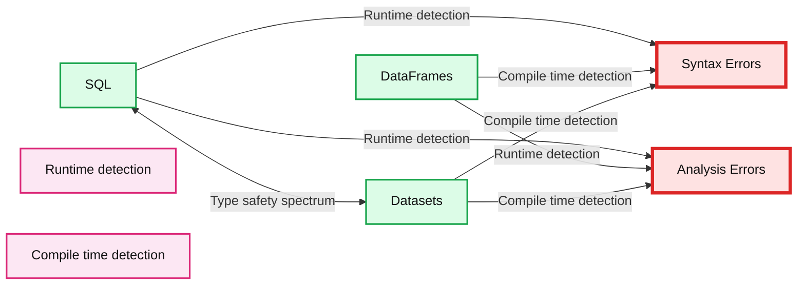
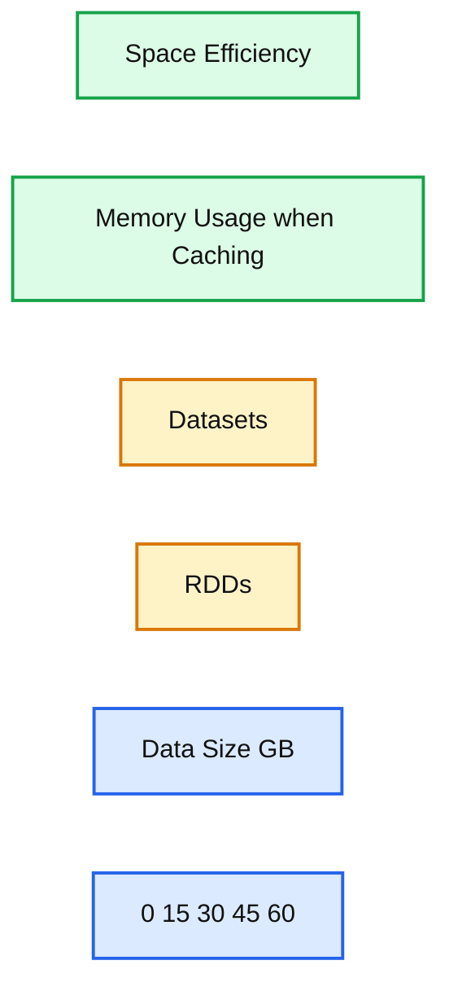

# A Tale of Three Apache Spark APIs: RDDs vs DataFrames and Datasets

*When to use them and why*

- Source: https://www.databricks.com/blog/2016/07/14/a-tale-of-three-apache-spark-apis-rdds-dataframes-and-datasets.html
- Published: 2016-07-14
- Authors: Jules Damji
- Categories: engineering, open-source
- Images: 5 total, 3 extracted as architecture

Of all the developers' delight, none is more attractive than a set of APIs that make developers productive, that is easy to use, and that is intuitive and expressive. One of [Apache Spark's](https://www.databricks.com/glossary/what-is-apache-spark) appeal to developers has been its easy-to-use APIs, for operating on large datasets, across languages: Scala, Java, Python, and R.

In this blog, I explore three sets of APIs—RDDs, DataFrames, and Datasets—available in [Apache Spark 2.2](https://spark.apache.org/releases/spark-release-2-2-0.html) and beyond; why and when you should use each set; outline their performance and optimization benefits; and enumerate scenarios when to use DataFrames and Datasets instead of RDDs. Mostly, I will focus on DataFrames and Datasets, because in [Apache Spark 2.0](https://www.databricks.com/), these two APIs are unified.

Our primary motivation behind this unification is our quest to simplify Spark by limiting the number of concepts that you have to learn and by offering ways to process structured data. And through structure, Spark can offer higher-level abstraction and APIs as domain-specific language constructs.

## Resilient Distributed Dataset (RDD)

RDD was the primary user-facing API in Spark since its inception. At the core, an RDD is an immutable distributed collection of elements of your data, partitioned across nodes in your cluster that can be operated in parallel with a low-level API that offers *transformations* and *actions*.

### When to use RDDs?

Consider these scenarios or common use cases for using RDDs when:

- you want low-level transformation and actions and control on your dataset;
- your data is unstructured, such as media streams or streams of text;
- you want to manipulate your data with functional programming constructs than domain specific expressions;
- you don't care about imposing a schema, such as columnar format, while processing or accessing data attributes by name or column; and
- you can forgo some optimization and performance benefits available with DataFrames and Datasets for structured and semi-structured data.

### What happens to RDDs in Apache Spark 2.0?

You may ask: Are RDDs being relegated as second class citizens? Are they being deprecated?

The answer is a resounding **NO!**

What's more, as you will note below, you can seamlessly move between DataFrame or Dataset and RDDs at will—by simple API method calls—and DataFrames and Datasets are built on top of RDDs.

## DataFrames

Like an RDD, a [DataFrame](https://www.databricks.com/blog/2015/02/17/introducing-dataframes-in-spark-for-large-scale-data-science.html) is an immutable distributed collection of data. Unlike an RDD, data is organized into named columns, like a table in a relational database. Designed to make large data sets processing even easier, DataFrame allows developers to impose a structure onto a distributed collection of data, allowing higher-level abstraction; it provides a domain specific language API to manipulate your distributed data; and makes Spark accessible to a wider audience, beyond specialized data engineers.

In our preview of [Apache Spark 2.0 webinar](https://www.databricks.com/) and [subsequent blog](https://www.databricks.com/blog/2016/05/11/apache-spark-2-0-technical-preview-easier-faster-and-smarter.html), we mentioned that in Spark 2.0, DataFrame APIs will merge with [Datasets](https://www.databricks.com/blog/2016/01/04/introducing-apache-spark-datasets.html) APIs, unifying data processing capabilities across libraries. Because of this unification, developers now have fewer concepts to learn or remember, and work with a single high-level and type-safe API called Dataset.

**Summary:** The diagram shows Apache Spark 2.0 unifying DataFrame and Dataset APIs under a single Dataset API with typed and untyped interfaces.

**Components:**

- DataFrame: Apache Spark untyped API alias
- Dataset: Apache Spark unified API
- Untyped API: DataFrame equals Dataset Row
- Typed API: Dataset T
- Alias: DataFrame equals Dataset Row

**Flows:**

- DataFrame and Dataset -> Unified Dataset API: API unification
- Unified Dataset API -> Untyped API: untyped access
- Unified Dataset API -> Typed API: strongly typed access

**Numbers:** 2.0, 2016

source image: https://www.databricks.com/wp-content/uploads/2016/06/Unified-Apache-Spark-2.0-API-1.png

## Datasets

Starting in Spark 2.0, Dataset takes on two distinct APIs characteristics: a ***strongly-typed*** API and an ***untyped*** API, as shown in the table below. Conceptually, consider DataFrame as an *alias* for a collection of generic objects *Dataset[Row]*, where a *Row* is a generic ***untyped*** JVM object. Dataset, by contrast, is a collection of ***strongly-typed*** JVM objects, dictated by a case class you define in Scala or a class in Java.

### Typed and Un-typed APIs

| Language | Main Abstraction |
|---|---|
| Scala | Dataset[T] & DataFrame (alias for Dataset[Row]) |
| Java | Dataset[T] |
| Python* | DataFrame |
| R* | DataFrame |

***Note:** Since Python and R have no compile-time type-safety, we only have untyped APIs, namely DataFrames.*

## Benefits of Dataset APIs

As a Spark developer, you benefit with the DataFrame and Dataset unified APIs in Spark 2.0 in a number of ways.

### 1. Static-typing and runtime type-safety

Consider static-typing and runtime safety as a spectrum, with SQL least restrictive to Dataset most restrictive. For instance, in your Spark SQL string queries, you won't know a syntax error until [runtime](https://www.databricks.com/glossary/what-is-databricks-runtime) (which could be costly), whereas in [DataFrames](https://www.databricks.com/glossary/what-are-dataframes) and Datasets you can catch errors at compile time (which saves developer-time and costs). That is, if you invoke a function in DataFrame that is not part of the API, the compiler will catch it. However, it won't detect a non-existing column name until runtime.

At the far end of the spectrum is Dataset, most restrictive. Since Dataset APIs are all expressed as lambda functions and JVM typed objects, any mismatch of typed-parameters will be detected at compile time. Also, your analysis error can be detected at compile time too, when using Datasets, hence saving developer-time and costs.

All this translates to is a spectrum of type-safety along syntax and analysis error in your Spark code, with Datasets as most restrictive yet productive for a developer.

**Summary:** The diagram compares SQL, DataFrames, and Datasets across syntax and analysis error detection, showing increasing type safety toward Datasets.

**Components:**

- SQL
- DataFrames
- Datasets
- Syntax Errors
- Analysis Errors
- Runtime detection
- Compile time detection

**Flows:**

- SQL <-> Datasets: Type safety spectrum
- SQL -> Syntax Errors: Runtime detection
- DataFrames -> Syntax Errors: Compile time detection
- Datasets -> Syntax Errors: Compile time detection
- SQL -> Analysis Errors: Runtime detection
- DataFrames -> Analysis Errors: Runtime detection
- Datasets -> Analysis Errors: Compile time detection

**Numbers:** none

source image: https://www.databricks.com/wp-content/uploads/2016/07/sql-vs-dataframes-vs-datasets-type-safety-spectrum.png

### 2. High-level abstraction and custom view into structured and semi-structured data

DataFrames as a collection of *Datasets[Row]* render a structured custom view into your semi-structured data. For instance, let's say, you have a huge IoT device event dataset, expressed as JSON. Since JSON is a semi-structured format, it lends itself well to employing Dataset as a collection of strongly typed-specific *Dataset[DeviceIoTData]*.

You could express each JSON entry as *DeviceIoTData*, a custom object, with a Scala case class.

Next, we can read the data from a JSON file.

Three things happen here under the hood in the code above:

1. Spark reads the JSON, infers the schema, and creates a collection of DataFrames.
2. At this point, Spark converts your data into *DataFrame = Dataset[Row]*, a collection of generic Row object, since it does not know the exact type.
3. Now, Spark converts the *Dataset[Row] -> Dataset[DeviceIoTData]* ***type-specific*** Scala JVM object, as dictated by the **class** *DeviceIoTData*.

Most of us have who work with structured data are accustomed to viewing and processing data in either columnar manner or accessing specific attributes within an object. With Dataset as a collection of *Dataset[ElementType] typed objects*, you seamlessly get both compile-time safety and custom view for strongly-typed JVM objects. And your resulting ***strongly-typed*** *Dataset[T]* from above code can be easily displayed or processed with high-level methods.

### 3. Ease-of-use of APIs with structure

Although structure may limit control in what your Spark program can do with data, it introduces rich semantics and an easy set of domain specific operations that can be expressed as high-level constructs. Most computations, however, can be accomplished with Dataset's high-level APIs. For example, it's much simpler to perform `agg`, `select`, `sum`, `avg`, `map`, `filter`, or `groupBy` operations by accessing a Dataset typed object's *DeviceIoTData* than using RDD rows' data fields.

Expressing your computation in a domain specific API is far simpler and easier than with relation algebra type expressions (in RDDs). For instance, the code below will `filter() and ` `map()` create another immutable Dataset.

### 4. Performance and Optimization

Along with all the above benefits, you cannot overlook the space efficiency and performance gains in using DataFrames and Dataset APIs for two reasons.

First, because DataFrame and Dataset APIs are built on top of the Spark SQL engine, it uses Catalyst to generate an optimized logical and physical query plan. Across R, Java, Scala, or Python DataFrame/Dataset APIs, all relation type queries undergo the same code optimizer, providing the space and speed efficiency. Whereas the *Dataset[T]* typed API is optimized for data engineering tasks, the untyped *Dataset[Row]* (an alias of DataFrame) is even faster and suitable for interactive analysis.

**Summary:** The benchmark chart compares memory usage when caching Datasets and RDDs, showing Datasets use substantially less space.

**Components:**

- Datasets - Apache Spark Dataset API
- RDDs - Apache Spark RDD API
- Memory Usage when Caching - benchmark metric
- Data Size GB - measurement axis
- Space Efficiency - benchmark category

**Flows:**

- none

**Numbers:** 0, 15, 30, 45, 60, GB

source image: https://www.databricks.com/wp-content/uploads/2016/07/memory-usage-when-caching-datasets-vs-rdds.png

Second, since [Spark as a compiler](https://www.databricks.com/blog/2016/05/23/apache-spark-as-a-compiler-joining-a-billion-rows-per-second-on-a-laptop.html) understands your Dataset type JVM object, it maps your type-specific JVM object to Tungsten's internal memory representation using [Encoders](https://www.databricks.com/blog/2015/04/28/project-tungsten-bringing-spark-closer-to-bare-metal.html). As a result, [Tungsten](https://www.databricks.com/glossary/tungsten) Encoders can efficiently serialize/deserialize JVM objects as well as generate compact bytecode that can execute at superior speeds.

### When should I use DataFrames or Datasets?

- If you want rich semantics, high-level abstractions, and domain specific APIs, use DataFrame or Dataset.
- If your processing demands high-level expressions, filters, maps, aggregation, averages, sum, SQL queries, columnar access and use of lambda functions on semi-structured data, use DataFrame or Dataset.
- If you want higher degree of type-safety at compile time, want typed JVM objects, take advantage of Catalyst optimization, and benefit from Tungsten's efficient code generation, use Dataset.
- If you want unification and simplification of APIs across Spark Libraries, use DataFrame or Dataset.
- If you are a R user, use DataFrames.
- If you are a Python user, use DataFrames and resort back to RDDs if you need more control.

Note that you can always seamlessly interoperate or convert from DataFrame and/or Dataset to an RDD, by simple method call `.rdd`. For instance,

## Bringing It All Together

In summation, the choice of when to use RDD or DataFrame and/or Dataset seems obvious. While the former offers you low-level functionality and control, the latter allows custom view and structure, offers high-level and domain specific operations, saves space, and executes at superior speeds.

As we examined the lessons we learned from early releases of Spark—how to simplify Spark for developers, how to optimize and make it performant—we decided to elevate the low-level RDD APIs to a high-level abstraction as DataFrame and Dataset and to build this unified data abstraction across  libraries atop [Catalyst optimizer](https://www.databricks.com/glossary/catalyst-optimizer) and Tungsten.

Pick one—DataFrames and/or Dataset or RDDs APIs—that meets your needs and use-case, but I would not be surprised if you fall into the camp of most developers who work with structure and semi-structured data.

## What's Next?

You can [try the Apache Spark 2.2 on Databricks](https://www.databricks.com/blog/2016/05/11/apache-spark-2-0-technical-preview-easier-faster-and-smarter.html).

You can also watch the Spark Summit presentation on [A Tale of Three Apache Spark APIs: RDDs vs DataFrames and Datasets](https://www.youtube.com/watch?v=Ofk7G3GD9jk)

If you haven't signed up yet, [try Databricks now](https://www.databricks.com/try-databricks).

In the coming weeks, we'll have a series of blogs on Structured Streaming. Stay tuned.
