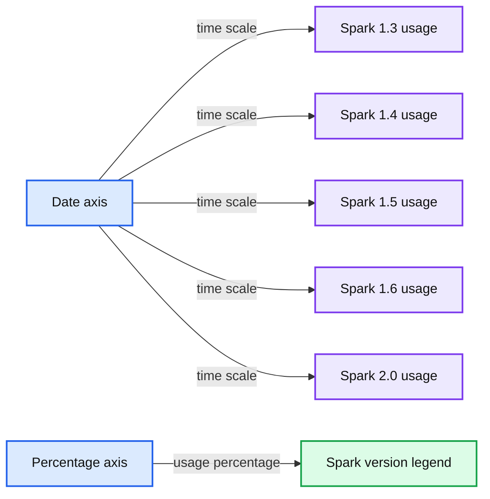
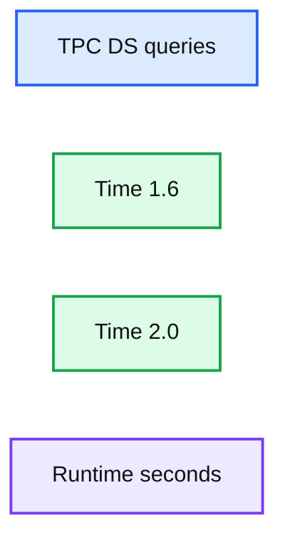

# Introducing Apache Spark 2.0

- Source: https://www.databricks.com/blog/2016/07/26/introducing-apache-spark-2-0.html
- Published: 2016-07-26
- Authors: Reynold Xin, Michael Lumb, Matei Zaharia
- Categories: engineering, open-source
- Images: 3 total, 2 extracted as architecture

Today, we're excited to announce the general availability of [Apache Spark 2.0](https://spark.apache.org/releases/spark-release-2-0-0.html) on Databricks. This release builds on what the community has learned in the past two years, doubling down on what users love and fixing the pain points. This post summarizes the three major themes—easier, faster, and smarter—that comprise Spark 2.0. We also explore many of them in more detail in our [anthology of Spark 2.0 content](https://www.databricks.com/blog/2016/06/01/preview-apache-spark-2-0-an-anthology-of-technical-assets.html).

Two months ago, we launched a preview release of Apache Spark 2.0 on Databricks. As you can see in the chart below, 10% of our clusters are already using this release, as customers experiment with the new features and give us feedback. Thanks to this experience, we are excited to be the first commercial vendor to support Spark 2.0.

*Apache Spark Usage over Time by VersionCost per Row (single thread)*

**Summary:** Stacked area chart showing Apache Spark cluster usage percentages over time by Spark release version.

**Components:**

- Date axis
- Percentage axis
- Spark version legend
- Spark 1.3 usage
- Spark 1.4 usage
- Spark 1.5 usage
- Spark 1.6 usage
- Spark 2.0 usage

**Flows:**

- none

**Numbers:** 100%, 75%, 50%, 25%, 0%, 1.3, 1.4, 1.5, 1.6, 2.0, October 2015, January 2016, April 2016, July 2016

source image: https://www.databricks.com/wp-content/uploads/2016/07/image00.png

Apache Spark Usage over Time by Version

 

Now, let’s dive into what's new in Apache Spark 2.0.

### Easier: ANSI SQL and Streamlined APIs

One thing we are proud of in Spark is APIs that are simple, intuitive, and expressive. Spark 2.0 continues this tradition, focusing on two areas: (1) standard SQL support and (2) unifying DataFrame/Dataset API.

On the SQL side, we have significantly expanded Spark's SQL support, with the introduction of a new ANSI SQL parser and [subqueries](https://www.databricks.com/blog/2016/06/17/sql-subqueries-in-apache-spark-2-0.html). **Spark 2.0 can run all the 99 TPC-DS queries, which require many of the SQL:2003 features.** Because SQL has been one of the primary interfaces to Spark, these extended capabilities drastically reduce the effort of porting legacy applications.

On the programmatic API side, we have streamlined Spark's APIs:

- **Unifying DataFrames and Datasets in Scala/Java:** Starting in Spark 2.0, DataFrame is just a type alias for Dataset of Row. Both the typed methods (e.g. `map`, `filter`, `groupByKey`) and the untyped methods (e.g. `select`, `groupBy`) are available on the Dataset class. Also, this new combined Dataset interface is the abstraction used for Structured Streaming. Since compile-time type-safety is not a feature in Python and R, the concept of Dataset does not apply to these language APIs. Instead, DataFrame remains the primary interface there, and is analogous to the single-node data frame notion in these languages. Get a peek from [this blog](https://www.databricks.com/blog/2016/07/14/a-tale-of-three-apache-spark-apis-rdds-dataframes-and-datasets.html) for the stories behind these APIs.
- **SparkSession:** a new entry point that supersedes SQLContext and HiveContext. For users of the DataFrame API, a common source of confusion for Spark is which “context” to use. Note that the old SQLContext and HiveContext classes are still kept for backward compatibility.
- **Simpler, more performant Accumulator API:** We have designed a new Accumulator API that has a simpler type hierarchy and support specialization for primitive types. The old Accumulator API has been deprecated but retained for backward compatibility
- **DataFrame-based Machine Learning API emerges as the primary ML API:** With Spark 2.0, the spark.ml package, with its “pipeline” APIs, will emerge as the primary machine learning API. While the original spark.mllib package is preserved, future development will focus on the DataFrame-based API.
- **Machine learning pipeline persistence:** Users can now save and load machine learning pipelines and models across all programming languages supported by Spark. See [this blog post](https://www.databricks.com/blog/2016/05/31/apache-spark-2-0-preview-machine-learning-model-persistence.html) for more details.
- **Distributed algorithms in R:** Added support for Generalized Linear Models (GLM), Naive Bayes, Survival Regression, and K-Means in R.
- **User-defined functions (UDFs) in R**: Added support for running partition level UDFs (dapply and gapply) and hyper-parameter tuning (lapply).

### Faster: Apache Spark as a Compiler

According to our [2015 Spark Survey](https://www.databricks.com/blog/2015/09/24/spark-survey-2015-results-are-now-available.html), 91% of users consider performance as the most important aspect of Apache Spark. As a result, performance optimizations have always been a focus in our Spark development. Before we started planning our contributions to Spark 2.0, we asked ourselves a question: **Spark is already pretty fast, but can we push the boundary and make Spark 10X faster?**

This question led us to fundamentally rethink the way we build Spark’s physical execution layer. When you look into a modern data engine (e.g. Spark or other MPP databases), majority of the CPU cycles are spent in useless work, such as making virtual function calls or reading/writing intermediate data to CPU cache or memory. Optimizing performance by reducing the amount of CPU cycles wasted in these useless work has been a long time focus of modern compilers.

Spark 2.0 ships with the second generation [Tungsten](https://www.databricks.com/blog/2015/04/28/project-tungsten-bringing-spark-closer-to-bare-metal.html) engine. **This engine builds upon ideas from modern compilers and MPP databases and applies them to Spark workloads.** The main idea is to emit optimized code at runtime that collapses the entire query into a single function, eliminating virtual function calls and leveraging CPU registers for intermediate data. We call this technique “[whole-stage code generation](https://www.databricks.com/blog/2016/05/23/apache-spark-as-a-compiler-joining-a-billion-rows-per-second-on-a-laptop.html).”

To give you a teaser, we have measured the time (in nanoseconds) it takes to process a row on one core for some of the operators in Spark 1.6 vs. Spark 2.0. The table below shows the improvements in Spark 2.0. Spark 1.6 also included an expression code generation technique that is used in some state-of-the-art commercial databases, but as you can see, many operators became an order of magnitude faster with whole-stage code generation.

Cost per Row (single thread)

| primitive | Spark 1.6 | Spark 2.0 |
|---|---|---|
| filter | 15ns | 1.1ns |
| sum w/o group | 14ns | 0.9ns |
| sum w/ group | 79ns | 10.7ns |
| hash join | 115ns | 4.0ns |
| sort (8-bit entropy) | 620ns | 5.3ns |
| sort (64-bit entropy) | 620ns | 40ns |
| sort-merge join | 750ns | 700ns |

 

How does this new engine work on end-to-end queries? We did some preliminary analysis using TPC-DS queries to compare Spark 1.6 and Spark 2.0:

**Summary:** Preliminary TPC-DS benchmark comparing query runtimes in Spark 1.6 and Spark 2.0, where lower runtime is better.

**Components:**

- Time 1.6: Spark 1.6 runtime series
- Time 2.0: Spark 2.0 runtime series
- TPC-DS queries: benchmark query categories on the horizontal axis
- Runtime seconds: vertical-axis measurement

**Flows:**

- none

**Numbers:** 1.6, 2.0, 0, 50, 100, 150, 200, 250, 300, 350, 400, 450, 500, 550, 600; query labels q1, q2, q3, q4, q5, q6, q7, q8, q9, q10, q11, q12, q13, q14, q15, q16, q17, q18, q19, q20, q21, q22, q23, q24, q25, q26, q27, q28, q29, q30, q31, q32, q33, q34, q35, q36, q37, q38, q39, q40, q41, q42, q43, q44, q45, q46, q47, q48, q49, q50, q51, q52, q53, q54, q55, q56, q57, q58, q59, q60, q61, q62, q63, q64, q65, q66, q67, q68, q69, q70, q71, q72, q73, q74, q75, q76, q77, q78, q79, q80, q81, q82, q83, q84, q85, q86, q87, q88, q89, q90, q91, q92, q93, q94, q95, q96, q97, q98, q99

source image: https://www.databricks.com/wp-content/uploads/2016/05/preliminary-tpc-ds-spark-2-0-vs-1-6.png

Beyond whole-stage code generation to improve performance, a lot of work has also gone into improving the Catalyst optimizer for general query optimizations such as nullability propagation, as well as a new vectorized Parquet decoder that improved Parquet scan throughput by 3X. [Read this blog post](https://www.databricks.com/blog/2016/05/23/apache-spark-as-a-compiler-joining-a-billion-rows-per-second-on-a-laptop.html) for more detail on the optimizations in Spark 2.0.

### Smarter: Structured Streaming

Spark Streaming has long led the big data space as one of the first systems unifying batch and streaming computation. When its streaming API, called DStreams, was introduced in Spark 0.7, it offered developers with several powerful properties: exactly-once semantics, fault-tolerance at scale, strong consistency guarantees and high throughput.

However, after working with hundreds of real-world deployments of Spark Streaming, we found that applications that need to make decisions in real-time often require **more than just a streaming engine**. They require deep integration of the batch stack and the streaming stack, interaction with external storage systems, as well as the ability to cope with changes in business logic. As a result, enterprises want more than just a streaming engine; instead they need a full stack that enables them to develop end-to-end **“continuous applications.”**

Spark 2.0 tackles these use cases through a new API called Structured Streaming. Compared to existing streaming systems, Structured Streaming makes three key improvements:

1. **Integrated API with batch jobs.** To run a streaming computation, developers simply write a batch computation against the DataFrame / Dataset API, and Spark automatically *incrementalizes* the computation to run it in a streaming fashion (i.e. update the result as data comes in). This powerful design means that developers don't have to manually manage state, failures, or keeping the application in sync with batch jobs. Instead, the streaming job always gives the same answer as a batch job on the same data.
2. **Transactional interaction with storage systems.** Structured Streaming handles fault tolerance and consistency holistically across the engine and storage systems, making it easy to write applications that update a live database used for serving, join in static data, or move data reliably between storage systems.
3. **Rich integration with the rest of Spark.** Structured Streaming supports interactive queries on streaming data through Spark SQL, joins against static data, and many libraries that already use DataFrames, letting developers build complete applications instead of just streaming pipelines. In the future, expect more integrations with MLlib and other libraries.

Spark 2.0 ships with an initial, alpha version of Structured Streaming, as a (surprisingly small!) extension to the DataFrame/Dataset API. This makes it easy to adopt for existing Spark users that want to answer new questions in real-time. Other key features include support for event-time based processing, out-of-order/delayed data, interactive queries, and interaction with non-streaming data sources and sinks.

We also updated the Databricks workspace to support Structured Streaming. For example, when launching a streaming query, the notebook UI will automatically display its status.

Streaming is clearly a broad topic, so stay tuned for a series of blog posts with more details on Structured Streaming in Apache Spark 2.0.

### Conclusion

Spark users initially came to Apache Spark for its ease-of-use and performance. Spark 2.0 doubles down on these while extending it to support an even wider range of workloads. Enjoy the new release on Databricks.
