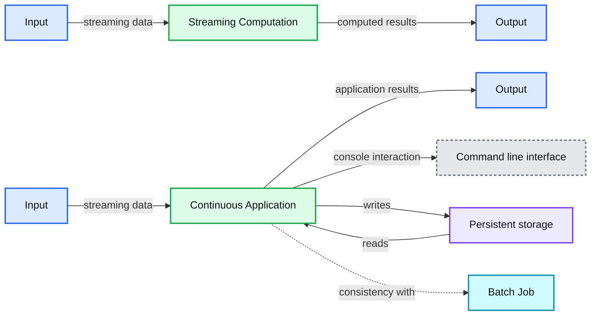

# Continuous Applications: Evolving Streaming in Apache Spark 2.0

- Source: https://www.databricks.com/blog/2016/07/28/continuous-applications-evolving-streaming-in-apache-spark-2-0.html
- Published: 2016-07-28
- Authors: Matei Zaharia
- Categories: engineering, open-source, data-streaming
- Images: 1 total, 1 extracted as architecture

Since its release, Spark Streaming has become [one of the most widely used](https://www.datanami.com/2016/07/07/investments-fast-data-analytics-surge/) distributed streaming engines, thanks to its high-level API and exactly-once semantics. Nonetheless, as these types of engines became common, we’ve noticed that developers often need more than just a streaming programming model to build real-time applications. At Databricks, we’ve worked with thousands of users to understand how to simplify real-time applications. In this post, we present the resulting idea, *continuous applications*, which we have started to implement through the [Structured Streaming API](https://www.databricks.com/blog/2016/07/28/structured-streaming-in-apache-spark.html) in [Apache Spark 2.0.](https://www.databricks.com/blog/2016/07/26/introducing-apache-spark-2-0.html)

Most streaming engines focus on performing computations on a stream: for example, one can map a stream to run a function on each record, reduce it to aggregate events by time, etc. However, as we worked with users, we found that **virtually no use case of streaming engines only involved performing computations on a stream**. Instead, stream processing happens as part of a larger application, which we’ll call a *continuous application*. Here are some examples:

1. **Updating data that will be served in real-time**. For instance, developers might want to update a summary table that users will query through a web application. In this case, much of the complexity is in the interaction between the streaming engine and the serving system: for example, can you run queries on the table while the streaming engine is updating it? The “complete” application is a real-time serving system, not a map or reduce on a stream.
2. **[Extract, transform and load](https://www.databricks.com/glossary/extract-transform-load) (ETL)**. One common use case is continuously moving and transforming data from one storage system to another (e.g. JSON logs to an [Apache Hive](https://www.databricks.com/glossary/apache-hive) table). This requires careful interaction with both storage systems to ensure no data is duplicated or lost -- much of the logic is in this coordination work.
3. **Creating a real-time version of an existing batch job.** This is hard because many streaming systems don’t guarantee their result will match a batch job. For example, we've seen companies that built live dashboards using a streaming engine and daily reporting using batch jobs, only to have customers complain that their daily report (or worse, their bill!) did not match the live metrics.
4. **Online machine learning**. These continuous applications often combine large static datasets, processed using batch jobs, with real-time data and live prediction serving.

These examples show that streaming computations are part of larger applications that include serving, storage, or batch jobs. Unfortunately, in current systems, streaming computations run on their own, in an engine focused just on streaming. This leaves developers responsible for the complex tasks of interacting with external systems (e.g. managing transactions) and making their result consistent with the the rest of the application (e.g., batch jobs). This is what we'd like to solve with continuous applications.

## Continuous Applications

We define a continuous application as *an end-to-end application that reacts to data in real-time*. In particular, we’d like developers to use a *single programming interface* to support the facets of continuous applications that are currently handled in separate systems, such as query serving or interaction with batch jobs. For example, here is how we would handle the use cases above:

1. **Updating data that will be served in real time**. The developer would write a single Spark application that handles both updates and serving (e.g. through Spark’s [JDBC server](https://spark.apache.org/docs/latest/sql-programming-guide.html#running-the-thrift-jdbcodbc-server)), or would use an API that automatically performs transactional updates on a serving system like MySQL, Redis or Apache Cassandra.
2. **Extract, transform and load (ETL)**. The developer would simply list the transformations required as in a batch job, and the streaming system would handle coordination with both storage systems to ensure exactly-once processing.
3. **Creating a real-time version of an existing batch job**. The streaming system would guarantee results are always consistent with a batch job on the same data.
4. **Online machine learning**. The [machine learning library](https://www.databricks.com/glossary/what-is-machine-learning-library) would be designed to combine real-time training, periodic batch training, and prediction serving behind the same API.

The figure below shows which concerns are usually handled in streaming engines, and which would be needed in continuous applications:

**Summary:** The diagram contrasts streaming computation with a continuous application that interacts with storage, command-line output, and batch jobs.

**Components:**

- Streaming Computation
- Continuous Application
- Command-line interface
- Persistent storage
- Batch Job

**Flows:**

- Input -> Streaming Computation: streaming data
- Streaming Computation -> Output: computed results
- Input -> Continuous Application: streaming data
- Continuous Application -> Output: application results
- Continuous Application -> Command-line interface: command or console interaction
- Continuous Application -> Persistent storage: writes
- Persistent storage -> Continuous Application: reads
- Continuous Application -> Batch Job: consistency with batch processing

**Numbers:** none

source image: https://www.databricks.com/wp-content/uploads/2016/07/continuous-apps.png

## Structured Streaming

[Structured Streaming](https://www.databricks.com/blog/2016/07/28/structured-streaming-in-apache-spark.html) is a new high-level API we have contributed to Apache Spark 2.0 to support continuous applications. It is, first, a higher-level API than Spark Streaming, bringing in ideas from the other structured APIs in Spark (DataFrames and Datasets)—most notably, a way to perform database-like query optimizations. More importantly, however, [Structured Streaming](https://www.databricks.com/glossary/what-is-structured-streaming) also incorporates the idea of continuous applications to provide a number of features that no other streaming engines offer.

1. ** Strong guarantees about consistency with batch jobs**. Users [specify a streaming computation by writing a batch computation](https://www.databricks.com/blog/2016/07/28/structured-streaming-in-apache-spark.html) (using Spark’s DataFrame/Dataset API), and the engine automatically *incrementalizes* this computation (runs it continuously). At any point, the output of the Structured Streaming job is [the same](https://www.databricks.com/blog/2016/07/28/structured-streaming-in-apache-spark.html) as running the batch job on a prefix of the input data. Most current streaming systems (e.g. Apache Storm, Kafka Streams, Google Dataflow and Apache Flink) **do not** provide this "prefix integrity" property.
2. **Transactional integration with storage systems**. We have taken care in the internal design to process data exactly once and update output sinks transactionally, so that serving applications always see a consistent snapshot of the data. While the Spark 2.0 release only supports a few data sources (HDFS and S3), we plan to add more in future versions. Transactional updates were one of the top pain points for users of Spark and other streaming systems, requiring [manual work](https://spark.apache.org/docs/latest/streaming-programming-guide.html#semantics-of-output-operations), so we are excited to make these part of the core API.
3. ** Tight integration with the rest of Spark**. Structured Streaming supports serving interactive queries on streaming state with [Spark SQL and JDBC](https://spark.apache.org/docs/latest/sql-programming-guide.html#running-the-thrift-jdbcodbc-server), and integrates with [MLlib](https://spark.apache.org/mllib/). These integrations are only beginning in Spark 2.0, but will grow in future releases. Because Structured Streaming builds on DataFrames, many other libraries of Spark will naturally run over it (e.g., all feature transformations in MLlib are written against DataFrames).

Apart from these unique characteristics, Structured Streaming has other new features to simplify streaming, such as explicit support for “event time” to aggregate out of order data, and richer support for windowing and sessions. Achieving its consistency semantics in a fault-tolerant manner is also not easy—see our [sister blog post](https://www.databricks.com/blog/2016/07/28/structured-streaming-in-apache-spark.html) about the API and execution model.

Structured Streaming is still in alpha in Spark 2.0, but we hope you try it out and send feedback. Our team and many other community members will be expanding it in the next few releases.

## An Example

As a simple example of Structured Streaming, the code below shows an Extract, Transform and Load (ETL) job that converts data from JSON into Apache Parquet. Note how Structured Streaming simply uses the [DataFrame API](https://www.databricks.com/blog/2015/02/17/introducing-dataframes-in-spark-for-large-scale-data-science.html), so the code is nearly identical to a batch version.

[row grid="yes"]
 [col xs="12" md="6"]

 

**Streaming Version**

 

[/col]
 [col xs="12" md="6"]

 

**Batch Version**

 

[/col]
 [/row]

 

While the code looks deceptively simple, Spark does a lot of work under the hood, such as grouping the data into Parquet partitions, ensuring each record appears in the output exactly once, and recovering the job’s state if you restart it. Finally, to serve this data *interactively* instead of writing it to Parquet, we could just change writeStream to use the (currently alpha) in-memory sink and connect a JDBC client to Spark to query it.

## Long-Term Vision

Our long-term vision for streaming in Spark is ambitious: *we want every library in Spark to work in an incremental fashion on Structured Streaming*. Although this is a big goal, Apache Spark is well positioned to achieve it. Its libraries are already built on common, narrow APIs (RDDs and DataFrames), and Structured Streaming is designed explicitly to give results consistent with these unified interfaces.

The biggest insight in Spark since its beginning is that developers need **unified interfaces***.* For example, batch computation on clusters used to require many disjoint systems (MapReduce for ETL, Hive for SQL, Giraph for graphs, etc), complicating both development and operations. Spark unified these workloads on one engine, greatly simplifying both tasks. The same insight applies to streaming. Because streaming workloads are usually part of a much larger continuous application, which may include serving, storage, and batch jobs, we want to offer a unified API and system for building end-to-end continuous applications.

## Read More

Our [Structured Streaming model](https://www.databricks.com/blog/2016/07/28/structured-streaming-in-apache-spark.html) blog post explores the streaming API and execution model in more detail. We recommend you read this post to get started with Structured Streaming.

In addition, the following resources cover Structured Streaming:

- [Spark 2.0 and Structured Streaming](https://www.databricks.com/dataaisummit)
- [Structuring Spark: DataFrames, Datasets and Streaming](https://www.databricks.com/dataaisummit)
- [A Deep Dive Into Structured Streaming](https://www.databricks.com/dataaisummit)
- [Structured Streaming Programming Guide](https://spark.apache.org/docs/latest/structured-streaming-programming-guide.html)
