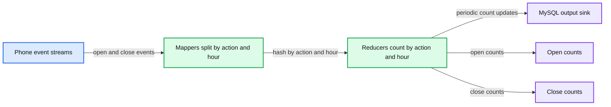
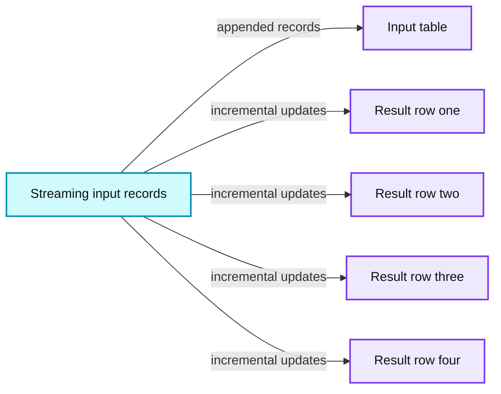
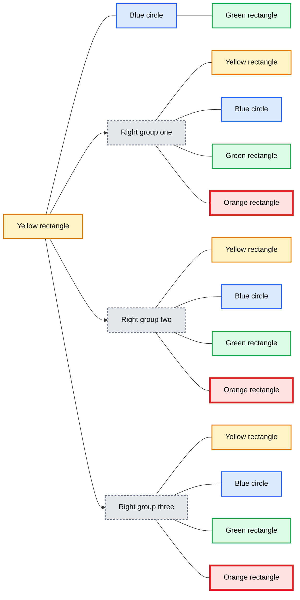
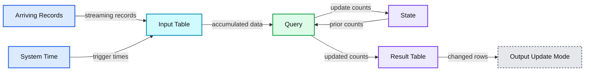
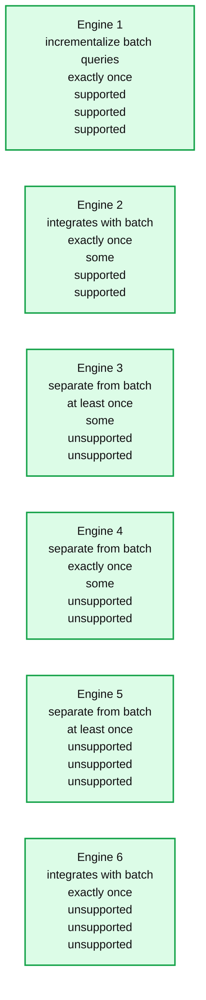

# Spark Structured Streaming

- Source: https://www.databricks.com/blog/2016/07/28/structured-streaming-in-apache-spark.html
- Published: 2016-07-28
- Authors: Matei Zaharia, Tathagata Das, Michael Lumb, Reynold Xin
- Categories: engineering, open-source, data-streaming
- Images: 5 total, 5 extracted as architecture

*Free Edition has replaced Community Edition, offering enhanced features at no cost. Start using *[*Free Edition *](https://login.databricks.com/?intent=SIGN_UP&amp;signup_experience_step=EXPRESS&amp;provider=DB_FREE_TIER&amp;dbx_source=www)*today.*
 

Apache Spark 2.0 adds the first version of a new higher-level API, Structured Streaming, for building [continuous applications](https://www.databricks.com/blog/2016/07/28/continuous-applications-evolving-streaming-in-apache-spark-2-0.html). The main goal is to make it easier to build *end-to-end* streaming applications, which integrate with storage, serving systems, and batch jobs in a consistent and fault-tolerant way. In this post, we explain why this is hard to do with current distributed streaming engines, and introduce Structured Streaming.

## Why Streaming is Difficult

At first glance, building a distributed streaming engine might seem as simple as launching a set of servers and pushing data between them. Unfortunately, distributed stream processing runs into multiple complications that don’t affect simpler computations like batch jobs.

To start, consider a simple application: we receive (phone_id, time, action) events from a mobile app, and want to count how many actions of each type happened each hour, then store the result in MySQL. If we were running this application as a batch job and had a table with all the input events, we could express it as the following SQL query:

In a distributed streaming engine, we might set up nodes to process the data in a "map-reduce" pattern, as shown below. Each node in the first layer reads a partition of the input data (say, the stream from one set of phones), then hashes the events by (action, hour) to send them to a reducer node, which tracks that group’s count and periodically updates MySQL.

**Summary:** A distributed streaming map-reduce pipeline hashes phone events by action and hour, counts them in reducers, and updates a MySQL output sink.

**Components:**

- Phone event streams
- Mappers split by action and hour
- Reducers count by action and hour
- MySQL output sink
- Open and close count tables

**Flows:**

- Phone event streams -> Mappers: phone open and close events
- Mappers -> Reducers: events partitioned by action and hour
- Reducers -> MySQL output sink: periodic count updates

**Numbers:** 2:01, 2:03, 2:00, 2:05, 1:00, 5, 1, 2

source image: https://www.databricks.com/wp-content/uploads/2016/07/image00-2.png

Unfortunately, this type of design can introduce quite a few challenges:

1. **Consistency**: This distributed design can cause records to be processed in one part of the system before they’re processed in another, leading to nonsensical results. For example, suppose our app sends an "open" event when users open it, and a "close" event when closed. If the reducer node responsible for "open" is slower than the one for "close", we might see a *higher total count of "closes" than "opens" in MySQL*, which would not make sense. The image above actually shows one such example.
2. **Fault tolerance**: What happens if one of the mappers or reducers fails? A reducer should not count an action in MySQL twice, but should somehow know how to request old data from the mappers when it comes up. Streaming engines go through a great deal of trouble to provide strong semantics here, at least *within* the engine. In many engines, however, keeping the result consistent in external storage is left to the user.
3. **Out-of-order data**: In the real world, data from different sources can come out of order: for example, a phone might upload its data hours late if it's out of coverage. Just writing the reducer operators to assume data arrives in order of time fields will not work---they need to be prepared to receive out-of-order data, and to update the results in MySQL accordingly.

In most current streaming systems, some or all of these concerns are left to the user. This is unfortunate because these issues---how the application interacts with the outside world---are some of the hardest to reason about and get right. In particular, there is no easy way to get semantics as simple as the SQL query above.

## Structured Streaming Model

In Structured Streaming, we tackle the issue of semantics head-on by making a strong guarantee about the system: *at any time, the output of the application is equivalent to executing a batch job on a prefix of the data*. For example, in our monitoring application, the result table in MySQL will always be equivalent to taking a prefix of each phone’s update stream (whatever data made it to the system so far) and running the SQL query we showed above. There will never be "open" events counted faster than "close" events, duplicate updates on failure, etc. Structured Streaming automatically handles consistency and reliability both within the engine and in interactions with external systems (e.g. updating MySQL transactionally).

This *prefix integrity* guarantee makes it easy to reason about the three challenges we identified. In particular:

1. Output tables are **always consistent** with all the records in a prefix of the data. For example, as long as each phone uploads its data as a sequential stream (e.g., to the same partition in Apache Kafka), we will always process and count its events in order.
2. **Fault tolerance** is handled holistically by Structured Streaming, including in interactions with output sinks. This was a major goal in supporting [continuous applications](https://www.databricks.com/blog/2016/07/28/continuous-applications-evolving-streaming-in-apache-spark-2-0.html).
3. The effect of **out-of-order data** is clear. We know that the job outputs counts grouped by action and time for a prefix of the stream. If we later receive more data, we might see a time field for an hour in the past, and we will simply update its respective row in MySQL. Structured Streaming also supports APIs for filtering out overly old data if the user wants. But fundamentally, out-of-order data is not a "special case": the query says to group by time field, and seeing an old time is no different than seeing a repeated action.

The last benefit of Structured Streaming is that the API is very easy to use: it is simply Spark's [DataFrame and Dataset](https://www.databricks.com/blog/2016/01/04/introducing-apache-spark-datasets.html) API. Users just describe the query they want to run, the input and output locations, and optionally a few more details. The system then runs their query incrementally, maintaining enough state to recover from failure, keep the results consistent in external storage, etc. For example, here is how to write our streaming monitoring application:

This code is nearly identical to the batch version below---only the "read" and "write" changed:

The next sections explain the model in more detail, as well as the API.

## Model Details

Conceptually, Structured Streaming treats all the data arriving as an unbounded **input table**. Each new item in the stream is like a row appended to the input table. We won’t actually retain all the input, but our results will be equivalent to having all of it and running a batch job.

**Summary:** The diagram shows streaming records being incrementally processed into an input table and several updated result-table rows.

**Components:**

- Streaming input records
- Input table
- Result table rows

**Flows:**

- Streaming input records -> Input table: appended records
- Streaming input records -> Result table rows: incremental updates

**Numbers:** none

source image: https://www.databricks.com/wp-content/uploads/2016/07/image01-1.png

The developer then defines a **query** on this input table, as if it were a static table, to compute a final **result table** that will be written to an output sink. Spark automatically converts this batch-like query to a streaming execution plan. This is called *incrementalization:* Spark figures out what state needs to be maintained to update the result each time a record arrives. Finally, developers specify **triggers** to control when to update the results. Each time a trigger fires, Spark checks for new data (new row in the input table), and incrementally updates the result.

**Summary:** The diagram shows one grouped state flowing into three repeated grouped states.

**Components:**

- One yellow rectangle, unlabeled
- One blue circle, unlabeled
- One green rectangle, unlabeled
- Three yellow rectangles, unlabeled
- Three blue circles, unlabeled
- Three green rectangles, unlabeled
- Three orange rectangles, unlabeled

**Flows:**

- Left grouped state -> Three right grouped states: directional flow

**Numbers:** none

source image: https://www.databricks.com/wp-content/uploads/2016/07/structured-model-1.png

The last part of the model is **output modes**. Each time the result table is updated, the developer wants to write the changes to an external system, such as S3, HDFS, or a database. We usually want to write output incrementally. For this purpose, Structured Streaming provides three output modes:

- **Append:** Only the new rows appended to the result table since the last trigger will be written to the external storage. This is applicable only on queries where existing rows in the result table cannot change (e.g. a map on an input stream).
- **Complete**: The entire updated result table will be written to external storage.
- **Update**: Only the rows that were updated in the result table since the last trigger will be changed in the external storage. This mode works for output sinks that can be updated in place, such as a MySQL table.

Let’s see how we can run our mobile monitoring application in this model. Our batch query is to compute a count of actions grouped by (action, hour). To run this query incrementally, Spark will maintain some state with the counts for each pair so far, and update when new records arrive. For each record changed, it will then output data according to its output mode. The figure below shows this execution using the Update output mode:

**Summary:** The diagram shows Spark Structured Streaming incrementally updating grouped action counts as records arrive, including late data, and emitting changed results in update mode.

**Components:**

- Arriving Records: streaming event records
- System Time: trigger timeline at 2:02, 2:04, and 2:06
- Input Table: accumulated streaming input
- Query: incremental grouped-count computation
- State: maintained aggregation state
- Result Table: current counts grouped by action and hour
- Output Update Mode: changed result rows emitted to the sink

**Flows:**

- Arriving Records -> Input Table: streaming records
- System Time -> Input Table: data available up to each trigger time
- Input Table -> Query: accumulated input data
- Query -> State: updated aggregation state
- State -> Query: prior grouped counts
- Query -> Result Table: updated grouped counts
- Result Table -> Output Update Mode: changed rows only

**Numbers:**

- 1:58
- 1:59
- 2:00
- 2:01
- 2:02
- 2:03
- 2:04
- 2:05
- 2:06
- 1
- 2

source image: https://www.databricks.com/wp-content/uploads/2016/07/stream-example1-updated.png

At every trigger point, we take the previous grouped counts and update them with new data that arrived since the last trigger to get a new result table. We then emit only the changes required by our output mode to the sink---here, we update the records for (action, hour) pairs that changed during that trigger in MySQL (shown in red).

Note that the system also automatically handles late data. In the figure above, the "open" event for phone3, which happened at 1:58 on the phone, only gets to the system at 2:02. Nonetheless, even though it’s past 2:00, we update the record for 1:00 in MySQL. However, the prefix integrity guarantee in Structured Streaming ensures that we process the records from each source *in the order they arrive*. For example, because phone1’s "close" event arrives after its "open" event, we will always update the "open" count before we update the "close" count.

## Fault Recovery and Storage System Requirements

Structured Streaming keeps its results valid even if machines fail. To do this, it places two requirements on the input sources and output sinks:

1. Input sources must be *replayable*, so that recent data can be re-read if the job crashes. For example, message buses like Amazon Kinesis and Apache Kafka are replayable, as is the file system input source. Only a few minutes’ worth of data needs to be retained; Structured Streaming will maintain its own internal state after that.
2. Output sinks must support *transactional updates*, so that the system can make a set of records appear atomically. The current version of Structured Streaming implements this for file sinks, and we also plan to add it for common databases and key-value stores.

We found that most Spark applications already use sinks and sources with these properties, because users want their jobs to be reliable.

Apart from these requirements, Structured Streaming will manage its internal state in a reliable storage system, such as S3 or HDFS, to store data such as the running counts in our example. Given these properties, Structured Streaming will enforce prefix integrity end-to-end.

## Structured Streaming API

Structured Streaming is integrated into Spark’s [Dataset and DataFrame APIs](https://www.databricks.com/blog/2016/07/14/a-tale-of-three-apache-spark-apis-rdds-dataframes-and-datasets.html); in most cases, you only need to add a few method calls to run a streaming computation. It also adds new operators for windowed aggregation and for setting parameters of the execution model (e.g. output modes). In [Apache Spark 2.0](https://www.databricks.com/blog/2016/07/26/introducing-apache-spark-2-0.html), we’ve built an alpha version of the system with the core APIs. More operators, such as sessionization, will come in future releases.

### API Basics

Streams in Structured Streaming are represented as DataFrames or Datasets with the isStreaming property set to true. You can create them using special read methods from various sources. For example, suppose we wanted to read data in our monitoring application from JSON files uploaded to Amazon S3. The code below shows how to do this in Scala:

Our resulting DataFrame, inputDF, is our input table, which will be continuously extended with new rows as new files are added to the directory. The table has two columns---time and action. Now you can use the usual DataFrame/Dataset operations to transform the data. In our example, we want to count action types each hour. To do that we have to group the data by action and 1 hours windows of time.

The new DataFrame countsDF is our result table, which has the columns action, window, and count, and will be continuously updated when the query is started. Note that this transformation would give hourly counts even if inputDF was a static table. This allows developers to test their business logic on static datasets and seamless apply them on streaming data without changing the logic.

Finally, we tell the engine to write this table to a sink and start the streaming computation.

The returned `query` is a StreamingQuery, a handle to the active streaming execution and can be used to manage and monitor the execution.

Beyond these basics, there are many more operations that can be done in Structured Streaming.

### Mapping, Filtering and Running Aggregations

Structured Streaming programs can use DataFrame and Dataset’s existing methods to transform data, including map, filter, select, and others. In addition, running (or infinite) aggregations, such as a `count` from the beginning of time, are available through the existing APIs. This is what we used in our monitoring application above.

### Windowed Aggregations on Event Time

Streaming applications often need to compute data on various types of *windows*, including *sliding windows*, which overlap with each other (e.g. a 1-hour window that advances every 5 minutes), and tumbling windows, which do not (e.g. just every hour). In Structured Streaming, *windowing is simply represented as a group-by*. Each input event can be mapped to one or more windows, and simply results in updating one or more result table rows.

Windows can be specified using the window function in DataFrames. For example, we could change our monitoring job to count actions by sliding windows as follows:

Whereas our previous application outputted results of the form (hour, action, count), this new one will output results of the form (window, action, count), such as ("1:10-2:10", "open", 17). If a late record arrives, we will update all the corresponding windows in MySQL. And unlike in many other systems, windowing is not just a special operator for streaming computations; we can run the same code in a batch job to group data in the same way.

Windowed aggregation is one area where we will continue to expand Structured Streaming. In particular, in Spark 2.1, we plan to add *watermarks*, a feature for dropping overly old data when sufficient time has passed. Without this type of feature, the system might have to track state for all old windows, which would not scale as the application runs. In addition, we plan to add support for *session-based windows*, i.e. grouping the events from one source into variable-length sessions according to business logic.

### Joining Streams with Static Data

Because Structured Streaming simply uses the DataFrame API, it is straightforward to join a stream against a static DataFrame, such as an Apache Hive table:

Moreover, the static DataFrame could itself be computed using a Spark query, allowing us to mix batch and streaming computations.

### Interactive Queries

Structured Streaming can expose results directly to interactive queries through Spark’s JDBC server. In Spark 2.0, there is a rudimentary "memory" output sink for this purpose that is not designed for large data volumes. However, in future releases, this will let you write query results to an in-memory Spark SQL table, and run queries directly against it.

## Comparison With Other Engines

To show what’s unique about Structured Streaming, the next table compares it with several other systems. As we discussed, Structured Streaming’s strong guarantee of prefix integrity makes it equivalent to batch jobs and easy to integrate into larger applications. Moreover, building on Spark enables integration with batch and interactive queries.

**Summary:** Comparison table showing streaming engines by batch integration, delivery guarantees, and other visible capabilities.

**Components:**

- Engine 1: incrementalizes batch queries, exactly once, supported in three additional visible criteria
- Engine 2: integrates with batch, exactly once, some support in one criterion, supported in two additional visible criteria
- Engine 3: separate from batch, at least once
- Engine 4: separate from batch, exactly once
- Engine 5: separate from batch, at least once
- Engine 6: integrates with batch, exactly once

**Flows:**

- none

**Numbers:** none

source image: https://www.databricks.com/wp-content/uploads/2016/07/streaming-engine-comparison-2.png

## Conclusion

Structured Streaming promises to be a much simpler model for building end-to-end real-time applications, built on the features that work best in [Spark Streaming](https://www.databricks.com/blog/2015/07/30/diving-into-apache-spark-streamings-execution-model.html). Although Structured Streaming is in alpha for Apache Spark 2.0, we hope this post encourages you to try it out.

Long-term, much like the [DataFrame API](https://www.databricks.com/blog/2015/02/17/introducing-dataframes-in-spark-for-large-scale-data-science.html), we expect Structured Streaming to complement Spark Streaming by providing a more restricted but higher-level interface. If you are running Spark Streaming today, don’t worry---it will continue to be supported. But we believe that Structured Streaming can open up real-time computation to many more users.

Structured Streaming is also fully supported on Databricks, including in the free[Databricks Community Edition](https://www.databricks.com/try-databricks).

## Read More

In addition, the following resources cover Structured Streaming:

- [Structuring Spark: DataFrames, Datasets and Streaming](https://www.databricks.com/dataaisummit)
- [Structured Streaming Programming Guide](https://spark.apache.org/docs/latest/structured-streaming-programming-guide.html)
- [Spark 2.0 and Structured Streaming](https://www.databricks.com/dataaisummit)
- [A Deep Dive Into Structured Streaming](https://www.databricks.com/dataaisummit)
