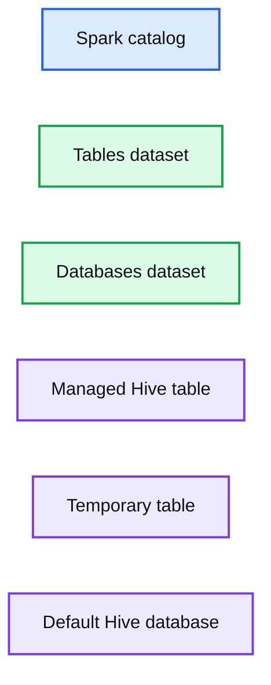
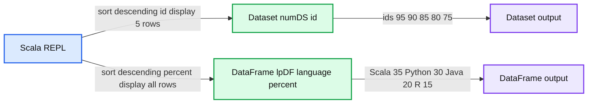
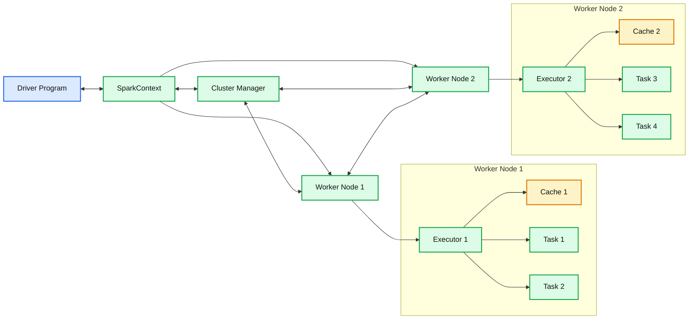

# How to use SparkSession in Apache Spark 2.0

*A unified entry point for manipulating data with Spark*

- Source: https://www.databricks.com/blog/2016/08/15/how-to-use-sparksession-in-apache-spark-2-0.html
- Published: 2016-08-15
- Authors: Jules Damji
- Categories: engineering, data-engineering, open-source
- Images: 7 total, 3 extracted as architecture

Generally, a session is an interaction between two or more entities. In computer parlance, its usage is prominent in the realm of networked computers on the internet. First with TCP session, then with login session, followed by HTTP and user session, so no surprise that we now have *SparkSession*, introduced in [Apache Spark](https://www.databricks.com/glossary/what-is-apache-spark).

Beyond a time-bounded interaction, *SparkSession* provides a single point of entry to interact with underlying Spark functionality and allows programming Spark with [DataFrame](https://www.databricks.com/glossary/what-are-dataframes) and Dataset APIs. Most importantly, it curbs the number of concepts and constructs a developer has to juggle while interacting with Spark.

In this blog and its accompanying Databricks notebook, we will explore SparkSession functionality in Spark 2.0.

## Exploring SparkSession’s Unified Functionality

First, we will examine a Spark application, [SparkSessionZipsExample](https://github.com/dmatrix/examples/blob/master/spark/databricks/apps/scala/2.x/src/main/scala/zips/SparkSessionZipsExample.scala), that reads zip codes from a JSON file and do some analytics using DataFrames APIs, followed by issuing Spark SQL queries, without accessing SparkContext, SQLContext or HiveContext.

### Creating a SparkSession

In previous versions of Spark, you had to create a SparkConf and SparkContext to interact with Spark, as shown here:

Whereas in Spark 2.0 the same effects can be achieved through SparkSession, without expliciting creating SparkConf, SparkContext or SQLContext, as they’re encapsulated within the SparkSession. Using a builder design pattern, it instantiates a SparkSession object if one does not already exist, along with its associated underlying contexts.

At this point you can use the *spark* variable as your instance object to access its public methods and instances for the duration of your Spark job.

### Configuring Spark’s Runtime Properties

Once the SparkSession is instantiated, you can configure Spark’s runtime config properties. For example, in this code snippet, we can alter the existing [runtime](https://www.databricks.com/glossary/what-is-databricks-runtime) config options. Since *configMap* is a collection, you can use all of Scala’s iterable methods to access the data.

### Accessing Catalog Metadata

Often, you may want to access and peruse the underlying catalog metadata. SparkSession exposes “catalog” as a public instance that contains methods that work with the metastore (i.e data catalog). Since these methods return a Dataset, you can use Dataset API to access or view data. In this snippet, we access table names and list of databases.

**Summary:** Spark catalog commands return datasets listing tables and databases with their metadata.

**Components:**

- Spark catalog
- Tables dataset
- Databases dataset
- Managed Hive table
- Temporary table
- Default Hive database

**Flows:**

- none

**Numbers:** none

source image: https://www.databricks.com/wp-content/uploads/2016/08/Screen-Shot-2016-08-12-at-5.38.30-PM.png

 Fig 1. Datasets returned from catalog

### Creating Datasets and Dataframes

There are a number of ways to create DataFrames and [Datasets](https://www.databricks.com/glossary/what-are-datasets) using [SparkSession APIs](https://spark.apache.org/docs/latest/api/scala/index.html#org.apache.spark.sql.SparkSession)
 One quick way to generate a [Dataset](https://spark.apache.org/docs/latest/api/scala/index.html#org.apache.spark.sql.Dataset) is by using the *spark.range* method. When learning to manipulate Dataset with its API, this quick method proves useful. For example,

*Fig 2. DataFrame & Dataset output*

**Summary:** Spark Scala REPL output shows a Dataset sorted by descending ID and a DataFrame sorted by descending percentage.

**Components:**

- Scala REPL
- Dataset numDS with id column
- DataFrame lpDF with language and percent columns

**Flows:**

- Scala REPL -> Dataset numDS: Sorts by descending id and displays rows
- Scala REPL -> DataFrame lpDF: Sorts by descending percent and displays rows

**Numbers:** 5, 95, 90, 85, 80, 75, 35, 30, 20, 15, top 5 rows

source image: https://www.databricks.com/wp-content/uploads/2016/08/image02.png

Fig 2. DataFrame & Dataset output

### Reading JSON Data with SparkSession API

Like any Scala object you can use *spark*, the SparkSession object, to access its public methods and instance fields. I can read JSON or CVS or TXT file, or I can read a parquet table. For example, in this code snippet, we will read a JSON file of zip codes, which returns a DataFrame, a collection of generic Rows.

### Using Spark SQL with SparkSession

Through SparkSession, you can access all of the Spark SQL functionality as you would through SQLContext. In the code sample below, we create a table against which we issue SQL queries.

Fig. 3 Partial output from the Spark Job run

### Saving and Reading from Hive table with SparkSession

Next, we are going to create a Hive table and issue queries against it using SparkSession object as you would with a HiveContext.

 Fig 4. Output from the Hive Table

As you can observe, the results in the output runs from using the DataFrame API, Spark SQL and Hive queries are identical.

Second, let’s turn our attention to two Spark developer environments where the SparkSession is automatically created for you.

## SparkSession in Spark REPL and Databricks Notebook

First, as in previous versions of Spark, the spark-shell created a SparkContext (*sc*), so in Spark 2.0, the spark-shell creates a SparkSession (*spark*). In this spark-shell, you can see *spark* already exists, and you can view all its attributes.

 Fig 5. SparkSession in spark-shell

Second, in the Databricks notebook, when you create a cluster, the SparkSession is created for you. In both cases it’s accessible through a variable called *spark*. And through this variable you can access all its public fields and methods. Rather than repeating the same functionality here, I defer you to examine the notebook, since each section explores SparkSession’s functionality—and more.

Fig 6. SparkSession in Databricks Notebook

You can explore an extended version of the above example in the Databricks notebook SparkSessionZipsExample, by doing some basic analytics on zip code data. Unlike our above Spark application example, we don’t create a SparkSession—since one is created for us—yet employ all its exposed Spark functionality. To try this notebook, import it in [Databricks](https://www.databricks.com/try-databricks).

## SparkSession Encapsulates SparkContext

Lastly, for historical context, let’s briefly understand the SparkContext’s underlying functionality.

*Fig 7. SparkContext as it relates to Driver and Cluster Manager*

**Summary:** The diagram shows SparkContext connecting a Driver Program to the Cluster Manager and Worker Nodes running Executors, Caches, and Tasks.

**Components:**

- Driver Program: Apache Spark driver application
- SparkContext: Apache Spark execution interface
- Cluster Manager: Spark cluster resource manager
- Worker Node 1: Spark worker hosting an Executor
- Executor 1: Spark task execution process
- Cache 1: Executor data cache
- Task 1 and Task 2: Spark workloads
- Worker Node 2: Spark worker hosting an Executor
- Executor 2: Spark task execution process
- Cache 2: Executor data cache
- Task 3 and Task 4: Spark workloads

**Flows:**

- Driver Program -> SparkContext: Spark application control
- SparkContext -> Driver Program: execution communication
- SparkContext -> Cluster Manager: cluster connection and job submission
- Cluster Manager -> SparkContext: cluster coordination
- SparkContext -> Worker Node 1: Spark job communication
- SparkContext -> Worker Node 2: Spark job communication
- Cluster Manager -> Worker Node 1: resource coordination
- Worker Node 1 -> Cluster Manager: worker status
- Cluster Manager -> Worker Node 2: resource coordination
- Worker Node 2 -> Cluster Manager: worker status
- Worker Node 1 -> Worker Node 2: worker communication
- Worker Node 2 -> Worker Node 1: worker communication
- Executor 1 -> Task 1: executes
- Executor 1 -> Task 2: executes
- Executor 2 -> Task 3: executes
- Executor 2 -> Task 4: executes
- Executor 1 -> Cache 1: uses
- Executor 2 -> Cache 2: uses

**Numbers:** none

source image: https://www.databricks.com/wp-content/uploads/2016/08/image04.png

Fig 7. SparkContext as it relates to Driver and Cluster Manager

As shown in the diagram, a [SparkContext](https://github.com/apache/spark/blob/master/core/src/main/scala/org/apache/spark/SparkContext.scala) is a conduit to access all Spark functionality; only a single SparkContext exists per JVM. The Spark driver program uses it to connect to the cluster manager to communicate, submit Spark jobs and knows what resource manager (YARN, Mesos or Standalone) to communicate to. It allows you to configure Spark configuration parameters. And through SparkContext, the driver can access other contexts such as SQLContext, HiveContext, and StreamingContext to program Spark.

However, with Spark 2.0, SparkSession can access all aforementioned Spark’s functionality through a single-unified point of entry. As well as making it simpler to access DataFrame and Dataset APIs, it also subsumes the underlying contexts to manipulate data.

In summation, what I demonstrated in this blog is that all functionality previously available through SparkContext, SQLContext or HiveContext in early versions of Spark are now available via SparkSession. In essence, SparkSession is a single-unified entry point to manipulate data with Spark, minimizing number of concepts to remember or construct. Hence, if you have fewer programming constructs to juggle, you’re more likely to make fewer mistakes and your code is likely to be less cluttered.

## What's Next?

This is the first in the series of how-to blog posts on new features and functionality introduced in Spark 2.0 and how you can use them on the Databricks just-time-data platform. Stay tuned for other how-to blogs in the coming weeks.
