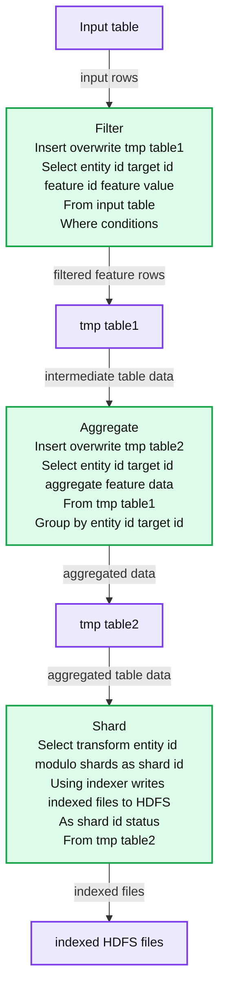
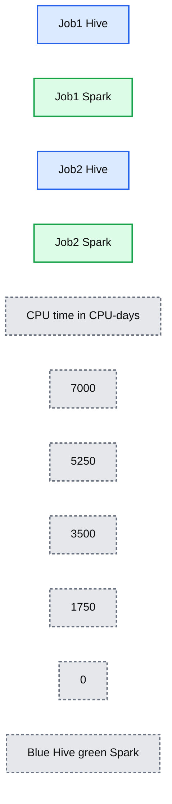
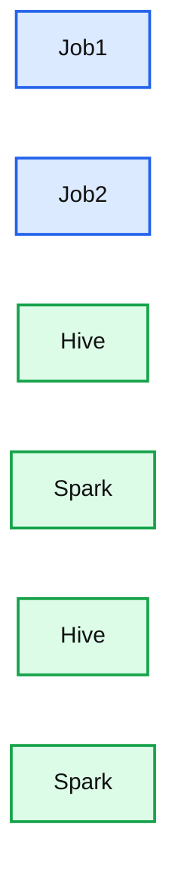
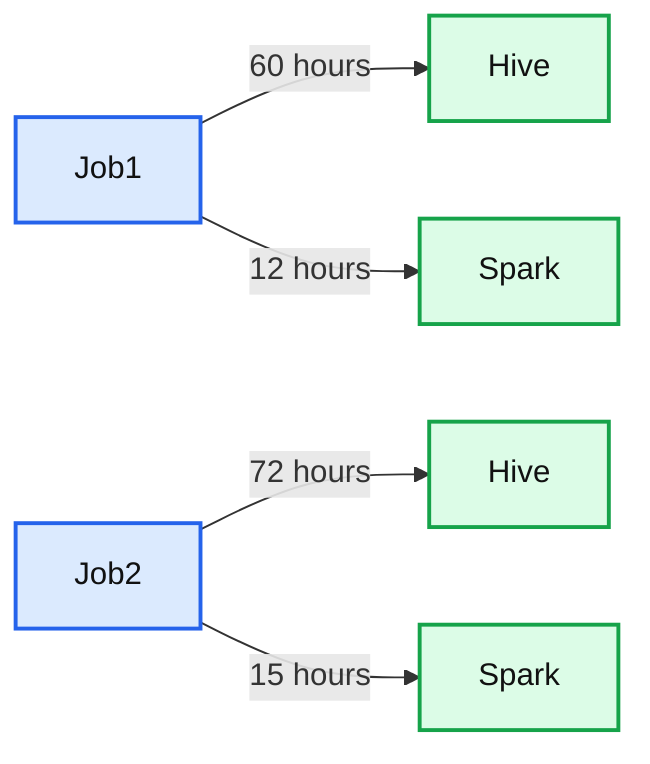

# Apache Spark @Scale: A 60 TB+ production use case from Facebook

- Source: https://www.databricks.com/blog/2016/08/31/apache-spark-scale-a-60-tb-production-use-case.html
- Published: 2016-08-31
- Authors: Sital Kedia, Shuojie Wang, Avery Ching
- Categories: solutions, engineering, open-source
- Images: 5 total, 5 extracted as architecture

*This is a guest Apache Spark community blog from [Facebook Engineering](https://engineering.fb.com/2016/08/31/core-data/apache-spark-scale-a-60-tb-production-use-case/). In this technical blog, Facebook shares their usage of Apache Spark at terabyte scale in a production use case.*

Facebook often uses analytics for data-driven decision making. Over the past few years, user and product growth has pushed our analytics engines to operate on data sets in the tens of terabytes for a single query. Some of our batch analytics is executed through the venerable [Hive](https://engineering.fb.com/2015/03/17/core-data/even-faster-data-at-the-speed-of-presto-orc/) platform (contributed to [Apache Hive](https://www.databricks.com/glossary/apache-hive) by Facebook in 2009) and [Corona](https://www.facebook.com/notes/facebook-engineering/under-the-hood-scheduling-mapreduce-jobs-more-efficiently-with-corona/10151142560538920/), our custom MapReduce implementation. Facebook has also continued to grow its Presto footprint for ANSI-SQL queries against several internal data stores, including Hive. We support other types of analytics such as graph processing and machine learning ([Apache Giraph](https://engineering.fb.com/2013/08/14/core-data/scaling-apache-giraph-to-a-trillion-edges/)) and streaming (e.g., [Puma](https://research.facebook.com/publications/realtime-data-processing-at-facebook/), [Swift](https://research.facebook.com/publications/realtime-data-processing-at-facebook/), and [Stylus](https://research.facebook.com/publications/realtime-data-processing-at-facebook/)).

While the sum of Facebook's offerings covers a broad spectrum of the analytics space, we continually interact with the open source community in order to share our experiences and also learn from others. [Apache Spark](https://spark.apache.org)was started by Matei Zaharia at UC-Berkeley's AMPLab in 2009 and was later contributed to Apache in 2013. It is currently one of the fastest-growing data processing platforms, due to its ability to support streaming, batch, imperative (RDD), declarative (SQL), graph, and machine learning use cases all within the same API and underlying compute engine. Spark can efficiently leverage larger amounts of memory, optimize code across entire pipelines, and reuse JVMs across tasks for better performance. Recently, we felt Spark had matured to the point where we could compare it with Hive for a number of batch-processing use cases. In the remainder of this article, we describe our experiences and lessons learned while scaling Spark to replace one of our Hive workload.

## Use case: Feature preparation for entity ranking

Real-time entity ranking is used in a variety of ways at Facebook. For some of these online serving platforms raw feature values are generated offline with Hive and data loaded into its real-time affinity query system. The old Hive-based infrastructure built years ago was computationally resource intensive and challenging to maintain because the pipeline was sharded into hundreds of smaller Hive jobs. In order to enable fresher feature data and improve manageability, we took one of the existing pipelines and tried to migrate it to Spark.

## Previous Hive implementation

The Hive-based pipeline was composed of three logical stages where each stage corresponded to hundreds of smaller Hive jobs sharded by entity_id, since running large Hive jobs for each stage was less reliable and limited by the maximum number of tasks per job.

**Summary:** The diagram shows a three-stage pipeline that filters, aggregates, and shards an input table into indexed HDFS files.

**Components:**

- Input table - source data table
- Filter - SQL transformation selecting production features
- tmp_table1 - filtered intermediate table
- Aggregate - SQL aggregation by entity and target
- tmp_table2 - aggregated intermediate table
- Shard - SQL transformation using an indexer
- indexed_hdfs_files - indexed HDFS output files

**Flows:**

- Input table -> Filter: input rows
- Filter -> tmp_table1: filtered feature rows
- tmp_table1 -> Aggregate: intermediate table data
- Aggregate -> tmp_table2: aggregated entity and target data
- tmp_table2 -> Shard: aggregated table data
- Shard -> indexed_hdfs_files: indexed files written to HDFS

**Numbers:** none

source image: https://www.databricks.com/wp-content/uploads/2016/08/fb_1.png

 The three logical steps can be summarized as follows:

1. Filter out non-production features and noise.
2. Aggregate on each (*entity_id*, *target_id*) pair.
3. Shard the table into N number of shards and pipe each shard through a custom binary to generate a custom index file for online querying.

The Hive-based pipeline building the index took roughly three days to complete. It was also challenging to manage, because the pipeline contained hundreds of sharded jobs that made monitoring difficult. There was no easy way to gauge the overall progress of the pipeline or calculate an ETA. When considering the aforementioned limitations of the existing Hive pipeline, we decided to attempt to build a faster and more manageable pipeline with Spark.

## Spark implementation

Debugging at full scale can be slow, challenging, and resource intensive. We started off by converting the most resource intensive part of the Hive-based pipeline: stage two. We started with a sample of 50 GB of compressed input, then gradually scaled up to 300 GB, 1 TB, and then 20 TB. At each size increment, we resolved performance and stability issues, but experimenting with 20 TB is where we found our largest opportunity for improvement.

While running on 20 TB of input, we discovered that we were generating too many output files (each sized around 100 MB) due to the large number of tasks. Three out of 10 hours of job runtime were spent moving files from the staging directory to the final directory in HDFS. Initially, we considered two options: Either improve batch renaming in HDFS to support our use case, or configure Spark to generate fewer output files (difficult due to the large number of tasks — 70,000 — in this stage). We stepped back from the problem and considered a third alternative. Since the tmp_table2 table we generate in step two of the pipeline is temporary and used only to store the pipeline's intermediate output, we were essentially compressing, serializing, and replicating three copies for a single read workload with terabytes of data. Instead, we went a step further: Remove the two temporary tables and combine all three Hive stages into a single Spark job that reads 60 TB of compressed data and performs a 90 TB shuffle and sort. The final Spark job is as follows:

**Summary:** The diagram shows an input table transformed by an indexer query into indexed HDFS files.

**Components:**

- Input table
- Indexer SQL transform
- Indexed HDFS files

**Flows:**

- Input table -> Indexer SQL transform: input records
- Indexer SQL transform -> Indexed HDFS files: transformed and clustered output

**Numbers:** none

source image: https://www.databricks.com/wp-content/uploads/2016/08/fb_2.png

## How did we scale Spark for this job?

Of course, running a single Spark job for such a large pipeline didn't work on the first try, or even on the 10th try. As far as we know, this is the largest real-world Spark job attempted in terms of shuffle data size ([Databricks' Petabyte sort](https://www.databricks.com/blog/2014/10/10/spark-petabyte-sort.html) was on synthetic data). It took numerous improvements and optimizations to the core Spark infrastructure and our application to get this job to run. The upside of this effort is that many of these improvements are applicable to other large-scale workloads for Spark, and we were able to contribute all our work back into the open source Apache Spark project — see the JIRAs for additional details. Below, we highlight the major improvements that enabled one of the entity ranking pipelines to be deployed into production.

## Reliability fixes

### Dealing with frequent node reboots

In order to reliably execute long-running jobs, we want the system to be fault-tolerant and recover from failures (mainly due to machine reboots that can occur due to normal maintenance or software errors). Although Spark is designed to tolerate machine reboots, we found various bugs/issues that needed to be addressed before it was robust enough to handle common failures.

- **Make PipedRDD robust to fetch failure** ([SPARK-13793](https://issues.apache.org/jira/browse/SPARK-13793)): The previous implementation of PipedRDD was not robust enough to fetch failures that occur due to node reboots, and the job would fail whenever there was a fetch failure. We made change in the PipedRDD to handle fetch failure gracefully so the job can recover from these types of fetch failure.
- **Configurable max number of fetch failures** ([SPARK-13369](https://issues.apache.org/jira/browse/SPARK-13369)): With long-running jobs such as this one, probability of fetch failure due to a machine reboot increases significantly. The maximum allowed fetch failures per stage was hard-coded in Spark, and, as a result, the job used to fail when the max number was reached. We made a change to make it configurable and increased it from four to 20 for this use case, which made the job more robust against fetch failure.
- **Less disruptive cluster restart**: Long-running jobs should be able to survive a cluster restart so we don't waste all the processing completed so far. Spark's restartable shuffle service feature lets us preserve the shuffle files after node restart. On top of that, we implemented a feature in Spark driver to be able to pause scheduling of tasks so the jobs don't fail due to excessive task failure due to cluster restart.

### Other reliability fixes

- **Unresponsive driver** ([SPARK-13279](https://issues.apache.org/jira/browse/SPARK-13279)): Spark driver was stuck due to O(N^2) operations while adding tasks, resulting in the job being stuck and killed eventually. We fixed the issue by removing the unnecessary O(N^2) operations.
- **Excessive driver speculation**: We discovered that the Spark driver was spending a lot of time in speculation when managing a large number of tasks. In the short term, we disabled speculation for this job. We are currently working on a change in the Spark driver to reduce speculation time in the long term.
- **TimSort issue due to integer overflow for large buffer** ([SPARK-13850](https://issues.apache.org/jira/browse/SPARK-13850)): We found that Spark's unsafe memory operation had a bug that leads to memory corruption in TimSort. Thanks to Databricks folks for fixing this issue, which enabled us to operate on large in-memory buffer.
- **Tune the shuffle service to handle large number of connections**: During the shuffle phase, we saw many executors timing out while trying to connect to the shuffle service. Increasing the number of Netty server threads (*spark.shuffle.io.serverThreads*) and backlog (*spark.shuffle.io.backLog*) resolved the issue.
- **Fix Spark executor OOM** ([SPARK-13958](https://issues.apache.org/jira/browse/SPARK-13958)) **(deal maker)**: It was challenging to pack more than four reduce tasks per host at first. Spark executors were running out of memory because there was a bug in the sorter that caused a pointer array to grow indefinitely. We fixed the issue by forcing the data to be spilled to disk when there is no more memory available for the pointer array to grow. As a result, now we can run 24 tasks/host without running out of memory.

## Performance improvements

After implementing the reliability improvements above, we were able to reliably run the Spark job. At this point, we shifted our efforts on performance-related projects to get the most out of Spark. We used Spark's metrics and several profilers to find some of the performance bottlenecks.

### Tools we used to find performance bottleneck

- **Spark UI Metrics**: Spark UI provides great insight into where time is being spent in a particular phase. Each task's execution time is split into sub-phases that make it easier to find the bottleneck in the job.
- **Jstack**: Spark UI also provides an on-demand jstack function on an executor process that can be used to find hotspots in the code.
- **Spark Linux Perf/Flame Graph support:** Although the two tools above are very handy, they do not provide an aggregated view of CPU profiling for the job running across hundreds of machines at the same time. On a per-job basis, we added support for enabling Perf profiling (via libperfagent for Java symbols) and can customize the duration/frequency of sampling. The profiling samples are aggregated and displayed as a Flame Graph across the executors using our internal metrics collection framework.

### Performance optimizations

- **Fix memory leak in the sorter** ([SPARK-14363](https://issues.apache.org/jira/browse/SPARK-14363)) **(30 percent speed-up)**: We found an issue when tasks were releasing all memory pages but the pointer array was not being released. As a result, large chunks of memory were unused and caused frequent spilling and executor OOMs. Our change now releases memory properly and enabled large sorts to run efficiently. We noticed a 30 percent CPU improvement after this change.
- **Snappy optimization** ([SPARK-14277](https://issues.apache.org/jira/browse/SPARK-14277)) **(10 percent speed-up)**: A JNI method — *(Snappy.ArrayCopy*) — was being called for each row being read/written. We raised this issue, and the Snappy behavior was changed to use the non-JNI based *System.ArrayCopy* instead. This change alone provided around 10 percent CPU improvement.
- **Reduce shuffle write latency **([SPARK-5581](https://issues.apache.org/jira/browse/SPARK-5581)) **(up to 50 percent speed-up)**: On the map side, when writing shuffle data to disk, the map task was opening and closing the same file for each partition. We made a fix to avoid unnecessary open/close and observed a CPU improvement of up to 50 percent for jobs writing a very high number of shuffle partitions.
- **Fix duplicate task run issue due to fetch failure **([SPARK-14649](https://issues.apache.org/jira/browse/SPARK-14649)): The Spark driver was resubmitting already running tasks when a fetch failure occurred, which led to poor performance. We fixed the issue by avoiding rerunning the running tasks, and we saw the job was more stable when fetch failures occurred.
- **Configurable buffer size for PipedRDD** ([SPARK-14542](https://issues.apache.org/jira/browse/SPARK-14542)) **(10 percent speed-up)**: While using a PipedRDD, we found out that the default buffer size for transferring the data from the sorter to the piped process was too small and our job was spending more than 10 percent of time in copying the data. We made the buffer size configurable to avoid this bottleneck.
- **Cache index files for shuffle fetch speed-up** ([SPARK-15074](https://issues.apache.org/jira/browse/SPARK-15074)): We observed that the shuffle service often becomes the bottleneck, and the reducers spend 10 percent to 15 percent of time waiting to fetch map data. Digging deeper into the issue, we found out that the shuffle service is opening/closing the shuffle index file for each shuffle fetch. We made a change to cache the index information so that we can avoid file open/close and reuse the index information for subsequent fetches. This change reduced the total shuffle fetch time by 50 percent.
- **Reduce update frequency of shuffle bytes written metrics** ([SPARK-15569](https://issues.apache.org/jira/browse/SPARK-15569)) **(up to 20 percent speed-up)**: Using the Spark Linux Perf integration, we found that around 20 percent of the CPU time was being spent probing and updating the shuffle bytes written metrics.
- **Configurable initial buffer size for Sorter** ([SPARK-15958](https://issues.apache.org/jira/browse/SPARK-15958)) **(up to 5 percent speed-up)**: The default initial buffer size for the Sorter is too small (4 KB), and we found that it is very small for large workloads — and as a result we waste a significant amount of time expending the buffer and copying the contents. We made a change to make the buffer size configurable, and with large buffer size of 64 MB we could avoid significant data copying, making the job around 5 percent faster.
- **Configuring number of tasks:** Since our input size is 60 T and each HDFS block size is 256 M, we were spawning more than 250,000 tasks for the job. Although we were able to run the Spark job with such a high number of tasks, we found that there is significant performance degradation when the number of tasks is too high. We introduced a configuration parameter to make the map input size configurable, so we can reduce that number by 8x by setting the input split size to 2 GB.

After all these reliability and performance improvements, we are pleased to report that we built and deployed a faster and more manageable pipeline for one of our entity ranking systems, and we provided the ability for other similar jobs to run in Spark.

## Spark pipeline vs. Hive pipeline performance comparison

We used the following performance metrics to compare the Spark pipeline against the Hive pipeline. Please note that these numbers aren't a direct comparison of Spark to Hive at the query or job level, but rather a comparison of building an optimized pipeline with a flexible compute engine (e.g., Spark) instead of a compute engine that operates only at the query/job level (e.g., Hive).

**CPU time**: This is the CPU usage from the perspective of the OS. For example, if you have a job that is running only one process on a 32-core machine using 50 percent of all CPU for 10 seconds, then your CPU time would be 32 * 0.5 * 10 = 160 CPU seconds.

**Summary:** The chart compares CPU time in CPU-days for Hive and Spark across Job1 and Job2.

**Components:**

- Job1
- Job2
- Hive
- Spark
- CPU time axis in CPU-days

**Flows:**

- none

**Numbers:** 7000, 5250, 3500, 1750, 0, Job1, Job2, CPU-days

source image: https://www.databricks.com/wp-content/uploads/2016/08/fb_3.png

**CPU reservation time:** This is the CPU reservation from the perspective of the resource management framework. For example, if we reserve a 32-core machine for 10 seconds to run the job, the CPU reservation time is 32 * 10 = 320 CPU seconds. The ratio of CPU time to CPU reservation time reflects how well are we utilizing the reserved CPU resources on the cluster. When accurate, the reservation time provides a better comparison between execution engines when running the same workloads when compared with CPU time. For example, if a process requires 1 CPU second to run but must reserve 100 CPU seconds, it is less efficient by this metric than a process that requires 10 CPU seconds but reserves only 10 CPU seconds to do the same amount of work. We also compute the memory reservation time but do not include it here, since the numbers were similar to the CPU reservation time due to running experiments on the same hardware, and that in both the Spark and Hive cases we do not cache data in memory. Spark has the ability to cache data in memory, but due to our cluster memory limitations we decided to work out-of-core, similar to Hive.

**Summary:** Bar chart comparing CPU reservation time for Hive and Spark across Job1 and Job2.

**Components:**

- Job1: benchmark workload
- Job2: benchmark workload
- Hive: CPU reservation measurement
- Spark: CPU reservation measurement

**Flows:**

- none

**Numbers:** 0, 3500, 7000, 10500, 14000, Job1, Job2, CPU-days

source image: https://www.databricks.com/wp-content/uploads/2016/08/fb_4.png

**Latency**: End-to-end elapsed time of the job.

**Summary:** The chart compares end-to-end latency for two jobs using Hive versus Spark.

**Components:**

- Job1: benchmark job
- Job2: benchmark job
- Hive: batch-processing technology
- Spark: batch-processing technology

**Flows:**

- Job1 -> Hive: measured latency
- Job1 -> Spark: measured latency
- Job2 -> Hive: measured latency
- Job2 -> Spark: measured latency

**Numbers:** Latency in hours; axis values 0, 20, 40, 60, 80; Job1 Hive 60 hours; Job1 Spark 12 hours; Job2 Hive 72 hours; Job2 Spark 15 hours.

source image: https://www.databricks.com/wp-content/uploads/2016/08/fb_5.png

## Conclusion and future work

Facebook uses performant and scalable analytics to assist in product development. Apache Spark offers the unique ability to unify various analytics use cases into a single API and efficient compute engine. We challenged Spark to replace a pipeline that decomposed to hundreds of Hive jobs into a single Spark job. Through a series of performance and reliability improvements, we were able to scale Spark to handle one of our entity ranking data processing use cases in production. In this particular use case, we showed that Spark could reliably shuffle and sort 90 TB+ intermediate data and run 250,000 tasks in a single job. The Spark-based pipeline produced significant performance improvements (4.5-6x CPU, 3-4x resource reservation, and ~5x latency) compared with the old Hive-based pipeline, and it has been running in production for several months.

While this post details our most challenging use case for Spark, a growing number of customer teams have deployed Spark workloads into production. Performance, maintainability, and flexibility are the strengths that continue to drive more use cases to Spark. Facebook is excited to be a part of the Spark open source community and will work together to develop Spark toward its full potential.
