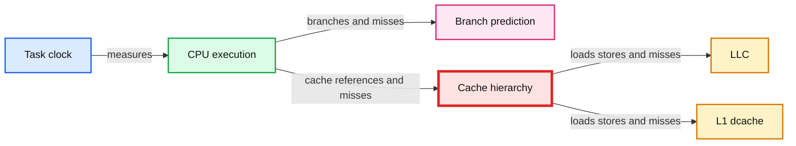

# Voice from CERN: Apache Spark 2.0 Performance Improvements Investigated With Flame Graphs

- Source: https://www.databricks.com/blog/2016/10/03/voice-from-cern-apache-spark-2-0-performance-improvements-investigated-with-flame-graphs.html
- Published: 2016-10-03
- Authors: Luca Canali
- Categories: engineering, solutions, open-source
- Images: 7 total, 7 extracted as architecture

*This is a guest post from CERN, the European Organization for Nuclear Research. In this blog, Luca Canali of CERN investigates performance improvements in Apache Spark 2.0 from whole-stage code generation using flame graphs. The blog was originally posted on the [CERN website.](https://db-blog.web.cern.ch/blog/luca-canali/2016-09-spark-20-performance-improvements-investigated-flame-graphs)  Luca will be speaking at [Spark Summit Europe](https://www.databricks.com/dataaisummit) Oct 25 - 27 on this topic.*

## Introduction

The idea for this post comes from a **performance** troubleshooting case that has come up recently at CERN database services. It started with a user reporting slow response time from a query for a custom report in a relational database. After investigations and initial troubleshooting, the query was still running slow (running in about 12 hours). It was understood that the query was mostly running "**on CPU**" and spending most of its time in evaluating a non-equijoin condition repeated 100s of millions of times. Most importantly it was also found that the query was easily **parallelizable**, this was good news as it meant that we could simply **"throw hardware at it"** to make it run faster. One way that the team (see the acknowledgments section at the end of the post) used to parallelize the workload (without affecting the production database), is to export the data to a Hadoop cluster and run the query there using **Spark SQL** (the cluster used has 14 nodes, installed with CDH 5.7, Spark version 1.6). This way it was possible to bring the execution time down to less than 20 minutes. All this with relatively low effort, as the query could be run basically **unchanged**.

## Apache Spark 2.0 enters the scene

As I write this post, Apache Spark 1.6 is installed in our production clusters and Apache Spark 2.0 is still relatively new (it has been released at the end of July 2016). Notably Spark 2.0 has very interesting **improvements** over the previous versions, among others improvements in the area of performance that I was eager to test ([see this blog post by Databricks](https://www.databricks.com/blog/2016/05/23/apache-spark-as-a-compiler-joining-a-billion-rows-per-second-on-a-laptop.html))

My first test was to try the query discussed in the previous paragraph on a test server with Spark 2.0 and I found that it was running considerably faster than in the tests with Spark 1.6. The best result I achieved, this time a large box with 60 CPU cores and using Spark 2.0, was an elapsed time of about 2 minutes (to be compared with 20 minutes in Spark 1.6). I have previously noticed Spark 1.6 and Impala 2.5 performed comparably on our workloads, but I’m impressed by Spark 2.0’s speedups over Spark 1.6, so I decided to **investigate** further.

## The test case

Rather than using the original query and data, I will report here on a synthetic test case that hopefully illustrates the main points of the original case and at the same is simple and easy to reproduce on your test systems, if you wish to do so. This test uses **pyspark**, the Python interface to Spark (if you are not familiar with how to run Spark, see further on in this post some hints on how to build a test system).

The preparation of the test data proceeds as follows: (1) it creates a DataFrame and registers it as table "t0" with 10 million rows. (2) Table t0 is used to create the actual test data, which is composed of an "id" column and three additional columns of randomly generated data, all integers. The resulting **DataFrame** is **cached** in memory and "registered" as a temporary table called "t1". **Spark SQL** interface for DataFrames makes this preparation task straightforward:

The following commands are additional checks to make sure the table t1 has been created correctly and is first read into memory. In particular, note that "t1" has the required test_numrows (10M) rows and the description of its column from the output of the command "desc":

The actual **test query** is here below. It consists of a **join** with two conditions: an equality predicate on the column bucket, which becomes an obvious point of where the query can be executed in **parallel**, and a more resource-intensive **non-equality** condition. Notably the query has also an **aggregation** operation. Some additional boilerplate code is added for timing the duration of the query:

## Drilling down into the execution plans

The **physical execution** plan generated and executed by Spark (in particular by **Catalyst**, the optimizer and **Tungsten**, the execution engine) has important differences in Spark 2.0 compared to Spark 1.6. The logical plan for executing the query however deploys a **sort merge join** in both cases. Please note in the execution plans reported below that in the case of Spark 2.0 several steps in the execution plan are marked with a star **(*)** around them. This marks steps optimized with **whole-stage code** generation.

### Physical execution plan in Spark 1.6

Note that a sort merge join operation is central to the execution plan of this query. Another important step after the join is the aggregation operation, used to compute "sum(a.val2)" as seen in the query text:

**Summary:** Spark 2.0 physical execution plan showing whole-stage code generation around aggregation, sorting, joining, and in-memory scans.

**Components:**

- TakeOrderedAndProject
- ConvertToSafe
- TungstenAggregate final
- TungstenAggregate partial
- Project
- Filter
- SortMergeJoin
- Sort on bucket
- TungstenExchange
- InMemoryColumnarTableScan left
- InMemoryColumnarTableScan right

**Flows:**

- InMemoryColumnarTableScan left -> TungstenExchange: partitioned rows
- InMemoryColumnarTableScan right -> TungstenExchange: partitioned rows
- TungstenExchange -> Sort on bucket: exchanged rows
- Sort on bucket -> SortMergeJoin: sorted rows
- SortMergeJoin -> Filter: joined rows
- Filter -> Project: filtered rows
- Project -> TungstenAggregate partial: projected rows
- TungstenAggregate partial -> TungstenAggregate final: partial sums
- TungstenAggregate final -> ConvertToSafe: aggregated results
- ConvertToSafe -> TakeOrderedAndProject: safe results

**Numbers:** 21, 1, 24, 3, 7, 25, 26, 200, 10000, 29, 27, 200.0, 5037924750592968597, 1000.0, -2880595295392729102, 1455514313286052937, 10.0

```mermaid
%% Spark physical execution plan with aggregation, join, sorting, and scans
flowchart LR
    L[InMemoryColumnarTableScan left] -->|partitioned rows| XL[TungstenExchange left]
    R[InMemoryColumnarTableScan right] -->|partitioned rows| XR[TungstenExchange right]
    XL -->|exchanged rows| SL[Sort on bucket left]
    XR -->|exchanged rows| SR[Sort on bucket right]
    SL -->|sorted rows| J[SortMergeJoin]
    SR -->|sorted rows| J
    J -->|joined rows| F[Filter]
    F -->|filtered rows| P[Project]
    P -->|projected rows| A1[TungstenAggregate partial]
    A1 -->|partial sums| A2[TungstenAggregate final]
    A2 -->|aggregated results| C[ConvertToSafe]
    C -->|safe results| T[TakeOrderedAndProject]

    classDef client fill:#dbeafe,stroke:#2563eb,stroke-width:2px,color:#111
    classDef service fill:#dcfce7,stroke:#16a34a,stroke-width:2px,color:#111
    classDef store fill:#ede9fe,stroke:#7c3aed,stroke-width:2px,color:#111
    classDef cache fill:#fef3c7,stroke:#d97706,stroke-width:2px,color:#111
    classDef queue fill:#cffafe,stroke:#0891b2,stroke-width:2px,color:#111
    classDef critical fill:#fee2e2,stroke:#dc2626,stroke-width:4px,color:#111
    classDef external fill:#e5e7eb,stroke:#6b7280,stroke-width:2px,color:#111,stroke-dasharray:4 3
    classDef decision fill:#fce7f3,stroke:#db2777,stroke-width:2px,color:#111

    class L,R store
    class XL,XR queue
    class SL,SR service
    class J critical
    class F,P,A1,A2,C,T service
```



<sub>source image: https://www.databricks.com/wp-content/uploads/2016/09/Spark16_blog_execplan_wholestagecodegeneration.png</sub>

### Physical execution plan in Spark 2.0

Note in particular the steps marked with **(*)**, they are optimized with **whole-stage code generation**:

**Summary:** Spark 2.0 physical execution plan showing a sort merge join followed by hash aggregation and top-21 projection.

**Components:**

- TakeOrderedAndProject
- HashAggregate for final sum
- HashAggregate for partial sum
- Project
- SortMergeJoin
- Left Sort
- Left Exchange with hash partitioning
- Left Filter
- InMemoryTableScan and InMemoryRelation
- Right Sort
- Right Exchange with hash partitioning
- Right Filter
- Right Project
- Range

**Flows:**

- InMemoryRelation -> Left Filter: filtered rows
- Left Filter -> Left Exchange: rows for repartitioning
- Left Exchange -> Left Sort: hash-partitioned rows
- Left Sort -> SortMergeJoin: sorted left input
- Range -> Right Project: generated range rows
- Right Project -> Right Filter: projected rows
- Right Filter -> Right Exchange: rows for repartitioning
- Right Exchange -> Right Sort: hash-partitioned rows
- Right Sort -> SortMergeJoin: sorted right input
- SortMergeJoin -> Project: joined rows
- Project -> HashAggregate partial sum: projected values
- HashAggregate partial sum -> HashAggregate final sum: partial aggregates
- HashAggregate final sum -> TakeOrderedAndProject: aggregated results

**Numbers:** 21, 4L, 33L, 200, 43L, 5L, 44L, 1000, 0, 2, 10000, 1, 0L, 200.0, -399889517868835567, 1000.0, -516805713005766039, 10.0, -44967589662801584, 10000000, 32

```mermaid
%% Spark physical execution plan with join, aggregation, and ordering
flowchart LR
    IMR[InMemoryRelation] --> LF[Left Filter]
    LF --> LE[Left Exchange]
    LE --> LS[Left Sort]
    LS --> SMJ[SortMergeJoin]
    R[Range] --> RP[Right Project]
    RP --> RF[Right Filter]
    RF --> RE[Right Exchange]
    RE --> RS[Right Sort]
    RS --> SMJ
    SMJ --> P[Project]
    P --> HA1[HashAggregate partial sum]
    HA1 --> HA2[HashAggregate final sum]
    HA2 --> TOP[TakeOrderedAndProject limit 21]

    classDef client fill:#dbeafe,stroke:#2563eb,stroke-width:2px,color:#111
    classDef service fill:#dcfce7,stroke:#16a34a,stroke-width:2px,color:#111
    classDef store fill:#ede9fe,stroke:#7c3aed,stroke-width:2px,color:#111
    classDef cache fill:#fef3c7,stroke:#d97706,stroke-width:2px,color:#111
    classDef queue fill:#cffafe,stroke:#0891b2,stroke-width:2px,color:#111
    classDef critical fill:#fee2e2,stroke:#dc2626,stroke-width:4px,color:#111
    classDef external fill:#e5e7eb,stroke:#6b7280,stroke-width:2px,color:#111,stroke-dasharray:4 3
    classDef decision fill:#fce7f3,stroke:#db2777,stroke-width:2px,color:#111

    class IMR store
    class LF,RP,RF,P,HA1,HA2,TOP service
    class LE,RE queue
    class LS,RS service
    class SMJ critical
    class R external
```



<sub>source image: https://www.databricks.com/wp-content/uploads/2016/09/Spark20_blog_execplan_wholestagecodegeneration.png</sub>

**Summary:** The diagram compares Spark 1.6 and Spark 2.0 SQL execution plans, highlighting whole-stage code generation and runtime performance metrics.

**Components:**

- Spark 1.6 execution plan
- Two InMemoryColumnarTableScan operators
- Two TungstenExchange operators
- Two Sort operators
- SortMergeJoin
- Filter
- Project
- Two TungstenAggregate operators
- ConvertToSafe
- TakeOrderedAndProject
- Spark 2.0 execution plan
- InMemoryTableScan
- WholeStageCodegen
- Filter
- Project
- Exchange
- Two Sort operators
- SortMergeJoin
- Two HashAggregate operators
- TakeOrderedAndProject

**Flows:**

- InMemoryColumnarTableScan -> TungstenExchange: scanned rows
- TungstenExchange -> Sort: exchanged rows
- Sort -> SortMergeJoin: sorted rows
- SortMergeJoin -> Filter: joined rows
- Filter -> Project: filtered rows
- Project -> TungstenAggregate: projected rows
- TungstenAggregate -> TungstenAggregate: aggregated rows
- TungstenAggregate -> ConvertToSafe: safe output rows
- ConvertToSafe -> TakeOrderedAndProject: ordered rows
- InMemoryTableScan -> Filter: scanned rows
- Filter -> Project: filtered rows
- Project -> Exchange: projected rows
- Exchange -> Sort: exchanged rows
- Sort -> SortMergeJoin: sorted rows
- SortMergeJoin -> Project: joined rows
- Project -> HashAggregate: projected rows
- HashAggregate -> HashAggregate: aggregated rows
- HashAggregate -> TakeOrderedAndProject: ordered rows

**Numbers:**

- Spark 1.6
- Spark 2.0
- 10000000 output rows
- 600.0 MB total data size
- 3.0 MB median data size
- 3.0 MB maximum data size
- 0.0 B total spill size
- 10000000 left rows
- 10000000 right rows
- 500010165242 output rows
- 500010165242 input rows
- 250327590796 output rows
- 200 output rows
- 450.0 MB total data size
- 2.2 MB minimum, median, and maximum data size
- 17.0 s
- 348 ms minimum task time
- 552 ms median task time
- 596 ms maximum task time
- 14.3 s
- 238 ms minimum task time
- 457 ms median task time
- 679 ms maximum task time
- 6.61 h
- 2 ms minimum task time
- 1.9 m median task time
- 9.3 m maximum task time
- 305.2 MB total data size
- 9.5 MB minimum, median, and maximum data size
- 2.53 h
- 64 ms minimum task time
- 848 ms median task time
- 7.1 m maximum task time
- 9.0 s total sort time
- 2 ms minimum sort time
- 588 ms median sort time
- 588 ms maximum sort time
- 764.0 MB peak memory
- 4.0 MB minimum peak memory
- 4.0 MB median peak memory
- 14.0 MB maximum peak memory
- 159.0 MB total spill size
- 9.0 MB minimum spill size
- 14.0 MB median spill size
- 14.0 MB maximum spill size
- 13.21 h
- 1 ms minimum task time
- 3.8 m median task time
- 18.6 m maximum task time
- 250163712626 output rows
- 50.0 MB peak memory
- 256.0 KB minimum peak memory
- 256.0 KB median peak memory
- 256.0 KB maximum peak memory
- 6.6 h aggregate time
- 0 ms minimum aggregate time
- 2 m median aggregate time
- 9.3 m maximum aggregate time
- 174.0 MB peak memory
- 256.0 KB minimum peak memory
- 1280.0 KB median peak memory
- 1280.0 KB maximum peak memory
- 176 spill bytes
- 0.0 B minimum, median, and maximum spill size
- 6.61 h aggregate time
- 0 ms minimum aggregate time
- 1.9 m median aggregate time
- 9.3 m maximum aggregate time



<sub>source image: https://www.databricks.com/wp-content/uploads/2016/09/WebUI_Spark_annotated.png</sub>

```mermaid
%% Compares Spark 1.6 and Spark 2.0 SQL execution flows
flowchart LR
  A[Spark 1.6 scans] -->|scanned rows| B[Spark 1.6 exchange]
  B -->|exchanged rows| C[Spark 1.6 sort]
  C -->|sorted rows| D[Spark 1.6 join]
  D -->|joined rows| E[Spark 1.6 aggregate]
  E -->|ordered rows| F[Spark 1.6 final output]

  G[Spark 2.0 scan] -->|scanned rows| H[Spark 2.0 codegen]
  H -->|projected rows| I[Spark 2.0 exchange]
  I -->|exchanged rows| J[Spark 2.0 sort]
  J -->|sorted rows| K[Spark 2.0 join]
  K -->|aggregated rows| L[Spark 2.0 final output]

  classDef client fill:#dbeafe,stroke:#2563eb,stroke-width:2px,color:#111
  classDef service fill:#dcfce7,stroke:#16a34a,stroke-width:2px,color:#111
  classDef store fill:#ede9fe,stroke:#7c3aed,stroke-width:2px,color:#111
  classDef cache fill:#fef3c7,stroke:#d97706,stroke-width:2px,color:#111
  classDef queue fill:#cffafe,stroke:#0891b2,stroke-width:2px,color:#111
  classDef critical fill:#fee2e2,stroke:#dc2626,stroke-width:4px,color:#111
  classDef external fill:#e5e7eb,stroke:#6b7280,stroke-width:2px,color:#111,stroke-dasharray:4 3
  classDef decision fill:#fce7f3,stroke:#db2777,stroke-width:2px,color:#111

  class A,G client
  class B,C,D,E,F,H,I,J,K,L service
```

 Details of the SQL execution from the Spark Web UI, Spark 1.6. vs. Spark 2.0. This reproduces the physical execution plan with additional metrics gathered at run-time. Note in particular in Spark 2.0 the steps marked as "Whole Stage Codegen."

## Code generation is the key

The key to understand the improved performance is with the new features in Spark 2.0 for whole-stage code generation. This is expected and detailed for example in the blog post by DataBricks Engineering [Apache Spark as a Compiler: Joining a Billion Rows per Second on a Laptop Deep dive into the new Tungsten execution engine](https://www.databricks.com/blog/2016/05/23/apache-spark-as-a-compiler-joining-a-billion-rows-per-second-on-a-laptop.html). The main point is that Spark 2.0 compiles query execution into bytecode that is then executed, as opposed to looping with an iterator over result sets. A detailed discussion on the benefits of query compilation and code generation vs. the "traditional approach" to query execution, also called volcano model, can be found in the lecture by [Andy Pavlo on Query Compilation](https://www.youtube.com/watch?v=y_quuGMRcds&index=19&list=PLSE8ODhjZXjbisIGOepfnlbfxeH7TW-8O).

## Runtime investigations with flame graphs

[Flame graphs](https://www.brendangregg.com/flamegraphs.html) visualization of stack profiles provide additional **insights** on what part of the code are executed on CPU. The upper layers of the flame graph highlight where **CPU cycles** are spent. The lower layers add context by detailing the information on the parent functions/methods that called the "upper layers". The **idea** for this paragraph is to use stack profiles and flame graphs to further drill down on the **differences** in the execution model between Spark 2.0 and Spark 1.6. To collect and generate the flame graphs I have used the methods described by [Kay Ousterhout in "Generating Flame Graphs for Apache Spark using Java Flight Recorder"](https://gist.github.com/kayousterhout/7008a8ebf2babeedc7ce6f8723fd1bf4). I have used the Java flight recorder on Oracle's Java 8, starting pyspark with the following options: **pyspark --conf "spark.driver.extraJavaOptions"="-XX:+UnlockCommercialFeatures -XX:+FlightRecorder" --conf "spark.executor.extraJavaOptions"="-XX:+UnlockCommercialFeatures -XX:+FlightRecorder" ** Here below you can find two flame graphs that visualize the stack profiles collected for Spark 1.6 and Spark 2.0 while running the test workload/query. The graphs represent samples collected over 100 seconds. The major differences you should notice between the two flame graphs are that on Spark 1.6 the execution iterates over rows of data, looping on **Row Iterator to Scala** for example. In the **Spark 2.0** example, however, you can see in the flame graph that the methods executing the bulk of the work are built/**optimized** with **whole-stage code generation**. For example the method where most time is spent during execution is code-generated and performs operations on Hash Maps in **vector** form. **What you can learn** from the flame graphs:

- The flame graph for Spark 1.6 shows that a considerable amount of CPU cycles are spent on the **Scala collection iterator**. This can be linked with Spark 1.6 using the "traditional volcano model" for SQL execution. This is the part that is optimized in Spark 2.0 (see next bullet points).
- Spark 2.0 is making use of** whole-stage code generation **and does not use Scala collection iterator.
- Spark 2.0 is also using Vectorized Hash Maps to perform aggregations that are also code generated. The use of **vectorized** operations is likely introducing further performance improvements.

**Spark 1.6:**

**Summary:** Flame graph showing Spark 1.6 SQL execution dominated by iterative Scala collection processing during aggregation and RDD computation.

**Components:**

- Spark SQL execution engine
- Scala collection iterators
- Row iterator
- Tungsten aggregation
- Spark RDD map partitions
- Spark scheduler and task runner
- Java thread pool
- Java thread

**Flows:**

- Spark SQL execution engine -> Row iterator: SQL rows
- Row iterator -> Scala collection iterators: iterative row traversal
- Scala collection iterators -> Tungsten aggregation: input rows
- Tungsten aggregation -> RDD map partitions: aggregation work
- RDD map partitions -> Spark scheduler: partition computation
- Spark scheduler -> Task runner: task execution
- Task runner -> Java thread pool: worker task
- Java thread pool -> Java thread: thread execution

**Numbers:** Spark 1.6, 100-sec, 76, 62, 389, 327, 511, 1, 95, 86, 710, 38, 306, 270, 66, 89, 213, 1142, 617, 745


<sub>source image: https://www.databricks.com/wp-content/uploads/2016/09/Flamegraph_Spark16_blog_wholestagecodegeneration_annotated.png</sub>

Flame graph for a sample of the execution of the test query using Spark 1.6 in local mode (on a machine with 16 cores). Note that most of the time is spent processing data on a iterative way (which is not optimal). [Click on this link for a SVG version of the graph](http://canali.web.cern.ch/canali/svg/Flamegraph_spark16_blog_sparkwholestagecodegeneration.svg) where you can drill down on the details of each step.

**Spark 2.0:**

**Summary:** Flame graph showing Spark 2.0 SQL execution time dominated by whole-stage code generation, generated classes, and vectorized hash-map operations.

**Components:**

- Apache Spark SQL Catalyst generated iterator
- Vectorized hash map
- Aggregation with keys
- Whole-stage code generation
- Buffered row iterator
- Spark RDD and scheduler execution layers
- Java thread-pool worker
- Sampled execution interval

**Flows:**

- Whole-stage code generation -> Generated class: dynamically generated execution code
- Generated class -> Vectorized hash map: vector operations for hash maps
- Spark SQL execution -> Buffered row iterator: row processing
- Buffered row iterator -> Spark RDD execution: iterator and partition processing
- Spark RDD execution -> Java thread pool: task execution

**Numbers:**

- Spark 2.0
- 100-sec sample
- `1`
- `43`
- `386`
- `408`
- `30`
- `628`
- `37`
- `1374`
- `1351`
- `766`
- `38`
- `319`
- `283`
- `70`
- `85`
- `274`
- `1142`
- `617`
- `745`

```text
%% mermaid failed to render; kept as text
%% Shows Spark SQL flame graph execution dominated by generated code
flowchart LR
    A[Whole stage code generation] -->|generates execution code| B[Generated class]
    B -->|vector operations for hash maps| C[Vectorized hash map]
    B -->|aggregates with keys| D[SQL aggregation]
    D -->|processes rows| E[Buffered row iterator]
    E -->|iterates partitions| F[Spark RDD execution]
    F -->|runs tasks| G[Java thread pool worker]
    H[100 second sample] -->|samples execution| A

    classDef client   fill:#dbeafe,stroke:#2563eb,stroke-width:2px,color:#111
    classDef service  fill:#dcfce7,stroke:#16a34a,stroke-width:2px,color:#111
    classDef store    fill:#ede9fe,stroke:#7c3aed,stroke-width:2px,color:#111
    classDef cache    fill:#fef3c7,stroke:#d97706,stroke-width:2px,color:#111
    classDef queue    fill:#cffafe,stroke:#0891b2,stroke-width:2px,color:#111
    classDef critical fill:#fee2e2,stroke:#dc2626,stroke-width:4px,color:#111
    classDef external fill:#e5e7eb,stroke:#6b7280,stroke-width:2px,color:#111,stroke-dasharray:4 3
    classDef decision fill:#fce7f3,stroke:#db2777,stroke-width:2px,color:#111
    A,B,C,D,E,F,G,H critical
```

<sub>source image: https://www.databricks.com/wp-content/uploads/2016/09/Flamegraph_Spark20_blog_wholestagecodegeneration_annotated.png</sub>

Flame graph for a sample of the execution of the test query using Spark 2.0 in local mode (on a machine with 16 cores). Note that most of the time is spent executing code that is generated dynamically via whole-stage code generation. [Click on this link for a SVG version of the graph](http://canali.web.cern.ch/canali/svg/Flamegraph_spark20_blog_sparkwholestagecodegeneration.svg) where you can drill down on the details of each step.

**Note**: the process of collecting stack profiles for Spark in this test is made easier by the fact that I have used Spark in local mode, which results in only one (multi-threaded) process to trace in a single box . In the general case tracing Spark is more complicated due to the distributed nature of the workload when running on a cluster for example.

## Linux Perf stat counters

In this paragraph you can find the output of [Linux Perf stat](https://perf.wiki.kernel.org/index.php/Tutorial#Counting_with_perf_stat) counters measured during the execution of the test query. The idea is to find differences in the run-time usage of resources that can further highlight the origin of the performance improvement that was measured in Spark 2.0 compared to Spark 1.6. The selection of stat counters to measure is taken from Tanel Poder's blog post "[RAM is the new disk – and how to measure its performance – Part 2 – Tools](https://tanelpoder.com/2015/09/21/ram-is-the-new-disk-and-how-to-measure-its-performance-part-2-tools/)." Notably you can find there also a short explanation of meaning of the counters.

**What you can learn** from comparing perf stat counters between Spark 1.6 and Spark 2.0 runs:

- In both cases the workload is CPU-bound. The machine has 16 cores and is configured with multi-threading support (i.e. 32 execution threads). Perf stat counters report an average CPU utilization of about 31 CPU threads in both cases, which confirms the fact that the workload is CPU bound.
- Reading from main memory seems to be key and **Spark 2.0** appears to access memory with much **higher throughput** than Spark 1.6. In particular, I believe it is important to look at the metrics **LLC-loads** and **LLC-load-misses**, those count respectively how many time a cache line was requested from last level cache (LLC) and the fraction of those requests that resulted in access from main memory. Notably Spark 2.0 in the given sample reports 33 M/sec LLC-loads with ~63% of loads resulting in misses (reads from main memory) while Spark 1.6 has 0,7 M/sec LLC-loads and also ~60% misses. I have noticed that these values fluctuate over different samples, but **Spark 2.**0 presents always much **higher access rate to LLC and memory** than Spark 1.6.
- It is interesting to note that the measurements in the case of Spark 1.6 run present a higher ratio of **instructions per cycle** than the run with Spark 2.0. Spark 2.0 workload is **stalling for memory access** more frequently. A higher ratio of instructions per cycle is often an indicator of better performance, however, in this case the opposite appears to be true. I believe a possible interpretation of what is happening is that **Spark 2.0 is more efficient** at using CPU resources and high throughput to memory, therefore it quickly gets into what appears to be the **bottleneck** for this workload: stalling for** memory access**.

This is the output of perf stat while running the test workload with Spark 1.6:

**Summary:** Apache Spark performance benchmark output from `perf stat`, showing CPU utilization, instruction throughput, branch behavior, stalls, and cache activity.

**Components:**

- `perf stat` hardware performance counter output
- CPU task clock and utilization metrics
- Instruction and cycle counters
- Branch prediction counters
- Frontend and backend stall counters
- Cache, LLC, and L1 data-cache counters

**Flows:**

- none

**Numbers:**

- 3,091,790.707578 task-clock msec
- 30.915 CPUs utilized
- 7,325,423,029,717 cycles
- 2.369 GHz
- 25.01%
- 9,577,944,921,957 instructions
- 1.31 insns per cycle
- 0.45 stalled cycles per insn
- 31.25%
- 1,323,763,955,367 branches
- 428.154 M/sec
- 31.06%
- 3,540,000,205 branch-misses
- 0.27% of all branches
- 25.02%
- 4,332,575,248,710 stalled-cycles-frontend
- 59.14% frontend cycles idle
- 25.02%
- 1,809,219,108,190 stalled-cycles-backend
- 24.70% backend cycles idle
- 25.01%
- 4,025,591,940 cache-references
- 1.302 M/sec
- 27.12%
- 2,688,865,386 cache-misses
- 66.794% of all cache refs
- 29.14%
- 2,305,317,283 LLC-loads
- 0.746 M/sec
- 25.40%
- 1,382,318,864 LLC-load-misses
- 59.86% of all LLC-cache hits
- 25.40%
- 1,265,162,587 LLC-stores
- 0.409 M/sec
- 24.60%
- 1,256,986,002 LLC-store-misses
- 0.407 M/sec
- 26.51%
- 3,084,754,630,344 L1-dcache-loads
- 997.724 M/sec
- 29.69%
- 18,141,140,551 L1-dcache-load-misses
- 0.59% of all L1-dcache hits
- 28.93%
- 891,386,721,821 L1-dcache-stores
- 288.308 M/sec
- 25.97%
- 1,281,601,143 L1-dcache-store-misses
- 0.415 M/sec
- 25.20%

```text
%% mermaid failed to render; kept as text
%% Shows perf stat CPU, branch, stall, and cache performance counters
flowchart LR
    A[perf stat output] -->|reports| B[CPU metrics]
    A -->|reports| C[Instruction metrics]
    A -->|reports| D[Branch metrics]
    A -->|reports| E[Stall metrics]
    A -->|reports| F[Cache metrics]
    F -->|includes| G[LLC metrics]
    F -->|includes| H[L1 dcache metrics]

    classDef client fill:#dbeafe,stroke:#2563eb,stroke-width:2px,color:#111
    classDef service fill:#dcfce7,stroke:#16a34a,stroke-width:2px,color:#111
    classDef store fill:#ede9fe,stroke:#7c3aed,stroke-width:2px,color:#111
    classDef cache fill:#fef3c7,stroke:#d97706,stroke-width:2px,color:#111
    classDef queue fill:#cffafe,stroke:#0891b2,stroke-width:2px,color:#111
    classDef critical fill:#fee2e2,stroke:#dc2626,stroke-width:4px,color:#111
    classDef external fill:#e5e7eb,stroke:#6b7280,stroke-width:2px,color:#111,stroke-dasharray:4 3
    classDef decision fill:#fce7f3,stroke:#db2777,stroke-width:2px,color:#111
    A,B,C,D,E service
    F,G,H cache
```

<sub>source image: https://www.databricks.com/wp-content/uploads/2016/09/Screen-Shot-2016-09-29-at-5.29.04-PM.png</sub>

This is the output of perf stat while running the test workload with Spark 2.0:

**Summary:** A `perf stat` benchmark readout showing CPU execution efficiency and cache and memory stall metrics for the Spark workload.

**Components:**

- Task clock
- CPU cycles
- Instructions
- Branches
- Branch misses
- Stalled cycles frontend
- Stalled cycles backend
- Cache references
- Cache misses
- LLC loads
- LLC load misses
- LLC stores
- LLC store misses
- L1 dcache loads
- L1 dcache load misses
- L1 dcache stores
- L1 dcache store misses

**Flows:**

- CPU execution -> Branch prediction: branches and branch misses
- CPU execution -> Cache hierarchy: cache references and cache misses
- Cache hierarchy -> LLC: LLC loads, misses, stores and store misses
- Cache hierarchy -> L1 dcache: L1 dcache loads, misses, stores and store misses

**Numbers:**

- 30.955 CPUs utilized
- 7,267,137,941,598 cycles
- 2.347 GHz
- 5,810,442,547,610 instructions
- 0.80 instructions per cycle
- 1.00 stalled cycles per instruction
- 1,142,058,628,367 branches
- 368.913 M/sec
- 17,663,392,720 branch misses
- 1.55% of all branches
- 5,791,745,210,259 stalled cycles frontend
- 79.70% frontend cycles idle
- 3,993,653,110,520 stalled cycles backend
- 54.95% backend cycles idle
- 51,936,035,185 cache references
- 16.777 M/sec
- 14,525,498,107 cache misses
- 27.968% of all cache refs
- 104,521,878,980 LLC loads
- 33.763 M/sec
- 66,262,327,528 LLC load misses
- 63.40% of all LLC hits
- 301,797,039 LLC stores
- 0.097 M/sec
- 215,020,365 LLC store misses
- 0.069 M/sec
- 2,520,703,012,324 L1 dcache loads
- 814.248 M/sec
- 96,261,558,827 L1 dcache load misses
- 3.82% of all L1 dcache hits
- 178,644,475,917 L1 dcache stores
- 57.706 M/sec
- 1,045,403,531 L1 dcache store misses
- 0.338 M/sec



<sub>source image: https://www.databricks.com/wp-content/uploads/2016/09/Screen-Shot-2016-09-29-at-5.29.55-PM.png</sub>

## Source code

If you want to further drill down on the changes in Spark 2.0 that benefit the performance of the test workload you can head to [GitHub and browse the source code of Spark](https://github.com/apache/spark). For example from the flame graphs you can find the name of the relevant classes with path and/or you can use the search function in GitHub. So far I have only skimmed through the source code with these methods and found a few links that I believe are interesting as an example of the drill-down analysis that one can do thanks to the fact that Spark is an open source project:

- One link of interest is "org.apache.sql.execution.[WholeStageCodegenExec](https://github.com/apache/spark/blob/branch-2.0/sql/core/src/main/scala/org/apache/spark/sql/execution/WholeStageCodegenExec.scala)". This is code introduced in the Spark 2.0 branch, you can find there also comments that shed some light on the mechanism used for code generation.
- Another interesting point is about the use of "vectorized hash maps" in Spark 2.0, which appears important as it is on the top line of the Spark 2.0 flame graph: "org.apache.spark.sql.executio.aggregate.[VectorizedHashMapGenerator.scala](https://github.com/apache/spark/blob/branch-2.0/sql/core/src/main/scala/org/apache/spark/sql/execution/aggregate/VectorizedHashMapGenerator.scala)" has additional details about the implementation. You can find there that this is an implementation for fast index lookup, also introduced in the Spark 2.0 branch. It is also mentioned there that the execution can be code generated for boosting its **performance**, that is what you can see happening in the flame graph of Spark 2.0 workload.

## Tips on how to build a test environment

For the readers who are not familiar with running Spark, here some tips on how to build a test environment:

- Download Spark from [Spark's website](https://spark.apache.org/downloads.html).
- You will not need to have Hadoop and/or a YARN cluster to run the tests described in this post.
- An easy way to install Python 2.7 is by downloading [Anaconda](https://www.anaconda.com/products/individual).
- You can download Java 8 from [Oracle technet](https://www.oracle.com/java/technologies/downloads/).
- Code for generating flame graphs for Spark using Java Flight Recorder (see the recipe at [this link](https://gist.github.com/kayousterhout/7008a8ebf2babeedc7ce6f8723fd1bf4)) at:[https://github.com/brendangregg/FlameGraph](https://github.com/brendangregg/FlameGraph) and [https://github.com/chrishantha/jfr-flame-graph](https://github.com/chrishantha/jfr-flame-graph)

## Summary

**Apache Spark 2.0** has important optimizations for performance compared to Spark version 1.6. Notably Spark optimizer and execution engine in version 2.0 can take advantage of **whole-stage code** generation and of vector operations to make **more efficient use of CPU** cycles and memory bandwidth for improved performance. This post briefly discusses an example how Spark SQL and its parallel execution engine have been useful to tune a query from a production RDBMS. Moreover an example comparing Spark 1.6 and Spark 2.0 performance has been discussed and drilled-down using execution plan details, **flame graphs** and Linux Perf stat counters.

## Additional comments and my take-away from the tests in this post

The **Hadoop ecosystem** provides a powerful and easy-to-use environment for running reports and analytics queries. The point is nicely illustrated for me by the fact that we could simply take data and a **query** from production RDBMS and run it on the Hadoop cluster (with Spark and Impala) to make it **run with parallelism** and fast. This provides a simple and quick way to throw HW at a performance problem.

I am impressed by the work on **Spark 2.0** optimizations for whole-stage code generation, in particular by how these new features address the important point of how to **optimize CPU-bound workloads**. This makes a great addition to Spark and strengthen its position as a leading player in data processing a scale.

**Query compilation** and/or code generation for executing **SQL** has become a common feature for many of the new databases appearing on the market optimized for "**in memory**" (i.e. processing an important fraction of their workload in main memory). This is implemented in various forms for different products, however it is proven to give significant gains in performance, typically of the order of one order of magnitude, for queries where it is applicable. The test case examined in this post provides an example of this type of optimization.

How are the mainstream **RDBMS** engines, that typically process result sets in an iterative way (similarly to what was found in this post with Spark 1,6 and often referred to as the **volcano model**) going to respond to this performance-based **challenge**?

## Acknowledgements and references

This work has been made possible and funded by CERN IT, in particular in the context of the **CERN IT Hadoop Service** and Database Services. In particular I would like to thanks CERN colleagues who have contributed to the performance troubleshooting case mentioned in this post: **Raul** Garcia Martinez, **Zbigniew** Baranowski and **Luca** Menichetti.

- On the topic of Spark 2.0 improvements for code generation, see the blog post "[Apache Spark as a Compiler: Joining a Billion Rows per Second on a Laptop](https://www.databricks.com/blog/2016/05/23/apache-spark-as-a-compiler-joining-a-billion-rows-per-second-on-a-laptop.html)" and the references therein, notably including "[Efficiently compiling efficient query plans for modern hardware](https://blog.acolyer.org/2016/05/23/efficiently-compiling-efficient-query-plans-for-modern-hardware//)" and [JIRA ticket SPARK-12795](https://issues.apache.org/jira/browse/SPARK-12795).
- On flame graphs for Spark: Kay Ousterhout in "[Generating Flame Graphs for Apache Spark using Java Flight Recorder](https://gist.github.com/kayousterhout/7008a8ebf2babeedc7ce6f8723fd1bf4)". See also ["Hadoop performance troubleshooting with stack tracing, an introduction."](https://db-blog.web.cern.ch/blog/joeri-hermans/2016-04-hadoop-performance-troubleshooting-stack-tracing-introduction)
- On the topic of query compilation on modern database systems vs. the volcano model, see also the lecture by [Andy Pavlo on Query Compilation](https://www.youtube.com/watch?v=y_quuGMRcds&index=19&list=PLSE8ODhjZXjbisIGOepfnlbfxeH7TW-8O).
- [Flame graphs](https://www.brendangregg.com/flamegraphs.html)are the brain child of [Brendan Gregg](https://twitter.com/brendangregg).
- Additional links on using Linux Perf to measure performance counters: [this article by Brendan Gregg](https://www.brendangregg.com/linuxperf.html) and the [3-part blog posts by Tanel Poder](https://tanelpoder.com/2015/09/21/ram-is-the-new-disk-and-how-to-measure-its-performance-part-2-tools/) on "**RAM is the new disk**".
- On the topic of connecting Hadoop and relational databases see also Tanel's presentation "Connecting Hadoop and Oracle".
