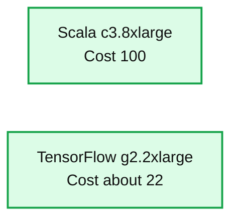

# GPU Acceleration in Databricks

- Source: https://www.databricks.com/blog/2016/10/27/gpu-acceleration-in-databricks.html
- Published: 2016-10-27
- Authors: Joseph Bradley, Tim Hunter, Yandong Mao
- Categories: engineering, open-source, data-science-machine-learning
- Images: 1 total, 1 extracted as architecture

Databricks is adding support for Apache Spark clusters with Graphics Processing Units (GPUs), ready to accelerate Deep Learning workloads. With Spark deployments tuned for GPUs, plus pre-installed libraries and examples, Databricks offers a simple way to leverage GPUs to power image processing, text analysis, and other Machine Learning tasks. Users will benefit from 10x speedups in Deep Learning, automated configuration of GPU machines, and smooth integration with Spark clusters. The feature is available [by request](https://www.databricks.com/company/contact), and will be generally available within weeks.

## Speeding up Machine Learning with GPUs

Deep Learning is an extremely powerful tool for modeling data, but it comes at the price of expensive computations. GPUs can drastically lower the cost because they support efficient parallel computation. To demonstrate these benefits, we benchmarked a simple numerical task ([kernel density estimation](https://en.wikipedia.org/wiki/Kernel_density_estimation)). We compared optimized code written in Scala and run on top-of-the-line compute intensive machines in AWS (c3.8xlarge) against standard GPU hardware (g2.2xlarge). Using [TensorFlow](https://www.tensorflow.org/) as the underlying compute library, the code is 3X shorter, and about 4X less expensive (in $ cost) to run on a GPU cluster. More details about achieving this level of performance will be published in a future blog post.

**Summary:** The chart compares normalized processing cost per data point for Scala on c3.8xlarge versus TensorFlow on g2.2xlarge.

**Components:**

- Scala on c3.8xlarge, normalized cost 100
- TensorFlow on g2.2xlarge, normalized cost about 22

**Flows:**

- none

**Numbers:** 100, 75, 50, 25, 0, 3.8, 2.2, about 22

source image: https://www.databricks.com/wp-content/uploads/2016/10/cpu-and-gpu-deep-learning-comparison.png

## Using GPUs in Databricks

Databricks’ GPU offering provides tight integration with Apache Spark. When you create a GPU cluster in Databricks, we configure the Spark cluster to use GPUs, and we preinstall the libraries required to access the GPU hardware. In addition, we provide scripts that install popular Deep Learning libraries so that you can immediately get started with Deep Learning or other GPU-accelerated tasks.

Here are some specifics on our current GPU offering:

- Amazon EC2 g2.2xlarge (1 GPU) and g2.8xlarge (4 GPUs) instance types. p2 (1-16 GPUs) instance types coming soon *(UPDATE: We are supporting P2 instances instead of G2 instances because P2 generally provide more memory and GPU cores per dollar than G2)*.
- Pre-installed CUDA ® and cuDNN libraries.
- Support for GPUs on both driver and worker machines in Spark clusters.
- Simplified installation of Deep Learning libraries, via provided and customizable init scripts.

## How Databricks integrated Spark with GPUs

Apache Spark does not provide out-of-the-box GPU integration. One of the key benefits of using GPUs on Databricks is our work on configuring Spark clusters to utilize GPUs. When you run Spark on Databricks, you will notice a few things that make your life easier:

**Cluster setup:** GPU hardware libraries like CUDA and cuDNN are required for communication with the graphics card on the host machine. Simply downloading and installing these libraries takes time, especially in cloud-based offerings which create and tear down clusters regularly. By providing pre-installed libraries, Databricks reduces cluster setup time (and the EC2 cost of setup) by about 60%.

**Spark configuration:** We configure GPU Spark clusters to prevent contention on GPU devices. Essentially, GPU context switching is expensive, and GPU libraries are generally optimized for running single tasks. Therefore, reducing Spark parallelism per executor results in higher throughput.

**Cluster management:** Databricks provides these capabilities within a secure, containerized environment. We isolate users from each other, and we reuse EC2 instances when you launch a cluster to minimize your cost.

## Using Deep Learning libraries on Databricks

Databricks users may take advantage of many Deep Learning libraries. For example, the above performance benchmark plot used [TensorFlow](https://www.databricks.com/glossary/what-is-tensorflow). We have published an open source Spark Package [TensorFrames](https://github.com/databricks/tensorframes) that integrates Spark with TensorFlow. To learn more, check out [Tim Hunter’s talk at Spark Summit Europe](https://www.youtube.com/watch?v=gXItObf-qaI). Databricks users can also take advantage of other popular libraries such as [Caffe](http://caffe.berkeleyvision.org/). Our follow-up blog post will dive into more details and tutorials.

## Getting started

[Contact us](https://www.databricks.com/company/contact) if you want to get started with deep learning on Databricks. We are working on example notebooks showing how to get started with GPU-accelerated Deep Learning on Spark. In the meantime, check out our [TensorFrames package](https://github.com/databricks/tensorframes) and example notebooks from our [previous blog post](https://www.databricks.com/blog/2016/01/25/deep-learning-with-apache-spark-and-tensorflow.html). Sign up for our [newsletter](https://www.databricks.com/resources?_sft_resource_type=newsletters) and [follow us on Twitter](https://twitter.com/databricks) to be notified when the next blog in the series comes out in a few weeks!
