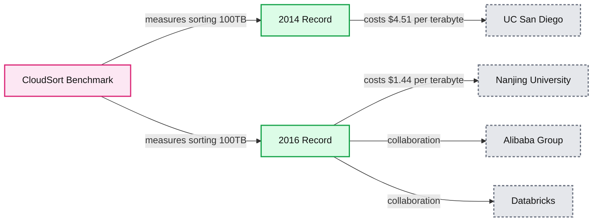

# $1.44 per terabyte: setting a new world record with Apache Spark

- Source: https://www.databricks.com/blog/2016/11/14/setting-new-world-record-apache-spark.html
- Published: 2016-11-14
- Authors: Reynold Xin
- Categories: engineering, open-source
- Images: 1 total, 1 extracted as architecture

We are excited to share with you that a joint effort by Nanjing University, Alibaba Group, and Databricks set a new world record in [CloudSort](http://sortbenchmark.org/), a well-established third-party benchmark. We together architected the most efficient way to sort 100 TB of data, using only $144.22 USD worth of cloud resources, 3X more cost-efficient than the previous world record. Through this benchmark, Databricks, along with our partners, demonstrated that the most efficient way to process data is to use Apache Spark in the cloud.

**Summary:** The benchmark compares the 2014 and 2016 records for sorting 100TB of data by cloud cost.

**Components:**

- 2014 Record using UC San Diego
- 2016 Record using Apache Spark with Databricks, Alibaba Group, and Nanjing University
- CloudSort Benchmark
- Cost metric measured per terabyte

**Flows:**

- none

**Numbers:** 2014, 2016, 100TB, $4.51 per terabyte, $1.44 per terabyte, 1902

source image: https://www.databricks.com/wp-content/uploads/2016/11/CloudSort-Benchmark-Image.jpg

This adds to the 2014 GraySort record we won, and validates two major technological trends we believe in:

1. Open source software is the future of software evolution, and Spark continues to be the most efficient engine for data processing.
2. Cloud computing is becoming the most cost-efficient and enabling architecture to deploy big data applications.

In the remainder of the blog post, we will explain the significance of the two benchmarks (CloudSort and GraySort), our records, and how they inspired major improvements in Spark such as [Project Tungsten](https://www.databricks.com/blog/2015/04/28/project-tungsten-bringing-spark-closer-to-bare-metal.html).

## GraySort Benchmark

It is easy to take for granted the incredible amount of computing power available today. As a beacon, the Sort Benchmark is a constant reminder of the journey taken and work accomplished by pioneers in computer systems of how we got here.

Started in 1985 by Turing Award winner Jim Gray, the benchmark measures the advances in computer software and hardware systems, and it is one of the most challenging benchmarks for computer systems. Participants in the past typically built specialized software and even hardware (e.g. special network topology) to maximize their chances of winning.

The original benchmark, called Datamation Sort, in 1985 required competing systems to sort 100 MB of data as fast as possible, regardless of the hardware resources used. 100 MB fits easily in the smallest USB stick you can find today, but back in 1985, it was a big challenge. The 1985 winning entry took 980 seconds. By 2001, this number was reduced to 0.44 seconds! To make the benchmark challenging, Datamation Sort was deprecated and a new TeraSort benchmark was created in 1998, changing the data size to 1TB.

In 2009, the 100 TB GraySort benchmark was created in honor of Jim Gray. Yahoo won the 2013 record using a 2100-node Hadoop cluster, sorting 100 TB of data in 72 minutes.

In 2014, our team at [Databricks entered the competition](https://www.databricks.com/blog/2014/11/05/spark-officially-sets-a-new-record-in-large-scale-sorting.html) using a distributed program built on top of Spark. Our system sorted 100 TB of data in 23 minutes, using only 207 machines on EC2. That is to say, Spark sorted the same data 3X faster using 10X fewer resources than the 2013 Hadoop entry. In addition to winning the benchmark, we also sorted 1 PB of data in 4 hours using a similar setup and achieved near linear scalability.

This 2014 win set a milestone: it was the first time a combination of open source software and cloud computing won the benchmark. In the past, only well-funded organizations could compete in the sort benchmark, because participants would need to acquire a sizable, costly cluster. But with the rise of the public cloud, anybody can leverage the elasticity and accomplish what was once only possible in a handful of companies.

## CloudSort Benchmark

The GraySort Benchmark measures the time it takes to sort 100 TB of data regardless of the hardware resources used. A well designed sorting system is relatively linearly scalable. Once an organization creates a linearly scalable system, the chance of winning then depends to a large degree on the amount of money the organization is willing to spend in acquiring hardware resources.

To mitigate this, the benchmark committee in 2014 created a new category called CloudSort. Unlike the GraySort which picks the winner based purely on time, CloudSort favors the entry with the lowest cost, measured by public cloud pricing. This benchmark effectively measures the efficiency, i.e. ratio of performance to cost, of the cloud architecture (combination of software stack, hardware stack, and tuning).

The spirit of the CloudSort is that it should be accessible enough that everyone can “play” at all scales, and let the best system win. In its inception year, the research team from the University of California, San Diego built a specialized sorting program called TritonSort and sorted 100 TB of data on Amazon EC2 for only $451. The system was so efficient that no one was able to challenge it even a year later.

That finally changed this week when our joint effort beat it and set the new CloudSort record.

## A New Cloud Record

Databricks, together with Nanjing University and Alibaba, formed a team called NADSort to compete this year. NADSort ran on 394 ecs.n1.large nodes on the AliCloud, each equipped with an Intel Haswell E5-2680 v3 processor, 8 GB of memory, and 4x135 GB SSD Cloud Disk. The sorting program was based on Databricks’ 2014 GraySort record-setting entry and adapted for better efficiency. You can find the details of NADSort in [this technical report](http://sortbenchmark.org/NADSort2016.pdf).

In the previous record for CloudSort, it cost nearly five dollars ($4.51) per terabyte, to sort 100 terabytes of data. Our optimizations and the cloud have reduced the per terabyte cost by two-thirds, and our new record stands at $1.44 per terabyte!

What made this cost efficiency improvement possible?

- **Cost-effectiveness of cloud computing:** Increased competition among major cloud providers has lowered the cost of resources, making deploying applications in the cloud economically feasible and scalable. In addition, cloud computing also enables use cases that were simply not possible before with on-demand resources and elasticity.
- **Efficiency of software:** We have invested heavily in performance optimizations, with some of the most significant changes in the last two years. Innovations such as [Project Tungsten](https://www.databricks.com/blog/2015/04/28/project-tungsten-bringing-spark-closer-to-bare-metal.html), [Catalyst](https://www.databricks.com/blog/2015/04/13/deep-dive-into-spark-sqls-catalyst-optimizer.html), and [whole-stage code generation](https://www.databricks.com/blog/2016/05/23/apache-spark-as-a-compiler-joining-a-billion-rows-per-second-on-a-laptop.html), have benefited Apache Spark enormously, improving all aspects of the stack. In addition to the general improvements in Spark, our collaborators have also worked on improving shuffle specifically for the AliCloud environment.
- **Expertise in optimizing Spark and cloud-native architecture:** As the team that started the Spark research project at UC Berkeley that later became Apache Spark, we continue to lead the way in execution optimization. In addition, we have developed deep expertise in operating and tuning cloud-native data architecture by operating tens of thousands of clusters at once for our customers and users. The expertise we developed in building the most efficient cloud architecture for data processing enabled us to push the boundary of cost-efficiency in addition to the innovations from providers.

## Significance of Sorting in Distributed Data Processing

You might ask: what’s the significance of sorting, and why would we sort so much data?

At the core of sorting is the shuffle operation, which moves data across all machines. Shuffle underpins almost all distributed data processing workloads. For example, a SQL query joining two disparate data sources uses shuffle to move tuples that should be joined together onto the same machine, and collaborative filtering algorithms such as ALS rely on shuffle to send user/product ratings and weights across the network.

Most data pipelines start with a large amount of raw data, but as the pipeline progresses, the amount of data is reduced due to filtering out irrelevant data or more compact representation of intermediate data. A SQL query on 100 TB of raw input data most likely only shuffles a tiny fraction of the 100 TB across the network, and the query optimizer can be smart to reduce the amount of data scanned. This pattern is also reflected in the naming of MapReduce itself.

We evaluate Spark using a lot of different benchmarks, e.g. TPC-H, TPC-DS. The sort benchmark, however, is by far the most challenging due to the way it stresses the execution path. Sorting 100 TB of input data requires shuffling 100 TB of data across the network. We can’t hide behind clever tricks such as data skipping or query optimizations to reduce the scale.

The above attributes make sorting a metric we frequently refer to when we seek to measure and improve Spark.

The optimizations we did for our 2014 GraySort record have led to important improvements to Spark itself in the last 2 years: Netty-based network module to improve network throughput, off-heap memory management to remove GC, Project Tungsten to improve CPU efficiency. We have learned more with our 2016 CloudSort record, and we will apply those learnings to our development on Spark and the Databricks platform.

The achievements of two world records in two years leave us humbled, yet they validate the technology trends we’ve invested in heavily: Spark and cloud computing. These achievements are also testament to the engineering prowess we posses. To leverage this expertise and get the best performance out of Spark in the cloud, [sign up for a Databricks account to build your data platform](https://www.databricks.com/try-databricks).

Last but not least, we would like to thank Qian Wang, Rong Gu, Yihua Huang from Nanjing University, Wei Wu, Jun Song, Junluan Xia from Alibaba for pushing forward state-of-the-art with us. We also thank the benchmark committee members Chris Nyberg, Mehul Shah, and Naga Govindaraju for their support. It was certainly fun to work together and compete!
