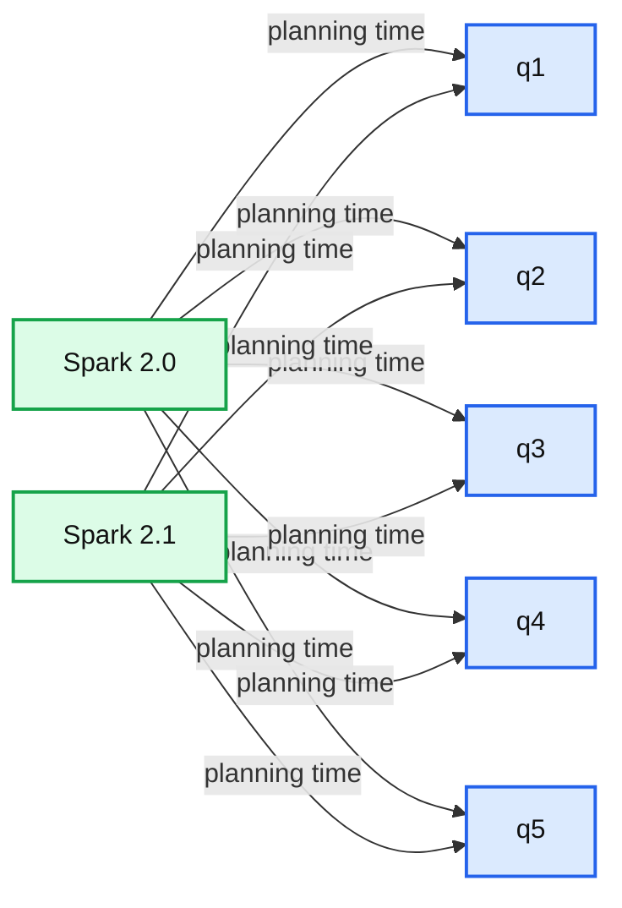

# Scalable Partition Handling for Cloud-Native Architecture in Apache Spark 2.1

- Source: https://www.databricks.com/blog/2016/12/15/scalable-partition-handling-for-cloud-native-architecture-in-apache-spark-2-1.html
- Published: 2016-12-15
- Authors: Eric Liang, Michael Allman, Wenchen Fan
- Categories: engineering, open-source
- Images: 1 total, 1 extracted as architecture

*Free Edition has replaced Community Edition, offering enhanced features at no cost. Start using *[*Free Edition *](https://login.databricks.com/?intent=SIGN_UP&amp;signup_experience_step=EXPRESS&amp;provider=DB_FREE_TIER&amp;dbx_source=www)*today.*
 

Apache Spark 2.1 is just around the corner: the community is going through voting process for the release candidates. This blog post discusses one of the most important features in the upcoming release: scalable partition handling.

Spark SQL lets you query terabytes of data with a single job. Often times though, users only want to read a small subset of the total data, e.g. scanning the activity of users in San Francisco rather than the entire world. They do this by partitioning the data files of the table by commonly filtered fields such as date or country. Spark SQL then uses this partitioning information to “prune” or skip over files irrelevant to the user’s queries. However, in previous Spark versions the first read to a table can be slow, if the number of partitions is very large, since Spark must first discover which partitions exist.

**In Spark 2.1, we drastically improve the initial latency of queries that touch a small fraction of table partitions.** In some cases, queries that took tens of minutes on a fresh Spark cluster now execute in seconds. Our improvements cut down on table memory overheads, and make the SQL experience starting cold comparable to that on a “hot” cluster with table metadata fully cached in memory.

**Spark 2.1 also unifies the partition management features of DataSource and Hive tables.** This means both types of tables now support the same partition DDL operations, e.g. adding, deleting, and relocating specific partitions.

## Table Management in Spark

To better understand why the latency issue existed, let us first explain how table management worked in previous versions of Spark. In these versions, Spark supports two types of tables in the catalog:

1. [DataSource tables](https://www.databricks.com/blog/2015/01/09/spark-sql-data-sources-api-unified-data-access-for-the-spark-platform.html) are the preferred format for tables created in Spark. This type of table can be defined on the fly by saving a DataFrame to the filesystem, e.g. `df.write.partitionBy("date").saveAsTable("my_metrics")`, or via a [CREATE TABLE statement](https://docs.databricks.com/spark/latest/spark-sql/language-manual/sql-ref-syntax-ddl-create-table.html), e.g. `CREATE TABLE my_metrics USING parquet PARTITIONED BY date`.In prior versions, Spark discovers DataSource table metadata from the filesystem and caches it in memory. This metadata includes the list of partitions and also file statistics within each partition. Once cached, table partitions could be pruned in memory very quickly to address incoming queries.
2. For users coming from [Apache Hive](https://www.databricks.com/glossary/apache-hive) deployments, Spark SQL can also read catalog tables defined by Hive serdes. When possible, Spark transparently converts such Hive tables to DataSource format in order to take advantage of IO performance improvements in Spark SQL. Spark does this internally by reading the table and partition metadata from the Hive metastore and caching it in memory.

While this strategy provides optimal performance once table metadata is cached in memory, it also has two downsides: First, the initial query over the table is blocked until Spark loads all the table partitions’ metadata. For a large partitioned table, recursively scanning the filesystem to discover file metadata for the initial query can take many minutes, especially when data is stored in cloud storage such as S3. Second, all the metadata for a table needs to be materialized in-memory on the driver process and increases memory pressure.

We have seen this issue coming up a lot from our customers and other large-scale Spark users. While it is sometimes possible to avoid the initial query latency by reading files directly with other Spark APIs, we wanted table performance to scale without workarounds. For Spark 2.1, Databricks collaborated with VideoAmp to eliminate this overhead and unify management of DataSource and Hive format tables.

VideoAmp has been using Spark SQL from the inception of its data platform, starting with Spark 1.1. As a demand side platform in the real-time digital advertising marketplace, they receive and warehouse billions of events per day. VideoAmp now has tables with tens of thousands of partitions.

Michael Allman (VideoAmp) describes their involvement in this project:

> Prior to Spark 2.1, fetching the metadata of our largest table took minutes and had to be redone every time a new partition was added. Shortly after the release of Spark 2.0, we began to prototype a new approach based on deferred partition metadata loading. At the same time, we approached the Spark developer community to sound out our ideas. We submitted one of our prototypes as a pull request to the Spark source repo, and began our collaboration to bring it to a production level of reliability and performance.

## Performance Benchmark

Before diving into the technical details, first we showcase query latency improvements over one of our internal metrics tables, which has over 50,000 partitions (at Databricks, we believe in eating our own dog food). The table is partitioned by date and metric type, roughly as follows:

We use a small Databricks cluster with 8 workers, 32 cores, and 250GB of memory. We run a simple aggregation query over a day, a week, and a month’s worth of data, and evaluate the *time to first result* on a newly launched Spark cluster:

### VideoAmp Production Benchmarks

We also show that these improvements substantially impact production queries in workloads used by VideoAmp. They run complex multi-stage queries with dozens of columns, multiple aggregations and unions over regularly updated tables tens of thousands of partitions in size. VideoAmp measured the fraction of time spent in the planner for several of their day-to-day queries, comparing performance between Spark 2.0 and 2.1. They found significant—sometimes dramatic—improvements across the board:

**Summary:** The chart compares the fraction of planning time for VideoAmp production queries q1 through q5 in Spark 2.0 and Spark 2.1.

**Components:**

- Spark 2.0: older Spark technology benchmark
- Spark 2.1: newer Spark technology benchmark
- Query number: q1 through q5
- Fraction of time spent in planner: percentage scale

**Flows:**

- Query number -> Planning time comparison: measured planner-time fraction

**Numbers:** 80.00%, 60.00%, 40.00%, 20.00%, 0.00%, q1, q2, q3, q4, q5, Spark 2.0, Spark 2.1

source image: https://www.databricks.com/wp-content/uploads/2016/12/videoamp-production-queries-planning-time.png

## Implementation

These benefits were enabled by two significant changes to Spark SQL internals.

1. Spark now persists table partition metadata in the system catalog (a.k.a. Hive metastore) for both Hive and DataSource tables. With the new [PruneFileSourcePartitions](https://github.com/apache/spark/blob/branch-2.1/sql/core/src/main/scala/org/apache/spark/sql/execution/datasources/PruneFileSourcePartitions.scala) rule, the Catalyst optimizer uses the catalog to prune partitions during [logical planning](https://www.databricks.com/blog/2015/04/13/deep-dive-into-spark-sqls-catalyst-optimizer.html), before metadata is ever read from the filesystem. This avoids needing to locate files from partitions that are not used.
2. File statistics can now be cached incrementally and partially during planning, instead of all upfront. Spark needs to know the size of files in order to divide them among read tasks during [physical planning](https://www.databricks.com/blog/2015/04/13/deep-dive-into-spark-sqls-catalyst-optimizer.html). Rather than eagerly cache all table files statistics in memory, tables now share a [fixed-size cache of (configurable) 250MB](https://github.com/apache/spark/blob/56a503df5ccbb233ad6569e22002cc989e676337/sql/core/src/main/scala/org/apache/spark/sql/internal/SQLConf.scala#L281) to robustly speed up repeated queries without risking out of memory errors.

In combination, these changes mean queries are faster from a cold start of Spark. Thanks to the incremental file statistics cache, there is also close to no performance penalty for repeated queries compared to the old partition management strategy.

## Newly supported partition DDLs

Another benefit of these changes is DataSource table support for several DDL commands previously only available for Hive tables. These DDLs allow the location of files for a partition to be changed from the default layout, e.g. partition `(date='2016-11-01', metric='m1')` can be placed at arbitrary filesystem locations, not only `/date=2016-11-01/metric=m1`.

Of course, you can still use native DataFrame APIs such as `df.write.insertInto` and `df.write.saveAsTable` to append to partitioned tables. For more information about supported DDLs in Databricks, see the [language manual](https://docs.databricks.com/spark/latest/spark-sql/index.html).

## Migration Tips

While new DataSource tables created by Spark 2.1 will use the new scalable partition management strategy by default, for backwards compatibility this is not the case for existing tables. To take advantage of these improvements for existing DataSource tables, you can use the MSCK command to convert an existing table using the old partition management strategy to using the new approach:

You will also need to issue `MSCK REPAIR TABLE` when creating a new table over existing files.

Note that this can potentially be a backwards-incompatible change, since direct writes to the table’s underlying files will no longer be reflected in the table until the catalog is also updated. This syncing is done automatically by Spark 2.1, but writes from older Spark versions, external systems, or outside of the Spark’s table APIs will require `MSCK REPAIR TABLE` to be called again.

How can you tell if catalog partition management is enabled for a table? Issue a `DESCRIBE FORMATTED table_name` command, and check for `PartitionProvider: Catalog` in the output:

## Conclusion

All of the work described in this blog post is included in Apache Spark’s 2.1 release. The JIRA ticket covering the major items can be found at [SPARK-17861](https://issues.apache.org/jira/browse/SPARK-17861).

We are excited about these changes, and look forward to building upon them for further performance improvements. To try out some queries using Spark SQL for free, [sign up for an account](https://www.databricks.com/try-databricks) on Databricks Community Edition.
