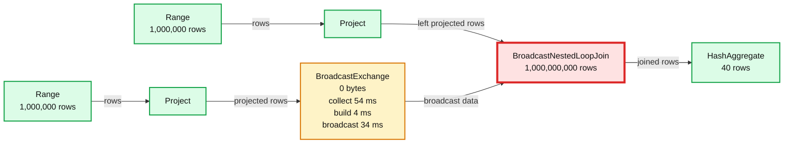
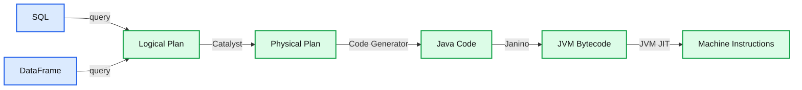

# Processing a Trillion Rows Per Second on a Single Machine: How Can Nested Loop Joins be this Fast?

- Source: https://www.databricks.com/blog/2017/02/16/processing-trillion-rows-per-second-single-machine-can-nested-loop-joins-fast.html
- Published: 2017-02-16
- Authors: Reynold Xin, Ala Luszczak, Bogdan Raducanu
- Categories: engineering, open-source
- Images: 2 total, 2 extracted as architecture

This blog post describes our experience debugging a failing test case caused by a cross join query running “too fast.” Because the root cause of fail test case spans across multiple layers—from Apache Spark to the JVM JIT compiler— we wanted to share our analysis in this post.

## Spark as a compiler

The vast majority of big data SQL or MPP engines follow the Volcano iterator architecture that is inefficient for analytical workloads. Since Spark 2.0 release, the new Tungsten execution engine in Apache Spark implements whole-stage code generation, a technique inspired by modern compilers to collapse the entire query into a single function. This JIT compiler approach is a far superior architecture than the row-at-a-time processing or code generation model employed by other engines, making Spark one of the most efficient in the market. Our earlier blog post demonstrated that Spark 2.0 was capable of [producing a billion records a second on a laptop](https://www.databricks.com/blog/2016/05/23/apache-spark-as-a-compiler-joining-a-billion-rows-per-second-on-a-laptop.html) using its broadcast hash join operator.

Spark 2.0 implemented whole-stage code generation for most of the essential SQL operators, such as scan, filter, aggregate, hash join. Based on our customers’ feedback, we recently implemented whole-stage code generation for broadcast nested loop joins in Databricks, and gained 2 to 10X improvement.

## Mystery of a failing test case

While we were pretty happy with the improvement, we noticed that one of the test cases in Databricks started failing. To simulate a hanging query, the test case performed a cross join to produce 1 trillion rows.

On a single node, we expected this query would run infinitely or "hang." To our surprise, we started seeing this test case failing nondeterministically because sometimes it completed on our Jenkins infrastructure in less than one second, the time limit we put on this query.

We noticed that in one of the failing instances, the query was performing a broadcast nested loop join using 40 cores, as shown below. That is to say, each core was able to process 25 billion rows per second. As much as we enjoyed the performance improvements, something was off: the CPU was running at less than 4 GHz, so how could a core process more than 6 rows per cycle in joins?

**Summary:** Spark WholeStageCodegen executes a broadcast nested loop join between two range projections, followed by hash aggregation.

**Components:**

- WholeStageCodegen: Apache Spark code generation stage for the left join input.
- Range: Apache Spark range operator producing rows.
- Project: Apache Spark projection operator.
- WholeStageCodegen: Apache Spark code generation stage for the right join input.
- BroadcastExchange: Apache Spark broadcast data exchange.
- BroadcastNestedLoopJoin: Apache Spark nested loop join operator.
- HashAggregate: Apache Spark hash aggregation operator.

**Flows:**

- Range -> Project: 1,000,000 generated rows
- Range -> Project: 1,000,000 generated rows
- Project -> BroadcastNestedLoopJoin: projected left-side rows
- Project -> BroadcastExchange: projected rows for broadcast
- BroadcastExchange -> BroadcastNestedLoopJoin: broadcast data
- BroadcastNestedLoopJoin -> HashAggregate: 1,000,000,000 joined rows

**Numbers:**

- Left WholeStageCodegen: 38.5 s
- Left timing: 945 ms, 965 ms, 980 ms
- Right WholeStageCodegen: 23 ms
- Right timing: 1 ms, 3 ms, 5 ms
- Range output: 1,000,000 rows
- BroadcastExchange data size: 0 bytes
- BroadcastExchange time to collect: 54 ms
- BroadcastExchange time to build: 4 ms
- BroadcastExchange time to broadcast: 34 ms
- BroadcastNestedLoopJoin output: 1,000,000,000 rows
- HashAggregate output: 40 rows
- HashAggregate aggregate time total: 38.5 ms
- HashAggregate timing: 930 ms, 955 ms, 975 ms

source image: https://www.databricks.com/wp-content/uploads/2017/02/trillion-rows-per-second-dag.png

## Life of a Spark query

Before revealing the cause, let’s walk through how Spark’s query execution works.

Spark internally represents a query or a DataFrame as a logical plan. The Catalyst optimizer applies both rule-based peephole optimizations as well as cost-based optimizations on logical plans. After logical query optimization, Catalyst transforms the logical plan into a physical plan, which contains more information about how the query should be executed. As an example, “join” is a logical plan node, which doesn’t dictate how the join should be physically executed. By contrast, “hash join” or “nested loop join” would be a physical plan node, as it specifies how the query should be executed.

**Summary:** The diagram shows the Apache Spark query pipeline from SQL or DataFrame input through logical and physical plans to machine instructions.

**Components:**

- SQL: SQL query input
- DataFrame: Spark DataFrame API input
- Logical Plan: Apache Spark logical query plan
- Physical Plan: Apache Spark execution plan
- Java Code: Generated Java code
- JVM Bytecode: Janino compiled bytecode
- Machine Instructions: JVM JIT compiled machine code

**Flows:**

- SQL -> Logical Plan: query
- DataFrame -> Logical Plan: query
- Logical Plan -> Physical Plan: Catalyst
- Physical Plan -> Java Code: code generation
- Java Code -> JVM Bytecode: Janino compilation
- JVM Bytecode -> Machine Instructions: JVM JIT optimization

**Numbers:** none

source image: https://www.databricks.com/wp-content/uploads/2017/02/life-of-a-spark-query.png

Prior to whole-stage code generation, each physical plan is a class with code defining the execution. With whole-stage code generation, all the physical plan nodes in a plan tree work together to generate Java code in a single function for execution. This Java code is then turned into JVM bytecode using Janino, a fast Java compiler. Then JVM JIT kicks in to optimize the bytecode further and eventually compiles them into machine instructions.

In this case, the generated Java code looked like the following (simplified for illustration):

Our first guess was that JVM JIT was smart enough to eliminate the inner loop, because JIT analyzed the bytecode and found the inner loop had no side effect other than incrementing some counters. In that case, JIT would rewrite the code into the following:

This would turn an operation that is **O(outer * inner)** to just **O(outer)**. To verify this, we used the flag `-XX:PrintAssembly` to dump the assembly code by JIT, and inspected the assembly code. A shortened version of the generated assembly looks like the following (annotation added by us; you can [find the full version here](https://gist.github.com/rxin/74d65a166b2f48773e0f61f923c0caa2)):

The assembly is a bit verbose, but it is easy to notice that the agg_value1 += 1 instruction was implemented using both add 0x01 and add 0x10 assembly instructions. This suggests the inner loop was unrolled with a factor of 16, after which further optimizations were possible. Since bnlj_broadcast.length might not be a multiple of 16, add 0x01 instructions are still needed to finish the loop.

So what really happened was that the nested loops were rewritten as following:

## What we learned and our takeaways

Mystery solved. **Would this particular optimization matter in practice? Probably not**, unless you are running a query that counts the output of cross joins.

However, we found the experience and cause fascinating and wanted to share with the curious. Without implementing a specific optimization rule to unroll the inner loop, we gained this optimization because it existed in another layer of abstraction, namely JVM JIT. Another interesting takeaway is that with multiple layers of optimizations, performance engineering can be quite challenging, and extreme care must be taken when designing benchmarks to measure the intended optimization, as optimizations in other layers might bring unexpected speedups and lead to incorrect conclusions.

The broadcast nested loop join improvement is, nonetheless, generally applicable, and all Databricks customers will automatically get this optimization in the next software update.
