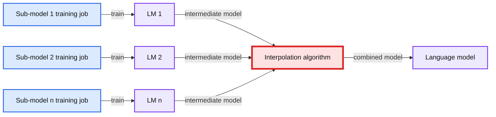
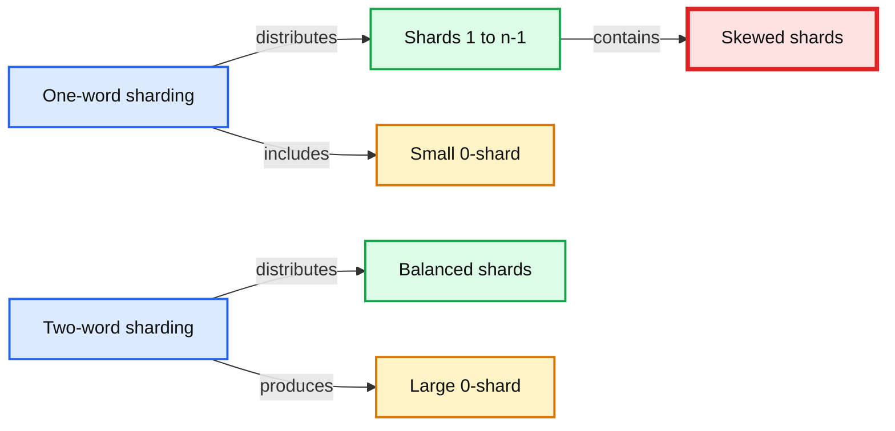
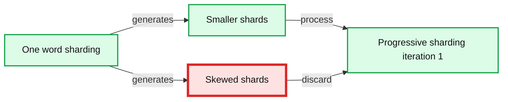
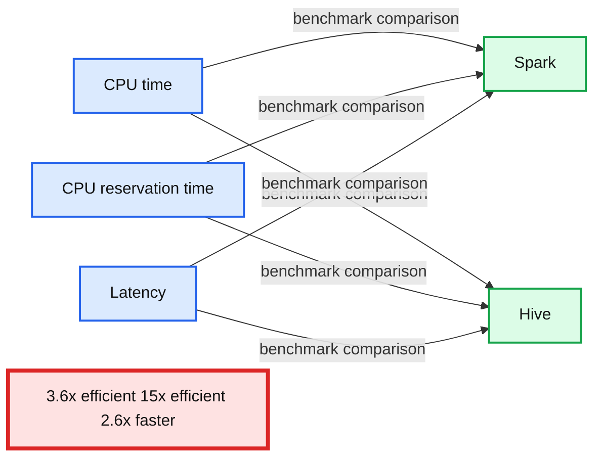

# Voice from Facebook: Using Apache Spark for Large-Scale Language Model Training

- Source: https://www.databricks.com/blog/2017/02/28/voice-facebook-using-apache-spark-large-scale-language-model-training.html
- Published: 2017-02-28
- Authors: Tejas Patil, Jing Zheng
- Categories: engineering, open-source
- Images: 6 total, 5 extracted as architecture

*This is a guest post from Facebook. Tejas Patil and Jing Zheng, software engineers in the Facebook engineering team, show how to use Apache Spark for large scale modeling. The blog was originally posted on the [Facebook Code blog](https://engineering.fb.com/2017/02/07/core-data/using-apache-spark-for-large-scale-language-model-training/).*

---

Processing large-scale data is at the heart of what the data infrastructure group does at Facebook. Over the years we have seen tremendous growth in our analytics needs, and to satisfy those needs we either have to design and build a new system or adopt an existing open source solution and improve it so it works at our scale.

For some of our batch-processing use cases we decided to use [Apache Spark](https://spark.apache.org/), a fast-growing open source data processing platform with the ability to scale with a large amount of data and support for custom user applications.

A few months ago, [we shared one such use case](https://www.databricks.com/blog/2016/08/31/apache-spark-scale-a-60-tb-production-use-case.html) that leveraged Spark's declarative (SQL) support. In this post, we will describe how we used the imperative side of Spark to redesign a large-scale, complex (100+ stage) pipeline that was originally written in HQL over Hive. In particular, we will describe how to control data distribution, avoid data skew, and implement application-specific optimizations to build performant and reliable data pipelines. This new Spark-based pipeline is modular, readable, and more maintainable compared with the previous set of HQL queries. In addition to the qualitative improvements, we also observed reductions in both resource usage and data landing time.

## Use case: N-gram language model training

Natural language processing is a field of artificial intelligence concerned with the interactions between computers and human languages. Computers can be trained to model a language, and these models are used to detect and correct spelling errors. The N-gram language model is the most widely used language modeling approach. An N-gram is usually written as an N-word phrase, with the first N-1 words as the history, and the last word predicted as a probability based on the N-1 previous words. For example, *“Can you please come here”* contains 5 words and is a 5-gram. Its history is *“Can you please come.”* Based on that history, an N-gram language model can compute a conditional probability of the word *“here.”*

Large-scale, higher-order N-gram language models (e.g., N=5) have proven very effective in many applications, such as automatic speech recognition and machine translation. At Facebook, for example, this is used to automatically generate captions for videos uploaded to pages, and detecting pages with potentially low quality place names (eg. “Home sweet home,” “Apt #00, Fake lane, Foo City”).

Language models trained with large datasets have better accuracy compared with ones trained with smaller datasets. The possibility of covering ample instances of infrequent words (or N-grams) increases with a larger dataset. For training with larger dataset, distributed computing frameworks (e.g. MapReduce) are generally used for better scalability and parallelizing model training.

## Earlier solution

We had originally developed a Hive-based solution for generating an N-gram language model. The N-gram counts were sharded by the last-two-word history, and C++ based TRANSFORMs were used to estimate partial language models and save them in Hive. Separate sub-models were built on different data sources, each triggered by a Hive query. Later, all these sub-models were combined in a final job using an interpolation algorithm using weights for each sub-model. Below is a high-level overview of the pipeline:

**Summary:** The diagram shows separate sub-model training jobs producing intermediate language models that are combined by an interpolation algorithm into a final language model.

**Components:**

- Sub-model 1 training job using Hive queries
- Sub-model 2 training job using Hive queries
- Sub-model n training job using Hive queries
- Intermediate sub-models LM 1, LM 2, and LM n
- Interpolation algorithm
- Final language model

**Flows:**

- Sub-model 1 training job -> LM 1: trained intermediate language model
- Sub-model 2 training job -> LM 2: trained intermediate language model
- Sub-model n training job -> LM n: trained intermediate language model
- LM 1 -> Interpolation algorithm: intermediate model
- LM 2 -> Interpolation algorithm: intermediate model
- LM n -> Interpolation algorithm: intermediate model
- Interpolation algorithm -> Language model: combined model using sub-model weights

**Numbers:** 1, 2, n

source image: https://www.databricks.com/wp-content/uploads/2017/02/high-level-hive-training-job-solution.jpg

The Hive-based solution obtained reasonable success in building language models: It could comfortably construct 5-gram language models when trained with a few billion N-grams. As we tried to increase the size of training dataset, the end-to-end time for running the pipeline was in an unacceptable range.

Hive provides a SQL-based engine for easily writing queries, which automatically get transformed into MapReduce jobs. For training language models, representing the computation as a SQL query wasn't a natural fit due to following reasons:

- The pipeline code comprised several SQL queries for each sub-model training. These queries were mostly similar with minor differences. Writing a new pipeline for model training leads to duplication of these SQL queries.
- As more clauses are added to the query, it gets harder to understand the intent of the query.
- Changing a part of query requires re-running the entire pipeline to make sure that it does not cause a regression. Inability to test changes in isolation makes the development cycle take longer.

As an alternative, writing Hadoop jobs provides more freedom to developers in terms of expressing the computation, but takes a lot more time and requires expertise in Hadoop.

## Spark-based solution

Spark comes with a Domain Specific Language (DSL) that makes it easy to write custom applications apart from writing jobs as SQL queries. With the DSL, you can control lower-level operations (e.g., when data is shuffled) and have access to intermediate data. This helps in implementing sophisticated algorithms achieve more efficiency and stability. It also enables users to write their pipeline in a modular fashion rather than one monolithic SQL string, which improves the readability, maintainability, and testability of the pipeline. These advantages led us to experiment with Spark.

Rewriting the C++ logic — which had implementations for language model training algorithms — in Scala or Java would have been a significant effort, so we decided to not change that part. Just like Hive, Spark supports running custom user code, which made it easy to invoke the same C++ binaries. This allowed for a smooth transition since we didn't have to maintain two versions of the C++ logic, and the migration was transparent to users. Instead of using Spark SQL, we used the RDD interface offered by Spark because of its ability to control partitioning of the intermediate data and manage shard generation directly. Spark's `pipe()` operator was used to invoke the binaries.

At a higher level, the design of the pipeline remained the same. We continued to use Hive tables as initial input and final output for the application. The intermediate outputs were written to the local disk on cluster nodes. The entire application is approximately 1,000 lines of Scala code and can generate 100+ stages (depending on the number of sources of training data) when executed over Spark.

## Scalability challenges

We faced some scalability challenges when we tested Spark with a larger training dataset. In this section, we start off with describing the data distribution requirements (smoothing and sharding), followed by the challenges it led to and our solution.

### Smoothing

N-gram models are estimated from N-gram occurrence counts in the training data. Since there can be N-grams absent in the training data, this can generalize poorly to unseen data. To address this problem, many smoothing methods are used that generally discount the observed N-gram counts to promote unseen N-gram probabilities and use lower-order models to smooth higher-order models. Because of smoothing, for an N-gram with history *h*, counts for all N-grams with the same history and all lower-order N-grams with a history as a suffix of *h* are required to estimate its probability. As an example, for the trigram *“how are you,”* where *“how are”* is the history and *“you”* is the word to be predicted, in order to estimate P(*you*| *how are*), we need counts for *“how are *,”* *“are *,”* and all unigrams (single-word N-grams), where * is a wildcard representing any word in the vocabulary. Frequently occurring N-grams (e.g., *“how are *”*) lead to data skews while processing.

### Sharding

With a distributed computing framework, we could partition N-gram counts into multiple shards so they could be processed by multiple machines in parallel. Sharding based on the last *k* words of an N-gram's history can guarantee that all N-grams longer than *k* words are decently balanced across the shards. This requires the counts for all the N-grams with length up to *k* to be shared across all the shards. We put all these short N-grams in a special shard called “0-shard.” For example, if *k* is 2, then all the unigrams and bigrams extracted from the training data are put together in a single shard (0-shard) and are accessible to all the servers doing the model training.

### Problem: Data skew

In the Hive-based pipeline, we two-word history sharding for the model training. Two-word history sharding means that all the N-gram counts sharing the same set of the most significant two-word histories (closest to the word being predicted) are distributed to the same node for processing. Compared with single word history, two-word sharding generally leads to more balanced data distribution, except that all nodes must share the statistics of unigram and bigrams required by smoothing algorithms, which are stored in the 0-shard. The image below illustrates the comparison between distribution of shards with one-word and two-word history.

**Summary:** The diagram compares shard distribution using one-word and two-word histories, highlighting skewed shards and a large 0-shard.

**Components:**

- Shards 1 to n-1: blue and red shard partitions, technology not specified
- Skewed shards: oversized red partitions, technology not specified
- 0-shard: yellow shared shard, technology not specified
- One-word sharding: left-side distribution strategy
- Two-word sharding: right-side distribution strategy

**Flows:**

- One-word sharding -> Shards 1 to n-1: distributes shards with some skew
- Shards 1 to n-1 -> Skewed shards: identifies oversized partitions
- One-word sharding -> 0-shard: includes a small 0-shard
- Two-word sharding -> 0-shard: produces a large 0-shard
- Two-word sharding -> Balanced shard distribution: distributes the remaining shards more evenly

**Numbers:** 1 to n-1, 1-word, 0-shard, 2-word

source image: https://www.databricks.com/wp-content/uploads/2017/02/data-skew.jpg

For large datasets, two-word history sharding can generate a large 0-shard. Having to distribute a large 0-shard to all the nodes can slow down overall computation time. It can also lead to potential job instability as it is hard to predict the memory requirements upfront, and once a job is launched it can run out of memory while in progress. While allocating more memory upfront is possible, it still does not guarantee 100% job stability, and can lead to poor memory utilization across the cluster since not all instances of the job would need more memory than the historical average.

While trying to move the computation to Spark, the job could run with small workloads. But with larger datasets, we observed these issues:

- Driver marking executor as “lost” due to no heartbeat received from the executor for a long time
- Executor OOM
- Frequent executor GC
- Shuffle service OOM
- 2GB limit in Spark for blocks

At a high level, the root cause of all these problems could be attributed to data skew. We wanted to achieve a balanced distribution of shards, but both two-word history sharding and single-word history sharding did not help with that. So we came up with a hybrid approach: Progressive sharding and dynamically adjusting the shard size.

### Solution: Progressive sharding

Progressive sharding uses an iterative method to address data skew. In the first iteration, we start with one-word sharding where only unigram counts need to be shared across all the shards. Unigram counts are much smaller than bigram counts. This mostly works fine except when a few shards are extremely large. For example, the shard corresponding to “how to ...” will be skewed. To tackle this, we check the size of each shard and only process those shards smaller than a certain threshold.

**Summary:** Progressive sharding iteration 1 processes smaller shards generated by one-word sharding and discards skewed shards.

**Components:**

- One-word sharding: Apache Spark language-model data partitioning
- Smaller shards: processable shard partitions
- Skewed shards: discarded oversized partitions
- Progressive sharding iteration 1: first processing iteration

**Flows:**

- One-word sharding -> Smaller shards: generates smaller shards
- One-word sharding -> Skewed shards: generates skewed shards
- Smaller shards -> Progressive sharding iteration 1: process
- Skewed shards -> Progressive sharding iteration 1: discard

**Numbers:** 1-word; Iteration #1

source image: https://www.databricks.com/wp-content/uploads/2017/02/progressive-sharding-iteration-1.jpg

In the second iteration, we use two-word sharding, which distributes N-gram counts based on two-word history. At this stage, we only need to share N-gram counts for bigrams excluding those already processed in the first iteration. These bigram counts are much smaller than the complete set of bigram counts and therefore are much faster to process. As before, we check the size of each shard, and only process those smaller than the threshold. Those left over will go to next iteration using three-word history. In most cases, three iterations are sufficient for very large datasets.

**Summary:** Progressive sharding iteration 2 re-shards leftover data using a 2-word history, making 0-shard smaller.

**Components:**

- Processed shards: blue shard blocks
- Left-over shard: red crossed block
- 0-shard: yellow shard area
- Re-sharding step: 2-words history

**Flows:**

- Left-over shard -> Re-sharding step: left-over data with 2-words history
- Re-sharding step -> 0-shard: smaller 0-shard

**Numbers:** 2, 0, 2-words, Iteration #2

source image: https://www.databricks.com/wp-content/uploads/2017/02/progressive-sharding-iteration-2.jpg

### Dynamically adjust shard size

For the first iteration, we use a pre-specified number that is sufficiently large so that most of the shards generated are small in size. Each shard is processed by a single Spark task. Since 0-shard is very small in this iteration, having lots of small shards does not affect the efficiency. In later iterations, the number of shards are determined automatically by the number of leftover N-grams.

Both of these solutions were possible due to the flexibility offered by the Spark DSL. With Hive, developers do not have control over such lower-level operations.

## General purpose library for training models

How language models are used depends on the context of different applications. Each application may require different data and configurations, and therefore a different pipeline. In the Hive solution, the SQL part of the pipeline was similar across applications but had different components in several places. Instead of repeating code for each pipeline, we developed a general purpose Spark application that can be invoked from different pipelines with different data sources and configurations.

With the Spark-based solution, we could also automatically optimize the workflow of steps performed by the application based on the input configuration. For example, if the user did not specify to use entropy pruning, the application would skip model re-estimation. If the user specified count-cutoff in the configuration, the application would collapse many low-count N-grams into single one with a wildcard placeholder in order to reduce storage. These optimizations saved computational resources and produced the trained model in less time.

## Spark pipeline vs. Hive pipeline performance comparison

We used following performance metrics to compare the Spark pipeline against the Hive pipeline:

- **CPU time:** This is the CPU usage from the perspective of the operating system. For example, if you have a job that is running one process on a 32-core machine using 50% of all CPU for 10 seconds, then your CPU time would be 32 * 0.5 * 10 = 160 CPU seconds.
- **CPU reservation time:** This is the CPU reservation from the perspective of the resource management framework. For example, if we reserve a 32-core machine for 10 seconds to run the job, the CPU reservation time is 32 * 10 = 320 CPU seconds. The ratio of CPU time to CPU reservation time reflects how well are we utilizing the reserved CPU resources on the cluster. When accurate, the reservation time is a better gauge than CPU time for comparing execution engines running the same workloads. For example, if a process requires 1 CPU second to run but must reserve 100 CPU seconds, it is less efficient by this metric than a process that requires 10 CPU seconds and reserves 10 CPU seconds to do the same amount of work.
- **Latency / wall time:** End-to-end elapsed time of the job.

The following charts summarize the performance comparison between the Spark and Hive jobs. Note that with Spark the pipeline is not a 1:1 translation of Hive pipeline. It has several customizations and optimizations that contributed to the better scalability and performance.

**Summary:** Benchmark charts compare Spark and Hive on CPU time, CPU reservation time, and latency.

**Components:**

- Spark using Apache Spark
- Hive using Apache Hive
- CPU time measured in CPU days
- CPU reservation time measured in CPU days
- Latency measured in hours

**Flows:**

- CPU time -> Spark and Hive: benchmark comparison
- CPU reservation time -> Spark and Hive: benchmark comparison
- Latency -> Spark and Hive: benchmark comparison

**Numbers:**

- 3.6x efficient
- 15x efficient
- 2.6x faster
- CPU time axis: 0, 100, 200, 300 CPU days
- CPU reservation time axis: 0, 400, 800, 1200, 1600, 2000 CPU days
- Latency axis: 0, 2, 4, 6, 8 hours

source image: https://www.databricks.com/wp-content/uploads/2017/02/spark-vs-hive-large-scale-language-model-training-results.jpg

Spark-based pipelines can scale comfortably to process many times more input data than what Hive could handle at peak. For example, we trained a large language model on 15x more data, which generated a language model containing 19.2 billion N-grams within a few hours. Ability to train with more data and run experiments faster leads to higher-quality models. Larger language models generally lead to better results in related applications, as we observed in our own experience.

## Conclusion

The flexibility offered by Spark helped us to:

- Express application logic in a modular way that is more readable and maintainable compared with a monolithic SQL string.
- Perform custom processing over data (e.g., partitioning, shuffling) at any stage in the computation.
- Save compute resources and experimentation time due to a performant compute engine.
- Train high-quality language models due to ability to scale with larger input data.
- Build a generic application that can be used for generating language models across different products.
- Migrate from our earlier solution due to support to run user binaries (like Hive's TRANSFORM) and compatibility in interacting with Hive data.

Facebook is excited to be a part of the Spark open source community and will work together to develop Spark toward its full potential.
