# Real-Time End-to-End Integration with Apache Kafka in Apache Spark’s Structured Streaming

- Source: https://www.databricks.com/blog/2017/04/04/real-time-end-to-end-integration-with-apache-kafka-in-apache-sparks-structured-streaming.html
- Published: 2017-04-04
- Authors: Sunil Sitaula
- Categories: engineering, open-source, data-engineering, data-streaming
- Images: 23 total, 11 extracted as architecture

*Free Edition has replaced Community Edition, offering enhanced features at no cost. Start using *[*Free Edition *](https://login.databricks.com/?intent=SIGN_UP&amp;signup_experience_step=EXPRESS&amp;provider=DB_FREE_TIER&amp;dbx_source=www)*today.*
 

[View the Notebook in Databricks Community Edition](https://docs.databricks.com/_static/notebooks/structured-streaming-etl-kafka.html)

Structured Streaming APIs enable building end-to-end streaming applications called [continuous applications](https://www.databricks.com/blog/2016/07/28/continuous-applications-evolving-streaming-in-apache-spark-2-0.html) in a consistent, fault-tolerant manner that can handle all of the complexities of writing such applications. It does so without having to reason about the nitty-gritty details of streaming itself and by allowing the usage of familiar concepts within Spark SQL such as DataFrames and [Datasets](https://www.databricks.com/glossary/what-are-datasets). All of this has led to a high interest in use cases wanting to tap into it. From [introduction](https://www.databricks.com/blog/2016/07/28/structured-streaming-in-apache-spark.html), to [ETL](https://www.databricks.com/blog/2017/01/19/real-time-streaming-etl-structured-streaming-apache-spark-2-1.html), to [complex data formats](https://www.databricks.com/blog/2017/02/23/working-complex-data-formats-structured-streaming-apache-spark-2-1.html), there has been a wide coverage of this topic. Structured Streaming is also integrated with third party components such as Kafka, HDFS, S3, RDBMS, etc.

In this blog, I'll cover an end-to-end integration with Kafka, consuming messages from it, doing simple to complex windowing ETL, and pushing the desired output to various sinks such as memory, console, file, databases, and back to Kafka itself. In the case of writing to files, I'll cover writing new data under existing partitioned tables as well.

**Summary:** The diagram shows data streams flowing through Kafka into Spark Structured Streaming, which writes results to memory, console, databases, and files.

**Components:**

- Data streams
- Apache Kafka
- Apache Spark Structured Streaming
- Console
- Memory
- Databases
- Files

**Flows:**

- Data streams -> Apache Kafka: incoming streaming data
- Apache Kafka -> Apache Spark Structured Streaming: Kafka messages
- Apache Spark Structured Streaming -> Apache Kafka: output stream
- Apache Spark Structured Streaming -> Console: processed output
- Apache Spark Structured Streaming -> Memory: processed output
- Apache Spark Structured Streaming -> Databases: processed output
- Apache Spark Structured Streaming -> Files: processed output

**Numbers:** none

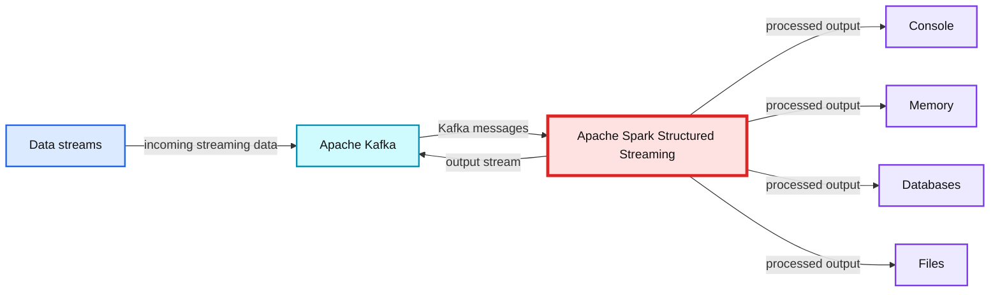

source image: https://www.databricks.com/wp-content/uploads/2017/04/structured-streaming-kafka-blog-image-1-overview.png

## Connecting to a Kafka Topic

Let's assume you have a [Kafka cluster](https://kafka.apache.org/quickstart) that you can connect to and you are looking to use Spark's Structured Streaming to ingest and process messages from a topic. The Databricks platform already includes an Apache Kafka 0.10 connector for Structured Streaming, so it is easy to set up a stream to read messages:

There are a number of options that can be specified while reading streams. The details of those options can be found here.

Let's quickly look at the schema for `streamingInputDF` DataFrame that we set up above.

It includes key, value, topic, partition, offset, timestamp and timestampType fields. We can pick and choose the ones as needed for our processing. The ‘value’ field is the actual data, and timestamp is message arrival timestamp. In windowing cases, we should not confuse this timestamp with what might be included in the messages itself which is more relevant most of the time.

## Streaming ETL

Now that the stream is set up, we can start doing the required ETL on it to extract meaningful insights. Notice that `streamingInputDF` is a DataFrame. Since DataFrames are essentially an untyped Dataset of rows, we can perform similar operations to them.

Let’s say that the generic ISP hit JSON data is being pushed to the Kafka ``above. An example value would look like this:

It is now possible to do interesting analysis quickly, such as how many users are coming in from a zipcode, what ISP do users come in from, etc. We can then create dashboards that can be shared to the rest of our organization. Let’s dive in:

**Summary:** A Databricks Structured Streaming query parses ZIP codes from Kafka input, groups and counts them, then displays an auto-updating bar chart.

**Components:**

- `streamingInputDF` - streaming input DataFrame
- JSON value parser - extracts `zip`
- Grouping operation - groups by ZIP code
- Count operation - counts records
- `display_query_5` - Databricks display query
- Bar chart - shows counts by ZIP code

**Flows:**

- `streamingInputDF -> JSON value parser`: streaming records
- `JSON value parser -> Grouping operation`: extracted ZIP codes
- `Grouping operation -> Count operation`: grouped ZIP records
- `Count operation -> display_query_5`: counted results
- `display_query_5 -> Bar chart`: displayed ZIP counts

**Numbers:** 1 Spark Jobs; display query 5; 5 seconds ago; chart ticks 0, 50, 100, 150; ZIP codes 38947, 38917, 38909, 38908; query ID 4492460c-b533-4d99-923e-6c435ba0c0a4

```mermaid
%% Shows a Databricks streaming ZIP count query and its bar chart output
flowchart LR
    A[Streaming input DataFrame] -->|streaming records| B[Parse JSON value]
    B -->|extracted ZIP codes| C[Group by ZIP]
    C -->|grouped records| D[Count records]
    D -->|counted results| E[Databricks display query]
    E -->|displayed counts| F[ZIP count bar chart]

    classDef client fill:#dbeafe,stroke:#2563eb,stroke-width:2px,color:#111
    classDef service fill:#dcfce7,stroke:#16a34a,stroke-width:2px,color:#111
    classDef store fill:#ede9fe,stroke:#7c3aed,stroke-width:2px,color:#111
    classDef cache fill:#fef3c7,stroke:#d97706,stroke-width:2px,color:#111
    classDef queue fill:#cffafe,stroke:#0891b2,stroke-width:2px,color:#111
    classDef critical fill:#fee2e2,stroke:#dc2626,stroke-width:4px,color:#111
    classDef external fill:#e5e7eb,stroke:#6b7280,stroke-width:2px,color:#111,stroke-dasharray:4 3
    classDef decision fill:#fce7f3,stroke:#db2777,stroke-width:2px,color:#111

    class A queue
    class B,C,D service
    class E client
    class F store
```

source image: https://www.databricks.com/wp-content/uploads/2017/04/structured-streaming-kafka-blog-image-5-realtime-analysis.png

Notice in the command above, we are able to parse the zipcode out of incoming JSON messages, group them and do a count, all in real-time as we are reading data from the Kafka topic. Once we have the count, we can display it, which fires the streaming job in the background and continuously updates the counts as new messages arrive. This auto-updating chart can now be shared as an [access-controlled dashboard in Databricks](https://www.databricks.com/blog/2016/02/17/introducing-databricks-dashboards.html) with the rest of our organization.

## Windowing

Now that we have parse, select, groupBy and count queries continuously executing, what if we want to find out traffic per zip code for a 10 minute window interval, with sliding duration of 5 minutes starting 2 minutes past the hour?

In this case, the incoming JSON contains timestamp in ‘hittime,’ so let’s use that to query the traffic per each 10 minute window.

> Note that in Structured Streaming, windowing is considered a groupBy operation. The pie charts below represents each 10 minute window.

**Summary:** Spark Structured Streaming groups Kafka JSON traffic by ZIP code in sliding time windows and displays the results as pie charts.

**Components:**

- Apache Spark Structured Streaming notebook
- `streamingInputDF`
- `streamingSelectDF`
- `get_json_object` extraction function
- Window aggregation
- Databricks display query
- Pie chart visualization

**Flows:**

- `streamingInputDF -> JSON extraction`: extracts ZIP code and hit time from the value field
- `JSON extraction -> Window aggregation`: groups by ZIP code and timestamp window
- `Window aggregation -> Databricks display query`: counts records
- `Databricks display query -> Pie chart visualization`: renders counts as pie charts

**Numbers:** 10 minute window, 5 minute sliding duration, 2 minute starting offset, 4 pie charts shown, ZIP codes 38917, 38909, 38908, 38986, percentages 0%, 13%, 25%, 50%, 1 Spark job, query 3, ID 2e31332b-73ba-4cef-adb1-326caebec54a, timestamps 2017-02-08T22:37:00.000+0000, 22:42:00.000+0000, 22:47:00.000+0000, 22:52:00.000+0000, 22:57:00.000+0000, 23:02:00.000+0000, 23:07:00.000+0000, 23:12:00.000+0000, 23:17:00.000+0000, 23:22:00.000+0000, 23:27:00.000+0000

```mermaid
%% Shows Spark Structured Streaming window aggregation and pie chart output
flowchart LR
    A[Streaming input data] -->|JSON value| B[Extract ZIP and hit time]
    B -->|ZIP and timestamp| C[Sliding time window]
    C -->|Count records| D[Databricks display query]
    D -->|Aggregated counts| E[Pie charts]

    classDef client fill:#dbeafe,stroke:#2563eb,stroke-width:2px,color:#111
    classDef service fill:#dcfce7,stroke:#16a34a,stroke-width:2px,color:#111
    classDef store fill:#ede9fe,stroke:#7c3aed,stroke-width:2px,color:#111
    classDef cache fill:#fef3c7,stroke:#d97706,stroke-width:2px,color:#111
    classDef queue fill:#cffafe,stroke:#0891b2,stroke-width:2px,color:#111
    classDef critical fill:#fee2e2,stroke:#dc2626,stroke-width:4px,color:#111
    classDef external fill:#e5e7eb,stroke:#6b7280,stroke-width:2px,color:#111,stroke-dasharray:4 3
    classDef decision fill:#fce7f3,stroke:#db2777,stroke-width:2px,color:#111

    class A queue
    class B,C service
    class D client
    class E client
```

source image: https://www.databricks.com/wp-content/uploads/2017/04/structured-streaming-kafka-blog-image-6-windowing.png

## Output Options

So far, we have seen the end results being displayed automatically. If we want more control in terms output options, there are a variety of output modes available. For instance, if we need to debug, you may wish to select the console output. If we need to be able to query the dataset interactively as data is being consumed, the memory output would be an ideal choice. Similarly, the output can be written to files, external databases, or even streamed back to Kafka.

Let’s go over these options in detail.

### Memory

In this scenario, data is stored as an in-memory table. From here, users are able to query the dataset using SQL. The name of the table is specified from the `queryName` option. Note we continue to use `streamingSelectDF` from the above windowing example.

**Summary:** The image shows a Spark Structured Streaming query writing windowed results to an in-memory table named isphits, which users query with SQL.

**Components:**

- Spark Structured Streaming query
- ProcessingTime trigger
- Memory sink
- In-memory table isphits
- Spark Jobs monitor
- SQL query interface
- Windowed zip and count results table

**Flows:**

- Spark Structured Streaming query -> ProcessingTime trigger: runs every 25 seconds
- Spark Structured Streaming query -> Memory sink: writes complete output
- Memory sink -> In-memory table isphits: stores streaming results
- SQL query interface -> In-memory table isphits: selects all rows
- In-memory table isphits -> Windowed zip and count results table: displays zip, window, and count

**Numbers:** 25 seconds; 1 Spark Jobs; 20 seconds ago; query id 68a2555f-c6e2-46dc-8081-052f4f5b78f1; zip values 38917 and 38909; counts 7, 3, 4, 3, 33, 3, 33; year 2017; window times 22:22, 22:27, 22:32, 22:37, 22:42, 22:47, 22:52, 22:57; window duration 10 minutes; UTC offset plus 0000

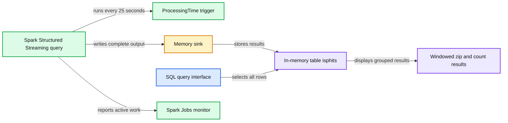

source image: https://www.databricks.com/wp-content/uploads/2017/04/structured-streaming-kafka-blog-image-7-store-in-memory.png

From here, you are now able to do more interesting analysis just as you would on a regular table while the data is automatically being updated.

### Console

In this scenario, output is printed to console/stdout log.

### File

This scenario is ideal for long-term persistence of output. Unlike memory and console sinks, files and directories are fault-tolerant. As such, this option requires a checkpoint directory, where state is maintained for fault-tolerance.

**Summary:** A streaming DataFrame is written as Parquet files with a data path, checkpoint location, and 25 second processing trigger.

**Components:**

- Streaming select DataFrame
- Spark Structured Streaming write stream
- Parquet file sink
- Data storage path
- Checkpoint storage
- Processing time trigger

**Flows:**

- Streaming select DataFrame -> Write stream: streaming records
- Write stream -> Parquet file sink: output format
- Parquet file sink -> Data storage path: writes files
- Parquet file sink -> Checkpoint storage: fault tolerance state
- Parquet file sink -> Processing time trigger: runs every 25 seconds

**Numbers:** 25 seconds

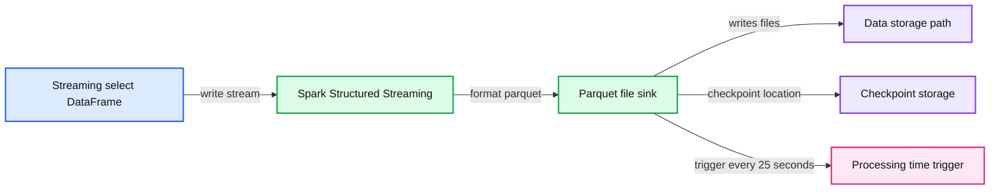

source image: https://www.databricks.com/wp-content/uploads/2017/04/structured-streaming-kafka-blog-image-9-write-to-parquet-file.png

**Summary:** Databricks displays the contents of `/mnt/sample/data`, including folders and compressed Parquet files with their sizes.

**Components:**

- Databricks file browser
- `%fs ls /mnt/sample/data` command
- `1/` directory
- `_spark_metadata/` directory
- Gzip-compressed Parquet files
- File size column

**Flows:**

- `%fs ls /mnt/sample/data` -> File listing: directory enumeration

**Numbers:** `1`, `00000`, `00001`, `00002`, `070544d3-8db3-456b-88a0-427149b062e9`, `1a90f838-6acd-4c81-9601-914b133335bf`, `b8266a87-c543-470e-900d-5e201b90e447`, `125e27b5-3c41-4fb3-9a77-633020fd9805`, `195e95ee-7077-4b29-8f29-c980e2a30354`, `df364fbe-cd6f-47a9-b2fe-0486b3526ea6`, `403fcedf-5a39-4866-a155-9457918b42d0`, `742`, `840`, `1076`, `848`, `1074`, `0`

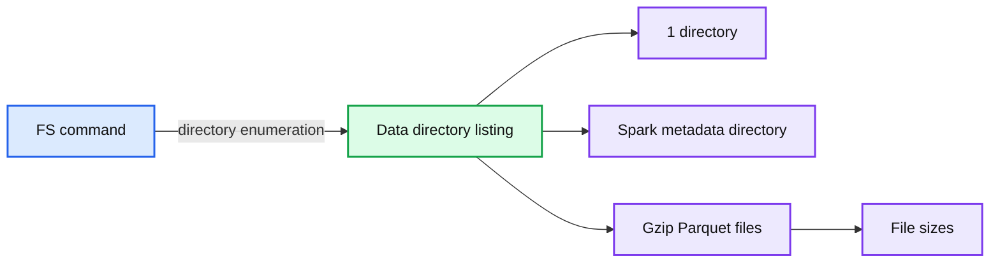

source image: https://www.databricks.com/wp-content/uploads/2017/04/structured-streaming-kafka-blog-image-10-read-file.png

Once the data is saved, it can be queried as one would do in Spark with any other dataset.

The other advantage of file output sinks is that you can dynamically partition incoming messages by any variation of columns. In this particular example, we can partition by ‘zipcode’ and ‘day’. This can help make queries faster as chunks of data could be skipped just by referencing individual partitions.

We could then partition the incoming data by ‘zip’ by ‘day’.

**Summary:** A Spark Structured Streaming query writes streaming data to partitioned Parquet files with checkpointing and a 25-second processing-time trigger.

**Components:**

- Spark Structured Streaming DataFrame
- Parquet file sink
- Output path `/mnt/sample/test-data`
- Checkpoint location `/mnt/sample/check`
- Partitions by `zip` and `day`
- Processing-time trigger
- Streaming query

**Flows:**

- Spark streaming DataFrame -> Parquet file sink: streaming records
- Parquet file sink -> Partitioned output: writes data partitioned by zip and day
- Streaming query -> Checkpoint location: checkpoint state
- Processing-time trigger -> Streaming query: triggers processing every 25 seconds

**Numbers:** 25 seconds

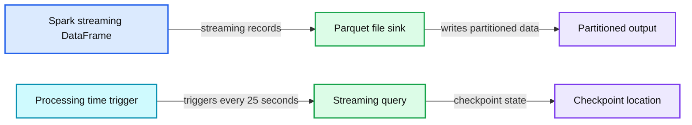

source image: https://www.databricks.com/wp-content/uploads/2017/04/structured-streaming-kafka-blog-image-13-dynamic-partition-by-column.png

Let’s look at the output directory.

**Summary:** The image shows a DBFS directory listing containing partitioned Parquet output files for zip 38908 and day 08.02.2017.

**Components:**

- Databricks FS using the `%fs ls` command
- DBFS output directory at `/mnt/sample/test-data/zip=38908/day=08.02.2017/`
- Parquet output files
- Directory listing columns: path, name, and size

**Flows:**

- `%fs ls` -> DBFS output directory: lists directory contents
- DBFS output directory -> Directory listing: returns Parquet file paths, names, and sizes

**Numbers:** 38908, 08.02.2017, 00000, 00001, 39d90024, 3518, 469b, bb10, 8dc6514bb786, 542, 5470dfd7, 79cc, 4560, b04f, 74b86e0d56e7, 498, bf846c6a, 5252, 47c9, 9366, 041ae682cae1, 10306660, a0b7, 4e6b, a5d9, 3524215305b5, 1949f2a8, 1094, 4369, b1a1, b0aec53fb098, 556, 555

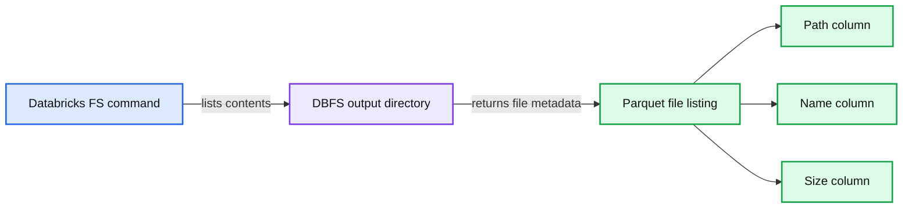

source image: https://www.databricks.com/wp-content/uploads/2017/04/structured-streaming-kafka-blog-image-14-output-directory.png

Now, the partitioned data can be used directly in datasets and DataFrames, and if a table is created pointing to the directory where files are written to, Spark SQL can be used to query the data.

**Summary:** SQL defines an external Parquet table named `test_par`, partitioned by ZIP and day, at a specified filesystem location.

**Components:**

- External table `test_par`
- Column `hittime` with string type
- ZIP partition with string type
- Day partition with string type
- Parquet storage format
- Filesystem location `/mnt/sample/test-data`

**Flows:**

- none

**Numbers:** none

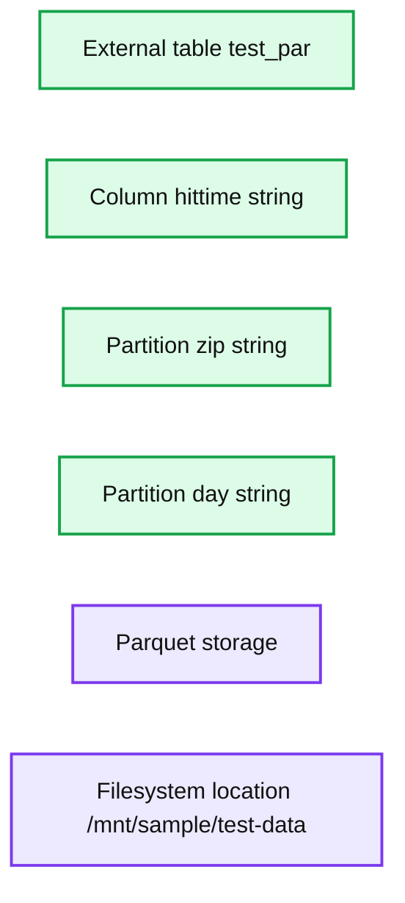

source image: https://www.databricks.com/wp-content/uploads/2017/04/structured-streaming-kafka-blog-image-15-sql-table-from-dataframe.png

The one caveat with this approach is that a partition will have to be added to the table for datasets under it to be accessible.

The partition reference can be pre-populated beforehand so that as files are created in them; they become instantly available.

You can now perform analysis on the table that is getting automatically updated while persisting data in the correct partition.

### Databases

Often times we want to be able to write output of streams to external databases such as MySQL. At the time of writing, the Structured Streaming API does not support external databases as sinks; however, when it does, the API option will be as simple as `.format("jdbc").start("jdbc:mysql/..")`. In the meantime, we can use the foreach sink to accomplish this. Let’s create a custom JDBC Sink that extends *ForeachWriter* and implements its methods.

We can now use the *JDBCSink*:

As batches are complete, counts by zip could be INSERTed/UPSERTed into MySQL as needed.

**Summary:** MySQL displays three rows from the `zip_test` table, showing zip codes and their counts.

**Components:**

- MySQL command-line client
- `zip_test` table
- `zipcode` column
- `count` column

**Flows:**

- MySQL command-line client -> `zip_test` table: executes a select query
- `zip_test` table -> MySQL command-line client: returns zip code counts

**Numbers:** 38909, 9, 38917, 15, 38908, 33, 3 rows, 0.00 sec

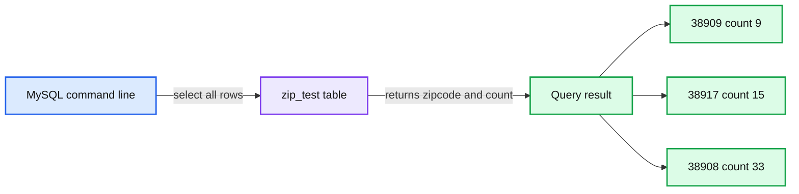

source image: https://www.databricks.com/wp-content/uploads/2017/04/structured-streaming-kafka-blog-image-20-mysql-select-example.png

### Kafka

Similar to writing to databases, the current Structured Streaming API does not support the “kafka” format, but this will be available in the next version. In the meantime, we can create a custom class named *KafkaSink` which extends _ForeachWriter*. Let’s see how that looks:

Now we can use the writer:

**Summary:** Structured Streaming writes updated records to a Kafka topic while the Databricks dashboard monitors input rate, processing rate, and batch duration.

**Components:**

- `streamingSelectDF` Structured Streaming DataFrame
- `KafkaSink` custom ForeachWriter
- Kafka topic `topic2`
- Kafka broker `server:ip`
- Databricks Streaming Dashboard
- Spark Jobs monitor
- Input versus Processing Rate chart
- Batch Duration chart
- Raw Data view

**Flows:**

- `streamingSelectDF -> KafkaSink`: updated records
- `KafkaSink -> Kafka broker`: writes records
- `Kafka broker -> Kafka topic topic2`: publishes records
- `streamingSelectDF -> Streaming Dashboard`: input and processing metrics
- `Streaming Dashboard -> Input versus Processing Rate chart`: rate data
- `Streaming Dashboard -> Batch Duration chart`: duration data

**Numbers:** `topic2`, `server:ip`, `25 seconds`, `1 Spark Job`, `86900ebf-9394-4b99-8d64-11e7c87232b9`, `5 seconds ago`, `0 rec/s`, `4.4 s`, `0 s`, `01:36:25`, `01:37:11`, `01:37:57`, chart values `0, 1, 2, 3, 4, 5, 6, 8, 10, 12`

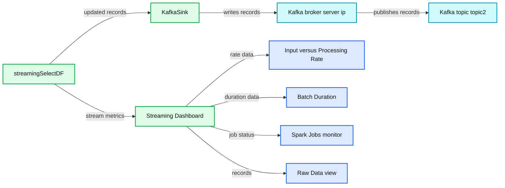

source image: https://www.databricks.com/wp-content/uploads/2017/04/structured-streaming-kafka-blog-image-22-kafka-sink-writer.png

You can now see that we are pumping messages back to Kafka topic ``. In this case we are pushing updated `zipcode:count` at the end of each batch. The other thing to note is that streaming Dashboard provides insights into incoming messages versus processing rate, batch duration and raw data that is used to generate it. This comes in very handy when debugging issues and monitoring system.

On the Kafka consumer side, we can see:

In this case, we are running in “update” output mode. As messages are being consumed, zipcodes that are getting updated during that batch are being pushed back to Kafka. Zipcodes that do not get updated are not being sent. You can also run in “complete” mode, as we did in the database sink above, in which all of the zipcodes with latest count will be sent, even if some of the zipcode counts did not change since the last batch.

## Conclusion

At a high level, I covered Structured Streaming integration with Kafka. Also, I showed how you could use various sinks and sources using the APIs. One thing to note is that what we have gone through here is equally relevant to other streams: sockets, directory, etc. For instance, if you wish to consume a socket source and push processed messages to MySQL, the sample here should be able to do just that simply by changing the stream. Also, examples showing *ForeachWriter* could be used for fanning out writes to multiple downstream systems. I plan to cover deeper insights into fanning out as well as sinks covered here in more detail in subsequent posts.

The example code we used in this blog is available as a [Databricks Notebook](https://docs.databricks.com/_static/notebooks/structured-streaming-etl-kafka.html). You can start experimenting with Structured Streaming today by signing up for a free [Databricks Community Edition](https://www.databricks.com/try-databricks) account. If you have questions, or would like to get started with Databricks, please [contact us](https://www.databricks.com/).

Finally, I encourage you to read our series of blogs on Structured Streaming:

- [Real-time Streaming ETL with Structured Streaming in Apache Spark 2.1](https://www.databricks.com/blog/2017/01/19/real-time-streaming-etl-structured-streaming-apache-spark-2-1.html)
- [Working with Complex Data Formats with Structured Streaming in Apache Spark 2.1](https://www.databricks.com/blog/2017/02/23/working-complex-data-formats-structured-streaming-apache-spark-2-1.html)
