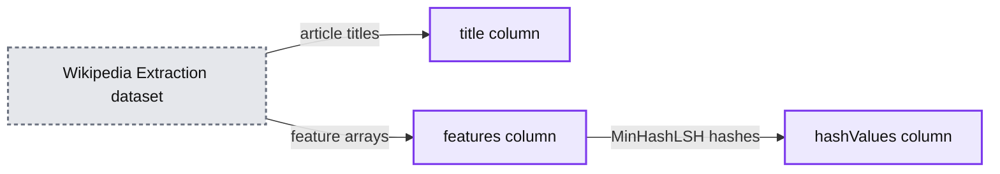
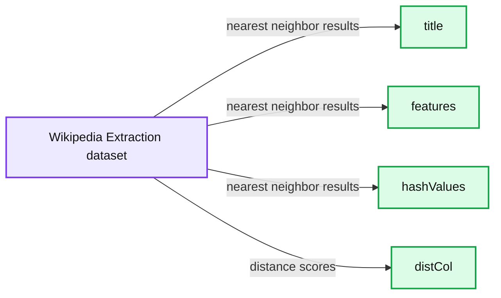
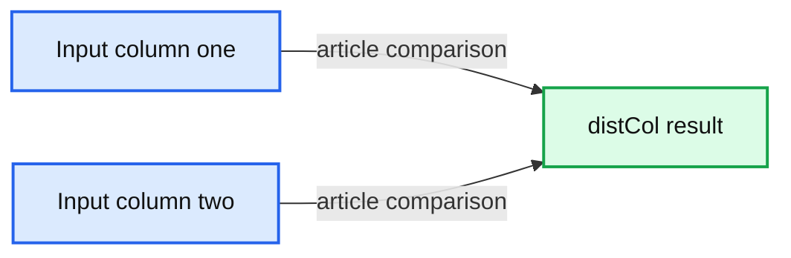
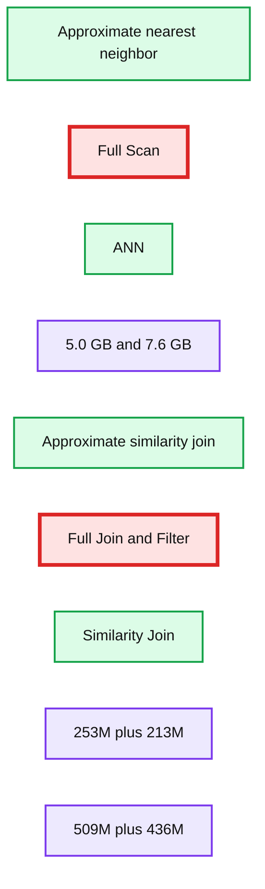

# Detecting Abuse at Scale: Locality Sensitive Hashing at Uber Engineering

- Source: https://www.databricks.com/blog/2017/05/09/detecting-abuse-scale-locality-sensitive-hashing-uber-engineering.html
- Published: 2017-05-09
- Authors: Yun Ni, Kelvin Chu, Joseph Bradley
- Categories: solutions, engineering, data-science-machine-learning
- Images: 6 total, 4 extracted as architecture

*This is a cross blog post effort between Databricks and Uber Engineering. Yun Ni is a software engineer on Uber’s Machine Learning Platform team, Kelvin Chu is technical lead engineer on Uber’s Complex Data Processing/Speak team, and Joseph Bradley is a software engineer on Databricks’ Machine Learning team.*

---

With 5 million Uber trips taken daily by users worldwide, it is important for Uber engineers to ensure that data is accurate. If used correctly, metadata and aggregate data can quickly detect platform abuse, from spam to fake accounts and payment fraud. Amplifying the right data signals makes detection more precise and thus, more reliable.

To address this challenge in our systems and others, Uber Engineering and Databricks worked together to contribute [Locality Sensitive Hashing (LSH)](https://www.mit.edu/~andoni/LSH/) to [Apache Spark 2.1](https://www.databricks.com/blog/2016/12/29/introducing-apache-spark-2-1.html). LSH is a randomized algorithm and hashing technique commonly used in large-scale machine learning tasks including clustering and approximate [nearest neighbor search](https://en.wikipedia.org/wiki/Nearest_neighbor_search).

In this article, we will demonstrate how this powerful tool is used by Uber to detect fraudulent trips at scale.

## Why LSH?

Before Uber Engineering implemented LSH, we used the N^2 approach to sift through trips; while accurate, the N^2 approach was ultimately too time-consuming, volume-intensive, and hardware-reliant for Uber’s size and scale.

The general idea of LSH is to use a family of functions (known as LSH families) to hash data points into buckets so that data points near each other are located in the same buckets with high probability, while data points far from each other are likely in different buckets. This makes it easier to identify trips with various degrees of overlap.

For reference, LSH is a multi-use technology with myriad applications, including:

- **Near-duplicate detection:** LSH is commonly used to deduplicate large quantities of documents, webpages, and other files.
- **Genome-wide association study:** Biologists often use LSH to identify similar gene expressions in genome databases.
- **Large-scale image search:** Google used LSH along with PageRank to build their image search technology [VisualRank](https://research.google/pubs/pub34634/).
- **Audio/video fingerprinting:** In multimedia technologies, LSH is widely used as a fingerprinting technique A/V data.

## LSH at Uber

The primary LSH use case at Uber is detecting similar trips based on their spatial properties, a method of identifying fraudulent drivers. Uber engineers presented on this use case [during Spark Summit 2016](https://www.databricks.com/dataaisummit), where they discussed our team’s motivations behind using LSH on the Spark framework to broadcast join all trips and sift through fraudulent ones. Our motivations for using LSH on Spark are threefold:

1. Spark is integral to Uber’s operations, and many internal teams currently use Spark for various types of complex data processing including machine learning, spatial data processing, time series computation, analytics and prediction, and ad hoc data science exploration. In fact, Uber uses almost all Spark components such as [MLlib](https://spark.apache.org/mllib/), [Spark SQL](https://spark.apache.org/sql/), [Spark Streaming](https://spark.apache.org/streaming/), and direct RDD processing on both [YARN and Mesos](https://www.oreilly.com/content/a-tale-of-two-clusters-mesos-and-yarn/); since our infrastructure and [tools](https://www.databricks.com/dataaisummit) are built around Spark, and our engineers can create and manage Spark applications easily.
2. Spark makes it efficient to do data cleaning and feature engineering before any actual machine learning is conducted, making the number-crunching much faster. Uber’s high volume of collected data makes solving this problem by basic approaches unscalable and very slow.
3. We do not need an exact solution for this equation, so there is no need to purchase and maintain additional hardware. In this case, approximations provide us with enough information to make judgment calls on potentially fraudulent activity and, in this case, are good enough to solve our problems. LSH allows us to trade some precision to save a lot of hardware resources.

For these reasons, solving the problem by deploying LSH on Spark was the right choice for our business goals: scale, scale, and scale again.

At a high level, our approach to using LSH has three steps. First, we create a feature vector for each trip by breaking it down into area segments of equal size. Then, we hash the vectors by [MinHash](https://en.wikipedia.org/wiki/MinHash) for [Jaccard distance](https://en.wikipedia.org/wiki/Jaccard_index) function. Lastly, we either do Similarity Join in batch or [k-Nearest Neighbor](https://en.wikipedia.org/wiki/K-nearest_neighbors_algorithm) search in real-time. **Compared to the basic brute-force approach of detecting fraud, our datasets enabled Spark jobs to finish faster by a full order of magnitude** (from about 55 hours with the N^2 method to 4 hours using LSH).

## API Tutorial

To best demonstrate how LSH works, we will walk through an example of using MinHashLSH on the Wikipedia Extraction (WEX) dataset to find similar articles.

Each LSH family is linked to its metric space. In Spark 2.1, there are two LSH Estimators:

- BucketedRandomProjectionLSH for [Euclidean Distance](https://en.wikipedia.org/wiki/Euclidean_distance)
- MinHashLSH for Jaccard Distance

In this scenario, we will use MinHashLSH since we will work with real-valued feature vectors of word counts.

### Load Raw Data

After setting up our Spark cluster and mounting WEX dataset, we upload a sample of WEX data to [HDFS](https://hadoop.apache.org/docs/r1.0.4/hdfs_design.html#Introduction) based on our cluster size. In the Spark shell, we load the sample data in HDFS

**Figure 1:**

Wikipedia articles are represented as titles and content.

Figure 1 shows the results of our previous code, displaying articles by title and subject matter. We will use the content as our hashing keys and approximately find similar Wikipedia articles in the following experiments.

### Prepare Feature Vectors

MinHash is a very common LSH technique for quickly estimating how similar two sets are to each other. In MinHashLSH implemented in Spark, we represent each set as a binary sparse vector. In this step, we will convert the contents of Wikipedia articles into vectors.

Using the following code for feature engineering, we split the article content into words (Tokenizer), create feature vectors of word counts (CountVectorizer), and remove empty articles:

**Figure 2:**

After feature engineering our code, the contents of Wikipedia articles are converted to binary sparse vectors.

### Fit and Query an LSH Model

In order to use MinHashLSH, we first fit a MinHashLSH model on our featurized data with the below command:

We can make several types of queries with our LSH model, but for the purposes of this tutorial, we first run a feature transformation on the dataset:

This command provides us with the hash values, which can be useful for manual joins and for feature generation.

*MinHashLSH will add a new column to store hashes. Each hash is represented as an array of vectors.*

**Summary:** Console output shows Wikipedia Extraction dataset records with title, feature arrays, and MinHashLSH-generated hash values.

**Components:**

- `title` column: Wikipedia article titles
- `features` column: featurized article data
- `hashValues` column: MinHashLSH hash vectors
- Wikipedia Extraction dataset: source dataset

**Flows:**

- `Wikipedia Extraction dataset -> title`: article titles
- `Wikipedia Extraction dataset -> features`: feature arrays
- `features -> hashValues`: MinHashLSH-generated hashes

**Numbers:** 55108; 0, 1, 2, 3, 4, 5, 6, 17, 39, 56, 601; -2.03376784E9; -2.031299587E9; -1.72896443E9; -2.037396156E9; -2.03584616E9; -1.940295433E9

source image: https://www.databricks.com/wp-content/uploads/2017/05/uber-lsh-fig-3-hash-with-array-of-vectors.png

**Figure 3:**

MinHashLSH will add a new column to store hashes. Each hash is represented as an array of vectors.

Next, we run an approximate nearest neighbor search to find the data point closest to our target. For the sake of demonstration, we search for articles with content approximately matching the phrase *united states*.

*An approximate nearest neighbor search finds Wikipedia articles related to the “united states.”*

**Summary:** Console output displays approximate nearest-neighbor results for Wikipedia articles related to “united states,” with titles, features, hash values, and distance scores.

**Components:**

- Title column
- Features column
- Hash values column
- Distance column
- Wikipedia Extraction dataset

**Flows:**

- none

**Numbers:** 179144; 0; 1; 3; 7; 9; 10; 55; 68; 76; 92; 32399; 37855; 49107; 55580; 58966; 59866; 61999; 7202; 73373; 0.75; 0.8; 0.9

source image: https://www.databricks.com/wp-content/uploads/2017/05/uber-lsh-fig-4-nearest-neighbor-search.png

**Figure 4:**

An approximate nearest neighbor search finds Wikipedia articles related to the “united states.”

Finally, we run an approximate similarity join to find similar pairs of articles within the same dataset:

While we use a self join, below, we could also join different datasets to get the same results.

*An approximate similarity join lists similar Wikipedia articles, setting the number of hash tables.*

**Summary:** Console output shows an approximate similarity join comparing two article inputs and reporting their distance or similarity column.

**Components:**

- Input column one
- Input column two
- distCol result column

**Flows:**

- Input column one -> distCol: article comparison
- Input column two -> distCol: article comparison

**Numbers:** 55108, 9, 0.625, 0.7121951219512195, 0.7262756318550351, 0.7265429001505268, 0.7282964039229931, 0.7301504992942917, 0.7383333333333333, 0.7393130434782608, 0.7396584440227705, 0.7441471571900635, 0.7503820682628063, 0.7511389252164009, 0.7541753635344467, 0.7551742919389979, 0.7555373965456468, 0.7565172054223149, 0.7573627844712182, 0.7575327343585086, 0.7583059510770354, 0.7588447653429603

source image: https://www.databricks.com/wp-content/uploads/2017/05/uber-lsh-fig-5-similarity-join-lists.png

**Figure 5:**

An approximate similarity join lists similar Wikipedia articles, setting the number of hash tables.

Figure 5 demonstrates how to set the number of [hash tables](https://en.wikipedia.org/wiki/Hash_table). For an approximate similarity join and the approximate nearest neighbor command, the number of hash tables can be used to trade off between running time and false positive rate ([OR-amplification](https://en.wikipedia.org/wiki/Locality-sensitive_hashing)). Increasing the number of hash tables will increase the accuracy (a positive), but also the program’s communication cost and running time. By default, the number of hash tables is set to one.

To gain additional practice using LSH in Spark 2.1, you can also run smaller examples in the Spark distribution for [BucketRandomProjectionLSH](https://github.com/apache/spark/blob/8a51cfdcad5f8397558ed2e245eb03650f37ce66/examples/src/main/scala/org/apache/spark/examples/ml/BucketedRandomProjectionLSHExample.scala) and [MinHashLSH](https://github.com/apache/spark/blob/8a51cfdcad5f8397558ed2e245eb03650f37ce66/examples/src/main/scala/org/apache/spark/examples/ml/MinHashLSHExample.scala).

## Performance Tests

In order to gauge performance, we benchmarked our implementations of MinHashLSH on the WEX dataset. Using an AWS cloud, we used 16 executors (m3.xlarge instances) to perform an approximate nearest neighbor search and approximate similarity join on a sample of WEX datasets.

*With numHashTables=5, approximate nearest neighbor ran 2x faster than full scan (as shown on right). With numHashTables=3, approximate similarity join ran 3x-5x faster than full join and filter (as shown on left).*

**Summary:** Benchmark charts compare approximate nearest neighbor and similarity join runtimes with full-scan alternatives.

**Components:**

- Approximate nearest neighbor benchmark
- Full Scan
- ANN
- Approximate similarity join benchmark
- Full Join and Filter
- Similarity Join
- Input data size labels

**Flows:**

- none

**Numbers:**

- 5.0 GB
- 7.6 GB
- 253M + 213M
- 509M + 436M
- Running time scales: 0, 2.5, 5, 7.5, 10 seconds
- Running time scales: 0, 25, 50, 75, 100 minutes
- Approximate nearest neighbor values: approximately 5.1, 9.5 seconds for Full Scan; approximately 2.4, 3.8 seconds for ANN
- Approximate similarity join values: approximately 15, 90 minutes for Full Join and Filter; approximately 4, 27 minutes for Similarity Join

source image: https://www.databricks.com/wp-content/uploads/2017/05/uber-lsh-fig-6-performance-test-results.jpg

**Figure 6:**

With numHashTables=5, approximate nearest neighbor ran 2x faster than full scan (as shown on right). With numHashTables=3, approximate similarity join ran 3x-5x faster than full join and filter (as shown on left).

In the tables above, we can see that approximate nearest neighbor ran 2x faster than full scan with the number of hash tables set to five, while approximate similarity join ran 3x-5x faster depending on the number of output rows and hash tables.

Our experiment also shows that despite their short run time, the algorithms achieved high accuracy compared to the results of brute-force methods as ground truth. Meanwhile, approximate nearest neighbor search achieved 85% accuracy for the 40 returned rows, while our approximate similarity join successfully found 93% of the nearby row pairs. This speed-accuracy trade-off has made LSH a powerful tool in detecting fraudulent trips from terabytes of data every day.

## Next Steps

While our LSH model has helped Uber identify fraudulent driver activity, our work is far from complete. During our initial implementation of LSH, we planned a number of features to deploy in future releases. The high priority features include:

1. [SPARK-18450](https://issues.apache.org/jira/browse/SPARK-18450): Besides specifying the number of hash tables needed to complete the search, this new feature users to define the number of hash functions in each hash table. This change will also provide full support for AND/OR-compound amplification.
2. [SPARK-18082](https://issues.apache.org/jira/browse/SPARK-18082) & [SPARK-18083](https://issues.apache.org/jira/browse/SPARK-18083): There are other LSH families we want to implement. These two updates will enable bit sampling for the Hamming distance between two data points and signs of random projection for cosine distance that are commonly used in machine learning tasks.
3. [SPARK-18454](https://issues.apache.org/jira/browse/SPARK-18454): A third feature will improve the API of the approximate nearest neighbor search. This new search, a multi-probe similarity search can improve the search quality without the requirement for a large number of hash tables.

We welcome your feedback as we continue to develop and scale our project to incorporate the above features—and many others.
