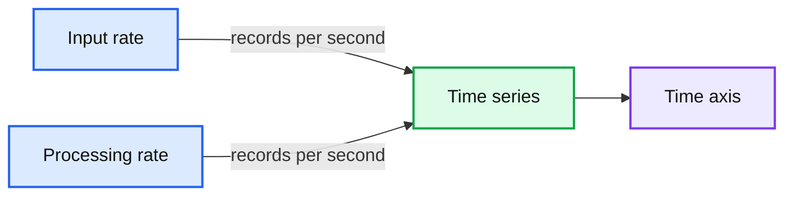
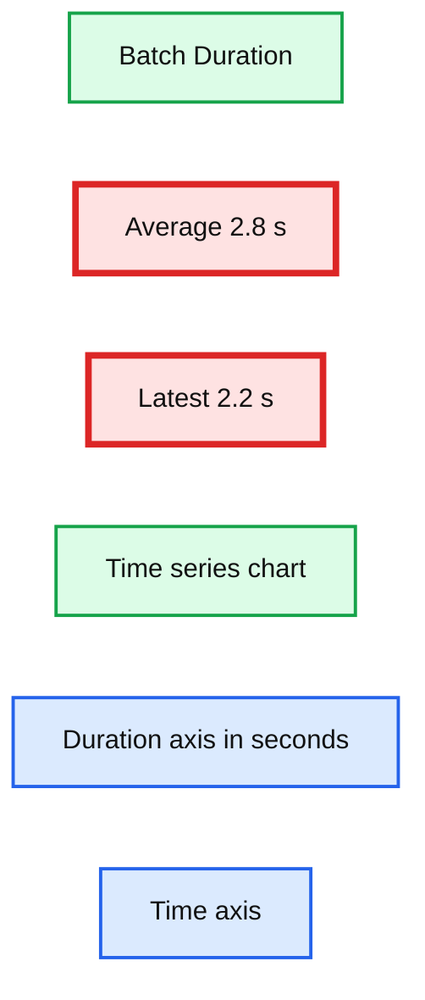

# Taking Apache Spark’s Structured Streaming to Production

- Source: https://www.databricks.com/blog/2017/05/18/taking-apache-sparks-structured-structured-streaming-to-production.html
- Published: 2017-05-18
- Authors: Bill Chambers, Michael Lumb
- Categories: engineering, open-source, data-engineering, data-streaming
- Images: 6 total, 2 extracted as architecture

*Free Edition has replaced Community Edition, offering enhanced features at no cost. Start using *[*Free Edition *](https://login.databricks.com/?intent=SIGN_UP&amp;signup_experience_step=EXPRESS&amp;provider=DB_FREE_TIER&amp;dbx_source=www)*today.*
 

*This is the fifth post in a *[*multi-part series*](https://www.databricks.com/blog/2017/01/19/real-time-streaming-etl-structured-streaming-apache-spark-2-1.html)* about how you can perform complex *[*streaming analytics*](https://www.databricks.com/glossary/streaming-analytics)* using Apache Spark.*

---

At Databricks, we’ve migrated our production pipelines to Structured Streaming over the past several months and wanted to share our out-of-the-box deployment model to allow our customers to rapidly build production pipelines in Databricks.

A production application requires monitoring, alerting, and an automatic (cloud native) approach to failure recovery. This post will not just walk you through the APIs available for tackling these challenges but will also show you how Databricks makes running Structured Streaming in production simple.

## Metrics and Monitoring

[Structured Streaming in Apache Spark](https://www.databricks.com/blog/2016/07/28/structured-streaming-in-apache-spark.html) provides a simple programmatic API to get information about a stream that is currently executing. There are two key commands that you can run on a currently active stream in order to get relevant information about the query execution in progress: a command to get the current *status* of the query and a command to get *recentProgress* of the query.

### Status

The first question you might ask is, "what processing is my stream performing right now?" The status maintains information about the current state of the stream, and is accessible through the object that was returned when you started the query. For example, you might have a simple counts stream that provides counts of IOT devices defined by the following query.

Running `query.status` will return the current status of the stream. This gives us details about what is happening at that point in time in the stream.

Databricks notebooks give you a simple way to see that status of any streaming query. Simply hover over the

 icon available in a streaming query. You’ll get the same information, making it much more convenient to quickly understand the state of your stream.

### Recent Progress

While the query status is certainly important, equally important is an ability to view query’s historical progress. Progress metadata will allow us to answer questions like "At what rate am I processing tuples?" or "How fast are tuples arriving from the source?"

By running `stream.recentProgress` you’ll get access to some more time-based information like the processing rate and batch durations. However, a picture is worth a thousand JSON blobs, so at Databricks, we created visualizations in order to facilitate rapid analysis of the recent progress of the stream.

Let’s explore why we chose to display these metrics and why they’re important for you to understand.

#### Input Rate and Processing Rate

The input rate specifies how much data is flowing into Structured Streaming from a system like Kafka or Kinesis. The processing rate is how quickly we were able to analyze that data. In the ideal case, these should vary consistently together; however, they will vary according to how much input data exists when processing starts. If the input rate far outpaces the processing rate, our streams will fall behind, and we will have to scale the cluster up to a larger size to handle the greater load.

**Summary:** The chart compares input and data processing rates over time for a Structured Streaming workload.

**Components:**

- Input rate, measured in records per second
- Processing rate, measured in records per second
- Time axis
- Rate axis

**Flows:**

- Input rate -> Time series: records arriving over time
- Processing rate -> Time series: records processed over time

**Numbers:** 12.9k rec/s, 14.4k rec/s, 15k, 10k, 5k, 0, 12:40:00, 12:40:30, 12:40:45

source image: https://www.databricks.com/wp-content/uploads/2017/05/input-vs-processing-rate-dashboard.png

#### Batch Duration

Nearly all streaming systems utilize batching to operate at any reasonable throughput (some have an option of high latency in exchange for lower throughput). Structured Streaming achieves both. As it operates on the data, you will likely see this oscillate as Structured Streaming processes varying numbers of events over time. On this single core cluster on Community Edition, we can see that our batch duration is oscillating consistently around three seconds. Larger clusters will naturally have much faster processing rates as well as much shorter batch durations.

**Summary:** Batch Duration dashboard showing streaming batch processing time over time, with average and latest values.

**Components:**

- Batch Duration metric
- Average value
- Latest value
- Time series chart
- Time axis
- Duration axis in seconds

**Flows:**

- none

**Numbers:** 2.8 s, 2.2 s, 0, 0.5, 1, 1.5, 2, 2.5, 3, 3.5, 07:58:30, 07:58:45, 07:59

source image: https://www.databricks.com/wp-content/uploads/2017/05/batch-duration-dashboard.png

## Production Alerting on Streaming Jobs

Metrics and Monitoring are all well and good, but in order to react quickly to any issues that arise without having to babysit your streaming jobs all day, you’re going to need a robust alerting story. Databricks makes alerting easy by allowing you to run your Streaming jobs as production pipelines.

For instance, let’s define a Databricks jobs with the following specifications:

Notice how we [set an email address to trigger an alert in PagerDuty](https://www.pagerduty.com/docs/guides/email-integration-guide/). This will trigger a product alert (or to the level that you specify) when the job fails.

## Automated Failure Recovery

While alerting is convenient, having to force a human to respond to an outage is inconvenient at best and impossible at worst. In order to truly productionize Structured Streaming, you’re going to want to be able to recover automatically to failures as quickly as you can, while ensuring data consistency and no data loss. Databricks makes this seamless: simply set the number of retries before a *unrecoverable failure* and Databricks will try to recover the streaming job automatically for you. On each failure, you can trigger a notification as a production outage.

You get the best of both worlds. The system will attempt to self-heal while keeping employees and developers informed of the status.

## Updating Your Application

There are two circumstances that you need to reason about when you are updating your streaming application. For the most part, if you’re not changing significant business logic (like the output schema) you can simply restart the streaming job using the same checkpoint directory. The new updated streaming application will pick up where it left off and continue functioning.

However, if you’re changing stateful operations (like aggregations or the output schema), the update is a bit more involved. You’ll have to start an entirely new stream with a new checkpoint directory. Luckily, it’s easy to start up another stream in Databricks in order to run both in parallel while you transition to the new stream.

## Advanced Alerting and Monitoring

There are several other advanced monitoring techniques that Databricks supports as well. For example, you can output notifications using a system like [Datadog](https://www.datadoghq.com/), [Apache Kafka](https://kafka.apache.org/), or [Coda Hale Metrics](https://github.com/dropwizard/metrics). These advanced techniques can be used to implement external monitoring and alerting systems.

Below is an example of how you can create a StreamingQueryListener that will forward all query progress information to Kafka.

## Conclusion

In this post, we showed how simple it is to take Structured Streaming from prototype to production using Databricks. To read more about other aspects of Structured Streaming, read our series of blogs:

- [Structured Streaming In Apache Spark](https://www.databricks.com/blog/2016/07/28/structured-streaming-in-apache-spark.html)
- [Real-time Streaming ETL with Structured Streaming in Apache Spark 2.1](https://www.databricks.com/blog/2017/01/19/real-time-streaming-etl-structured-streaming-apache-spark-2-1.html)
- [Working with Complex Data Formats with Structured Streaming in Apache Spark 2.1](https://www.databricks.com/blog/2017/02/23/working-complex-data-formats-structured-streaming-apache-spark-2-1.html)
- [Processing Data in Apache Kafka with Structured Streaming in Apache Spark 2.2](https://www.databricks.com/blog/2017/04/26/processing-data-in-apache-kafka-with-structured-streaming-in-apache-spark-2-2.html)
- [Event-time Aggregation and Watermarking in Apache Spark’s Structured Streaming](https://www.databricks.com/blog/2017/05/08/event-time-aggregation-watermarking-apache-sparks-structured-streaming.html)

You can learn more about using streaming from the [Databricks Documentation](https://docs.databricks.com/spark/latest/structured-streaming/index.html) or sign up to [start a free trial today](https://www.databricks.com/try-databricks).
