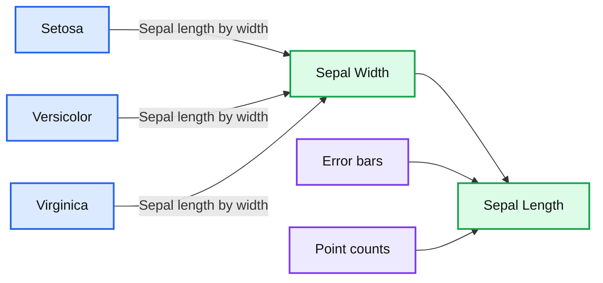

# Using sparklyr in Databricks

- Source: https://www.databricks.com/blog/2017/05/25/using-sparklyr-databricks.html
- Published: 2017-05-25
- Authors: Hossein Falaki
- Categories: solutions, engineering, open-source
- Images: 2 total, 1 extracted as architecture

*Free Edition has replaced Community Edition, offering enhanced features at no cost. Start using *[*Free Edition *](https://login.databricks.com/?intent=SIGN_UP&amp;signup_experience_step=EXPRESS&amp;provider=DB_FREE_TIER&amp;dbx_source=www)*today.*
 

[Try this notebook on Databricks with all instructions as explained in this post notebook](https://docs.databricks.com/_static/notebooks/sparklyr.html?utm_campaign=Engineering%20Blog&utm_source=refferral&utm_medium=DB%20Blog)

In September 2016, RStudio announced [sparklyr](https://spark.rstudio.com/), a new [R interface to Apache Spark](https://www.rstudio.com/blog/sparklyr-r-interface-for-apache-spark/). sparklyr’s interface to Spark follows the popular dplyr syntax. At Databricks, we provide the best place to run Apache Spark and all applications and packages powered by it, from all the languages that Spark supports. sparklyr’s addition to the Spark ecosystem not only complements [SparkR](https://spark.apache.org/docs/latest/sparkr.html) but also extends Spark’s reach to new users and communities.

Today, we are happy to announce that [sparklyr](https://www.databricks.com/glossary/sparklyr) can be seamlessly used in Databricks clusters running Apache Spark 2.2 or higher with Scala 2.11. In this blog post, we show how you can install and configure sparklyr in Databricks. We also introduce some of the latest improvements in Databricks R Notebooks.

## Clean R Namespace

When we [released R notebooks](https://www.databricks.com/blog/2015/07/13/introducing-r-notebooks-in-databricks.html) in 2015, we integrated SparkR into the notebook: the [SparkR](https://www.databricks.com/blog/2016/12/28/10-things-i-wish-i-knew-before-using-apache-sparkr.html) package was imported by default in the namespace, and both Spark and SQL Context objects were initialized and configured. Thousands of users have been running R and Spark code in R notebooks. We learned that some of them use our notebooks as a convenient way for single node R data analysis. For these users, the pre-loaded [SparkR](https://www.databricks.com/glossary/what-is-sparkr) functions masked several functions from other popular packages, most notably dplyr.

To improve the experience of users who wish to use R notebooks for single node analysis and the new sparklyr users starting with Spark 2.2, we are not importing SparkR by default any more. Users who are interested in single-node R data science can launch single node clusters with large instances and comfortably run their existing single-node R analysis in a clean R namespace.

For users who wish to use SparkR, the *SparkSession* object is still initialized and ready to be used right after they import SparkR.

## sparklyr in Databricks

We collaborated with our friends at RStudio to enable sparklyr to seamlessly work in Databricks clusters. Starting with sparklyr version 0.5.5, there is a new connection method in sparklyr: `databricks`. When calling `spark_connect(method = "databricks")` in a Databricks R Notebook, sparklyr will connect to the spark cluster of that notebook. As this cluster is fully managed, you do not need to specify any other information such as version, SPARK_HOME, etc.

## Installing sparklyr

You can install sparklyr easily from CRAN:

## Configuring sparklyr connection

Configuring the sparklyr connection in Databricks cannot be simpler.

## Using sparklyr API

After setting up the sparklyr connection, you can use all sparklyr APIs. You can import and combine sparklyr with [dplyr](https://spark.rstudio.com/dplyr/) or MLlib. You can also use sparklyr extensions. Note that if the extension packages include third-party JARs, you may need to install those JARs as [libraries](https://docs.databricks.com/libraries/index.html) in your workspace.

**Summary:** The chart compares sepal length by sepal width for the setosa, versicolor, and virginica iris species, including error bars and point counts.

**Components:**

- Setosa series, shown in salmon
- Versicolor series, shown in green
- Virginica series, shown in blue
- Sepal Width horizontal axis
- Sepal_Length vertical axis
- Error bars
- Point count labels

**Flows:**

- none

**Numbers:**

- Sepal Width: 2, 2.5, 3, 3.5, 4, 4.5
- Sepal_Length: 5, 6, 7, 8
- Setosa counts: 1, 16, 23, 9, 1
- Versicolor counts: 3, 18, 27, 2
- Virginica counts: 1, 10, 31, 6, 2

source image: https://www.databricks.com/wp-content/uploads/2017/05/image2.png

## Using SparkR and sparklyr Together

We find SparkR and sparklyr complementary. You can use the packages next to each other in a single notebook or job. To do so you can import SparkR along with sparklyr in Databricks notebooks. The SparkR connection is pre-configured in the notebook, and after importing the package, you can start using SparkR API. Also, remember that some of the functions in SparkR mask a number of functions in dplyr.

If you import SparkR after you imported dplyr, you can reference the functions in dplyr by using the fully qualified names, for example, `dplyr::arrange()`. Similarly, if you import dplyr after SparkR the functions in SparkR are masked by dplyr.

Alternatively, you can selectively detach one of the two packages if you do not need it.

## Conclusion

We are continuously improving Databricks R Notebooks to keep them as the best place to perform reproducible R data analysis, whether it is on distributed data with Apache Spark or single-node computation using packages from existing rich R ecosystem.

As we demonstrated with a few easy steps, you can now seamlessly use sparklyr on Databricks. You can try it out in our [Community Edition](https://www.databricks.com/try-databricks) with [Databricks Runtime Beta 3.0](https://www.databricks.com/blog/2017/05/24/databricks-runtime-3-0-beta-delivers-enterprise-grade-apache-spark.html) that includes the latest release candidate build of Apache Spark 2.2.
