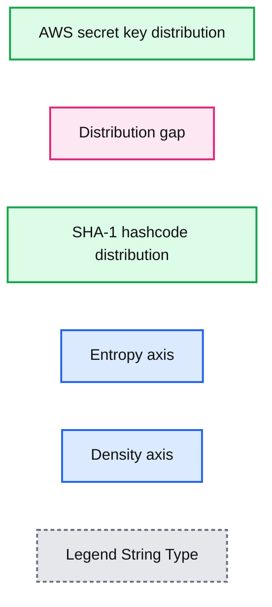

# Entropy-based Log Redaction for Apache Spark on Databricks

- Source: https://www.databricks.com/blog/2017/05/30/entropy-based-log-redaction-apache-spark-databricks.html
- Published: 2017-05-30
- Authors: Weiluo Ren, Yu Peng
- Categories: engineering, product, platform, open-source
- Images: 1 total, 1 extracted as architecture

*This blog post is part of our series of internal engineering blogs on Databricks platform, infrastructure management, tooling, monitoring, and provisioning.*

We love logs at Databricks. And we want to provide users the best experience to access Apache Spark logs. On Databricks, Spark logs are available via built-in Spark UI for clusters. Databricks also supports [delivering cluster logs to customers’ chosen destination](https://docs.databricks.com/clusters/clusters-manage.html).

While we care about the ease of accessing Spark logs, we pay more attention to data security issues that appear in logging. In this blog post, we discuss a specific data security topic on Spark logs: redacting credentials in logs.

## Credentials in Apache Spark Logs

Spark can load data from various data sources, where users may need to provide credentials for accessing data. For instance, a Spark job may read a dataset from S3 using AWS access and secret access keys:

 Anyone who obtained a copy of the keys would have the same access to the corresponding AWS resources. Unfortunately, the S3 URI that contains the credentials may appear in Spark logs in plain text form:

 This could lead to serious data security issues if logs do not receive the same level of protection as credentials. And it is hard for users to control or watch what content are logged by Spark and third-party packages.

To enhance data security, Databricks redacts credentials from Spark logs at logging time, before log messages are written to the disk. For example, the above log message would appear in redacted form on Databricks:

 In the following sections, we’ll discuss how we attempt to properly identify credentials and redact them at logging time. Although we’ll use AWS keys as examples for this blog post, Databricks also redacts other types of credentials.

## Identifying AWS Credentials

Before each message gets logged, Databricks scans the whole string to identify any possible credential and redacts them. Because redaction is done at logging time, we cannot afford an overly sophisticated redaction procedure that may hurt the performance. With complexity constraints in mind, log redaction at Databricks is developed based on regular expressions (regexes).

AWS access keys consist of 20-character upper case alphanumeric strings starting with “AKIA,” which can be captured by the following regex:

 For secret keys, there is no explicit pattern except that they are 40-character base64 strings. AWS provided a regex for access keys in the blog, [A Safer Way to Distribute AWS Credentials to EC2](https://aws.amazon.com/cn/blogs/security/a-safer-way-to-distribute-aws-credentials-to-ec2/), which is a good start:

 However, we found this regex insufficient to capture all secret keys. Some secret keys contains special characters such as the forward slash “/”, which needs to be URL-encoded (e.g., “/” encoded as “%2F”) to appear in a file path. Therefore, to identify secret keys in Spark logs, we also need to take into account the URL encoding on special characters. Moreover, both users and Spark may escape special characters in the URI, so in some cases special characters may be encoded twice. For instance, instead of “%2F”, “/” may be encoded and logged as “%252F”. We improved the regular expression accordingly as follows, which matches the secret keys not only in code but also in logs:

`(? ## False Positives and Entropy Thresholding One issue of using the regular expression above is that it is not specific enough for secret keys, which could cause a number of false positives when applying to all Spark logs. For instance, it could also match hashcodes, paths or even class names that happen to be 40 characters long. To reduce the false positive rate without missing real secret keys, more checks are needed after regular expression matching. One difference between secret keys and informative false positives is that the secret keys are randomly generated. One way to differentiate secret keys from those false positives is to measure how random they are. Following this idea, we use entropy to determine how likely a matched string is indeed a secret key that was randomly generated. > In information theory, entropy, or Shannon entropy, is the expected value of the information contained in each message ([Wiki page](https://en.wikipedia.org/wiki/Entropy_(information_theory))). This concept can be applied to strings to measure how random they are. We expect randomly generated strings to have higher entropy than meaningful words with the same length.`

After calculating entropy, we set a threshold to decide whether to redact a given string. The threshold is based on the empirical distribution of AWS secret keys and those of known false positive types. One type of false positives is the SHA-1 hashcode, which is 40 characters long and randomly generated. However, the SHA-1 hashcode only consists of hexadecimal digits. Roughly speaking, with the same length, the more distinct characters a string have, the higher its entropy would be. Therefore, the entropy of SHA-1 hashcodes would usually be smaller than that of AWS secret keys, which are generated from base64 character set. By comparing the empirical distribution of entropy of two datasets consisting of AWS secret keys and SHA-1 hashcodes respectively (see figure below), it turns out that there’s a clear gap between those two distributions and we can choose a threshold accordingly.

**Summary:** The chart compares entropy distributions for AWS secret keys and SHA-1 hashcodes, showing a clear separation between them.

**Components:**

- AWS secret key distribution
- SHA-1 hashcode distribution
- Entropy axis
- Density axis
- Distribution gap

**Flows:**

- none

**Numbers:** 0, 1, 2, 3, 3.5, 4.0, 4.5, 5.0, and the 1 in SHA-1. No units or percentages.

source image: https://www.databricks.com/wp-content/uploads/2017/05/image1-2.png

## Logging-time Redaction with log4j

Logs generated by Apache Spark jobs at Databricks are mostly handled by the logging service log4j. Databricks customizes [log4j appenders](https://logging.apache.org/log4j/1.2/apidocs/org/apache/log4j/Appender.html), for example, console appender and rolling file appender to redact log strings before they arrive at the disk. Note that the redaction is applied to not only normal messages, but also stack traces when exceptions are thrown.

One interesting lesson learned is that since logging is so pervasive at Databricks, we need to minimize the dependency of customized appenders. Otherwise there could be a circle dependency issue.

## Using IAM Roles Instead of Keys

In this blog post, we shared our experience on redacting credentials at logging time. On Databricks this security feature is turned on automatically1. Outside of Databricks, users can implement the methods mentioned to improve data security in Spark logs.

However, rather than doing redaction at logging time, the best security practice is to simply not use credentials in the first place. Databricks encourages users to [use IAM roles to access AWS resources](https://docs.databricks.com/administration-guide/cloud-configurations/aws/instance-profiles.html). Users can launch Databricks clusters with IAM roles that grant the workers the corresponding permissions. With IAM-enabled clusters, users no longer need to embed their AWS keys in notebooks to access data, and hence keys won’t appear in logs.

Similarly, in Databricks File System (DBFS), users can mount their S3 bucket with IAM roles. Users can create clusters with corresponding IAM roles to access data directly without keys.

---

1.  see [https://docs.databricks.com/security/keys/redaction.html](https://docs.databricks.com/security/keys/redaction.html) for details ↩
