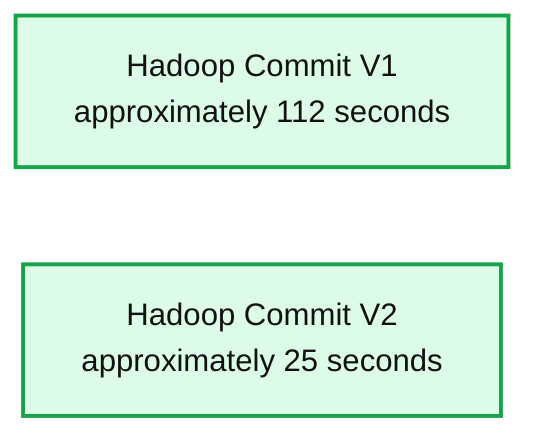
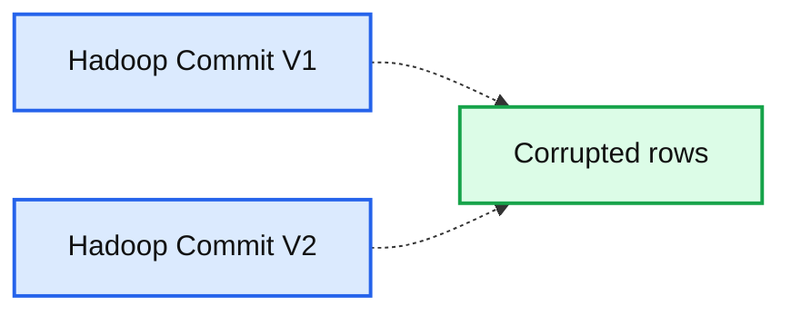
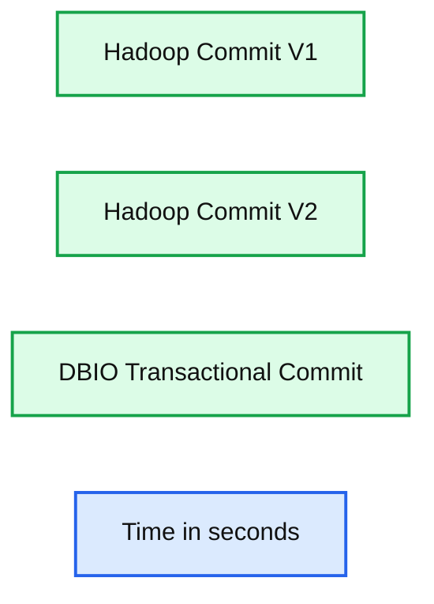

# Transactional Writes to Cloud Storage on Databricks

- Source: https://www.databricks.com/blog/2017/05/31/transactional-writes-cloud-storage.html
- Published: 2017-05-31
- Authors: Eric Liang, Srinath Shankar, Bill Chambers
- Categories: platform, engineering
- Images: 3 total, 3 extracted as architecture

*Free Edition has replaced Community Edition, offering enhanced features at no cost. Start using *[*Free Edition *](https://login.databricks.com/?intent=SIGN_UP&amp;signup_experience_step=EXPRESS&amp;provider=DB_FREE_TIER&amp;dbx_source=www)*today.*
 

In another [blog post published today](https://www.databricks.com/blog/2017/05/31/top-5-reasons-for-choosing-s3-over-hdfs.html), we showed the top five reasons for choosing S3 over HDFS. With the dominance of simple and effective cloud storage systems such as Amazon S3, the assumptions of on-premise systems like Apache Hadoop are becoming, sometimes painfully, clear. Apache Spark users require both fast and transactionally correct writes to cloud storage systems. This blog post will introduce how Databricks allows customers to achieve both by comparing the performance and by correctness pitfalls of current Hadoop commit protocols with Databricks' I/O (DBIO) transactional commit protocol.

## Why Does Spark Need Transactional Writes?

Large-scale data processing frameworks like Apache Spark implement fault-tolerance by breaking up the work required to execute a job into retriable *tasks*. Since tasks may occasionally fail, Spark must ensure that only the outputs of successful tasks and jobs are made visible. Formally, this is achieved using a *commit protocol*, which specifies how results should be written at the end of a job.

The *job commit* phase of a Spark job ensures that only the output of successful jobs are visible to readers. In our experience, job commit is a large source of performance and correctness issues when Spark is used in a cloud-native setting, for instance, writing directly to storage services like S3.

To better understand why job commit is necessary, let’s compare two different failure scenarios if Spark were to not use a commit protocol.

1. If a task fails, it could leave partially written data on S3 (or other storage). The Spark scheduler will re-attempt the task, which could result in duplicated output data.
2. If an entire job fails, it could leave partial results from individual tasks on S3.

Either of these scenarios can be extremely detrimental to a business. To avoid these data corruption scenarios, Spark relies on commit protocol classes from Hadoop that first stage task output into temporary locations, only moving the data to its final location upon task or job completion. As we will show, these Hadoop protocols were not designed for the cloud-native setting and force the user to choose between performance and correctness.

## Comparing Existing Commit Protocols

Before introducing Databricks I/O (DBIO) transactional commit, let’s first evaluate the existing Hadoop commit protocols. Commit protocols can be evaluated on two dimensions:

- **Performance** - how fast is the protocol at committing files? Naturally, you want your jobs to run as quickly as possible.
- **Transactionality** - Can a job complete with only partial or corrupt results? Ideally, job output should be made visible **transactionally** (i.e., all or nothing). If the job fails, readers should not observe corrupt or partial outputs.

### Performance Test

Spark ships with two default Hadoop commit algorithms — version 1, which moves staged task output files to their final locations at the end of the job, and version 2, which moves files as individual job tasks complete. Let's compare their performance. We use a Spark 2.1 cluster on [Databricks Community Edition](https://www.databricks.com/try-databricks) for these [test runs](https://docs.databricks.com/_static/notebooks/dbio-transactional-commit.html):

**Summary:** Benchmark comparing Hadoop Commit V1 and Hadoop Commit V2 execution times.

**Components:**

- Hadoop Commit V1 using the Hadoop commit protocol
- Hadoop Commit V2 using the Hadoop commit protocol
- Time axis measured in seconds

**Flows:**

- none

**Numbers:** 0, 20, 40, 60, 80, 100, 120 seconds; Hadoop Commit V1 approximately 112 seconds; Hadoop Commit V2 approximately 25 seconds

source image: https://www.databricks.com/wp-content/uploads/2017/05/hadoop-commit-1-vs-2-performance-test-results.png

Because it starts moving files in parallel as soon as tasks complete, the v2 Hadoop commit protocol is almost five times faster than v1. This is why in the [latest Hadoop release](https://issues.apache.org/jira/browse/MAPREDUCE-6336), v2 is the default commit protocol.

### Transactionality Test

Now let's look at transactionality. We evaluate this by simulating a job failure caused by a persistently failing task, which occurs commonly in practice, for example, this might occur if there are bad records in a particular file that cannot be parsed. This can be done as follows:

**Summary:** Benchmark comparing corrupted rows produced by Hadoop Commit V1 and Hadoop Commit V2.

**Components:**

- Hadoop Commit V1
- Hadoop Commit V2
- Corrupted rows measurement

**Flows:**

- None visible.

**Numbers:** 0, 2,000, 4,000, 6,000, 8,000; Hadoop Commit V2 bar is approximately 8,500 corrupted rows.

source image: https://www.databricks.com/wp-content/uploads/2017/05/hadoop-commit-1-vs-2-transactionality-test-results.png

We see empirically that **while v2 is faster, it also leaves behind partial results on job failures**, breaking transactionality requirements. In practice, this means that with chained ETL jobs, a job failure — even if retried successfully — could duplicate some of the input data for downstream jobs. This requires careful management when using chained ETL jobs.

## No Compromises with DBIO Transactional Commit

> Note: This feature is available starting in Databricks (Spark 2.1-db4)

All Hadoop users face this performance-reliability tradeoff for their jobs when writing to cloud storage, whether they are using Spark or not. Although v1 is more transactional, it’s extremely slow because moving files in S3 is expensive. This tradeoff is not fundamental, however, and so at Databricks, we built a new transactional commit protocol for DBIO that coordinates with a highly available service in Databricks. The basic idea is as follows:

When a user writes a file in a job, DBIO will perform the following actions for you.

- Tag files written with the unique transaction id.
- Write files directly to their final location.
- Mark the transaction as committed when the jobs commits.

When a user goes to read the files, DBIO will perform the following actions for you.

- Check to see if it has a transaction id as well as a status and either ignore files if the transaction has not completed or read in your data.

This simple idea greatly improves performance *without* trading off reliability. We run the same performance test from above and compare with the default Hadoop commit algorithms:

**Summary:** Benchmark chart comparing commit times for Hadoop Commit V1, Hadoop Commit V2, and DBIO Transactional Commit.

**Components:**

- Hadoop Commit V1
- Hadoop Commit V2
- DBIO Transactional Commit
- Time axis in seconds

**Flows:**

- None

**Numbers:** 0, 20, 40, 60, 80, 100, 120 seconds

source image: https://www.databricks.com/wp-content/uploads/2017/05/dbio-transactional-commit-comparison-results.png

In this performance test, Spark running on Databricks will beat both Hadoop versions of commit protocols. In fact, this comparison holds true across all types of ETL workloads. We also perform a theoretical correctness analysis of each protocol: does the protocol guarantee correct output in the presence of different types of failures?

|  | No commit protocol | Hadoop Commit V1 | Hadoop Commit V2 | DBIO Transactional Commit |
|---|---|---|---|---|
| Task failure | No | [db_icon name="checkmark"]Yes | [db_icon name="checkmark"]Yes | [db_icon name="checkmark"]Yes |
| Job failure (e.g. persistent task failure) | No | [db_icon name="checkmark"]Yes | No | [db_icon name="checkmark"]Yes |
| Driver failure during commit | No | No | No | [db_icon name="checkmark"]Yes |

As the table shows, Databricks’ new transactional commit protocol provides strong guarantees in the face of different types of failures. Moreover, by enforcing correctness, this brings several additional benefits to Spark users.

**Safe task speculation** - Task speculation allows for Spark to speculatively launch tasks when certain tasks are observed to be executing unusually slowly. With current Hadoop commit protocols, Spark task speculation is not safe to enable when writing to S3 due to the possibility of file collisions. With transactional commit, you can safely enable task speculation with `"spark.speculation true"` in the cluster Spark config. Speculation reduces the impact of straggler tasks on job completion, [greatly improving performance](https://www.usenix.org/legacy/events/osdi08/tech/full_papers/zaharia/zaharia_html/) in some cases.

**Atomic file overwrite** - It is sometimes useful to atomically overwrite a set of existing files. Today, Spark implements overwrite by first deleting the dataset, then executing the job producing the new data. This interrupts all current readers and is not fault-tolerant. With transactional commit, it is possible to "logically delete" files atomically by marking them as deleted at commit time. Atomic overwrite can be toggled by setting `"spark.databricks.io.directoryCommit.enableLogicalDelete true|false"`. This improves user experience across those that are accessing the same datasets at the same time.

**Enhanced consistency** - Our transactional commit protocol, in conjunction with other Databricks services, helps mitigate [S3 eventual consistency](https://aws.amazon.com/s3/faqs/) issues that may arise with chained ETL jobs.

## Enabling DBIO Transactional Commit in Databricks

Starting with our Spark 2.1-db4 cluster image, the DBIO commit protocol ([documentation](https://docs.databricks.com/spark/latest/spark-sql/dbio-commit.html)) can be enabled with the following SQL configuration:

This can also be set at cluster creation by setting the same cluster configuration. We have also enabled DBIO transactional commit by default in [Databricks Runtime 3.0 Beta](https://www.databricks.com/blog/2017/05/24/databricks-runtime-3-0-beta-delivers-enterprise-grade-apache-spark.html) — bringing fast and correct ETL to all Databricks customers. You can read more about this feature in [our documentation](https://docs.databricks.com/spark/latest/spark-sql/dbio-commit.html).

## Conclusion

To recap, we showed that existing Hadoop commit protocols force performance-integrity tradeoffs when used in the cloud-native setting. In contrast, DBIO transactional commit offers both the best performance and strong correctness guarantees.

[Give it a try on Databricks.](https://www.databricks.com/try-databricks)
