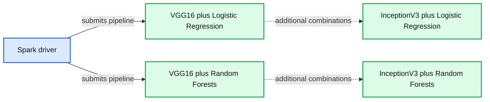

# A Vision for Making Deep Learning Simple

- Source: https://www.databricks.com/blog/2017/06/06/databricks-vision-simplify-large-scale-deep-learning.html
- Published: 2017-06-06
- Authors: Sue Ann Hong, Tim Hunter, Reynold Xin
- Categories: engineering, data-science-machine-learning, open-source
- Images: 2 total, 2 extracted as architecture

[Try this notebook on Databricks](https://databricks-prod-cloudfront.cloud.databricks.com/public/4027ec902e239c93eaaa8714f173bcfc/5181772898130619/419014196113123/1282150081618649/latest.html)

When MapReduce was introduced 15 years ago, it showed the world a glimpse into the future. For the first time, engineers at Silicon Valley tech companies could analyze the entire Internet. MapReduce, however, provided low-level APIs that were incredibly difficult to use, and as a result, this "superpower" was a luxury — only a small fraction of highly sophisticated engineers with lots of resources could afford to use it.

Today, deep learning has reached its “MapReduce” point: it has demonstrated its potential; it is the “superpower” of Artificial Intelligence. Its accomplishments were unthinkable a few years ago: self-driving cars and AlphaGo would have been considered miracles.

Yet leveraging the superpower of deep learning today is as challenging as big data was yesterday: deep learning frameworks have steep learning curves because of low-level APIs; scaling out over distributed hardware requires significant manual work; and even with the combination of time and resources, achieving success requires tedious fiddling and experimenting with parameters. Deep learning is often referred to as “black magic.”

Seven years ago, a group of us started the Spark project with the singular goal to “democratize” the “superpower” of big data, by offering high-level APIs and a unified engine to do machine learning, ETL, streaming and interactive SQL. Today, Apache Spark makes big data accessible to everyone from software engineers to SQL analysts.

Continuing with that vision of democratization, we are excited to announce **[Deep Learning Pipelines](https://github.com/databricks/spark-deep-learning)**, a new open-source library aimed at enabling everyone to easily integrate scalable deep learning into their workflows, from machine learning practitioners to business analysts.

Deep Learning Pipelines builds on Apache Spark’s [ML Pipelines](https://spark.apache.org/docs/latest/ml-pipeline.html) for training, and with Spark DataFrames and SQL for deploying models. It includes high-level APIs for common aspects of deep learning so they can be done efficiently in a few lines of code:

- Image loading
- Applying pre-trained models as transformers in a Spark ML pipeline
- Transfer learning
- Distributed hyperparameter tuning
- Deploying models in DataFrames and SQL

In the rest of the post, we describe each of these features in detail with examples. To try out these and further examples on Databricks, check out the notebook [Deep Learning Pipelines on Databricks](https://databricks-prod-cloudfront.cloud.databricks.com/public/4027ec902e239c93eaaa8714f173bcfc/5669198905533692/3647723071348946/3983381308530741/latest.html).

## Image Loading

The first step to applying deep learning on images is the ability to load the images. Deep Learning Pipelines includes utility functions that can load millions of images into a DataFrame and decode them automatically in a distributed fashion, allowing manipulation at scale.

We are also working on adding support for more data types, such as text and time series.

## Applying Pre-trained Models for Scalable Prediction

Deep Learning Pipelines supports running pre-trained models in a distributed manner with Spark, available in both batch and [streaming data processing](https://www.databricks.com/blog/2016/07/28/structured-streaming-in-apache-spark.html). It houses some of the most popular models, enabling users to start using deep learning without the costly step of training a model. For example, the following code creates a Spark prediction pipeline using InceptionV3, a state-of-the-art convolutional neural network (CNN) model for image classification, and predicts what objects are in the images that we just loaded. This prediction, of course, is done in parallel with all the benefits that come with Spark:

In addition to using the built-in models, users can plug in [Keras models](https://keras.io/api/models/) and TensorFlow Graphs in a Spark prediction pipeline. This turns any single-node models on single-node tools into one that can be applied in a distributed fashion, on a large amount of data.

On Databricks’ [Unified Analytics Platform](https://www.databricks.com/product/data-lakehouse), if you choose a GPU-based cluster, the computation intensive parts will automatically run on GPUs for best efficiency.

## Transfer Learning

Pre-trained models are extremely useful when they are suitable for the task at hand, but they are often not optimized for the specific dataset users are tackling. As an example, InceptionV3 is a model optimized for image classification on a broad set of 1000 categories, but our domain might be dog breed classification. A commonly used technique in deep learning is transfer learning, which adapts a model trained for a similar task to the task at hand. Compared with training a new model from ground-up, transfer learning requires substantially less data and resources. This is why transfer learning has become the go-to method in many real world use cases, such as [cancer detection](https://idp.nature.com/transit?redirect_uri=https%3A%2F%2Fwww.nature.com%2Farticles%2Fnature21056&code=35ca213f-9829-40bf-92db-d7e0385b6c73).

**Summary:** The diagram shows transfer learning using a pretrained neural network and DeepImageFeaturizer to classify a dog image as Chihuahua.

**Components:**

- Input image
- Pretrained neural network using InceptionV3
- SoftMax output
- Class probabilities
- DeepImageFeaturizer using Spark
- Extracted feature maps
- Classifier using logistic regression
- Chihuahua prediction

**Flows:**

- Input image -> Pretrained neural network: image pixels
- Pretrained neural network -> SoftMax: model output
- SoftMax -> Class probabilities: class scores
- Pretrained neural network -> DeepImageFeaturizer: pretrained model layers
- Input image -> DeepImageFeaturizer: image pixels
- DeepImageFeaturizer -> Extracted feature maps: intermediate features
- Extracted feature maps -> Classifier: feature vectors
- Classifier -> Chihuahua prediction: classification result

**Numbers:** 0.9, 0.05, 0.01

```mermaid
%% Shows pretrained image classification and transfer learning with a featurizer
flowchart LR
    image[Input image]
    network[Pretrained neural network]
    softmax[SoftMax]
    probs[Class probabilities]
    featurizer[DeepImageFeaturizer]
    features[Extracted feature maps]
    classifier[Classifier]
    prediction[Chihuahua prediction]

    image -->|image pixels| network
    network -->|model output| softmax
    softmax -->|class scores| probs
    network -->|pretrained layers| featurizer
    image -->|image pixels| featurizer
    featurizer -->|intermediate features| features
    features -->|feature vectors| classifier
    classifier -->|classification result| prediction

    classDef client fill:#dbeafe,stroke:#2563eb,stroke-width:2px,color:#111
    classDef service fill:#dcfce7,stroke:#16a34a,stroke-width:2px,color:#111
    classDef store fill:#ede9fe,stroke:#7c3aed,stroke-width:2px,color:#111
    classDef cache fill:#fef3c7,stroke:#d97706,stroke-width:2px,color:#111
    classDef queue fill:#cffafe,stroke:#0891b2,stroke-width:2px,color:#111
    classDef critical fill:#fee2e2,stroke:#dc2626,stroke-width:4px,color:#111
    classDef external fill:#e5e7eb,stroke:#6b7280,stroke-width:2px,color:#111,stroke-dasharray:4 3
    classDef decision fill:#fce7f3,stroke:#db2777,stroke-width:2px,color:#111
    class image client
    class network,softmax,featurizer,classifier service
    class probs,features store
    class prediction decision
```

source image: https://www.databricks.com/wp-content/uploads/2017/06/image1-2.png

Deep Learning Pipelines enables fast transfer learning with the concept of a *Featurizer*. The following example combines the InceptionV3 model and logistic regression in Spark to adapt InceptionV3 to our specific domain. The DeepImageFeaturizer automatically peels off the last layer of a pre-trained neural network and uses the output from all the previous layers as features for the logistic regression algorithm. Since logistic regression is a simple and fast algorithm, this transfer learning training can converge quickly using far fewer images than are typically required to train a deep learning model from ground-up.

## Distributed Hyperparameter Tuning

Getting the best results in deep learning requires experimenting with different values for training parameters, an important step called hyperparameter tuning. Since Deep Learning Pipelines enables exposing deep learning training as a step in Spark’s machine learning pipelines, users can rely on the hyperparameter tuning infrastructure already built into Spark.

**Summary:** Spark driver orchestrates combinations of deep learning models and traditional machine learning algorithms for hyperparameter tuning.

**Components:**

- Spark driver - Apache Spark orchestration
- VGG16 - deep learning model
- InceptionV3 - deep learning model
- Logistic Regression - traditional machine learning algorithm
- Random Forests - traditional machine learning algorithm

**Flows:**

- Spark driver -> VGG16 with Logistic Regression: submits a model pipeline
- Spark driver -> VGG16 with Random Forests: submits a model pipeline

**Numbers:** 16 in VGG16; 3 in InceptionV3

source image: https://www.databricks.com/wp-content/uploads/2017/06/image2-1.png

The following code plugs in a Keras Estimator and performs hyperparameter tuning using grid search with cross validation:

## Deploying Models in SQL

Once a data scientist builds the desired model, Deep Learning Pipelines makes it simple to expose it as a function in SQL, so anyone in their organization can use it – data engineers, data scientists, business analysts, anybody.

Next, any user in the organization can apply prediction in SQL:

Similar functionality is also available in the DataFrame programmatic API across all supported languages (Python, Scala, Java, R). Similar to scalable prediction, this feature works in both batch and [structured streaming](https://www.databricks.com/blog/2016/07/28/structured-streaming-in-apache-spark.html).

## Conclusion

In this blog post, we introduced [Deep Learning Pipelines](https://github.com/databricks/spark-deep-learning), a new library that makes deep learning drastically easier to use and scale. While this is just the beginning, we believe Deep Learning Pipelines has the potential to accomplish what Spark did to big data: make the deep learning "superpower" approachable for everybody.

Future posts in the series will cover the various tools in the library in more detail: image manipulation at scale, transfer learning, prediction at scale, and making deep learning available in SQL.

To learn more about the library, check out the [Databricks notebook](https://databricks-prod-cloudfront.cloud.databricks.com/public/4027ec902e239c93eaaa8714f173bcfc/5181772898130619/419014196113123/1282150081618649/latest.html) as well as the [github repository](https://github.com/databricks/spark-deep-learning). We encourage you to give us feedback. Or even better, be a contributor and help bring the power of scalable deep learning to everyone.
