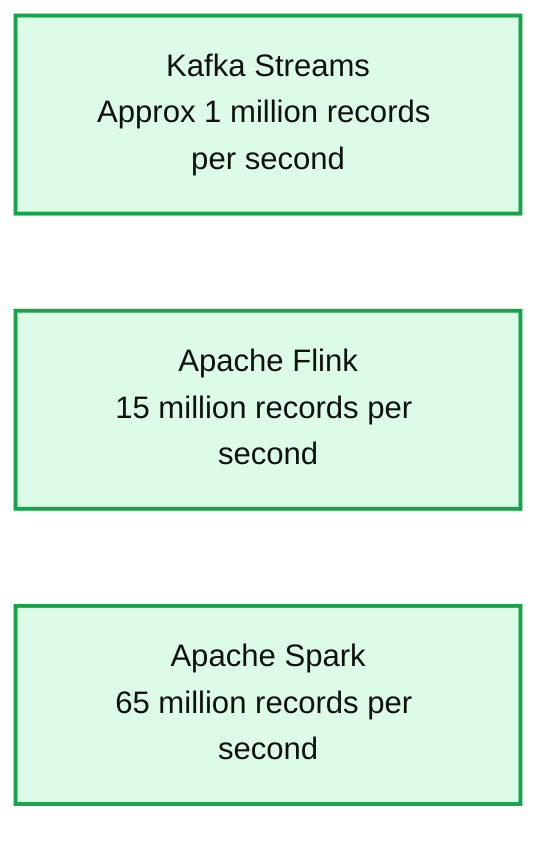
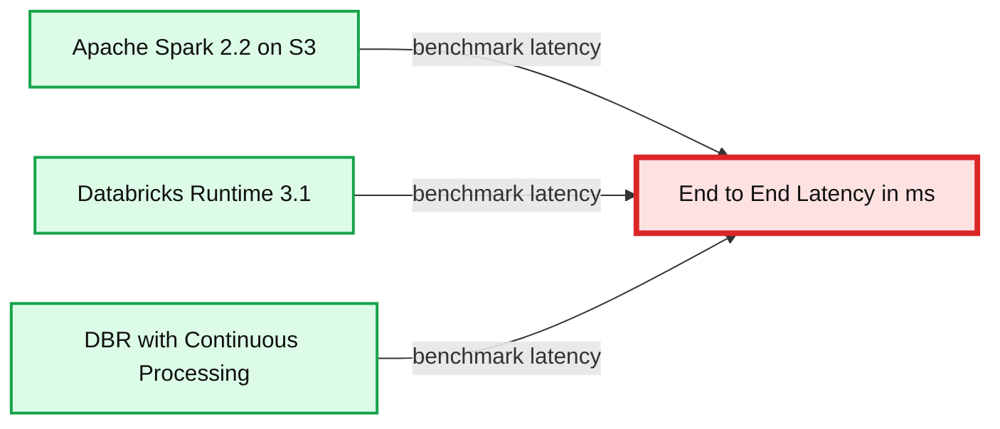

# Making Apache Spark the Fastest Open Source Streaming Engine

- Source: https://www.databricks.com/blog/2017/06/06/simple-super-fast-streaming-engine-apache-spark.html
- Published: 2017-06-06
- Authors: Michael Lumb
- Categories: engineering, open-source, data-engineering, data-streaming
- Images: 2 total, 2 extracted as architecture

We started building [Structured Streaming](https://www.databricks.com/blog/2016/07/28/structured-streaming-in-apache-spark.html) in Apache Spark one year ago as a new, simpler way to develop [continuous applications](https://www.databricks.com/blog/2016/07/28/continuous-applications-evolving-streaming-in-apache-spark-2-0.html). Not only does this new way make it easy to build end-to-end streaming applications by exposing a single API to write streaming queries as you would write batch queries, but it also handles streaming complexities by ensuring exactly-once-semantics, doing incremental stateful aggregations, and providing data consistency across sources and sinks.

## Best-in-Class Performance

[As we showed this morning at Spark Summit 2017](https://www.youtube.com/watch?v=xwQwKW-cerE), Structured Streaming is not only the simplest-to-use streaming engine, but for many workloads is also the fastest!

By leveraging all of the work done on the [Catalyst query optimizer](https://www.databricks.com/blog/2015/04/13/deep-dive-into-spark-sqls-catalyst-optimizer.html) and the [Tungsten execution engine](https://www.databricks.com/blog/2015/04/28/project-tungsten-bringing-spark-closer-to-bare-metal.html), Structured Streaming brings the efficiency of Spark SQL to real-time streaming. In our benchmarks, we showed **5x** or better throughput than other popular streaming engines on the widely used Yahoo! Streaming Benchmark.

**Summary:** The chart compares streaming throughput, showing Apache Spark at approximately 65 million records per second, Apache Flink at 15 million, and Kafka Streams at approximately 1 million.

**Components:**

- Kafka Streams streaming engine
- Apache Flink streaming engine
- Apache Spark streaming engine

**Flows:**

- none

**Numbers:** 0, 10, 20, 30, 40, 50, 60, 70; millions; records per second; Kafka Streams approximately 1; Apache Flink 15; Apache Spark 65; 5x

source image: https://www.databricks.com/wp-content/uploads/2017/06/spark-yahoo-streaming-benchmark.png

The above shows a comparison when running a modified version of the benchmark that generates the data in the framework. We ran on a similar setup, using 10 r3.xlarge machines (40 cores) running Spark 2.2.0-RC3. To let you reproduce these results, we will shortly release a blog with full source code runnable on Databricks. *Note that for Kafka Streams, the data is still read from persistent storage as this is the only mode that is supported.*

## Best-in-Class Latency

Of course, throughput is only one metric for evaluating a streaming engine. Latency is also important for time-sensitive applications. Up until now, the minimum possible latency has been bounded by the microbatch-based architecture of Spark Streaming.

However, from the beginning, we carefully designed the API of Structured Streaming to be agnostic to the underlying execution engine, eliminating the concept of batching in the API. At Databricks, we have also been working to remove batching in the engine. Today, we are excited to propose a new extension, **[continuous processing](https://issues.apache.org/jira/browse/SPARK-20928)**, that also eliminates micro-batches from execution. As we demonstrated at Spark Summit this morning, this new execution mode lets users achieve **sub-millisecond end-to-end latency** for many important workloads -- with no change to their Spark application.

**Summary:** The chart compares end-to-end latency for Apache Spark, Databricks Runtime, and DBR with Continuous Processing.

**Components:**

- Apache Spark 2.2 on S3 - Spark streaming engine using S3
- Databricks Runtime 3.1 - Databricks execution runtime
- DBR with Continuous Processing - Databricks Runtime continuous processing mode
- End to End Latency - latency measured in milliseconds

**Flows:**

- Apache Spark 2.2 on S3 -> End to End Latency: benchmark latency
- Databricks Runtime 3.1 -> End to End Latency: benchmark latency
- DBR with Continuous Processing -> End to End Latency: benchmark latency

**Numbers:** 2.2, 3.1, 10000, 1000, 100, 10, 1, 0.1, ms

source image: https://www.databricks.com/wp-content/uploads/2017/06/db-runtime-latency.png

We have already built a working first version of continuous processing, and look forward to working with the community to contribute this extension to Apache Spark.

## Efficient Streaming in the Cloud

Databricks customers can access the latest and greatest streaming features through the [Databricks Runtime 3.0 beta](https://www.databricks.com/blog/2017/05/24/databricks-runtime-3-0-beta-delivers-enterprise-grade-apache-spark.html), which includes the following new features from Apache Spark:

- Support for arbitrary complex [stateful processing using [flat]MapGroupsWithState](https://youtu.be/JAb4FIheP28), allowing developers to write customized stateful aggregations such as sessionization or joining two streams.
- Support for [reading and writing data in streaming or batch to/from Apache Kafka](https://www.databricks.com/blog/2017/04/26/processing-data-in-apache-kafka-with-structured-streaming-in-apache-spark-2-2.html), giving developers ability to publish transformed streams to subsequent stages in a complex data pipeline upstream or update dashboards in real time.
- Support for [production monitoring and alert management](https://www.databricks.com/blog/2017/05/18/taking-apache-sparks-structured-structured-streaming-to-production.html), providing engineers ways to survey metrics, inspect query progress, and write advanced monitoring applications with third-party alerting platforms.

In addition to the upstream improvements, Databricks Runtime 3.0 has optimized Structured Streaming specifically for the cloud deployments, including the following enhancements for running cloud workloads:

- Drastically reduce costs by combining the [Once Trigger mode with the Databricks Job Scheduler](https://www.databricks.com/blog/2017/05/22/running-streaming-jobs-day-10x-cost-savings.html).
- Easily monitor production streaming jobs with [integrated throughput and latency metrics](https://www.databricks.com/blog/2017/05/18/taking-apache-sparks-structured-structured-streaming-to-production.html).
- Additionally support another source of streaming data from [Amazon Kinesis](https://docs.databricks.com/spark/latest/structured-streaming/kinesis.html).

## Ready for Production

Finally, we are excited to announce that we at Databricks now consider Structured Streaming to be production ready and it is fully supported. At Databricks, our customers have already been using Structured Streaming and **in the last month alone processed over 3 trillion records**.

## Read More

To explain how we and our customers employ Structured Streaming at scale, we have penned a half dozen blogs that cover many of the key aspects of Structured Streaming:

- [Real-time Streaming ETL with Structured Streaming in Apache Spark 2.1](https://www.databricks.com/blog/2017/01/19/real-time-streaming-etl-structured-streaming-apache-spark-2-1.html)
- [Working with Complex Data Formats with Structured Streaming in Apache Spark 2.1](https://www.databricks.com/blog/2017/02/23/working-complex-data-formats-structured-streaming-apache-spark-2-1.html)
- [Processing Data in Apache Kafka with Structured Streaming in Apache Spark 2.2](https://www.databricks.com/blog/2017/04/26/processing-data-in-apache-kafka-with-structured-streaming-in-apache-spark-2-2.html)
- [Event-time Aggregation and Watermarking in Apache Spark’s Structured Streaming](https://www.databricks.com/blog/2017/05/08/event-time-aggregation-watermarking-apache-sparks-structured-streaming.html)
- [Taking Apache Spark’s Structured Structured Streaming to Production](https://www.databricks.com/blog/2017/05/18/taking-apache-sparks-structured-structured-streaming-to-production.html)
- [Once Trigger mode with the Databricks Job Scheduler](https://www.databricks.com/blog/2017/05/22/running-streaming-jobs-day-10x-cost-savings.html)
