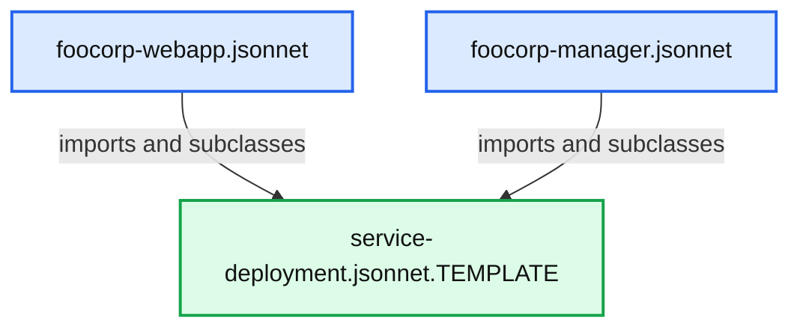
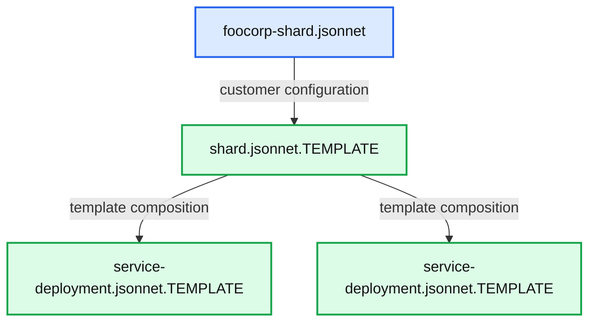

# Declarative Infrastructure with the Jsonnet Templating Language

- Source: https://www.databricks.com/blog/2017/06/26/declarative-infrastructure-jsonnet-templating-language.html
- Published: 2017-06-26
- Authors: Eric Liang, Aaron Davidson
- Categories: platform, solutions, engineering, open-source
- Images: 5 total, 5 extracted as architecture

*Free Edition has replaced Community Edition, offering enhanced features at no cost. Start using *[*Free Edition *](https://login.databricks.com/?intent=SIGN_UP&amp;signup_experience_step=EXPRESS&amp;provider=DB_FREE_TIER&amp;dbx_source=www)*today.*
 

*This blog post is part of our series of internal engineering blogs on Databricks platform, infrastructure management, integration, tooling, monitoring, and provisioning.*

At Databricks engineering, we are avid fans of [Kubernetes](https://kubernetes.io/). Much of our platform infrastructure runs within Kubernetes, whether in AWS cloud or [more regulated environments](https://www.databricks.com/solutions/industries/federal-government).

However, we have found that Kubernetes alone is not enough for managing a complex service infrastructure, which may encompass both resources created in Kubernetes (e.g., [pods](https://kubernetes.io/docs/concepts/workloads/pods/), [services](https://kubernetes.io/docs/concepts/services-networking/service/)) and external resources such as [IAM roles](https://docs.aws.amazon.com/IAM/latest/UserGuide/id_roles.html). Management complexity comes from (1) need for visibility into the current state of the infrastructure (2) reasoning about how to make changes to the infrastructure.

To help reduce management complexity, it is desirable for infrastructure to be [*declarative*](https://research.google/pubs/pub43438/) (i.e., described by a set of configuration files or templates). The first advantage is that one can easily inspect the target state of infrastructure by reading the configuration files. Second, since the infrastructure is entirely described by the files, changes can be proposed, reviewed, and applied as part of a standard software development workflow.

## What's Missing?

Kubernetes [YAML configuration files](https://kubernetes.io/docs/concepts/overview/working-with-objects/kubernetes-objects/) already implement declarative updates to objects in Kubernetes. The user only need edit an object's YAML file and then run `$ kubectl apply -f theobject.yaml` to sync the changes to Kubernetes. These YAML files may be checked into source control, and if needed the user can query Kubernetes to inspect the difference between the live version and the local file.

However, one runs into pain points when attempting to apply this methodology to a larger production environment:

1. Common structures cannot be shared across YAML files. You typically set up a service not once but several times, perhaps in {dev, staging, prod} environments, across different geographic regions such as {us-west, us-east, asia-pacific}, and Cloud providers {AWS, Azure, GCE}.
2. YAML files must often reference metadata about externally defined entities such as relational databases, networking configurations, or SSL certificates.
3. Complex multi-tier service deployments may require the composition of many distinct resources or YAML files. Updating a deployment composed of many such files becomes burdensome.

In this blog post, we describe how we use Google's [Jsonnet configuration language](https://jsonnet.org/) to solve these problems, walk through an example of templatizing a service deployment using Jsonnet, and propose a [Jsonnet style guide](https://github.com/databricks/jsonnet-style-guide) for the infrastructure templating use case. We've found that Jsonnet is easy to get started with and scales well to complex use cases.

## Jsonnet Usage at Databricks

Late 2015 we started experimenting with Jsonnet as part of the effort for [Databricks Community Edition](https://www.databricks.com/blog/2016/06/07/dce-ga.html), our free tier Apache Spark service for education. Since then, Jsonnet has exploded in popularity within Databricks engineering, with over 40,000 lines of Jsonnet in 1000+ distinct files checked into our main development repository. These templates expand to hundreds of thousands of lines of raw YAML once materialized.

Teams at Databricks currently use Jsonnet to manage configurations for Kubernetes resources (including internal configurations of services running on Kubernetes), [AWS CloudFormation](https://aws.amazon.com/cloudformation/), [Terraform](https://www.terraform.io/), [Databricks Jobs](https://docs.databricks.com/jobs.html), and also for tasks such as [TLS cert management](https://en.wikipedia.org/wiki/Transport_Layer_Security) and defining [Prometheus alerts](https://prometheus.io/docs/practices/alerting/). Over the past two years, Jsonnet has grown to become the de-facto standard configuration language within engineering.

**Summary:** The chart shows the growth of Jsonnet lines of code checked into the Databricks universe over time.

**Components:**

- Jsonnet codebase growth metric
- Month timeline from 2016/4 to 2017/4
- Lines of code vertical scale
- Actual growth line
- Trend line

**Flows:**

- 0 -> 1052: Lines of code increase
- 1052 -> 4248: Lines of code increase
- 4248 -> 10494: Lines of code increase
- 10494 -> 19208: Lines of code increase
- 19208 -> 25612: Lines of code increase
- 25612 -> 30140: Lines of code increase
- 30140 -> 34960: Lines of code increase
- 34960 -> 34901: Lines of code decrease
- 34901 -> 39846: Lines of code increase
- 39846 -> 42800: Lines of code increase

**Numbers:** 0, 1052, 4248, 10494, 12483, 13151, 15114, 19208, 22267, 24829, 25612, 27691, 29766, 30140, 34960, 34901, 39846, 42800, 12500, 25000, 37500, 2016/4, 2016/7, 2016/10, 2017/1, 2017/4, two years


<sub>source image: https://www.databricks.com/wp-content/uploads/2017/06/image5-1.png</sub>

## Jsonnet Basics

[Jsonnet](https://jsonnet.org/) is a configuration language that helps you define [JSON](http://www.json.org/) data. The basic idea is that some JSON fields may be left as variables or expressions that are evaluated at compilation time. For example, the JSON object `{"count": 4}` may be expressed as `{count: 2 + 2}` in Jsonnet. You can also declare hidden fields with "::" that can be referenced during compilation, e.g. `{x:: 2, y:: 2, count: $.x + $.y}` also evaluates to `{"count": 4}`.

Jsonnet objects may be *subclassed* by concatenating ("+") objects together to override field values, e.g. suppose we define the following.

Then, the Jsonnet expression `(base + {x:: 10})` will compile to `{"count": 12`}. In fact, the Jsonnet compiler requires you to override x since the default value raises an error. You can, therefore, think of base as defining an abstract base class in Jsonnet.

Jsonnet compilation is completely deterministic and cannot perform external I/O, making it ideal for defining configuration. We've found that Jsonnet strikes the right balance between restrictiveness and flexibility -- previously we generated configurations using Scala code, which erred too much on the side of flexibility, leading to many headaches.

At Databricks, we extended our [kubectl](https://kubernetes.io/docs/reference/kubectl/overview/) tool (dubbed kubecfg) so that it can take Jsonnet files directly as arguments. Internally it compiles the Jsonnet to plain JSON / YAML before sending the data to Kubernetes. Kubernetes then creates or updates objects as needed based on the uploaded configuration.

**Summary:** Jsonnet templates are compiled by kubecfg into JSON or YAML, which Kubernetes uses to create or update objects.

**Components:**

- Jsonnet templates: Jsonnet templating language
- JSON or YAML: Kubernetes configuration data format
- Kubernetes objects: Kubernetes resources
- kubecfg apply command: Databricks kubectl extension

**Flows:**

- Jsonnet templates -> JSON or YAML: Compiled configuration
- JSON or YAML -> Kubernetes objects: Configuration uploaded to Kubernetes

**Numbers:** none

```text
%% mermaid failed to render; kept as text
%% Jsonnet templates compile into Kubernetes objects through kubecfg
flowchart LR
    A[Jsonnet templates] -->|compile to| B[JSON or YAML]
    B -->|upload configuration| C[Kubernetes objects]
    D[kubecfg apply command]

    classDef client   fill:#dbeafe,stroke:#2563eb,stroke-width:2px,color:#111
    classDef service  fill:#dcfce7,stroke:#16a34a,stroke-width:2px,color:#111
    classDef store    fill:#ede9fe,stroke:#7c3aed,stroke-width:2px,color:#111
    classDef cache    fill:#fef3c7,stroke:#d97706,stroke-width:2px,color:#111
    classDef queue    fill:#cffafe,stroke:#0891b2,stroke-width:2px,color:#111
    classDef critical fill:#fee2e2,stroke:#dc2626,stroke-width:4px,color:#111
    classDef external fill:#e5e7eb,stroke:#6b7280,stroke-width:2px,color:#111,stroke-dasharray:4 3
    classDef decision fill:#fce7f3,stroke:#db2777,stroke-width:2px,color:#111
    A,B,C,D service
```

<sub>source image: https://www.databricks.com/wp-content/uploads/2017/06/image4-1.png</sub>

## Composing Kubernetes Objects with Jsonnet

To better understand how Jsonnet can be used with Kubernetes, let's consider the task of deploying an idealized [1] single-tenant "Databricks platform" for an enterprise customer. Here we want to create two distinct but related service deployments: a Webapp (for the interactive workspace) and Cluster manager (for managing Spark clusters). In addition, the services need access to an [AWS RDS database](https://aws.amazon.com/rds/) to store persistent data.

[1]: Note that we don't actually create individual Jsonnet files for each customer in reality -- that would create a frightening number of Jsonnet files and would in itself be a problem.

### Template for Defining Kubernetes Deployments

For these examples, we'll be using [service-deployment.jsonnet.TEMPLATE](https://github.com/databricks/jsonnet-style-guide/blob/master/examples/databricks/service-deployment.jsonnet.TEMPLATE), a simplified version of one of our internal base templates that define a Kubernetes [service](https://kubernetes.io/docs/concepts/services-networking/service/) and [deployment](https://kubernetes.io/docs/concepts/workloads/controllers/deployment/) together as a pair. The instantiated service and deployment together constitute a standalone "production service" in Kubernetes that can receive network traffic. Note that the template has two required arguments in addition to several optional arguments, including optional config passed to the service binary itself:

[service-deployment.jsonnet.TEMPLATE](https://github.com/databricks/jsonnet-style-guide/blob/master/examples/databricks/service-deployment.jsonnet.TEMPLATE):

### Example 1: One File for Each Service Deployment

Given service-deployment.jsonnet.TEMPLATE, the simplest option we have is to create separate Jsonnet files for the Webapp and Cluster manager. In each file we must import the base template, subclass it, and fill in the required parameters.

**Summary:** Two Jsonnet deployment files inherit from a shared service deployment template.

**Components:**

- foocorp-webapp.jsonnet, a Jsonnet deployment file
- foocorp-manager.jsonnet, a Jsonnet deployment file
- service-deployment.jsonnet.TEMPLATE, a Jsonnet base template

**Flows:**

- foocorp-webapp.jsonnet -> service-deployment.jsonnet.TEMPLATE: imports and subclasses the base template
- foocorp-manager.jsonnet -> service-deployment.jsonnet.TEMPLATE: imports and subclasses the base template

**Numbers:** none



<sub>source image: https://www.databricks.com/wp-content/uploads/2017/06/image1-8.png</sub>

We specify the service name, the Docker image containing the service binary, and some service specific configurations including the RDS address. In this example, the RDS address is hard-coded, but later on we'll show how to import that metadata from e.g. the output file of running a CloudFormation script.

The following file describes the manager service (here service takes on its standard meaning, we'll refer to *Kubernetes services* explicitly as such going on). We also construct service-specific configurations within the Jsonnet template via the `serviceConf:: field`, which the template passes to the pod as an environment variable. We've found it useful to unify service and Kubernetes configs in this way:

[simple/foocorp-manager.jsonnet](https://github.com/databricks/jsonnet-style-guide/blob/master/examples/databricks/simple/foocorp-manager.jsonnet):

For the webapp service to create clusters, it must specify the cluster manager’s [Kubernetes DNS](https://kubernetes.io/docs/concepts/services-networking/dns-pod-service/) address, which can be determined ahead of time from the Kubernetes service name:

[simple/foocorp-webapp.jsonnet](https://github.com/databricks/jsonnet-style-guide/blob/master/examples/databricks/simple/foocorp-webapp.jsonnet):

If you have the [example code repo](https://github.com/databricks/jsonnet-style-guide) cloned, you can view the materialized outputs of these templates by running the jsonnet compiler on the files, e.g.:

`$ jsonnet examples/databricks/simple/foocorp-webapp.jsonnet`

So what has this gotten us? We've managed to at least remove some of the standard Kubernetes boilerplate around defining services, reducing each deployment definition from over 100 lines to about 10. However, we can do better -- there are still duplicated parameters which would make this pattern hard to maintain if there were many distinct customers or more services required per customer.

### Example 2: Composing Together Deployments in a Single File

Since both the Webapp and Cluster manager services are deployed together as a unit or *shard* per customer, it makes sense that there should just be one file per customer describing their unique requirements. It is indeed possible to define a single template, [shard.jsonnet.TEMPLATE](https://github.com/databricks/jsonnet-style-guide/blob/master/examples/databricks/shard-v1/shard.jsonnet.TEMPLATE), that composes together both the Webapp and Cluster manager deployments without duplication of params.

**Summary:** A customer-specific Jsonnet file feeds a shard template that composes multiple service deployment templates.

**Components:**

- `foocorp-shard.jsonnet` - customer-specific Jsonnet configuration
- `shard.jsonnet.TEMPLATE` - Jsonnet composition template
- `service-deployment.jsonnet.TEMPLATE` - reusable service deployment template

**Flows:**

- `foocorp-shard.jsonnet -> shard.jsonnet.TEMPLATE`: customer configuration
- `shard.jsonnet.TEMPLATE -> service-deployment.jsonnet.TEMPLATE`: template composition
- `shard.jsonnet.TEMPLATE -> service-deployment.jsonnet.TEMPLATE`: template composition

**Numbers:** none



<sub>source image: https://www.databricks.com/wp-content/uploads/2017/06/image6-1.png</sub>

The trick here is that the template defines a Kubernetes "List" object, which can include multiple Kubernetes resources within one JSON object. We merge the sub-lists produced by the service-deployment templates using the Jsonnet [standard library function](https://jsonnet.org/docs/stdlib.html) `std.flattenArrays`:

[shard-v1/shard.jsonnet.TEMPLATE](https://github.com/databricks/jsonnet-style-guide/blob/master/examples/databricks/shard-v1/shard.jsonnet.TEMPLATE):

Now we can conveniently define FooCorp's entire deployment without any duplicated data, and using only one file:

[shard-v1/foocorp-shard.jsonnet](https://github.com/databricks/jsonnet-style-guide/blob/master/examples/databricks/shard-v1/foocorp-shard.jsonnet):

### Example 3: Subclassing Templates for Multiple Environments

To see the flexibility of Jsonnet, consider how you might subclass the templates defined in the above examples to create shards that run in the development environment. In dev, deployments should use the dev database instead of the production one, and we also want to run with the latest bleeding-edge Docker images. To do this, we can further subclass the shard.jsonnet.TEMPLATE to different environments. This makes it possible to create specific production or development shards from these specialized templates:

**Summary:** The diagram shows Jsonnet template inheritance and environment-specific shard configuration for production and development deployments.

**Components:**

- `$foocorp-shard.jsonnet` shard configuration files using Jsonnet
- `dev-shard-$i.jsonnet` development shard configuration files using Jsonnet
- `prod-shard.jsonnet.TEMPLATE` production shard template using Jsonnet
- `dev-shard.jsonnet.TEMPLATE` development shard template using Jsonnet
- `prod-env.json` production environment configuration
- `dev-env.json` development environment configuration
- `shard.jsonnet.TEMPLATE` shared shard template using Jsonnet
- `service-deployment.jsonnet.TEMPLATE` service deployment template using Jsonnet

**Flows:**

- `$foocorp-shard.jsonnet` -> `prod-shard.jsonnet.TEMPLATE`: specializes the production shard template
- `dev-shard-$i.jsonnet` -> `dev-shard.jsonnet.TEMPLATE`: specializes the development shard template
- `prod-shard.jsonnet.TEMPLATE` -> `prod-env.json`: produces production environment configuration
- `dev-shard.jsonnet.TEMPLATE` -> `dev-env.json`: produces development environment configuration
- `prod-shard.jsonnet.TEMPLATE` -> `shard.jsonnet.TEMPLATE`: inherits shared shard behavior
- `dev-shard.jsonnet.TEMPLATE` -> `shard.jsonnet.TEMPLATE`: inherits shared shard behavior
- `shard.jsonnet.TEMPLATE` -> `service-deployment.jsonnet.TEMPLATE`: builds on the service deployment template

**Numbers:** none

```text
%% mermaid failed to render; kept as text
%% Shows Jsonnet template inheritance and environment-specific configuration
flowchart LR
    Corp["$foocorp-shard.jsonnet"]
    DevFiles["dev-shard-$i.jsonnet"]
    Prod["prod-shard.jsonnet.TEMPLATE"]
    Dev["dev-shard.jsonnet.TEMPLATE"]
    ProdEnv["prod-env.json"]
    DevEnv["dev-env.json"]
    Shared["shard.jsonnet.TEMPLATE"]
    Service["service-deployment.jsonnet.TEMPLATE"]

    Corp -->|specializes| Prod
    DevFiles -->|specializes| Dev
    Prod -->|generates| ProdEnv
    Dev -->|generates| DevEnv
    Prod -->|inherits| Shared
    Dev -->|inherits| Shared
    Shared -->|builds on| Service

    classDef client   fill:#dbeafe,stroke:#2563eb,stroke-width:2px,color:#111
    classDef service  fill:#dcfce7,stroke:#16a34a,stroke-width:2px,color:#111
    classDef store    fill:#ede9fe,stroke:#7c3aed,stroke-width:2px,color:#111
    classDef cache    fill:#fef3c7,stroke:#d97706,stroke-width:2px,color:#111
    classDef queue    fill:#cffafe,stroke:#0891b2,stroke-width:2px,color:#111
    classDef critical fill:#fee2e2,stroke:#dc2626,stroke-width:4px,color:#111
    classDef external fill:#e5e7eb,stroke:#6b7280,stroke-width:2px,color:#111,stroke-dasharray:4 3
    classDef decision fill:#fce7f3,stroke:#db2777,stroke-width:2px,color:#111
    Corp,DevFiles client
    Prod,Dev,Shared,Service service
    ProdEnv,DevEnv store
```

<sub>source image: https://www.databricks.com/wp-content/uploads/2017/06/image3-3.png</sub>

To make the interface exposed by shard.jsonnet.TEMPLATE more explicit, instead of exporting an object we will export a function `newShard(name, release, env)`, which can be called to construct the shard object. The env object encapsulates the differences between environments (e.g. database URL).

[shard-v2/shard.jsonnet.TEMPLATE](https://github.com/databricks/jsonnet-style-guide/blob/master/examples/databricks/shard-v2/shard.jsonnet.TEMPLATE):

The dev shard template now just needs to fill in the required env for dev and specify the bleeding-edge release by default. It obtains the env by importing a plain JSON file containing the needed database metadata:

[shard-v2/dev-shard.jsonnet.TEMPLATE](https://github.com/databricks/jsonnet-style-guide/blob/master/examples/databricks/shard-v2/dev-shard.jsonnet.TEMPLATE):

The full example code for the prod and dev shard templates can be found here: [https://github.com/databricks/jsonnet-style-guide/tree/master/examples/databricks/shard-v2](https://github.com/databricks/jsonnet-style-guide/tree/master/examples/databricks/shard-v2)

Note that the use of functions for subclassing is optional -- we could have instead derived [dev-shard.jsonnet.TEMPLATE](https://github.com/databricks/jsonnet-style-guide/blob/master/examples/databricks/shard-v2/dev-shard.jsonnet.TEMPLATE) and [prod-shard.jsonnet.TEMPLATE](https://github.com/databricks/jsonnet-style-guide/blob/master/examples/databricks/shard-v2/prod-shard.jsonnet.TEMPLATE) using only field overrides. However, in our experience, the use of ad-hoc field overrides, though powerful, tends to lead to more brittle templates. We've found it useful to establish best practices to limit the use of such constructs in larger templates.

## Jsonnet Style Guide

In the above examples, we saw how Jsonnet templates can be used to remove duplication of configuration data between Kubernetes objects, compose multiple deployments together, and reference external entities. This greatly simplifies infrastructure management. In large projects, however, templates themselves may become a source of complexity. We've found this to be manageable with some best practices and investment in tooling around Jsonnet:

**Here are a few Jsonnet best practices we've found:**

1. For large templates (>10 parameters), avoid directly overriding internal fields when subclassing. Rather, define explicit constructors for templates using Jsonnet functions, which helps with readability and encourages modularity.
2. Check your Jsonnet configurations into source control.
  - Add pre-commit tests to make sure all checked in templates compile. This avoids inadvertent breakages when common templates are updated. You can also create "unit tests" using [Jsonnet assert expressions](https://jsonnet.org/docs/stdlib.html#assertions_debugging) that assert invariants over template variables.
  - Consider also checking in the Jsonnet materialized JSON / YAML to make changes more visible during code review. Because common Jsonnet templates may be imported by many files, changing one file can affect the output of many. Fortunately, unintended changes can be detected at compile time if the materialized YAML is also included with the Jsonnet changes.
  - Refactor often -- there's no risk of breakage. Since Jsonnet templates compile to concrete JSON / YAML files, it's possible to check the before and after outputs to ensure the refactoring was correct (i.e. zero net materialized diff).
3. Push as much configuration to Jsonnet as possible. It may be tempting to introduce logic into services based on some environment flag (e.g. dev vs prod). We've found this to be an anti-pattern -- such configuration should be determined at template compile time rather than at runtime. This principle of *hermetic configuration* helps prevent surprises when services are deployed to new environments.

**For more detailed recommendations, check out our newly posted **[**Jsonnet style guide**](https://github.com/databricks/jsonnet-style-guide). We also want to welcome any comments or contributions there from the community.

## Conclusion

In this blog post, we've shared our experience at Databricks using Jsonnet to simplify infrastructure management. As a unifying templating language that enables composition across a broad range of infrastructure and services, Jsonnet brings us one step closer to a totally declarative infrastructure. We've found Jsonnet easy to use and flexible enough to serve as our primary configuration language, and suggest you try it too!

If you found this topic interesting, watch out for future blog posts on the tooling we've built around Jsonnet and Kubernetes. We're also [hiring](https://www.databricks.com/company/careers) for Cloud platform, infrastructure, and [Databricks Serverless](https://www.databricks.com/blog/2017/06/07/databricks-serverless-next-generation-resource-management-for-apache-spark.html).
