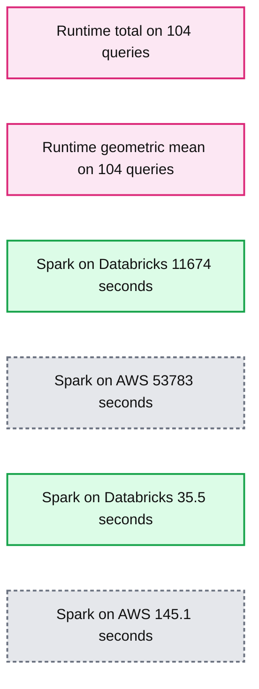
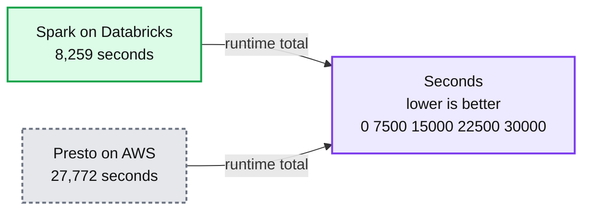
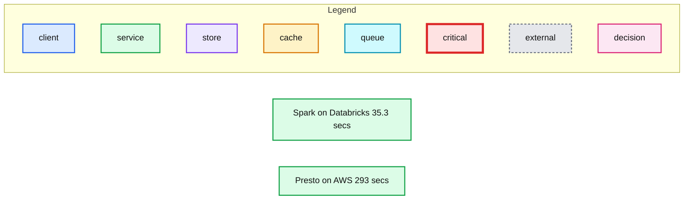
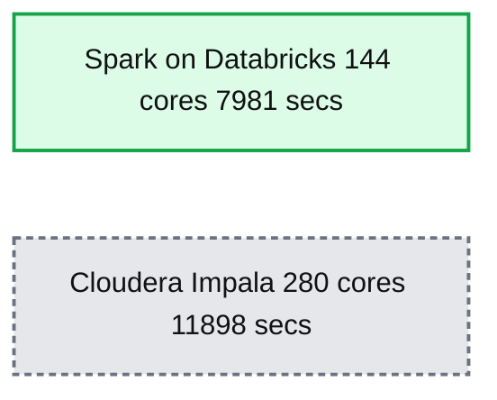
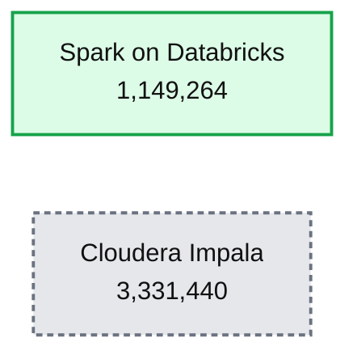

# Benchmarking Big Data SQL Platforms in the Cloud

- Source: https://www.databricks.com/blog/2017/07/12/benchmarking-big-data-sql-platforms-in-the-cloud.html
- Published: 2017-07-12
- Authors: Juliusz Sompolski, Reynold Xin
- Categories: engineering, open-source
- Images: 5 total, 5 extracted as architecture

>  For a deeper dive on these benchmarks, [watch the webinar](https://www.databricks.com/) featuring Reynold Xin.

Performance is often a key factor in choosing big data platforms. Given SQL is the lingua franca for big data analysis, we wanted to make sure we are offering one of the most performant SQL platforms in our [Unified Analytics Platform](https://www.databricks.com/product/data-lakehouse).

In this blog post, we compare [Databricks Runtime 3.0](https://www.databricks.com/blog/2017/05/24/databricks-runtime-3-0-beta-delivers-enterprise-grade-apache-spark.html) (which includes Apache Spark and our DBIO accelerator module) with vanilla open source Apache Spark and Presto on in the cloud using the industry standard [TPC-DS v2.4](http://www.tpc.org/tpcds/) benchmark. In addition to the cloud setup, the Databricks Runtime is compared at 10TB scale to a recent [Cloudera benchmark](https://blog.cloudera.com/apache-impala-leads-traditional-analytic-database/) on Apache Impala using on-premises hardware. In this case, only 77 of the 104 TPC-DS queries are reported in the Impala results published by Cloudera.

The summary of results reveal that:

1. Databricks Runtime 3.0 outperforms vanilla Spark on AWS by 5X using the same hardware specs.
2. Databricks outperforms Presto by 8X. While Presto could run only 62 out of 104 queries, Databricks ran all.
3. Databricks not only outperforms the on-premise Impala by 3X on the queries picked in the Cloudera report, but also benefits from S3 storage elasticity, compared to fixed-physical disks on-premise.

To reproduce this benchmark, you can get all the scripts from [here](https://github.com/databricks/benchmarks/tree/master/tpc-ds-2.4).

## TPC-DS

Created by a third-party committee, TPC-DS is the de-facto industry standard benchmark for measuring the performance of decision support solutions. According to its [own homepage](http://www.tpc.org/tpcds/), it defines decision support systems as those that examine large volumes of data, give answers to real-world business questions, execute SQL queries of various operational requirements and complexities (e.g., ad-hoc, reporting, iterative OLAP, data mining), and are characterized by high CPU and IO load.

This benchmark includes 104 queries that exercise a large part of the SQL 2003 standards - 99 queries of the TPC-DS benchmark, four of which with two variants (14, 23, 24, 39) and “s_max” query performing a full scan and aggregation of the biggest table, store_sales. As discussed in an [earlier blog post](https://www.databricks.com/blog/2016/07/26/introducing-apache-spark-2-0.html), Spark SQL is one of the few open source SQL engines that are capable of running all TPC-DS queries without modification.

## Databricks Runtime vs Vanilla Apache Spark

We conducted this experiment using the latest Databricks Runtime 3.0 release and compared it with a Spark cluster setup on another popular cloud data platform for AWS. Databricks Runtime augments Spark with an IO layer (DBIO) that enables optimized access to cloud storage (in this case S3).

Cloud storage for optimal Spark performance is different from Spark on-prem HDFS, as the cloud storage IO semantics can introduce network latencies or file inconsistencies — in some cases unsuitable for big data software. But with Spark on Databricks, we eliminate both.

**Summary:** Benchmark comparison showing Spark on Databricks versus Spark on AWS across total runtime and geometric mean for 104 queries.

**Components:**

- Spark on Databricks
- Spark on AWS
- Runtime total benchmark
- Runtime geometric mean benchmark

**Flows:**

- none visible

**Numbers:** 104 queries; seconds; lower is better; 11,674; 53,783; 35.5; 145.1; axis values 0, 15,000, 30,000, 45,000, 60,000, 40, 80, 120, 160

source image: https://www.databricks.com/wp-content/uploads/2017/07/image5-1.png

As illustrated above, **Spark on Databricks performed roughly 5X better in total runtime and 4X better** in [geometric mean](https://en.wikipedia.org/wiki/Geometric_mean). Next, we explain more details of the benchmark setup.

**Hardware Configuration**: We used the following setup on Amazon EC2:

- Machine type: 11 r3.xlarge nodes (10 workers and 1 driver)
- CPU core count: 44 virtual cores (22 physical cores)
- System memory: 335 GB
- Total local disk space for shuffle: 880 GB (benchmark data stored as [Parque](https://www.databricks.com/glossary/what-is-parquet)t on S3)
- Networking performance is described as “Moderate” by Amazon

**Dataset:** TPC-DS 1,000 scale factor, on S3. We chose this instead of scale factor 10000 because Presto, compared in the next section, had severe issues scaling up.

**Query Rewrites:** No query rewrite was done. Both Spark SQL flavors were capable of running all 104 queries.

**Configuration Tuning:** We ran the benchmark using out-of-the-box configuration on Databricks, and with additional manual tuning on the AWS cluster. We initially ran this benchmark on the competing platform using its default configurations but found the performance to be below our expectations. We then did some manual tuning to match the configurations on Databricks so Spark on AWS would perform better. The additional configuration on the non-Databricks platform can be found [here](https://github.com/databricks/benchmarks/blob/master/tpc-ds-2.4/emr-spark/emr-cluster-setup.sh) and [here](https://github.com/databricks/benchmarks/blob/master/tpc-ds-2.4/emr-spark/spark-defaults.json).

To further analyze the query results, we also divided the queries into three categories:

1. **Interactive queries:** Queries in this category complete within 1 mins. In this category, Databricks Runtime 3.0 is 3X faster.
2. **Reporting queries:** Queries in this category complete within 3 mins. In this category, Databricks Runtime 3.0 is 4X faster.
3. **Deep analytics queries:** Long running queries that can take an hour or more. In this category, Databricks Runtime 3.0 is 5X faster.

Because interactive queries were bottlenecked by the latency of metadata discovery, we observed only a 3X speedup, whereas the reporting and deep analytics queries benefited immensely from optimized DBIO. Future versions of DBIO will also improve the latency of metadata discovery substantially to improve interactive queries even more.

## Databricks Runtime vs Presto

Using the same hardware configuration, we also compared Databricks Runtime with Presto on AWS, using the same vendor to set up Presto clusters.

**Hardware Configuration:** Same as above (11 r3.xlarge nodes)

**Dataset:** TPC-DS 1,000 scale factor, on S3

**Query Rewrites:** We had to rewrite some queries for Presto due to the lack of support for grouping function for a rollup. Even with some minor rewrites, only 62 queries could complete on Presto. The rest either crashed the system or returned no result. This explains why the total runtime on Presto is smaller than the total runtime for vanilla Spark from the previous section, as the total runtime for Presto does not take into account the failing queries.

**Summary:** Runtime comparison for 62 queries shows Spark on Databricks completing in 8,259 seconds versus Presto on AWS in 27,772 seconds.

**Components:**

- Spark on Databricks: Databricks Spark SQL
- Presto on AWS: Presto running on AWS
- Runtime axis: seconds, lower is better

**Flows:**

- none

**Numbers:** 62 queries; 8,259 seconds; 27,772 seconds; axis values 0, 7,500, 15,000, 22,500, 30,000; lower is better

source image: https://www.databricks.com/wp-content/uploads/2017/07/image7-1.png

**Summary:** Runtime geometric mean for 62 completed queries compares Spark on Databricks with Presto on AWS, where lower seconds are better.

**Components:**

- Spark on Databricks - Spark SQL on Databricks
- Presto on AWS - Presto running on AWS

**Flows:**

- none

**Numbers:** 62 queries; secs; lower is better; 35.3; 293; 0; 75; 150; 225; 300

source image: https://www.databricks.com/wp-content/uploads/2017/07/image3-1.png

As illustrated above, Spark SQL on Databricks completed all 104 queries, versus the 62 by Presto. Comparing only the 62 queries Presto was able to run, Databricks Runtime performed 8X better in geometric mean than Presto. **Databricks Runtime is 8X faster than Presto, with richer ANSI SQL support.**

## Databricks in the Cloud vs Apache Impala On-prem

Apache Impala is another popular query engine in the big data space, used primarily by Cloudera customers. Cloudera publishes benchmark numbers for the Impala engine themselves. The [most recent benchmark](https://blog.cloudera.com/apache-impala-leads-traditional-analytic-database/) was published two months ago by Cloudera and ran only 77 queries out of the 104.

In this experiment, we asked ourselves: how does the Databricks Runtime in a cloud setup compares to the Impala results on physical hardware? What if we compare using out-of-the-box configuration of Databricks to Impala tuned by the engineering team behind the product, and the set of cherry-picked queries? Moreover, what is the performance of Spark on S3 to Impala with physical disks? This section presents the result from this experiment.

**Hardware Configuration:**

|  | Databricks Runtime | Cloudera Impala |
|---|---|---|
| CPU core count | 144 (288 AWS vCPUs) | 280 |
| Memory (GB) | 2196 | 1792 |
| Local Disk (TB) | 68 | 112 |
| Data storage | S3 (decoupled storage and compute) | HDFS (local disks) |
| Machine details | 18 cloud i3.4xlarge | 7 on-prem nodes |

**Dataset:** For Databricks, TPC-DS 10000 scale factor, on S3. For Impala, on HDFS.

**Query Rewrites:** None, but the set of 77 queries selected by the Cloudera team excluded some of the most demanding queries in TPC-DS.

**Configuration Tuning:** None on Databricks; we ran with out-of-the-box configuration. Unknown for what was done in the Cloudera benchmark, as it was not reported (look at the comments).

All 104 queries completed at the 10000 scale factor in 19990 seconds. The following chart compares the runtime for the 77 queries picked by Cloudera in their report:

**Summary:** Runtime comparison for 77 Impala queries, showing Spark on Databricks completing them faster than Cloudera Impala.

**Components:**

- Spark on Databricks using 144 cores
- Cloudera Impala using 280 cores
- Runtime axis measured in seconds, where lower is better

**Flows:**

- None

**Numbers:** 77 queries; 7,981 secs; 144 cores; 11,898 secs; 280 cores; axis values 0, 3,750, 7,500, 11,250, 15,000; lower is better

source image: https://www.databricks.com/wp-content/uploads/2017/07/image6-1.png

In the case where we take the number of CPUs as a normalization factor, Databricks Runtime, using commodity hardware in the cloud, is 3X more efficient than Impala:

**Summary:** Benchmark chart comparing CPU-normalized runtime for 77 Impala queries on Spark on Databricks and Cloudera Impala.

**Components:**

- Spark on Databricks - Apache Spark running on Databricks
- Cloudera Impala - Cloudera Impala

**Flows:**

- none

**Numbers:**

- 77 Impala queries
- CPU cores
- CPU time
- Lower is better
- Spark on Databricks: 1,149,264
- Cloudera Impala: 3,331,440
- Axis values: 0, 1,000,000, 2,000,000, 3,000,000, 4,000,000

source image: https://www.databricks.com/wp-content/uploads/2017/07/image2-1.png

Databricks Runtime achieves better performance to the numbers published by Cloudera on Impala, on queries picked by Impala’s engineering team, using a cluster with only half of the physical CPU cores. One important factor these numbers alone don’t highlight is that Databricks experiment was run against data in S3, using decoupled storage and compute, which adds elasticity and ease of management compared to local disks, as done in the Impala benchmark.

In an [earlier blog post comparing S3 vs HDFS](https://www.databricks.com/blog/2017/05/31/top-5-reasons-for-choosing-s3-over-hdfs.html), we came to the conclusion that S3 has a much lower total cost of ownership, while HDFS might have better performance on a per node basis. This benchmark result has shown that with our optimizations, it is possible to have the best of both worlds: flexibility and lower TCO of the cloud, with better than on-prem performance, and with a broader set of ANSI SQL support.

## Conclusion

This blog post reports the benchmark we have conducted comparing Databricks Runtime 3.0 with other big data engines, including vanilla Apache Spark and Presto in the cloud. Even after improving the Spark configuration in Spark on AWS, Databricks Runtime outperforms vanilla Spark by 5X using the same hardware specs.

When compared to Presto, Databricks Runtime performed 8X better, while being able to run all queries. Presto could run only 62 out of the 104 queries, while Spark was able to run the 104 unmodified in both vanilla open source version and in Databricks.

Additionally to the cloud results, we have compared our platform to a recent Impala 10TB scale result set by Cloudera. While the results were from an on-prem cluster, Databricks Runtime outperforms the on-premises Impala by 3X on the queries picked in the report to the same number of CPU cores. Databricks Runtime test uses S3 as storage with the additional cloud elasticity leading to lower TCO than on-prem.

For a deeper dive on these benchmarks, [watch the webinar](https://www.databricks.com/) featuring Reynold Xin.

To leverage the latest performance optimizations in Databricks Runtime 3.0, [sign up for a Databricks account](https://www.databricks.com/try-databricks).
