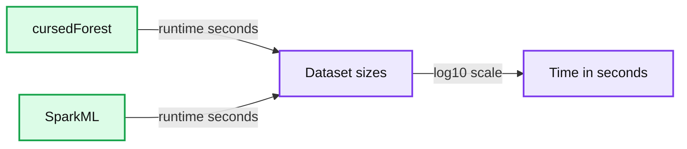
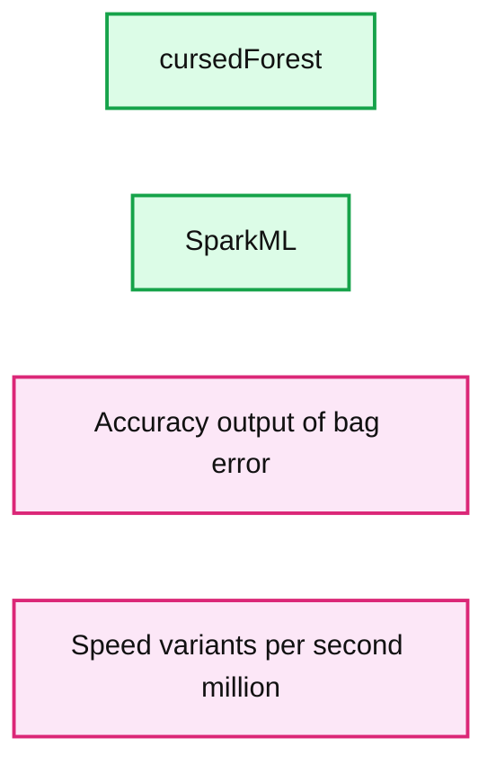
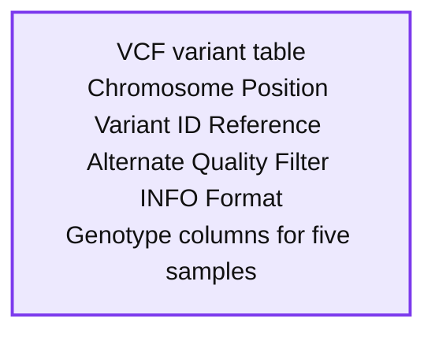
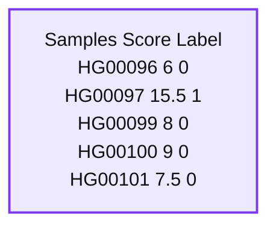

# Breaking the “curse of dimensionality” in Genomics using “wide” Random Forests

- Source: https://www.databricks.com/blog/2017/07/26/breaking-the-curse-of-dimensionality-in-genomics-using-wide-random-forests.html
- Published: 2017-07-26
- Authors: Denis C. Bauer, Lynn Langit, Oscar Luo, Piotr Szul, Aidan O’Brien
- Categories: engineering, solutions, data-science-machine-learning, open-source
- Images: 7 total, 5 extracted as architecture

*This is a guest blog from members of [CSIRO’s](https://www.csiro.au/) transformational bioinformatics team in Sydney, Australia. CSIRO, Australia’s government research agency, is in the top 1% of global research institutions with inventions like fast WiFi, the Hendra virus vaccine, and polymer banknotes. It is their technical account of a scalable [VariantSpark](https://github.com/aehrc/VariantSpark) toolkit for genomic analysis at scale using Apache Spark on Databricks.*

[Try this notebook in Databricks](https://aehrc.github.io/VariantSpark/notebook-examples/VariantSpark_HipsterIndex.html)

We are in the midst of the digital revolution where consumers and businesses demand decisions be based on evidence collected from data. The resulting datafication of almost everything produces datasets that are not only growing **vertically**, by capturing more events, but also **horizontally** by capturing more information about these events.

The challenge of big and “wide'' data is especially pronounced in the health and bioinformatics space where, for example, whole genome sequencing (WGS) technology enables researchers to interrogate all 3 billion base pairs of the human genome.

Data acquisition in this space is predicted to outpace that of traditional big data disciplines, such as astronomy or youtube 1, as 50% of the world’s population will have been sequenced to inform a medical decision by 2030. 2

As such, the analysis of medical genomics data is at the forefront of this growing need to apply sophisticated machine learning methods to large high-dimensional datasets. A common task in this field is to identify disease genes, that is where small errors in the gene sequence have had a detrimental health impact, such as neurodegenerative diseases or cancer. This has typically been done by looking at one genomic location at a time and assessing whether it is mutated in a large number of affected individuals compared to a healthy test group.

However, biology is much more complicated than that. For most common diseases, like Alzheimer's or stroke, small differences may individually have no or only a small effect; joined together they can trigger the ‘perfect storm.’ It can get even more complicated as variants may interact with each other and between individuals it can be different sets of interacting variants that cause disease.

In this blog, we explain why we needed to design a novel parallelization algorithm for Random Forests. Although Apache Spark’s MLlib is designed for the common use cases in which there are hundreds of thousands of features, in genomics, we needed to scale to the millions of genomic features. We give details on the new algorithm being based on Spark Core as it provides the parallelization agility needed to orchestrate this massively distributed machine learning task.

Furthermore, we highlight that VariantSpark can be triggered from a Databricks notebook, which enables researchers to just point it to their data in an S3 bucket and start analyzing without worrying about cluster specs or data transfer. This frees up time to do more research and fosters better collaborations as notebooks can be worked on simultaneously and provide a reproducible record conducted experiments.

## Random Forest models disease biology

Finding such interacting sets of ‘needles’ in the ‘haystack’ is impossible for statistical models due to the size of the combinatorial space they need to interrogate. Machine Learning methods, in particular Random Forest (RF), on the other hand are well suited to identify sets of features (e.g., mutations or more generally variants) that are predictive or associated with a label (e.g., disease).

RF has also a reduced risk of overfitting compared to other machine learning methods, which is crucial for situations where the dataset has many more features than samples. These situations suffer from the “curse of dimensionality,” and RF overcomes this by building independent decision trees each trained on a sub-sampled range of the dataset with the global decision based on all ensemble of trees.

## Making Random Forest scalable to modern data sizes

However, to deal with big datasets, the generation of RF need to be parallelized. Current Big Data algorithms for Decision Trees, such as Google’s PLANET or YGGDRASIL led by MIT and UCLA are designed for lower dimensional data. YGGDRASIL was showcased at last year’s Spark Summit for datasets with 3,500 features, which is orders of magnitude smaller than what is necessary for genomics data ranging in the millions.

[CSIRO](https://www.csiro.au/), Australia’s government research agency, developed a new parallelization strategy to cater for this new discipline of machine learning on high-dimensional data that can be applied to forests of decision trees.

[VariantSpark RF](https://github.com/aehrc/VariantSpark) starts by randomly assigning subsets of the data to Spark Executors for decision tree building (Fig 1). It then calculates the best split over all nodes and trees simultaneously. This implementation avoids communication bottlenecks between Spark Driver and Executors as information exchange is minimal, allowing it to build large numbers of trees efficiently. This surveys the solution space appropriately to cater for millions of features and thousands of samples.

Furthermore, VariantSpark RF has memory efficient representation of genomics data, optimized communication patterns and computation batching. It also provides efficient implementation of Out-Of-Bag (OOB) error, which substantially simplifies parameter tuning over the computationally more costly alternative of cross-validation.

We implemented VariantSpark RF in scala as it is the most performant interface languages to Apache Spark. Also, new updates to Spark and the interacting APIs will be deployed in scala first, which has been important when working on top of a fast evolving framework.

**Summary:** VariantSpark RF samples individuals and genomic features, computes tree splits in parallel with Apache Spark, and generates consensus results for classification or association.

**Components:**

- Samples and features: VCF genomic variant data
- Random sampling: selects individuals and features
- Random forest: multiple decision trees
- Sample subset: tree-specific sampled data
- Variant partitioning: binary variant splits
- Local best split: executor-side Gini scoring
- Global best split: driver-side reduction across workers
- Consensus analysis: classification and association outputs

**Flows:**

- Samples and features -> Random sampling: sampled individuals and features
- Random sampling -> Random forest: sampled data for each tree
- Random forest -> Sample subset: tree-specific subset
- Sample subset -> Variant partitioning: variants evaluated as binary splits
- Variant partitioning -> Local best split: candidate split scoring
- Local best split -> Global best split: Gini scores from executors
- Global best split -> Consensus analysis: best split at each tree level
- Consensus analysis -> Classification: phenotype group consensus
- Consensus analysis -> Association: variant association consensus

**Numbers:** 1, 2, 3, 0|1, 0.02, s1...sn, p1...pn, p1, p5334, Tree 1, Tree n, VCF, Gini, Phenotype1, Phenotypen

```mermaid
%% Shows parallel VariantSpark random forest split calculation and consensus analysis
flowchart LR
    A[Samples and features] -->|sample individuals and features| B[Random sampling]
    B -->|sampled data| C[Random forest trees]
    C -->|tree specific data| D[Sample subset]
    D -->|binary variant values| E[Variant partitioning]
    E -->|candidate split scores| F[Local best split]
    F -->|Gini scores from executors| G[Global best split]
    G -->|best split per level| H[Consensus analysis]
    H -->|phenotype consensus| I[Classification]
    H -->|variant consensus| J[Association]

    classDef client fill:#dbeafe,stroke:#2563eb,stroke-width:2px,color:#111
    classDef service fill:#dcfce7,stroke:#16a34a,stroke-width:2px,color:#111
    classDef store fill:#ede9fe,stroke:#7c3aed,stroke-width:2px,color:#111
    classDef cache fill:#fef3c7,stroke:#d97706,stroke-width:2px,color:#111
    classDef queue fill:#cffafe,stroke:#0891b2,stroke-width:2px,color:#111
    classDef critical fill:#fee2e2,stroke:#dc2626,stroke-width:4px,color:#111
    classDef external fill:#e5e7eb,stroke:#6b7280,stroke-width:2px,color:#111,stroke-dasharray:4 3
    classDef decision fill:#fce7f3,stroke:#db2777,stroke-width:2px,color:#111

    class A external
    class B,C,D,E,F,G,H service
    class I,J client
```

source image: https://www.databricks.com/wp-content/uploads/2017/07/variant_spark.jpg

## VariantSpark RF scales to Thousands of samples with Millions of features

In 2015, CSIRO developed the first version of VariantSpark, which was limited to unsupervised clustering and was built on top of Spark MLlib. In the resulting peer-reviewed publication 3, we clustered individuals from the 1000 Genomes Project to identify their ethnicity. This dataset contained ~2,500 individuals with ~80 Million genomic variants and we achieved a correct prediction rate of 82% (accuracy).

We wanted to re-evaluate this dataset using the random forest implementation in Spark MLlib to improve the accuracy using supervised learning. However, MLlib’s RF was not able to process the entire dataset and ran out of memory on an on-premise Hadoop-cluster with 12 Executors (16 Intel Xeon E5-2660@2.20GHz CPU cores and 128GB of RAM) for even a small subset of the original data (2,504 samples 6,450,364 features).

In contrast, the new version of VariantSpark, which implements the RF with a novel parallelization algorithm built on Spark Core directly, was able to process the entire dataset using the same cluster setup. It is processing over 15 Million variants per second from the 202 Billion variants in the dataset and was finishing in 3 hours. Being the only method to use the whole dataset, VariantSpark RF achieved a higher accuracy 0.96 (OOB=0.02) (Fig 2).

**Summary:** Benchmark chart comparing cursedForest and SparkML runtime across increasing samples multiplied by features.

**Components:**

- cursedForest: Random forest implementation
- SparkML: Spark machine learning implementation
- Dataset size: samples multiplied by features on a log10 scale
- Runtime metric: time in seconds

**Flows:**

- cursedForest -> Dataset sizes: runtime measurements
- SparkML -> Dataset sizes: runtime measurements

**Numbers:** 0, 10000, 20000, 30000, 40000, 50000, 1e+09, 1e+10, 1e+11

source image: https://www.databricks.com/wp-content/uploads/2017/07/1000genomesRuntime.jpg

**Summary:** Benchmark chart comparing cursedForest and SparkML by accuracy and processing speed.

**Components:**

- cursedForest program
- SparkML program
- Accuracy output-of-bag error axis
- Speed variants per second in millions axis

**Flows:**

- none

**Numbers:** 15, 10, 5, 0.04, 0.03, 0.02, 0.01, 0.00

source image: https://www.databricks.com/wp-content/uploads/2017/07/1000genomesAccuracy.jpg

***Fig. 2** Performance comparison of VariantSpark RF and Spark MLlib on 1000 Genomes Project dataset. **Top** Runtime over different dataset sizes, cross marks the last dataset analyzed successfully. **Bottom** Accuracy achieved at termination point and number of features processed per second.*

## VariantSpark RF helps disease gene association discovery

The main achievement of VariantSpark RF is to enable -- for the first time -- the identification of disease causing variants by taking the higher-order genome-wide interactions between genomic loci into account.

To illustrate the benefit of this new powerful analysis, we created a synthetic dataset that simulates the mechanics of a complex disease or phenotype. We call this synthetic affliction “Hipsterism.” To create this, we first identified peer-reviewed and published traits, such as propensity for facial hair or higher coffee consumption, that are commonly associated with being a Hipster.

We then score each individual in the 1000 Genomes Project dataset with the formula below, which joins information from these genome-wide locations in a similarly non-purely-additive way as a real complex phenotype would:

Where GT stands for the genotype at this position with *homozygous* reference encoded as 0, *heterozygote* as 1, and *homozygote alternative* as 2. We then label individuals with a score above 10 as being a Hipster. The genomic information from all individuals with the synthetic Hipster label was then used to train VariantSpark RF to find the features that are most predictive or associated with this synthetic Hipster-phenotype.

VariantSpark RF was able to correctly identify the 4 correct locations purely from the given Hipster label. Not only that, it identified the location in order of their exact weighting in the score’s formula, which similar tools were not able to achieve (Fig 3).

***Fig. 3** Synthetic phenotype demonstrating the ability of VariantSpark RF to identify sets of variants contributing to the phenotype even in a non-additive way.*

## Running VariantSpark RF

Unlike other statistical approaches, RF has the advantage of not needing the data to be extensively processed. Furthermore, we deploy the jar file for VariantSpark RF through Maven Central, which enables the users to import the latest version of the software directly into their Databricks notebook. Together with VariantSpark’s API designed to ingest standard genomics variant data formats (VCF), getting to the association testing started is done with three easy commands:

Firstly, import the genomic data. Here, we show genomic data in VCF format, which looks like this:

**Summary:** A VCF genomic variant table showing variant metadata and genotype values across samples.

**Components:**

- Chromosome field
- Position field
- Variant ID field
- Reference allele field
- Alternate allele field
- Quality field
- Filter field
- INFO field
- FORMAT field
- HG00096 sample genotype
- HG00097 sample genotype
- HG00099 sample genotype
- HG00100 sample genotype
- HG00101 sample genotype

**Flows:**

- None visible.

**Numbers:** 2, 109511398, 109511454, 109511463, 109511467, 109511478, rs150055772, rs558429529, rs200762071, rs145115545, rs540842456, 100, HG00096, HG00097, HG00099, HG00100, HG00101, 0|0, 1|0

source image: https://www.databricks.com/wp-content/uploads/2017/07/VCFblack.jpg

 Secondly, import the label data. Here, we show the synthetic hipster index which has two categories 1=yes, 0=no hipster

**Summary:** A labeled sample table containing sample identifiers, scores, and binary labels.

**Components:**

- Samples column with genomic sample identifiers
- Score column with numeric scores
- Label column with binary class labels

**Flows:**

- none

**Numbers:** 6, 0, 97, 15.5, 1, 99, 8, 100, 9, 101, 7.5

source image: https://www.databricks.com/wp-content/uploads/2017/07/labelblack.jpg

 Thirdly, run the `ImportanceAnalysis` of VariantSpark RF to identify the features that are most associated with the label. Here, it will return the genomic locations that are most associated with the binary Hipster label.

 Note, apart from VCF and CSV file format, VariantSpark also works with the ADAM 4 data schema, implemented on top of Avro and Parquet, as well as the HAIL API 5 for variant pre-processing.

### Conclusion

In this blog post, we introduced VariantSpark RF, a new library that allows random forest to be applied to high-dimensional datasets. The novel Spark-based parallelization allows a large number of trees to be built simultaneously, hence enabling the solution space to be searched more exhaustively than other methods.

While genomics is currently the discipline producing the largest volumes of complex data, the ongoing datafication will bring similar analysis challenges to other disciplines.

VariantSpark RF may hence be capable of converting these challenges to opportunities on those disciplines as well.

Hence running VariantSpark through API calls in a Databricks notebook makes sophisticated machine learning on Big Data very accessible. Databricks has specifically simplified the use of otherwise complex Spark infrastructure and enables teams of researchers to co-develop and share research workflows.

To learn more about the VariantSpark RF, run the Databricks notebook6 with the HipsterIndex example yourself. You can also apply VariantSpark RF to your own data on [Databricks today](https://www.databricks.com/try-databricks) or by downloading the source code from github repository.

## What’s Next?

VariantSpark RF 7 will continued to be expanded to cover different applications area. For example, we will extend the current multi-nominal classification to a full regression analysis to cover continuous response variables or scores. Also, we will support a mix of categorical and continuous features as well as allow vastly different feature value ranges, e.g. needed for gene expression analysis.

### **Scale Your Genomic Analyses with Databricks!**

For many organizations the processing and downstream analyses of large genomic datasets  has become a major bottleneck. The Databricks Unified Analytics Platform for Genomics powered by Apache SparkTM addresses these challenges with a single, collaborative platform for genomic data processing, tertiary analytics and AI at massive scale.

- [Take the platform for a spin](https://pages.databricks.com/genomics-preview.html)
- [Learn more about our genomics solutions](https://www.databricks.com/product/genomics)

---

1.  https://www.ncbi.nlm.nih.gov/pubmed/26151137 ↩
2.  Frost & Sullivan: Global Precision Market Growth Opportunities, Forecast to 2015 2017 ↩
3.  O’Brien et al. BMC Genomics 2015 https://bmcgenomics.biomedcentral.com/articles/10.1186/s12864-015-2269-7 ↩
4.  https://github.com/bigdatagenomics/adam ↩
5.  https://hail.is ↩
6.  https://aehrc.github.io/VariantSpark/notebook-examples/VariantSpark_HipsterIndex.html ↩
7.  https://github.com/aehrc/VariantSpark ↩
