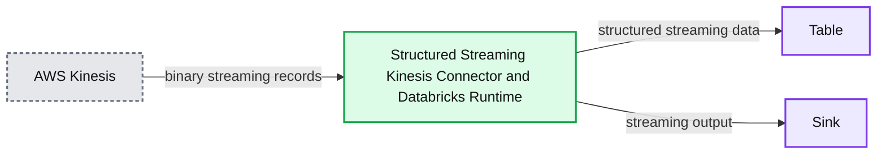
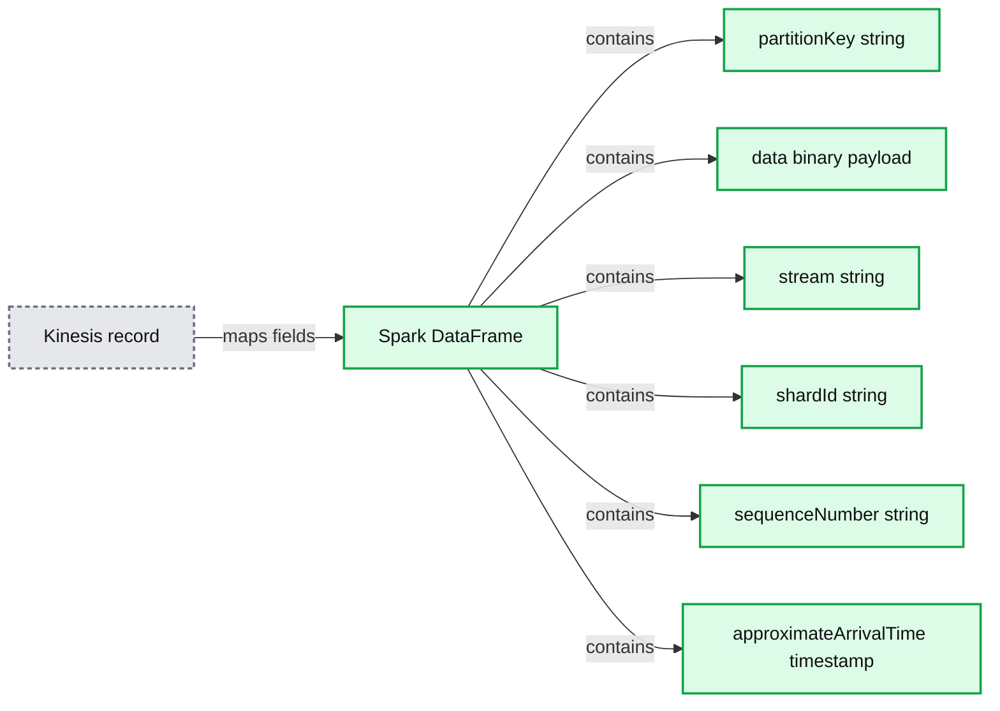

# Apache Spark’s Structured Streaming with Amazon Kinesis on Databricks

- Source: https://www.databricks.com/blog/2017/08/09/apache-sparks-structured-streaming-with-amazon-kinesis-on-databricks.html
- Published: 2017-08-09
- Authors: Jules Damji
- Categories: product, data-streaming, company
- Images: 3 total, 3 extracted as architecture

On July 11, 2017, we announced the general availability of [Apache Spark 2.2.0](https://www.databricks.com/blog/2017/07/11/introducing-apache-spark-2-2.html) as part of [Databricks Runtime 3.0](https://docs.databricks.com/release-notes/runtime/3.0.html) (DBR) for the [Unified Analytics Platform](https://www.databricks.com/product/data-lakehouse). To augment the scope of Structured Streaming on DBR, we support [AWS Kinesis Connector](https://docs.databricks.com/spark/latest/structured-streaming/kinesis.html) as a source (to read streams from), giving developers the freedom to do three things.

First, you can choose either Apache Kafka or Amazon’s Kinesis as a *source* to read streaming data. Second, you are not shackled to Kinesis Analytics for doing analytics but can use Spark SQL and Structured APIs. And finally, you can use Apache Spark on the [Unified Databricks Data + AI Platform](https://www.databricks.com/product/data-lakehouse), along with other workloads, to write your end-to-end [continuous applications](https://www.databricks.com/blog/2016/07/28/continuous-applications-evolving-streaming-in-apache-spark-2-0.html).

In this blog, we’ll discuss four aspects of the Kinesis connector for S[tructured Streaming](https://www.databricks.com/glossary/what-is-structured-streaming) so that you can get started quickly on Databricks, and with minimal changes, you can switch to other streaming *sources* and *sinks* of your choice.

1. Kinesis Data Schema
2. Configuration Parameters
3. Authentication with AWS Kinesis
4. Anatomy of a Kinesis Structured Streaming Application

**Summary:** AWS Kinesis streams data through the Structured Streaming Kinesis Connector and Databricks Runtime to a table and a sink.

**Components:**

- AWS Kinesis
- Structured Streaming, Kinesis Connector and Databricks Runtime
- Table
- Sink

**Flows:**

- AWS Kinesis -> Structured Streaming Kinesis Connector and Databricks Runtime: binary streaming records
- Structured Streaming Kinesis Connector and Databricks Runtime -> Table: structured streaming data
- Structured Streaming Kinesis Connector and Databricks Runtime -> Sink: streaming output

**Numbers:** 10101010; 1

source image: https://www.databricks.com/wp-content/uploads/2017/08/kinesis_blog_final.jpg

## Kinesis Data Schema

Knowing what Kinesis records you’ve read from a stream and understanding how those records map to a defined schema make developers’ lives easier. Even better if a [Kinesis record](https://docs.aws.amazon.com/AWSJavaSDK/latest/javadoc/com/amazonaws/services/kinesis/model/Record.html) maps to [Apache Spark’s DataFrames](https://spark.apache.org/docs/latest/sql-programming-guide.html), with named columns and their associated types. Then you can select the desired payload from the Kinesis record, by accessing the column from the resulting DataFrame and employ DataFrame APIs operations.

**Summary:** Table showing how a Kinesis record maps to a Spark DataFrame with named columns and data types.

**Components:**

- partitionKey column, string
- data column, binary payload
- stream column, string
- shardId column, string
- sequenceNumber column, string
- approximateArrivalTime column, timestamp

**Flows:**

- Kinesis record -> Spark DataFrame: maps record fields to named columns

**Numbers:** none

source image: https://www.databricks.com/wp-content/uploads/2017/08/Screen-Shot-2017-08-08-at-1.20.03-PM.png

Let’s assume you send JSON blobs to Kinesis as your records. To access the binary data payload, which is your JSON encoded data, you can use the DataFrame API method as `cast(data as STRING) as JsonData` to deserialize your binary payload data into a JSON string. Furthermore, once converted to a JSON string, you can then use `from_json()` [SQL utility functions](https://www.databricks.com/blog/2017/06/13/five-spark-sql-utility-functions-extract-explore-complex-data-types.html) to explode into respective DataFrame columns.

Hence, knowing the Kinesis schema and how it maps to a DataFrame makes things easier to do streaming [ETL](https://www.databricks.com/glossary/extract-transform-load), whether your data is simple, such as words, or structured and complex, such as nested JSON.

## Kinesis Configuration

Just as important as understanding Kinesis record and its schema is knowing the right [configuration parameters and options](https://docs.databricks.com/spark/latest/structured-streaming/kinesis.html#configuring) to supply in your Kinesis connector code. While options are many, few import ones are worthy of note:

**Summary:** The table shows configuration options for the Amazon Kinesis connector.

**Components:**

- streamName option using stream names
- initialPosition option using stream offsets
- maxRecordPerFetch option using a positive integer

**Flows:**

- none

**Numbers:**

- stream1
- stream2
- N
- 10K
- Table 2

```mermaid
%% Kinesis connector configuration options
flowchart TD
    T["Kinesis Connector Configuration Options"]
    H["Option | Value | Default | Description"]
    S["streamName | stream1 stream2 N | required | The name of streams to read from"]
    I["initialPosition | earliest latest | latest | Where to start reading from the stream"]
    M["maxRecordPerFetch | Positive integer | 10K | How many records to read per API call to Kinesis"]

    classDef client   fill:#dbeafe,stroke:#2563eb,stroke-width:2px,color:#111
    classDef service  fill:#dcfce7,stroke:#16a34a,stroke-width:2px,color:#111
    classDef store    fill:#ede9fe,stroke:#7c3aed,stroke-width:2px,color:#111
    classDef cache    fill:#fef3c7,stroke:#d97706,stroke-width:2px,color:#111
    classDef queue    fill:#cffafe,stroke:#0891b2,stroke-width:2px,color:#111
    classDef critical fill:#fee2e2,stroke:#dc2626,stroke-width:4px,color:#111
    classDef external fill:#e5e7eb,stroke:#6b7280,stroke-width:2px,color:#111,stroke-dasharray:4 3
    classDef decision fill:#fce7f3,stroke:#db2777,stroke-width:2px,color:#111

    class T,H,S,I,M service
```

source image: https://www.databricks.com/wp-content/uploads/2017/08/Screen-Shot-2017-08-08-at-1.29.11-PM.png

For detailed options read [Kinesis configuration documentation](https://docs.databricks.com/spark/latest/structured-streaming/kinesis.html#configuring).

Now that we know the format of our DataFrame derived from the [Kinesis record](https://docs.aws.amazon.com/AWSJavaSDK/latest/javadoc/com/amazonaws/services/kinesis/model/Record.html) and understand what options we can supply to Kinesis connector to read a stream, we can write our code, as shown below in the anatomy of a Kinesis streaming application. But first, we must pass through AWS security gatekeepers for authentication.

## Authentication with AWS Kinesis

By default, the Kinesis connector resorts to [Amazon’s default credential provider chain](https://docs.aws.amazon.com/sdk-for-java/v1/developer-guide/credentials.html#credentials-default), so if you have created an IAM role for your Databricks cluster that includes access to Kinesis then access will be automatically granted. Additionally, depending on your IAM role access, the same default credentials will grant you access to AWS S3 buckets for writing.

Alternatively, you can explicitly supply credentials as part of the “options” to the Kinesis connector. When supplying explicit secret keys, use two “option” parameters: `awsAccessKey` and `awsSecretKey`. However, we recommend using [AWS IAM Roles](https://docs.aws.amazon.com/IAM/latest/UserGuide/id_roles.html) instead of providing keys in production.

## Anatomy of a Kinesis Structured Streaming Application

So far we introduced three concepts that enable us to write our Structured Streaming application using the Kinesis connector. A Structured Streaming application has a distinct anatomy, serial steps, regardless of your streaming *sources* or *sinks*. Let’s study each step.

### Step 1: Defining your data’s schema

Although the Kinesis connector can read any encoded data—including JSON, Avro, bytes—as long as you can decode it in your receiving Spark code, for this blog we will assume that our Kinesis stream is fed with device data encoded as a JSON string, with the following schemas.

[code_tabs]

[/code_tabs]

### Step 2: Reading from your source

One you have defined your schema, the next step is to read your stream, using Kinesis connector. By only specifying your source format, namely “kinesis,” Databricks will automatically use the Kinesis connector for reading. It will handle all aspects of what shard to read from and keep track of all the metadata. You need not worry about it.

Something to note here is that if my *source* were other than “kinesis,” I would simply change this to indicate “kafka” or “socket,” and drop the AWS credentials.

[code_tabs]

[/code_tabs]

### Step 3: Exploring or Transforming streams

Once we have our data loaded and the Kinesis records now have been mapped to DataFrames, we can use the SQL and DataFrames/Datasets API to process. And the underlying streaming engines will ensure exactly-once semantics and fault-tolerance. To learn more about how [Spark Streaming](https://www.databricks.com/glossary/what-is-spark-streaming) achieves this vital functionality in Structured Streaming, view our deep dive [Spark Summit session](https://www.databricks.com/dataaisummit/).

[code_tabs]

[/code_tabs]

This step is where most of your analytics is done and where your actionable insights are derived from. By using Spark’s Structured APIs in this step, you get all the merits of Spark SQL performance and compact-code generation from Tungsten, without using another SQL engine or programming in a separate SDK to conduct your ETL or [streaming analytics](https://www.databricks.com/glossary/streaming-analytics).

### Step 4: Saving your transformed stream

Finally, you can optionally write your transformed stream to a [parquet](https://www.databricks.com/glossary/what-is-parquet) file at the specified location in your S3 bucket, partitioned by “date” or “timestamp.” To inform Spark to ensure fault-tolerance, you can specify an option parameter “checkpointLocation,” and the underlying engine will maintain the state.

[code_tabs]

[/code_tabs]

These four basic steps encapsulate an anatomy of a typical Structured Streaming application. Whether your source is Kinesis or Kafka or socket or a local filesystem, you can follow these guidelines and structure your Structured Streaming computation.

What if you want to write your transformed stream to, for instance, your own *sink*, such as Kinesis or NoSQL, presently not supported by Spark’s Structured Streaming. You can write your own *sink* functionality by implementing the [`ForeachSink`interface to write data to Kinesis](https://docs.databricks.com/spark/latest/structured-streaming/kinesis.html#structured-streaming-kinesis-sink).

## What’s Next

Instead of cluttering this blog with a complete code example showing a Kinesis connector streaming application, I’ll refer you to examine and explore the code to do the quintessential “Hello World” of distributed computing [WordCount on Kinesis](https://docs.databricks.com/spark/latest/structured-streaming/kinesis.html#quickstart). Even better, you can import this [WordCount notebook](https://docs.databricks.com/_static/notebooks/structured-streaming-kinesis.html) and supply your AWS credentials—and get on with it.

There’s no need for you to install or attach any Kinesis library. No need to access an external Kinesis SDK. You simply write your Structured Streaming on [Databricks Runtime 3.0](https://docs.databricks.com/release-notes/runtime/3.0.html). We will do the rest.

If you don’t have an account on Databricks, [get one today](https://www.databricks.com/try-databricks).

## Read More

We have a series of [Structured Streaming blogs](https://www.databricks.com/blog/2017/01/19/real-time-streaming-etl-structured-streaming-apache-spark-2-1.html) that expound on many of its features,
 and you can consult our [Kinesis Connector](https://docs.databricks.com/spark/latest/structured-streaming/kinesis.html#) documentation along with
[Structured Streaming Programming guide](https://spark.apache.org/docs/latest/structured-streaming-programming-guide.html) for some immersive reading.
