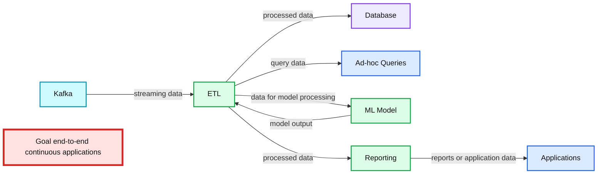

# Anthology of Technical Assets on Apache Spark's Structured Streaming

- Source: https://www.databricks.com/blog/2017/08/24/anthology-of-technical-assets-on-apache-sparks-structured-streaming.html
- Published: 2017-08-24
- Authors: Jules Damji
- Categories: engineering, open-source, data-engineering
- Images: 1 total, 1 extracted as architecture

Older anthologies collated a collection of contributions from various authors around a theme—bounded then as a journal or periodical. Newer anthologies, however, include multiple modals of expressions—digitized now as an ebook or a blog. Both offer an exposition of the subject matter. No matter their form, they provide a single source of focused content.

In this anthology, we have compiled a collection of videos, technical blogs, podcasts, and articles that focus on [Apache Spark's Structured Streaming](https://www.databricks.com/blog/2016/07/28/structured-streaming-in-apache-spark.html).

**Summary:** The diagram shows an ETL-centered continuous application processing Kafka data for databases, ad-hoc queries, ML models, reporting, and applications.

**Components:**

- Kafka - streaming data source
- ETL - continuous processing layer
- Database - durable data store
- Ad-hoc Queries - query interface
- ML Model - machine learning processing
- Reporting - reporting layer
- Applications - downstream consumers
- Goal - end-to-end continuous applications

**Flows:**

- Kafka -> ETL: streaming data
- ETL -> Database: processed data
- ETL -> Ad-hoc Queries: query data
- ETL -> ML Model: data for model processing
- ML Model -> ETL: model output
- ETL -> Reporting: processed data
- Reporting -> Applications: reports or application data

**Numbers:** none

source image: https://www.databricks.com/wp-content/uploads/2016/06/example-apache-spark-continuous-application.png

### [Spark Summit 2017 Keynote: Apache Spark 2.2 and Structured Streaming Demo](https://youtu.be/qAZ5XUz32yM?list=PLTPXxbhUt-YV6RdCNARfSKs3-3Old6XTk)

Databricks' Chief Technologist Matei Zaharia thanks the community's contributions and announces Structured Streaming as ready for production.

### [Easy, Scalable, Fault-tolerant Stream Processing with Structured Streaming in Apache Spark 2.2](https://www.youtube.com/watch?v=8o-cyjMRJWg&feature=youtu.be)

In less than 10 lines of code, you can read streams from Apache Kafka, parse JSON payload data into separate columns, transform it, enrich it by joining with static data and write it out as a table ready for batch or ad-hoc queries. Apache Spark committers and Databricks' engineers Michael Armbrust and Tathagata Das discuss and demonstrate that with concrete examples.

Also, they explain features that allow event-time based aggregations, arbitrary stateful operations, and automatic state management using event-time watermarks.

### [Continuous Applications: Evolving Streaming in Apache Spark 2.x](https://www.databricks.com/blog/2016/07/28/continuous-applications-evolving-streaming-in-apache-spark-2-0.html)

Last year, Databricks' Chief Technologist Matei Zaharia shared his vision of where Apache Spark streaming is heading: Continuous Applications with Structured Streaming is the next step, he wrote.

### [Structured Streaming In Apache Spark: A new high-level API for streaming](https://www.databricks.com/blog/2016/07/28/structured-streaming-in-apache-spark.html)

Databricks' engineers and Apache Spark committers Matei Zaharia, Tathagata Das, Michael Armbrust and Reynold Xin expound on why streaming applications are difficult to write, and how Structured Streaming addresses all the underlying complexities.

### [Real-time Streaming ETL with Structured Streaming in Apache Spark 2.1: Part 1 of Scalable Data @ Databricks](https://www.databricks.com/blog/2017/01/19/real-time-streaming-etl-structured-streaming-apache-spark-2-1.html)

Databricks' engineers Tathagata Das, Michael Armbrust and Tyson Condie show how to do streaming ETL with real-time data at scale.

### [Working with Complex Data Formats with Structured Streaming in Apache Spark 2.1: Part 2 of Scalable Data @ Databricks](https://www.databricks.com/blog/2017/02/23/working-complex-data-formats-structured-streaming-apache-spark-2-1.html)

Learn from Databricks engineers and Apache Spark contributors Burak Yavuz, Michael Armbrust, Tathagata Das, and Tyson Condie how to handle complex and nested data formats with Structured Streaming.

### [Processing Data in Apache Kafka with Structured Streaming in Apache Spark 2.2: Part 3 of Scalable Data @ Databricks](https://www.databricks.com/blog/2017/04/26/processing-data-in-apache-kafka-with-structured-streaming-in-apache-spark-2-2.html)

Databricks engineers and Spark contributors Kunal Khamar, Tyson Condie and Michael Armbrust show how easily you can read streams from Apache Kafka using Structured Streaming APIs in Apache Spark 2.2.

### [Event-time Aggregation and Watermarking in Apache Spark's Structured Streaming: Part 4 of Scalable Data @ Databricks](https://www.databricks.com/blog/2017/05/08/event-time-aggregation-watermarking-apache-sparks-structured-streaming.html)

How to do event-time aggregations and watermarking using simple Structured Streaming APIs? Databricks engineer and Spark committer Tathagata Das explains how.

### [Taking Apache Spark's Structured Streaming to Production: Part 5 of Scalable Data @ Databricks](https://www.databricks.com/blog/2017/05/18/taking-apache-sparks-structured-structured-streaming-to-production.html)

How do you ensure your Structured Streaming Application is ready for production. Product Manager Bill Chambers and Apache Spark committer Michael Armbrust lay out the vital steps, using simple APIs for alerts and monitoring streaming query states.

### [Running Streaming Jobs Once a Day For 10x Cost Savings: Part 6 of Scalable Data @ Databricks](https://www.databricks.com/blog/2017/05/22/running-streaming-jobs-day-10x-cost-savings.html)

Apache Spark contributors Burak Yavuz and Tyson Condie demonstrate how to control and curb costs by using simple APIs such as `Run Once trigger` feature added to Structured Streaming in Spark 2.2. You get all the benefits of the Catalyst Optimizer incrementalizing your workload and the cost savings of not having an idle cluster lying around.

### [Arbitrary Stateful Processing in Apache Spark's Structured Streaming: Part 7 of Scalable Data @ Databricks](https://www.databricks.com/blog/2017/10/17/arbitrary-stateful-processing-in-apache-sparks-structured-streaming.html)

Databricks Product Manager Bill Chambers and Spark Community Evangelist Jules Damji demonstrate how to use Structure Streaming APIs for Customized and Arbitrary Stateful Processing

### [Real-Time End-to-End Integration with Apache Kafka in Apache Spark's Structured Streaming](https://www.databricks.com/blog/2017/04/04/real-time-end-to-end-integration-with-apache-kafka-in-apache-sparks-structured-streaming.html)

Databricks Senior Solution Architect Sunil Sitaula guides you through an end-to-end integration with Apache Kafka, consuming messages from it, doing simple to complex windowing ETL, and pushing the desired output to various sinks such as memory, console, file, databases, and back to Kafka itself.

### [Making Apache Spark the Fastest Open Source Streaming Engine](https://www.databricks.com/blog/2017/06/06/simple-super-fast-streaming-engine-apache-spark.html)

Databricks' lead on Structured Streaming and Spark committer Michael Armbrust avers why Structured Streaming is the fastest open source engine compared to other streaming engines.

### [Apache Spark's Structured Streaming with Amazon Kinesis on Databricks: A quick guide on how to get started with Kinesis Connector](https://www.databricks.com/blog/2017/08/09/apache-sparks-structured-streaming-with-amazon-kinesis-on-databricks.html)

Databricks' Spark Community Evangelist Jules Damji outlines steps to use AWS Kinesis with Structured Streaming in Apache Spark 2.2 on Databricks Runtime 3.0.

### [Arbitrary Stateful Aggregations in Structured Streaming in Apache Spark](https://www.databricks.com/blog/2017/05/26/bay-area-apache-spark-meetup-summary.html)

In this Bay Area Apache Spark Meetup talk, Burak Yavuz, Spark committer and Databricks software engineer, expands on how to use Structured Streaming APIs to maintain stateful aggregations.

### [Structured Streaming Comes to Apache Spark 2.0](https://www.oreilly.com/radar/podcast/structured-streaming-comes-to-apache-spark-2-0/)

O'Reilly's Chief Data Scientist Ben Lorica sits down with Michael Armbrust and talks about life and structured streaming.

### [What Spark's Structured Streaming Really Means](https://www.infoworld.com/article/3052924/what-sparks-structured-streaming-really-means.html)

[Ion Pointer](https://www.infoworld.com/author/Ian-Pointer/) (contributor for InfoWorld) advocates why DataFrames are the best choice for Apache Spark Streaming in Spark 2.0, and why structured streaming makes sense.

### [Apache Spark 2.0 to Introduce New 'Structured Streaming' Engine](https://www.datanami.com/2016/02/25/spark-2-0-to-introduce-new-structured-streaming-engine/)

[Datanami](https://www.datanami.com/) sits down with Chief Technologist and Co-founder of Databricks Matei Zaharia to discuss all aspects of Structured Streaming in Apache Spark

## What's Next?

You might want to bookmark this page, as we will update it with part 7 of our series on Structured Streaming. If you want to try some of the notebooks in these assets to explore Spark 2.2's Structured Streaming features on [Databricks Runtime 3.0](https://docs.databricks.com/release-notes/runtime/3.0.html), you can sign up for a [free trial](https://www.databricks.com/try-databricks).
