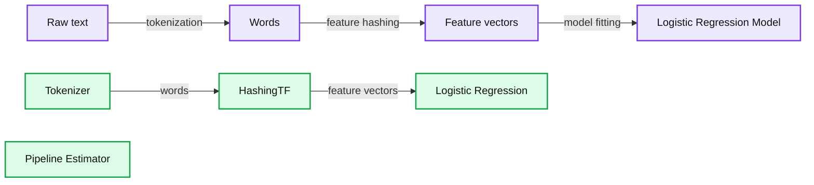

# Developing Custom Machine Learning Algorithms in PySpark

- Source: https://www.databricks.com/blog/2017/08/30/developing-custom-machine-learning-algorithms-in-pyspark.html
- Published: 2017-08-30
- Authors: Ajay Saini, Joseph Bradley
- Categories: engineering, open-source, data-science-machine-learning
- Images: 2 total, 1 extracted as architecture

Developing custom Machine Learning (ML) algorithms in PySpark—the Python API for Apache Spark—can be challenging and laborious. In this blog post, we describe our work to improve PySpark APIs to simplify the development of custom algorithms. Our key improvement reduces hundreds of lines of boilerplate code for persistence (saving and loading models) to a single line of code. These changes are expected to be available in the next [Apache Spark release](https://spark.apache.org/versioning-policy.html).

## Background: PySpark developer APIs

In recent years, Python has become the most popular language for data scientists worldwide, with over a million developers contributing to thousands of open source ML projects. Despite Python’s immense popularity, the developer APIs of [Apache Spark MLlib](https://spark.apache.org/docs/latest/ml-guide.html) remain Scala-dominated, with all algorithms implemented first in Scala and then made available in Python via wrappers. As a result, it has been very difficult for data scientists to develop ML algorithms in Python without having to write Scala code as well.

This blog post introduces several improvements to PySpark that facilitate the development of custom ML algorithms and 3rd-party ML packages using Python. After introducing the main algorithm APIs in MLlib, we discuss current challenges in building custom ML algorithms on top of PySpark. We then describe our key improvements to PySpark for simplifying such customization.

## MLlib algorithm APIs

Before discussing the specific changes to PySpark, it helps to understand the main APIs for ML algorithms in Spark. There are two major types of algorithms: Transformers and Estimators.

Transformers are algorithms that take an input dataset and modify it via a `transform()` function to produce an output dataset. For example, Binarizer reads an input column of feature values from a dataset, and it outputs a dataset with a new column of 0/1 features based on thresholding the original features.

Estimators are ML algorithms that take a training dataset, use a `fit()` function to train an ML model, and output that model. That model is itself a Transformer; for models, calling `transform()` will “transform” the dataset by adding a new column of predictions. Popular examples of Estimators are Logistic Regression and [Random Forests](https://docs.databricks.com/applications/machine-learning/train-model/mllib/index.html#random-forest).

Users often combine multiple Transformers and Estimators into a data analytics workflow. ML Pipelines provide an API for chaining algorithms, feeding the output of each algorithm into following algorithms. For more details on these types of algorithms, check out the [Databricks docs](https://docs.databricks.com/applications/machine-learning/index.html).

Below, we show a simple Pipeline with 2 feature Transformers (Tokenizer, HashingTF) and 1 Estimator (LogisticRegression) from the [MLlib guide on Pipelines](https://spark.apache.org/docs/latest/ml-pipeline.html).

**Summary:** A PySpark machine learning pipeline transforms raw text into words, feature vectors, and a logistic regression model.

**Components:**

- Pipeline Estimator: PySpark ML pipeline
- Tokenizer: text feature transformer
- HashingTF: term frequency feature transformer
- Logistic Regression: classifier estimator
- Raw text: input data
- Words: tokenized text
- Feature vectors: hashed text features
- Logistic Regression Model: trained output model

**Flows:**

- Tokenizer -> HashingTF: tokenized words
- HashingTF -> Logistic Regression: feature vectors
- Raw text -> Words: tokenization
- Words -> Feature vectors: feature hashing
- Feature vectors -> Logistic Regression Model: model fitting

**Numbers:** none

source image: https://www.databricks.com/wp-content/uploads/2017/08/ml-Pipeline.png

## The obstacle: ML Persistence

Let’s say a data scientist wants to extend PySpark to include their own custom Transformer or Estimator. First, the data scientist writes a class that extends either Transformer or Estimator and then implements the corresponding `transform()` or `fit()` method in Python. In simple cases, this implementation is straightforward. For example, many feature Transformers can be implemented by using a simple [User-Defined Function](https://docs.microsoft.com/en-us/azure/databricks/spark/latest/spark-sql/udf-python) to add a new column to the input DataFrame.

One critical functionality in MLlib, however, is ML Persistence. Persistence allows users to save models and Pipelines to stable storage, for loading and reusing later or for passing to another team. The API is simple; the following code snippet fits a model using `CrossValidator` for parameter tuning, saves the fitted model, and loads it back:

ML Persistence saves models and Pipelines as JSON metadata + Parquet model data, and it can be used to transfer models and Pipelines across Spark clusters, deployments, and teams. For info on persistence, see our [blog post](https://www.databricks.com/blog/2016/05/31/apache-spark-2-0-preview-machine-learning-model-persistence.html) and [webinar](https://www.databricks.com/).

Adding support for ML Persistence has traditionally required a Scala implementation. Up until now, the simplest way to implement persistence required the data scientist to implement the algorithm in Scala and write a Python wrapper. Implementing the algorithm in Scala would require knowing both languages, understanding the Java—Python communication interface, and writing duplicate APIs in the two languages.

## The solution: Python Persistence mixins

To support Python-only implementations of ML algorithms, we implemented a persistence framework in the PySpark API analogous to the one in the Scala API. With this framework, when implementing a custom Transformer or Estimator in Python, it is no longer necessary to implement the underlying algorithm in Scala. Instead, one can use [mixin classes](https://en.wikipedia.org/wiki/Mixin#In_Python) with a custom Transformer or Estimator to enable persistence.

For simple algorithms for which all of the parameters are JSON-serializable (simple types like `string`, `float`), the algorithm class can extend the classes `DefaultParamsReadable` and `DefaultParamsWritable` ([SPARK-21542](https://issues.apache.org/jira/browse/SPARK-21542); [code on Github](https://github.com/apache/spark/blob/94439997d57875838a8283c543f9b44705d3a503/python/pyspark/ml/util.py)) to enable automatic persistence. (If you are unfamiliar with Params in ML Pipelines, they are standardized ways to specify algorithm options or properties. Refer to the Param section of the MLlib guide for more info.) The default implementation of persistence will allow the custom algorithm to be saved and loaded back within PySpark.

These mixins dramatically reduce the development effort required to create custom ML algorithms on top of PySpark. Persistence functionality that used to take many lines of extra code can now be done in a single line in many cases.

The code snippets below demonstrate the code length of persisting an algorithm with a Scala implementation and a Python wrapper:

And this code snippet demonstrates using these mixins for a Python-only implementation of persistence:

Adding the mixins `DefaultParamsReadable` and `DefaultParamsWritable` to the `MyShiftTransformer` class allows us to eliminate a lot of code.

For complex algorithms with parameters or data which are not JSON-serializable (complex types like `DataFrame`), the developer can write custom `save()` and `load()` methods in Python. Previously, even with `save()` and `load()` implemented, custom Python implementations could not be saved within ML Pipelines. Our fixes ([SPARK-17025](https://issues.apache.org/jira/browse/SPARK-17025)) correct this issue, allowing smooth integration of custom Python algorithms with the rest of MLlib.

## Looking forward

With these improvements, developers will soon be able to write custom machine learning algorithms in Python, use them in Pipelines, and save and load them without touching Scala. We believe this will unblock many developers and encourage further efforts to develop Python-centric [Spark Packages](https://spark-packages.org/) for machine learning.
