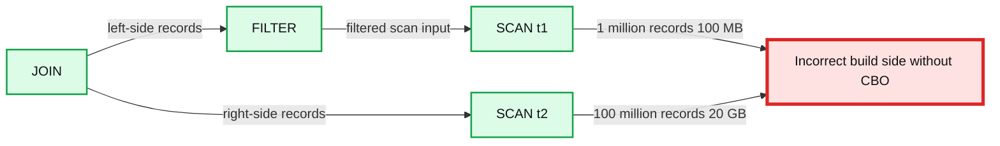
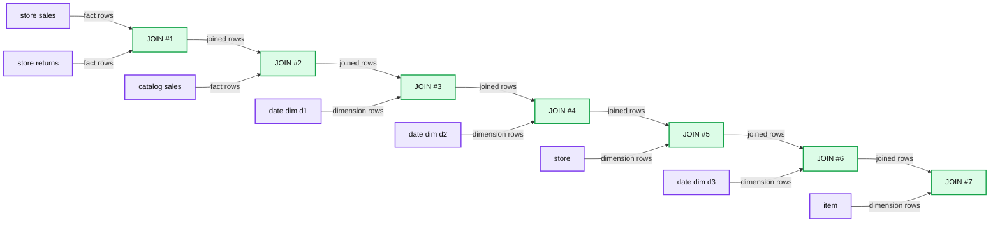
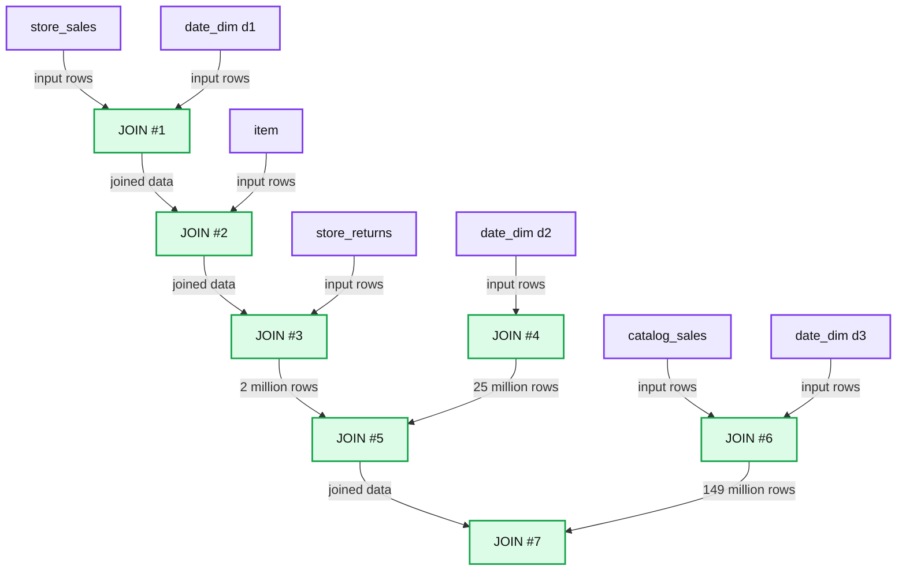
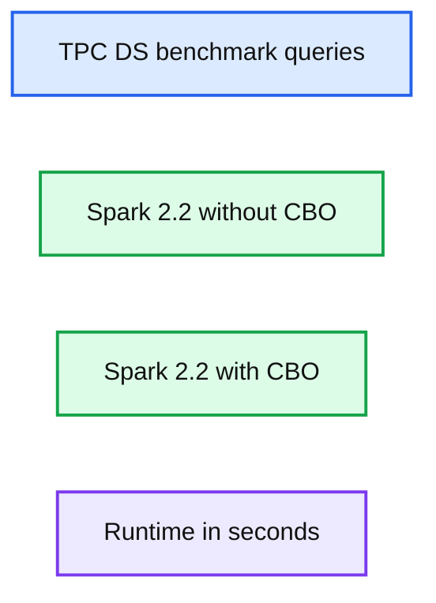
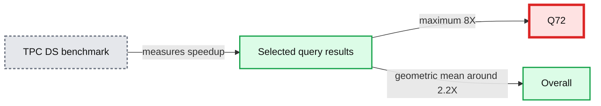

# Cost Based Optimizer in Apache Spark 2.2

- Source: https://www.databricks.com/blog/2017/08/31/cost-based-optimizer-in-apache-spark-2-2.html
- Published: 2017-08-31
- Authors: Ron Hu, Zhenhua Wang, Wenchen Fan, Sameer Agarwal
- Categories: engineering, open-source
- Images: 6 total, 6 extracted as architecture

*This is a joint engineering effort between Databricks’ Apache Spark engineering team (Sameer Agarwal and Wenchen Fan) and Huawei’s engineering team (Ron Hu and Zhenhua Wang)*

[Apache Spark 2.2](https://www.databricks.com/blog/2017/07/11/introducing-apache-spark-2-2.html) recently shipped with a state-of-art cost-based optimization framework that collects and leverages a variety of per-column data statistics (e.g., cardinality, number of distinct values, NULL values, max/min, average/max length, etc.) to improve the quality of query execution plans. Leveraging these statistics helps Spark to make better decisions in picking the most optimal query plan. Examples of these optimizations include selecting the correct build side in a hash-join, choosing the right join type (broadcast hash-join vs. shuffled hash-join) or adjusting a multi-way join order, among others.

In this blog, we'll take a deep dive into Spark's Cost Based Optimizer (CBO) and discuss how Spark collects and stores these statistics, optimizes queries, and show its performance impact on TPC-DS benchmark queries.

## A Motivating Example

At its core, [Spark’s Catalyst optimizer](https://www.databricks.com/blog/2015/04/13/deep-dive-into-spark-sqls-catalyst-optimizer.html) is a general library for representing query plans as trees and sequentially applying a number of optimization rules to manipulate them. A majority of these optimization rules are based on heuristics, i.e., they only account for a query’s structure and ignore the properties of the data being processed, which severely limits their applicability. Let us demonstrate this with a simple example. Consider a query shown below that filters a table *t1* of size 500GB and joins the output with another table *t2* of size 20GB. Spark implements this query using a hash join by choosing the smaller join relation as the *build side* (to build a hash table) and the larger relation as the *probe side* 1. Given that *t2* is smaller than *t1*, Apache Spark 2.1 would choose the right side as the build side without factoring in the effect of the filter operator (which in this case filters out the majority of *t1*'s records). Choosing the incorrect side as the *build side* often forces the system to give up on a fast hash join and turn to sort-merge join due to memory constraints.

**Summary:** The diagram shows an incorrect Apache Spark join build-side choice without cost-based optimization.

**Components:**

- JOIN: Apache Spark join operator
- FILTER: Apache Spark filter operator
- SCAN t1: Apache Spark scan of t1
- SCAN t2: Apache Spark scan of t2
- Incorrect build side without CBO: cost-based optimization warning

**Flows:**

- JOIN -> FILTER: left-side records
- FILTER -> SCAN t1: filtered scan input
- JOIN -> SCAN t2: right-side records

**Numbers:** 1 million records, 100 MB, 5 billion records, 500 GB, 100 million records, 20 GB



<sub>source image: https://www.databricks.com/wp-content/uploads/2017/08/image5.png</sub>

Apache Spark 2.2, on the other hand, collects statistics for each operator and figures out that the left side would be only 100MB (1 million records) after filtering, and the right side would be 20GB (100 million records). With the correct size/cardinality information for both sides, Spark 2.2 would choose the left side as the build side resulting in significant query speedups.

In order to improve the quality of query execution plans, we enhanced the Spark SQL optimizer with detailed statistics information. From the detailed statistics information, we propagate the statistics to other operators as we traverse the query tree upwards. Once propagated, we can estimate the number of output records and output size for each database operator, enabling and optimizing an efficient query plan.

## Statistics Collection Framework

### ANALYZE TABLE command

CBO relies on detailed statistics to optimize a query plan. To collect these statistics, users can issue these new SQL commands described below:

`ANALYZE TABLE table_name COMPUTE STATISTICS`

The above SQL statement can collect table level statistics such as number of rows and table size in bytes. Note that `ANALYZE`, `COMPUTE`, and `STATISTICS` are reserved keywords and can take specific column names as arguments, storing all the table level statistics in the metastore.

`ANALYZE TABLE table_name COMPUTE STATISTICS FOR COLUMNS column-name1, column-name2, ….`

Note that it’s not necessary to specify every column of a table in the ANALYZE statement—only those that are used in a filter/join condition, or in `group by` clauses etc.

#### Types of Statistics

The following tables list the detailed statistics information we collect for `numeric/date/timestamp` and `string/binary` data types respectively.

**Summary:** The table lists collected column statistics for numeric/date/timestamp and string/binary data types.

**Components:**

- Numeric/date/timestamp type statistics
- String/binary type statistics
- Distinct count
- Max
- Min
- Null count
- Average length
- Max length

**Flows:**

- none

**Numbers:** none

```text
%% mermaid failed to render; kept as text
%% Shows collected statistics by data type
flowchart LR
  A[Numeric Date Timestamp Type]
  B[String Binary Type]
  C[Distinct Count]
  D[Max]
  E[Min]
  F[Null Count]
  G[Average Length Fixed Length]
  H[Max Length Fixed Length]
  I[Distinct Count]
  J[Null Count]
  K[Average Length]
  L[Max Length]

  class A,B client
  class C,D,E,F,G,H,I,J,K,L service

  classDef client fill:#dbeafe,stroke:#2563eb,stroke-width:2px,color:#111
  classDef service fill:#dcfce7,stroke:#16a34a,stroke-width:2px,color:#111
  classDef store fill:#ede9fe,stroke:#7c3aed,stroke-width:2px,color:#111
  classDef cache fill:#fef3c7,stroke:#d97706,stroke-width:2px,color:#111
  classDef queue fill:#cffafe,stroke:#0891b2,stroke-width:2px,color:#111
  classDef critical fill:#fee2e2,stroke:#dc2626,stroke-width:4px,color:#111
  classDef external fill:#e5e7eb,stroke:#6b7280,stroke-width:2px,color:#111,stroke-dasharray:4 3
  classDef decision fill:#fce7f3,stroke:#db2777,stroke-width:2px,color:#111
  client = clients edge gateway LB
  service = stateless compute
  store = databases durable storage
  cache = Redis CDN or losable data
  queue = Kafka streams async pipes
  critical = bottleneck or SPOF
  external = third party
  decision = trade off point
```

<sub>source image: https://www.databricks.com/wp-content/uploads/2017/08/Screen-Shot-2017-08-30-at-3.00.54-PM.png</sub>

Given that CBO traverses Spark’s `LogicalPlan` in a post-order fashion, we can propagate these statistics bottom-up to other operators. Although there are numerous operators for which we can estimate their statistics and corresponding costs, here we’ll describe the process to estimate statistics for two of the most complex and interesting operators: `FILTER` and `JOIN`.

### FILTER Selectivity

A filter condition is a predicate expression specified in the WHERE clause of a `SQL SELECT` statement. A predicate can be a compound logical expression with logical `AND`, `OR`, `NOT` operators combining multiple single conditions. A single condition usually has comparison operators such as =, , >= or 2. Therefore, it can be quite complex to estimate the selectivity for the overall filter expression.

Let’s examine a few computations of filter selectivity for a compound logical expression comprising of multiple single logical expressions.

- For logical AND expression, its filter selectivity is the selectivity of left condition multiplied by the selectivity of the right condition, i.e., `fs(a AND b) = fs(a) * fs (b)`.
- For logical-OR expression, its filter selectivity is the selectivity of left condition, plus the selectivity of the right condition, and minus the selectivity of left condition logical-AND right condition,
 i.e., `fs (a OR b) = fs (a) + fs (b) - fs (a AND b) = fs (a) + fs (b) – (fs (a) * fs (b))`
- For logical-NOT expression, its filter factor is 1.0 minus the selectivity of the original expression, i.e., `fs (NOT a) = 1.0 - fs (a)`

Next, let’s examine a single logical condition that can have comparison operators, such as =, , >= or . In order to drive intuition, we will compute the filter selectivity for equality (=) and less than (

- **Equal-to (=) condition:** Here we check if the literal constant value of the condition falls within the qualified range between the current minimal and maximal column value. This is necessary because the range may change due to a previous condition applied earlier. If the constant value is outside the qualified range, then the filter selectivity is simply 0.0. Otherwise, it is the inverse of the number of distinct values (note that without additional histogram information, we just assume a uniform distribution for the column values). Future releases will leverage histograms to further improve estimation accuracy.
-

**Less-than ( Here we check where the constant literal value of the condition falls. If it is smaller than the current minimal column value, then the filter selectivity is simply 0.0 (and if it’s larger than the current maximal value, then the selectivity is just 1.0). Otherwise, we compute the filter factor based on the available information. If there is no histogram, we prorate and set filter selectivity to: `(constant – minimum) / (maximum – minimum)`. On the other hand, if there is a histogram, we can calculate the filter selectivity by adding up the density of histogram buckets between current column minimal values and the constant value. Also, note that the constant on the right hand side of the condition would now become the new maximal column value.**

### Join Cardinality

Now that we’ve discussed filter selectivity, let’s talk about join output cardinality. Before computing the cardinality of a two-way join output, we should already have the output cardinalities of both its child nodes. The cardinality of each join side is no greater than the number of records in the original join table; rather, it is the number of qualified records after applying all execution operators before this join operator. Here we are specifically interested in computing the cardinality of inner join operation as it is often used to derive the cardinalities of other join types. We compute the number of rows of `A join B on A.k = B.k` as:

`num(A IJ B) = num(A)*num(B)/max(distinct(A.k),distinct(B.k))`

where num(A) is the number of qualified records in **table A** immediately before join operation, and distinct is the number of distinct values of the join column k.

By computing the inner join cardinality, we can similarly derive the join cardinality for other join types as below:

- **Left-Outer Join:** `num(A LOJ B) = max(num(A IJ B),num(A))` meaning the larger value between the inner join output cardinality and cardinality of the left join outer side A. This is because we still need to factor in every record of the outer side although some of them do not produce join output records.
- **Right-Outer Join:** `num(A ROJ B) = max(num(A IJ B),num(B))`
- **Full-Outer Join:** `num(A FOJ B) = num(A LOJ B) + num(A ROJ B) - num(A IJ B)`

## Optimal Plan Selection

Now that we are armed with intermediate data statistics, let us discuss how Spark SQL uses this information to pick the best possible query plan. Earlier we explained selecting build side based on accurate cardinality and statistics for a hash join operation.

Similarly, with accurate cardinality and size estimation for all operators preceding a join operator, we can better estimate the size of a join side to decide whether or not that side can meet the broadcast criteria.

These statistics also help us leverage cost-based join reordering optimizations. We adapted the dynamic programming algorithm in [Selinger 1979]3 to pick the best m-way join order. To be more specific, when building m-way joins, we only keep the best plan (with the lowest cost) for the same set of m items. For instance, for 3-way joins, we only keep the best join plan with its order for items `{A, B, C}` among plans `(A join B) join C, (A join C) join B and (B join C) join A`. Our adapted algorithm considers all combinations including *left-deep trees*, *bushy trees*, and *right-deep-trees*. We also prune cartesian product candidates when building a new plan if there exists no join condition involving references from both left and right subtrees. This pruning strategy significantly reduces the search space.

Most database optimizers factor in the CPU and I/O costs separately to estimate the overall operator cost. In Spark, we estimate the cost of a join operator with a simple formula:

`cost = weight * cardinality + (1.0 - weight) * size` 4

The first portion of the join cost formula roughly corresponds to the CPU cost and the second portion roughly corresponds to the I/O cost. The cost of a join tree is the summation of costs of all intermediate joins.

## Query Benchmark and Analysis

We took a non-intrusive approach while adding these cost-based optimizations to Spark by adding a global config `spark.sql.cbo.enabled` to enable/disable this feature. In Spark 2.2, this parameter is set to `false` by default. This was a conscious short-term choice keeping in mind that Spark is being used in production at thousands of companies and changing the default behavior might be undesirable for existing production workloads.

### Configuration and Methodology

We ran all TPC-DS benchmark queries with Apache Spark 2.2 on a 4 node cluster (Huawei FusionServer RH2288 with 40 cores and 384 GB memory each) and a scale factor of 1000 (i.e., 1TB data). It took us ~14 minutes to collect the statistics on all 24 tables (and a total of 425 columns).

Before examining the end-to-end results, let us first look at a specific TPC-DS query (Q25; shown below) to better understand the impact of cost-based join ordering. This query involves three fact tables: `store_sales` (2.9 billion rows), `store_returns` (288 million rows) and `catalog_sales` (1.44 billion rows). It also involves three dimension tables: `date_dim` (73K rows), store (1K rows) and item (300K rows).

### Q25 without CBO

Let us first look at the unoptimized join tree for Q25 without CBO (shown below). This is also commonly referred to as a left-deep tree. Here, joins #1 and #2 are large fact-to-fact table joins that join the 3 fact tables `store_sales`, `store_returns`, and `catalog_sales` together, and produce very large intermediate tables. Both these joins executed as shuffle joins with the large join #1 outputting 199 million rows. Overall, the query takes 241 seconds when CBO is *disabled*.

**Summary:** The diagram shows a cost-based Spark SQL bushy join plan that joins fact tables with dimensions before completing the remaining joins.

**Components:**

- JOIN #1: Spark SQL join operator
- JOIN #2: Spark SQL join operator
- JOIN #3: Spark SQL join operator
- JOIN #4: Spark SQL join operator
- JOIN #5: Spark SQL join operator
- JOIN #6: Spark SQL join operator
- JOIN #7: Spark SQL join operator
- store_sales: fact table
- store_returns: fact table
- catalog_sales: fact table
- date_dim d1: date dimension table
- date_dim d2: date dimension table
- date_dim d3: date dimension table
- store: dimension table
- item: dimension table

**Flows:**

- store_sales -> JOIN #1: fact table rows
- store_returns -> JOIN #1: fact table rows
- JOIN #1 -> JOIN #2: joined rows
- catalog_sales -> JOIN #2: fact table rows
- JOIN #2 -> JOIN #3: joined rows
- date_dim d1 -> JOIN #3: dimension rows
- JOIN #3 -> JOIN #4: joined rows
- date_dim d2 -> JOIN #4: dimension rows
- JOIN #4 -> JOIN #5: joined rows
- store -> JOIN #5: dimension rows
- JOIN #5 -> JOIN #6: joined rows
- date_dim d3 -> JOIN #6: dimension rows
- JOIN #6 -> JOIN #7: joined rows
- item -> JOIN #7: dimension rows

**Numbers:** JOIN #1, JOIN #2, JOIN #3, JOIN #4, JOIN #5, JOIN #6, JOIN #7; 199 million rows; 2.9 billion rows; 1.4 billion rows; 288 million rows.



<sub>source image: https://www.databricks.com/wp-content/uploads/2017/08/image4.png</sub>

### Q25 with CBO

On the other hand, with cost-based optimization, Spark creates an optimal join plan that reduces intermediary data size (shown below). In this case, Spark creates a *bushy tree* instead of a *left-deep tree*. When CBO is enabled, Spark joins the fact tables with their corresponding `date_dim` dimension table first (before attempting any fact-to-fact joins). Avoiding large fact-to-fact joins means avoiding large expensive shuffles. In this query, this reduces the intermediate data size to about 1/6th (compared to the previous case). As a result, Q25 took only **71 seconds**, representing a speedup of **3.4X**.

**Summary:** Spark’s cost-based optimizer produces a join tree that reduces shuffle size by more than 90% and speeds up the query by 3X.

**Components:**

- JOIN #1 through JOIN #7: Spark SQL join operators
- store_sales, store, item, store_returns, date_dim d1, date_dim d2, date_dim d3, catalog_sales: TPC-DS tables

**Flows:**

- store_sales -> JOIN #1: input rows
- date_dim d1 -> JOIN #1: input rows
- JOIN #1 -> JOIN #2: joined data
- item -> JOIN #2: input rows
- JOIN #2 -> JOIN #3: joined data
- store_returns -> JOIN #3: input rows
- JOIN #3 -> JOIN #5: 2 million rows
- date_dim d2 -> JOIN #4: input rows
- JOIN #4 -> JOIN #5: 25 million rows
- JOIN #5 -> JOIN #7: joined data
- catalog_sales -> JOIN #6: input rows
- date_dim d3 -> JOIN #6: input rows
- JOIN #6 -> JOIN #7: 149 million rows
- JOIN #7: final joined result

**Numbers:**

- JOIN #1, JOIN #2, JOIN #3, JOIN #4, JOIN #5, JOIN #6, JOIN #7
- 2 million rows
- 25 million rows
- 149 million rows
- more than 90% reduction in shuffle size
- 3X query speedup with CBO



<sub>source image: https://www.databricks.com/wp-content/uploads/2017/08/image3.png</sub>

### TPC-DS Query Performance

Now that we’ve established an intuition behind where the improvements come from, let us look at the end-to-end TPC-DS query results. The figure below shows query times for all TPC-DS queries with and without CBO:

**Summary:** The chart compares TPC-DS query runtimes in Apache Spark 2.2 with and without the Cost Based Optimizer, where lower runtime is better.

**Components:**

- TPC-DS benchmark queries
- Apache Spark 2.2 without CBO
- Apache Spark 2.2 with CBO
- Runtime in seconds

**Flows:**

- none

**Numbers:** 2.2; 0, 250, 500, 750, 1000, 1250, 1500 seconds; query labels Q1 through Q99



<sub>source image: https://www.databricks.com/wp-content/uploads/2017/08/image1.png</sub>

First of all, note that about half of TPC-DS benchmark queries do not show performance change. This is because there is no change in the query plan when running queries with or without CBO (i.e., even without CBO, existing heuristics in Spark’s Catalyst optimizer were able to optimize these queries well). For the remaining queries, while there were improvements across the board, what’s perhaps more interesting is the set of 16 queries where CBO brought substantial changes to the query plan and improved performance by more than **30%** (shown below). Overall, we observed that the geometric mean speedup for these 16 queries was around 2.2X with Q72 achieving a maximal speedup of **8X**.

**Summary:** Bar chart showing TPC-DS query speedup from cost-based optimization in Apache Spark 2.2, with Q72 reaching 8X.

**Components:**

- TPC-DS benchmark using Apache Spark 2.2
- Cost-based optimizer speedup measurement
- Sixteen selected query bars
- Overall geometric mean speedup

**Flows:**

- none

**Numbers:** 0, 1, 2, 3, 4, 5, 6, 7, 8, 9; 16 queries; 8X maximum speedup; around 2.2X geometric mean speedup; visible query labels Q4, Q8, Q14, Q22, Q23, Q24, Q28, Q38, Q49, Q52, Q64, Q68, Q72, Q75, Q77, Q79, Overall



<sub>source image: https://www.databricks.com/wp-content/uploads/2017/08/image2.png</sub>

## Conclusion

To recap, this blog post highlighted various aspects of the new cost-based optimizer in Apache Spark 2.2. We discussed details of the statistics collection framework, cardinality propagation for filters and joins, the cost-based optimizations they enable (build side selection and multi-way join reordering), and its performance impact on TPC-DS benchmark queries.

In the past year, we’ve resolved a total of 32 sub-tasks spanning over 50+ patches and 7000+ line of code under the CBO umbrella [JIRA SPARK-16026](https://issues.apache.org/jira/browse/SPARK-16026). That said, leveraging cost-based optimizations in distributed databases is an extremely complex problem and this is just a first step in this direction. In future releases, we plan on continuing work in this direction by adding more complex statistics (histograms, count-min sketches, partition-level statistics etc.) and refining our cost formulas.

We are excited about the progress made and hope you will enjoy the improvements. We encourage you to try out the new Cost-Based Optimizer in Apache Spark 2.2!

## Read More

You can view our Spark Summit 2017 talk: [Cost Based Optimizer in Spark 2.2](https://www.databricks.com/session/cost-based-optimizer-in-apache-spark-2-2)

---

1. The rationale here is that the smaller relation is more likely to fit in memory. ↩
2. represents ‘equal null safe’ returning true if both operands are null, false if one of the operands is null. ↩
3. P. Griffiths Selinger, M. M. Astrahan, D. D. Chamberlin, R. A. Lorie, T. G. Price, “Access Path Selection in a Relational Database Management System”, Proceedings of ACM SIGMOD conference, 1979 ↩
4. weight is a tuning parameter that can be configured via spark.sql.cbo.joinReorder.card.weight (0.7 by default) ↩
