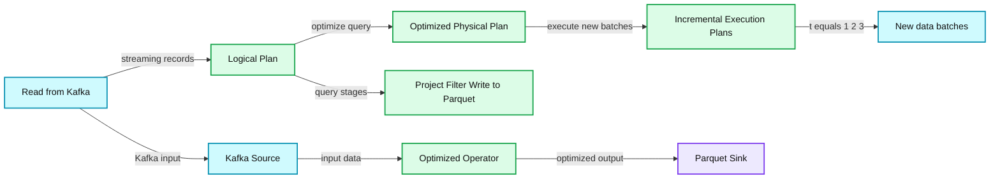

# Do your Streaming ETL at Scale with Apache Spark’s Structured Streaming

- Source: https://www.databricks.com/blog/2017/09/01/streaming-etl-scale-apache-sparks-structured-streaming.html
- Published: 2017-09-01
- Authors: Tathagata Das
- Categories: announcements, data-streaming, company, events
- Images: 1 total, 1 extracted as architecture

At the [Spark Summit in San Francisco in June](https://www.databricks.com/blog/2017/06/06/simple-super-fast-streaming-engine-apache-spark.html), we announced that Apache Spark’s Structured Streaming is marked as production-ready and shared benchmarks to demonstrate its performance compared to other streaming engines.

Structured Streaming is a novel way to process streams. Not only does this new way make it easy to build end-to-end streaming applications, but it also handles all the underlying complexities for fault-tolerance. You as a developer need not worry about it.

**Summary:** Apache Spark converts a batch-like streaming query into an optimized physical plan and a series of incremental execution plans.

**Components:**

- Input stream using Spark readStream
- Kafka source
- Logical plan using Project, Filter, and Write to Parquet
- Optimized physical plan using an optimized operator
- Parquet sink
- Incremental execution plans for new data batches
- DataFrames, Datasets, and SQL

**Flows:**

- Input -> Read from Kafka: streaming records
- Read from Kafka -> Project: selected device and signal fields
- Project -> Filter: records matching signal greater than 15
- Filter -> Write to Parquet: filtered records
- Kafka Source -> Optimized Operator: Kafka input for optimization
- Optimized Operator -> Parquet Sink: optimized output
- Logical Plan -> Optimized Physical Plan: optimized query execution plan
- Optimized Physical Plan -> Incremental Execution Plans: new batches of data processed incrementally

**Numbers:** 15; t=1; t=2; t=3

source image: https://www.databricks.com/wp-content/uploads/2017/08/image1-1.jpg

At the [Data + AI Summit](https://www.databricks.com/dataaisummit), I will present two talks covering many aspects of Structured Streaming. The first talk covers concepts, APIs, integration with external sources and sinks, underlying incremental Spark SQL execution engine, and fault-tolerant semantics, while the second will focus on stateful stream processing using *mapGroupsWithState* APIs.

1. [Easy, Scalable, fault-tolerant Stream Processing with Structured Streaming in Apache Spark](https://www.databricks.com/dataaisummit)
2. [Deep Dive into Stateful Streaming Processing in Structured Streaming](https://www.databricks.com/dataaisummit)

Why should you attend these sessions? If you are a data engineer or data scientist who wants to turbocharge your ETL with streaming, build low-latency predictive IoT or fraud-detection applications with fast-data, and create streaming pipelines for data ingestion and real-time streaming analytics, then attend my sessions.

And see you Dublin!
