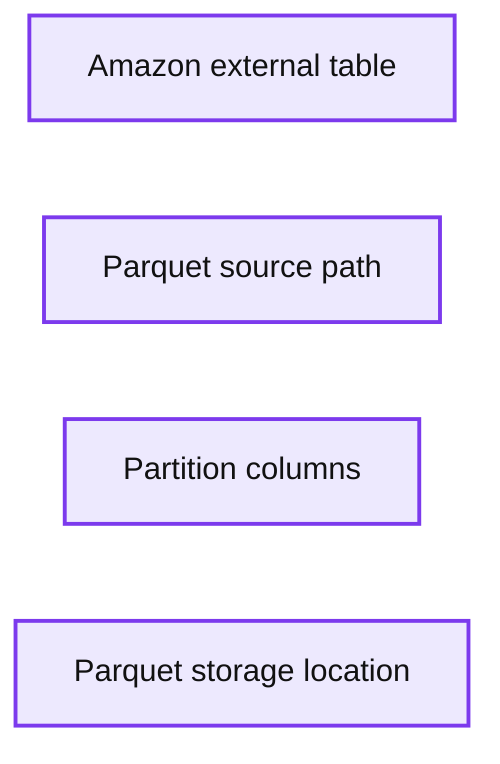

# Building Complex Data Pipelines with Unified Analytics Platform

- Source: https://www.databricks.com/blog/2017/10/05/build-complex-data-pipelines-with-unified-analytics-platform.html
- Published: 2017-10-05
- Authors: Jules Damji, Jason Pohl
- Categories: platform, engineering, open-source, data-science-machine-learning, data-engineering
- Images: 11 total, 4 extracted as architecture

## Introduction

Big data practitioners often post recurring questions on Quora: [What is data engineering?](https://www.quora.com/unanswered/What-is-the-use-of-Data-engineer-in-Apache-Spark) [How to become a data scientist?](https://www.quora.com/How-can-I-become-a-data-scientist-1) [What’s a data analyst?](https://www.quora.com/Who-are-data-analysts)

Apart from understanding these roles and respective responsibilities, more important questions to pose are: How can three different personas, three different experiences, and three different requirements collaborate and combine their efforts? Or can they employ a unified platform rather than resort to one-off bespoke solutions?

Yes, they can collaborate and use a single platform. Last month, we announced our [Unified Databricks Data + AI Platform](https://www.databricks.com/product/data-lakehouse). Aimed to facilitate collaboration among data engineers, data scientists, and data analysts, two of its software artifacts—Databricks Workspace and Notebook Workflows—achieve this coveted collaboration.

In this blog, we will explore how each persona can

- Employ [Notebook Workflows](https://www.databricks.com/blog/2016/08/30/notebook-workflows-the-easiest-way-to-implement-apache-spark-pipelines.html) to collaborate and construct complex data pipelines with Apache Spark
- Orchestrate independent and idempotent notebooks as a *single unit of execution*
- Eliminate the need for bespoke one-off or distinct solutions.

## Amazon Public Product Ratings

First, let’s look at the data scenario. Consider our data scenario as a corpus of [Amazon public product ratings](https://snap.stanford.edu/data/web-Amazon.html), where each persona expects data in a digestible format to perform respective tasks.

A corpus of product reviews with different data artifacts, this dataset is of interest to any data scientist or data analyst. For example, a data analyst may want to explore data to examine what kinds of ratings, product categories or brands exist. By contrast, a data scientist may want to train a machine learning model to predict favorable ratings with certain keywords—such as “great” or “return” or “horrible”—in the user reviews on a periodic basis.

But neither exploration (by a data analyst) nor training the model (by a data scientist) is possible without first transforming data into a digestible format for each of the personas. And that’s where a data engineer comes into the equation: She’s responsible to transform raw data into consumable data, by creating a data pipeline. (We refer to a [*ExamplesIngestingData*](https://databricks-prod-cloudfront.cloud.databricks.com/public/4027ec902e239c93eaaa8714f173bcfc/8599738367597028/327074921650366/3601578643761083/latest.html) notebook how a data engineer may ingest public data set into Databricks.)

Next, we will examine our first data pipeline, the first notebook [*TrainModel*](https://databricks-prod-cloudfront.cloud.databricks.com/public/4027ec902e239c93eaaa8714f173bcfc/8599738367597028/327074921650486/3601578643761083/latest.html), and walk through the tasks pertaining to each persona.

## Data Pipeline of Apache Spark Jobs

**Summary:** Data engineering pipeline showing ingestion, exploration, ML model training, evaluation, and persistence.

**Components:**

- Ingest Data
- Explore Data
- Train ML Model
- Evaluate ML Model
- Persist ML Model

**Flows:**

- Ingest Data -> Explore Data: ingested data
- Explore Data -> Train ML Model: explored data
- Train ML Model -> Evaluate ML Model: trained ML model
- Evaluate ML Model -> Persist ML Model: evaluated ML model

**Numbers:** none

source image: https://www.databricks.com/wp-content/uploads/2017/09/Slide1.jpg

```mermaid
%% Data engineering pipeline from ingestion to model persistence
flowchart LR
    A[Ingest Data] -->|ingested data| B[Explore Data]
    B -->|explored data| C[Train ML Model]
    C -->|trained ML model| D[Evaluate ML Model]
    D -->|evaluated ML model| E[Persist ML Model]

    classDef client fill:#dbeafe,stroke:#2563eb,stroke-width:2px,color:#111
    classDef service fill:#dcfce7,stroke:#16a34a,stroke-width:2px,color:#111
    classDef store fill:#ede9fe,stroke:#7c3aed,stroke-width:2px,color:#111
    classDef cache fill:#fef3c7,stroke:#d97706,stroke-width:2px,color:#111
    classDef queue fill:#cffafe,stroke:#0891b2,stroke-width:2px,color:#111
    classDef critical fill:#fee2e2,stroke:#dc2626,stroke-width:4px,color:#111
    classDef external fill:#e5e7eb,stroke:#6b7280,stroke-width:2px,color:#111,stroke-dasharray:4 3
    classDef decision fill:#fce7f3,stroke:#db2777,stroke-width:2px,color:#111

    class A,B,C,D service
    class E store
```

### Exploring Data

For brevity we won’t go into the Python code that transformed raw data into JSON files for ingestion—that code is on this [page](https://snap.stanford.edu/data/web-Amazon.html). Instead, we will focus on our data pipeline notebook, [*TrainModel*](https://databricks-prod-cloudfront.cloud.databricks.com/public/4027ec902e239c93eaaa8714f173bcfc/8599738367597028/327074921650486/3601578643761083/latest.html), that aids the data scientist and data analyst to collaborate.

Once our data engineer has ingested the corpus of product reviews into Parquet files, created an external Amazon table with parquet files, created a temporary view from that external table to explore portions of the table, both a data analyst and data scientist can work cooperatively within this [*TrainModel*](https://databricks-prod-cloudfront.cloud.databricks.com/public/4027ec902e239c93eaaa8714f173bcfc/8599738367597028/327074921650486/3601578643761083/latest.html) notebook.

**Summary:** An external Amazon table is defined using Parquet data, partitioned by specified fields and stored at a filesystem location.

**Components:**

- Amazon external table
- Parquet format
- Parquet source path `/mnt/parquet/amazon_json`
- Partition columns asin, brand, helpful, img, price, rating, review, time, title, usr
- Storage location `/mnt/parquet/amazon_tables`

**Flows:**

- none

**Numbers:** 4; 1, 2, 3, 4, 5

source image: https://www.databricks.com/wp-content/uploads/2017/10/image2.png

Rather than express computation in Python code, a language a data engineer or data scientist is more intimate with, a data analyst can express SQL queries. The point here is that the type of notebook—whether Scala, Python, R or SQL—is less important than the ability to express query in a familiar language (i.e., SQL) and to collaborate with others.

Now that we have digestible data for each persona, as a temporary table `tmp_amazon`, a data analyst can ask business questions and visualize data; she can query this table, for example, with the following questions:

### What does the data look like?

### How many different brands?

### How do the brands fair in ratings?

Satisfied with her preliminary analyses, she may turn to a data scientist who can devise a machine learning model that enables them to periodically predict ratings of user reviews. As users buy and rate products on the Amazon website, on daily or weekly basis, a machine learning model can be retrained with new data on regular basis in production.

## Training the Machine Learning Model

Apache Spark’s [Machine Learning Library MLlib](https://www.databricks.com/glossary/what-is-machine-learning-library) contains many algorithms for classification, regression, clustering and collaborative filtering. At a high level, the *spark.ml* package provides tools, techniques, and APIs for featurization, pipelining, mathematical utilities, and persistence.

When it comes to binary predictions with outcomes of good (1) or bad (0) based on certain keywords, the best model suited for this classification is [Logistic Regression Model](https://spark.apache.org/docs/latest/mllib-linear-methods.html#logistic-regression), a special case of [Generalized Linear Models](https://en.wikipedia.org/wiki/Generalized_linear_model) that predict the probability of favorable outcomes.

In our case, we want to predict outcomes of ratings for reviews with some favorable keywords. Not only we will employ the binomial logistic regression of the family of logistic regression models offered by MLlib but use [*spark.ml* pipelines](https://www.databricks.com/blog/2015/01/07/ml-pipelines-a-new-high-level-api-for-mllib.html) and its Transformers and Estimators.

## Create Machine Learning Pipeline

This snippet of Python code shows how to create the pipeline with transformers and estimators.

### Create Training and Test Data

Next, we use our training data to fit the model and finally evaluate with our test data. The transformed DataFrames `predictions` should have our predictions and labels.

As you may notice from the above query on our `predictions` DataFrame saved as a temporary table that occurrences of the word `return` in the reviews in our test data result in value 0 for both `prediction` and `label` and low ratings as expected.

Satisfied with the results from evaluating the model, a data scientist can persist the model for either sharing with other data scientists for further evaluation or sharing with data engineer to deploy in production.

That is accomplished by persisting the model.

## Persisting the Model

Consider use cases and scenarios where a data scientist produces an ML model and wants to test and iterate over it, deploy it into production for real-time prediction serving or share it with another data scientist to validate. How to do you do it?

[Persisting and serializing the ML pipeline](https://www.databricks.com/blog/2016/05/31/apache-spark-2-0-preview-machine-learning-model-persistence.html) is one way to export MLlib models. Another way is to use [Databricks dbml-local library](https://www.databricks.com/), which is the preferred way for real-time serving with very low latency requirements. **An important caveat:** For low-latency requirements when serving the model, we advise and advocate using dbml-local. Yet for this example, because latency is not an issue or a requirement with periodic product reviews, we are using the MLlib pipeline API for exporting and importing the models.

Although dbml-local is our preferred way to export and import model, both mechanisms of persistence are important for many reasons. First, it is easy and language independent—the model is exported as JSON. Second, it can be exported from one notebook, written in Python, and imported (loaded) into another notebook, written in Scala—persisting and serializing a [ML pipeline](https://www.databricks.com/glossary/what-are-ml-pipelines) and the exchange format are language independent. Third, serializing and persisting the pipeline encapsulates all featurization, not just the model. And finally, if you wish to serve your model in real-time prediction with Structured Streaming.

In our [*TrainModel*](https://databricks-prod-cloudfront.cloud.databricks.com/public/4027ec902e239c93eaaa8714f173bcfc/8599738367597028/327074921650486/3601578643761083/latest.html) notebook, we export our model so that it can be imported by another notebook, [*ServeModel*](https://databricks-prod-cloudfront.cloud.databricks.com/public/4027ec902e239c93eaaa8714f173bcfc/8599738367597028/327074921650404/3601578643761083/latest.html), downstream in our chained notebooks workflow (see below).

In the next section, we discuss our second pipeline, [*CreateStream*](https://databricks-prod-cloudfront.cloud.databricks.com/public/4027ec902e239c93eaaa8714f173bcfc/8599738367597028/327074921650526/3601578643761083/latest.html).

## Creating Streams

Consider this scenario: We have access to a live stream of product reviews and, using our trained model, we want to score against our model. A data engineer can offer this real-time data in two ways: one through Kafka or Kinesis as users rate the product on Amazon website; another through the new entries inserted into the table, which were not part of the training set, convert them into JSON files on S3. Indeed, that will just work, because Structured Streaming API reads data in the same manner whether your data sources are Blobs, files in S3, or streams from Kinesis or Kafka. We elected S3 over distributed queue for low cost and low latency.

**Summary:** Data engineering pipeline that queries Amazon data, creates a query stream, and persists the stream as JSON.

**Components:**

- Query Amazon Data using SQL
- Create Query Stream
- Persist Stream as JSON files

**Flows:**

- Query Amazon Data -> Create Query Stream: query results
- Create Query Stream -> Persist Stream as JSON: data stream

**Numbers:** none

source image: https://www.databricks.com/wp-content/uploads/2017/09/Slide2.jpg

In our case, a data engineer can simply extract the most recent entries from our table, built atop Parquet files. This short pipeline consists of three Spark jobs:

1. Query new product data from the Amazon table
2. Convert the resulting DataFrame
3. Store our DataFrames as JSON Files on S3

To simulate streams, we can treat each file as a collection of rows of JSON data as streaming data to score our model. This is not an uncommon case where a data scientist has trained a model and a data engineer is tasked to provide a way to get to the stream of live data persisted someplace where she can easily read and evaluate against the trained model.

To see how this is implemented, read the [*CreateStream*](https://databricks-prod-cloudfront.cloud.databricks.com/public/4027ec902e239c93eaaa8714f173bcfc/8599738367597028/327074921650526/3601578643761083/latest.html) notebook; its output serves JSON files as streams of Amazon reviews to the [*ServeModel*](https://databricks-prod-cloudfront.cloud.databricks.com/public/4027ec902e239c93eaaa8714f173bcfc/8599738367597028/327074921650404/3601578643761083/latest.html) notebook—to score against our persisted model. This leads to our final pipeline.

## Serving, Importing and Scoring a Model

**Summary:** Data engineering pipeline for loading a machine learning model, reading and querying a stream, and scoring the model.

**Components:**

- Load ML Model - persisted machine learning model
- Read Query Stream - query stream
- Query the Stream - SQL
- Score ML Model - machine learning scoring

**Flows:**

- Load ML Model -> Read Query Stream: loaded model data
- Read Query Stream -> Query the Stream: query stream
- Query the Stream -> Score ML Model: queried stream data

**Numbers:** none

source image: https://www.databricks.com/wp-content/uploads/2017/09/Slide3.jpg

Consider the final scenario: We now have access to a live stream (or near a live stream) of new product reviews, and we have access to our trained model, which is persisted on our S3 bucket. A data scientist can then employ both these assets.

Let's see how. In our case, a data scientist can simply create short pipeline of four Spark jobs:

1. Load the model from data store
2. Read the JSON files as DataFrame input stream
3. Transform the model with input stream
4. Query the prediction

Since all the featurization is encapsulated in the persisted model, all we need is to load this serialized model as is from the disk and use it to serve and score our new data. Moreover, note that we created this model in the notebook [*TrainModel*](https://databricks-prod-cloudfront.cloud.databricks.com/public/4027ec902e239c93eaaa8714f173bcfc/8599738367597028/327074921650486/3601578643761083/latest.html), which is written in Python, and we loaded inside a Scala notebook. This shows that regardless of language each persona is using to create notebooks, they can share persisted models in languages supported in Apache Spark.

## Databricks Notebook Workflow Orchestration

Central to collaboration and coordination are [Notebook Workflows’ APIs](https://docs.databricks.com/notebooks/notebook-workflows.html). With these APIs, a data engineer can string together all the aforementioned pipelines as a *single unit of execution*.

https://www.youtube.com/watch?v=byLFMgmHdwE

One way to achieve this is to share inputs and outputs among notebooks in the chain. That is, notebook’s output and exit status serve as input to the next notebook in the flow. [Notebook Widgets](https://docs.databricks.com/notebooks/widgets.html) allows parameterizing input to notebooks, whereas notebook’s exit status can pass arguments to the next one in the flow.

In our example, [*RunNotebooks*](https://databricks-prod-cloudfront.cloud.databricks.com/public/4027ec902e239c93eaaa8714f173bcfc/8599738367597028/327074921650520/3601578643761083/latest.html) invokes each notebook in the flow, with parameterized arguments. It will orchestrate three other notebooks, each executing its own data pipeline, creating its own Spark jobs within, and finally emitting a JSON document as its exit status. This JSON document then serves as an input parameter to the subsequent notebook in the pipeline.

Finally, not only you can run this particular notebook as an ephemeral job, but you can schedule the flow using the [Job Scheduler](https://docs.databricks.com/dev-tools/api/latest/jobs.html).

## What’s Next

To really get the feel for this end-to-end collaboration among the three personas in the [Unified Analytics Platform](https://www.databricks.com/product/data-lakehouse), try these five notebooks today on the [Databricks platform](https://www.databricks.com/try-databricks).

1. [*RunNotebooks*](https://databricks-prod-cloudfront.cloud.databricks.com/public/4027ec902e239c93eaaa8714f173bcfc/8599738367597028/327074921650520/3601578643761083/latest.html), created by a data engineer
2. [*TrainModel*](https://databricks-prod-cloudfront.cloud.databricks.com/public/4027ec902e239c93eaaa8714f173bcfc/8599738367597028/327074921650486/3601578643761083/latest.html), created by a data engineer, data analyst, and data scientist
3. [*CreateStream*](https://databricks-prod-cloudfront.cloud.databricks.com/public/4027ec902e239c93eaaa8714f173bcfc/8599738367597028/327074921650526/3601578643761083/latest.html), created by a data engineer
4. [*ServeModel*](https://databricks-prod-cloudfront.cloud.databricks.com/public/4027ec902e239c93eaaa8714f173bcfc/8599738367597028/327074921650404/3601578643761083/latest.html), created by a data scientist and data engineer
5. [*ExamplesIngestingData*](https://databricks-prod-cloudfront.cloud.databricks.com/public/4027ec902e239c93eaaa8714f173bcfc/8599738367597028/327074921650366/3601578643761083/latest.html), a sample notebook for data engineer

In summary, we demonstrated that big data practitioners can work together in Databricks’ [Unified Analytics Platform](https://www.databricks.com/glossary/what-is-unified-analytics) to create notebooks, explore data, train models, export models, and evaluate their trained model against new real-time data. Together, they become productive when complex data pipelines, when myriad notebooks, built by different personas, can be executed as a single and sequential unit of execution. Through Notebook Workflows APIs, we demonstrated a unified experience, not bespoke one-off solutions. All that promises benefits.

## Read More

To understand Notebook Workflows and Widgets and Notebooks integration in Github, read the following:

- [Notebook Workflows: The Easiest Way to Implement Apache Spark Pipelines](https://www.databricks.com/blog/2016/08/30/notebook-workflows-the-easiest-way-to-implement-apache-spark-pipelines.html)
- [Notebook Workflows](https://docs.databricks.com/notebooks/notebook-workflows.html)
- [Notebook Widgets](https://docs.databricks.com/notebooks/widgets.html)
- [Notebook Github Integration](https://docs.databricks.com/notebooks/github-version-control.html#)
