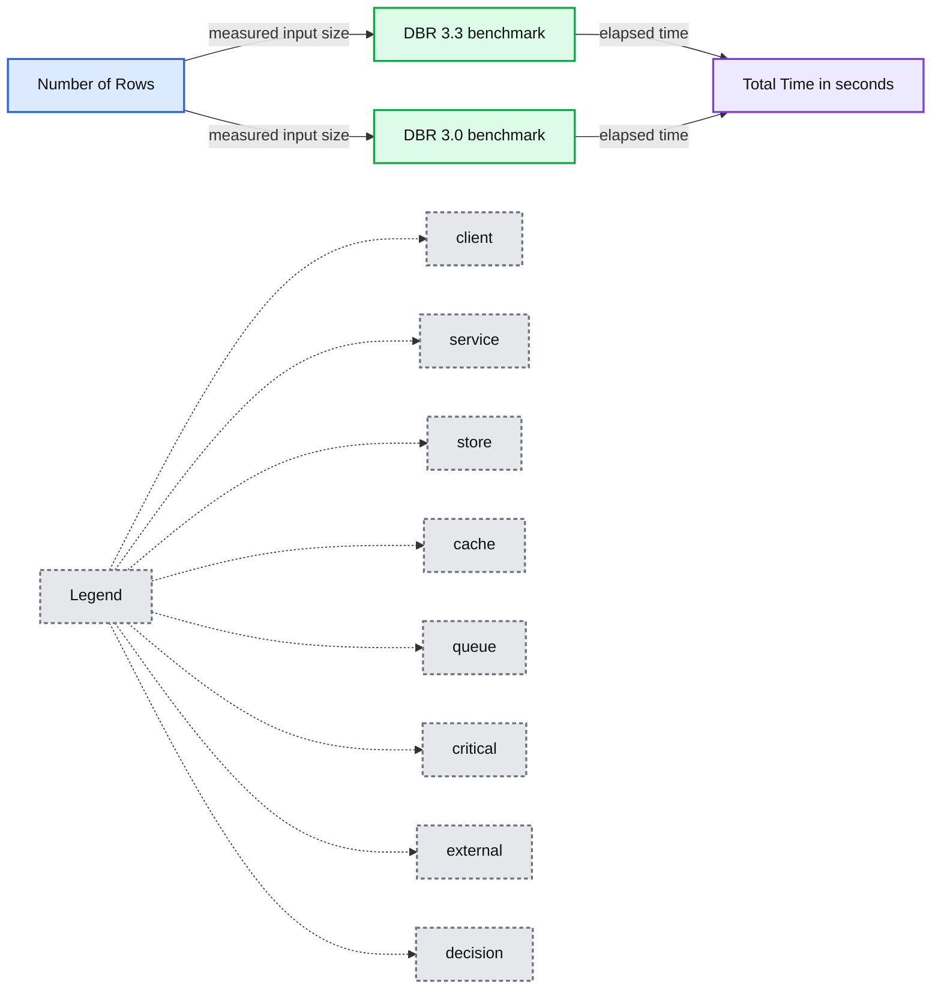
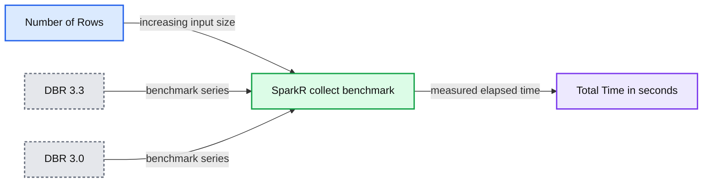

# Accelerating R Workflows on Databricks

- Source: https://www.databricks.com/blog/2017/10/06/accelerating-r-workflows-on-databricks.html
- Published: 2017-10-06
- Authors: Hossein Falaki
- Categories: engineering, open-source, data-science-machine-learning
- Images: 3 total, 2 extracted as architecture

At Databricks we strive to make our [Unified Analytics Platform](https://www.databricks.com/product/data-lakehouse) the best place to run big data analytics. For big data, Apache Spark has become the de-facto computing engine, while for advanced analytics, R is one of the [most widely used languages and environments](https://www.tiobe.com/tiobe-index/). R’s [package ecosystem](https://cran.r-project.org/web/packages/available_packages_by_name.html) boasts more than 10k packages ranging from implementation of simple statistical functions to sophisticated packages in verticals such as [genomics](https://www.bioconductor.org/) and [finance](https://cran.r-project.org/web/views/Finance.html).

The Unified Analytics Platform, with [Databricks Runtime](https://www.databricks.com/blog/2017/05/24/databricks-runtime-3-0-beta-delivers-enterprise-grade-apache-spark.html) (DBR) at its core, accelerates and unifies the strengths of both Apache Spark and R. The DBR helps customers, in a wide range of industries and verticals, to extract value from their big data efficiently.

Many Databricks R users take advantage of the strengths of Apache Spark and R’s rich ecosystem with a two-step workflow. First, they perform all large data operations on distributed SparkDataFrames using SparkR API. These usually include loading data from its sources, parsing and transforming it into desired format and shape. In many cases, the interesting parts of the final structured dataset can fit in a single machine’s memory. At this stage, users convert distributed datasets to a local R `data.frames` and pass them to other (single-node) R packages for further analysis or visualization. Often, the conversions between R `data.frames` and Spark `DataFrames` happen multiple times. For example, results of an R package functions are parallelized and joined with distributed datasets.

In this blog post, we introduce two new improvements in [Databricks Runtime 3.3](https://docs.databricks.com/release-notes/runtime/3.3.html) (DBR) that accelerate these common workflows. First, we added support for R packages as part of Databricks library management. Second, as part of our [DBIO accelerator module](https://www.databricks.com/blog/2017/05/24/databricks-runtime-3-0-beta-delivers-enterprise-grade-apache-spark.html), we have accelerated the performance of `SparkR::collect()` and `SparkR::createDataFrame()`. These two APIs are the bridges between single-node R and distributed Spark applications and are among the most frequently used functions of SparkR.

## R Package Management in Databricks

On Databricks workspace, users can now define a library that points to their desired CRAN repository and package. When this library is attached to a cluster, all workers and the driver node will install the CRAN package automatically. This functionality is accessible through the [REST API](https://docs.databricks.com/dev-tools/api/latest/libraries.html#rcranlibrary) as well.

With managed R libraries, integrating workflows with third-party R packages will be much easier on Databricks. This is especially the case with auto-scaling clusters where new workers may be added to a cluster dynamically.

## High-performance SparkR with DBIO

We used the [airlines dataset](https://community.amstat.org/jointscsg-section/dataexpo/dataexpo2009) for the benchmark. The dataset consists of over 120 million rows and 29 columns of numeric and character types in CSV format, which is common and popular among R users. We progressively used larger fractions of the dataset to evaluate throughput and latency with varying data size and also found the limit after which the calls fail. We compared DBR 3.3 with DBR 3.0 on clusters comprising of four i3.xlarge workers.

### Measuring SparkR::collect() performance

We first load data using Spark’s CSV data source with automatic schema inference. We cache and materialize the Spark `DataFrame` and then collect it to a local R `data.frame`. We measure the total elapsed time of the collect step.

### Measuring SparkR::createDataFrame() performance

We load the file from the local file system using R’s tabular data reading functionality with a default configuration, which automatically infers schema. We then parallelize the `data.frame` with `SparkR::createDataFrame()` and count the number of rows. For this benchmark, We measure elapsed time of last two steps combined.

## Benchmark Results

First, we compare average throughput of parallelizing R `data.frames` on DBR 3.3 and DBR 3.0. DBIO can achieve 300x higher average throughput in DBR 3.3 compared to DBR 3.0. When collecting Spark `DataFrames`, we observed 24X higher average throughput on Databricks Runtime 3.3 compared to the older version.

The plots below show end-to-end latency. This is what users perceive when calling SparkR API. On each DBR version, we progressively increased input size until the call would fail. We measured elapsed time for each successful run.

On DBR 3.0 `SparkR::createDataFrame()` failed with data larger than 750K rows (about 70MB). On DBR 3.3 the call did not fail for any R `data.frame`. Overall `createDataFrame()` is 100X faster on DBR 3.3— and can handle much larger data.

**Summary:** Benchmark chart comparing log-scale elapsed time for SparkR createDataFrame across DBR 3.3 and DBR 3.0 as row count increases.

**Components:**

- DBR 3.3 benchmark
- DBR 3.0 benchmark
- Number of Rows
- Total Time in seconds

**Flows:**

- Number of Rows -> DBR 3.3 benchmark: measured input size
- Number of Rows -> DBR 3.0 benchmark: measured input size
- DBR 3.3 benchmark -> Total Time in seconds: elapsed time
- DBR 3.0 benchmark -> Total Time in seconds: elapsed time

**Numbers:** 3.3, 3.0, 100, 10, 1, 1e+05, 1e+06

source image: https://www.databricks.com/wp-content/uploads/2017/10/plots_583ff1ae-2820-4707-a3db-4500992b15df.png

 The failure point of `SparkR::collect()` has not changed. At about 6M rows (550MB) the R process cannot handle the single in-memory object, and we observed failure when collecting Spark `DataFrames`. In this experiment, DBR 3.3 is 10x faster than older versions across varying input size.

**Summary:** Benchmark chart comparing SparkR::collect() elapsed time on DBR 3.3 and DBR 3.0 as row count increases.

**Components:**

- SparkR::collect() benchmark
- DBR 3.3 runtime
- DBR 3.0 runtime
- Number of Rows axis
- Total Time in seconds axis

**Flows:**

- Number of Rows -> SparkR::collect() benchmark: increasing input size
- SparkR::collect() benchmark -> Total Time in seconds: measured elapsed time

**Numbers:** 3.3, 3.0, 10, 100, 1000, 1e+05, 1e+06

source image: https://www.databricks.com/wp-content/uploads/2017/10/image2-1.png

## Conclusions

We are continuously working to improve different R workflows on Databricks. We recently announced [integration with sparklyr](https://www.databricks.com/blog/2017/05/25/using-sparklyr-databricks.html); R package management and improved SparkR performance are our most recent steps toward that goal.

As shown above, the DBIO in Databricks Runtime 3.3 significantly accelerates the performance of two of the most important SparkR calls: `SparkR::collect()` and `SparkR::createDataFrame()`. These calls transfer data from Spark’s JVM to R and vice-versa and are the most popular SparkR APIs.

## Read More

To read more about our efforts with SparkR on Databricks, we refer you to the following assets:

- [Parallelizing Large Simulations with Apache SparkR on Databricks](https://www.databricks.com/blog/2017/06/23/parallelizing-large-simulations-apache-sparkr-databricks.html)
- [On-Demand Webinar and FAQ: Parallelize R Code Using Apache Spark](https://www.databricks.com/blog/2017/08/21/on-demand-webinar-and-faq-parallelize-r-code-using-apache-spark.html)
- [Benchmarking Big Data SQL Platforms in the Cloud](https://www.databricks.com/blog/2017/07/12/benchmarking-big-data-sql-platforms-in-the-cloud.html)
- [Using sparklyr in Databricks](https://www.databricks.com/blog/2017/05/25/using-sparklyr-databricks.html)
