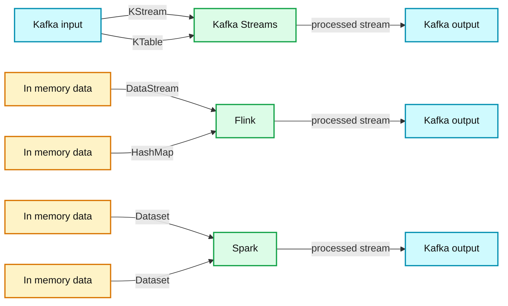
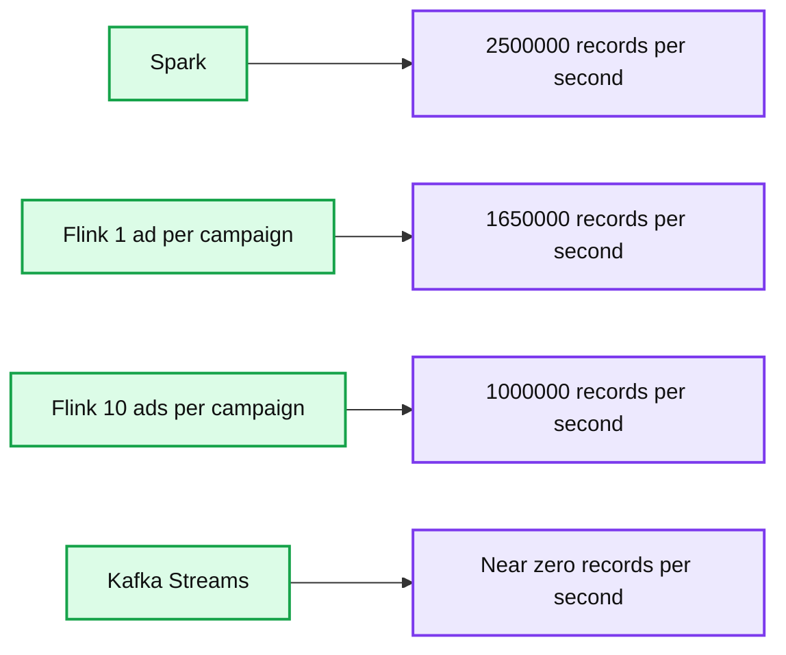
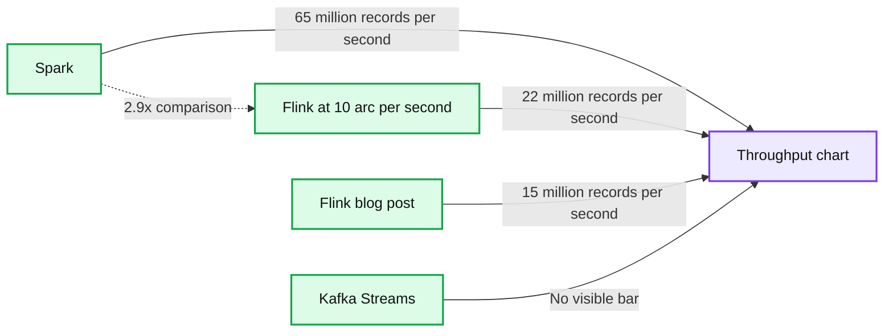

# Benchmarking Structured Streaming on Databricks Runtime Against State-of-the-Art Streaming Systems

- Source: https://www.databricks.com/blog/2017/10/11/benchmarking-structured-streaming-on-databricks-runtime-against-state-of-the-art-streaming-systems.html
- Published: 2017-10-11
- Authors: Burak Yavuz
- Categories: engineering, open-source, data-engineering, data-streaming
- Images: 3 total, 3 extracted as architecture

*Free Edition has replaced Community Edition, offering enhanced features at no cost. Start using *[*Free Edition *](https://login.databricks.com/?intent=SIGN_UP&amp;signup_experience_step=EXPRESS&amp;provider=DB_FREE_TIER&amp;dbx_source=www)*today.*
 

**Update Dec 14, 2017**: As a result of a fix in the toolkit’s data generator, Apache Flink's performance on a cluster of 10 nodes, multiple core cluster went from **6x** slower than Apache Spark to **3x**. This configuration is not examined in Apache Flink's post. In most uses cases, you will want to run streaming applications in a clustered environment, not on a single machine. Also, the images have been updated to reflect these changes.

Benchmarking is a crucial and common process for evaluating the performance of systems. What makes a benchmark credible is its reproducibility. Many existing benchmarks are hard to reproduce for a couple reasons:

- The code that was used to certain generate results is not publicly available.
- The hardware used to generate certain results is not easily accessible or available.

At Databricks, we used [Databricks Notebooks](https://docs.databricks.com/notebooks/index.html) and [cluster management](https://docs.databricks.com/clusters/index.html) to set up a reproducible benchmarking harness that compares the performance of [Apache Spark’s Structured Streaming](https://spark.apache.org/docs/latest/structured-streaming-programming-guide.html), running on [Databricks Unified Analytics Platform](https://www.databricks.com/product/data-lakehouse), against other open source streaming systems such as [Apache Kafka Streams](https://kafka.apache.org/documentation/streams/) and [Apache Flink](https://flink.apache.org/). In particular, we used the following systems and versions in our benchmarks:

- [Databricks Runtime 3.1](https://databricks.github.io/benchmarks/structured-streaming-yahoo-benchmark/index.html#Spark.html)
- [Apache Flink 1.2.1](https://databricks.github.io/benchmarks/structured-streaming-yahoo-benchmark/index.html#Flink.html)
- [Kafka Streams 0.10.2.1](https://databricks.github.io/benchmarks/structured-streaming-yahoo-benchmark/index.html#Kafka%20Streams.html)

The [Yahoo Streaming Benchmark](https://yahooeng.tumblr.com/post/135321837876/benchmarking-streaming-computation-engines-at) is a well-known benchmark used in industry to evaluate streaming systems. When setting up our benchmark, we wanted to push each streaming system to its absolute limits, yet keep the business logic the same as in the Yahoo Streaming Benchmark. We shared some of the results we achieved from these benchmarks during [Spark Summit West 2017 keynote](https://www.databricks.com/blog/2017/06/06/simple-super-fast-streaming-engine-apache-spark.html) showing that Spark can reach **4x or higher throughput** over other popular streaming systems. In this blog, we discuss in more detail about how we performed this benchmark, and how you can reproduce the results yourselves.

## Setup and Configuration

With only a couple of clicks and commands, you can run all these systems side-by-side in [Databricks Community Edition](https://www.databricks.com/try-databricks). All you need to do is:

1. Login to [Databricks Community Edition](https://community.cloud.databricks.com/login.html). You can create an account [here](https://www.databricks.com/try-databricks).
2. [Import the benchmark](https://docs.databricks.com/notebooks/index.html#importing-notebooks) using the [GitHub URL](https://github.com/databricks/benchmarks/blob/master/streaming/structured-streaming-yahoo-benchmark/yahooBenchmark.dbc)
3. [Launch a cluster](https://docs.databricks.com/clusters/create.html)
4. Follow the instructions in the [Main notebook](https://databricks.github.io/benchmarks/structured-streaming-yahoo-benchmark/index.html#Main.html) regarding the [installation of libraries](https://docs.databricks.com/libraries/index.html#creating-libraries) and how to run the benchmark.

If you have a Databricks Enterprise subscription, you may run the benchmark at scale using the additional set of configurations that have been commented out in the Main notebook.

## Background

The original Yahoo Benchmark emulates a simple advertisement application. A stream of ad events is consumed from Kafka. The goal is to compute event-time windowed counts of ad campaigns that are “viewed.” Specifically, the order of operations is:

- Read JSON data from Kafka. The input data has the following schema:
  - *user_id*: UUID
  - *page_id*: UUID
  - *ad_id*: UUID
  - *ad_type*: String in {banner, modal, sponsored-search, mail, mobile}
  - *event_type*: String in {view, click, purchase}
  - *event_time*: Timestamp
  - *ip_address*: String
- Filter events that we are interested in (view) based on the `event_type` field
- Take a projection of the relevant fields (`ad_id` and `event_time`)
- Join each event by `ad_id` with its associated `campaign_id`. This information is stored as a static table in Redis.
- Take a windowed count of views per campaign and store each window in Redis along with a timestamp of the time the window was last updated in Redis. This step must be able to handle late events.

## Methodology

We wanted to make sure that the system we were benchmarking was the bottleneck, and not some interaction with an external service; therefore, we made the following changes, as was done in the benchmark published by data Artisans on Flink:

- Redis was removed in order to not obfuscate join performance. Instead, we join the stream with a static table as follows:
  - In Kafka Streams, we read the static table from Kafka as a `KTable`. We made sure that both the static table and the events stream were partitioned equivalently in order to avoid an additional shuffle in Kafka Streams.
  - Flink doesn’t support joins (in version 1.2.1) of a `Datastream` with a `Dataset`. Therefore, we perform a hashmap lookup. In Spark, we join with a static local `Dataset.`
- Data is generated as follows:
  - For Flink and Spark, we generate data in memory
  - Kafka Streams requires data to be stored persistently in Kafka, so we generate data using Spark and write it out to Kafka
- Data is written out to Kafka instead of Redis. We use Kafka timestamps to determine the timestamp of the last update for the window.
- We also didn’t generate “late data” as each system is known to handle late data

**Summary:** The diagram compares Kafka Streams, Flink, and Spark processing pipelines, showing their input data sources, processing APIs, state stores, and Kafka outputs.

**Components:**

- Kafka input and output brokers
- Kafka Streams using KStream and KTable
- In memory data sources
- Flink using DataStream and HashMap
- Spark using Dataset

**Flows:**

- Kafka -> Kafka Streams: KStream
- Kafka -> Kafka Streams: KTable
- Kafka Streams -> Kafka: processed stream
- In memory data -> Flink: DataStream
- In memory data -> Flink: HashMap state
- Flink -> Kafka: processed stream
- In memory data -> Spark: Dataset
- In memory data -> Spark: Dataset
- Spark -> Kafka: processed stream

**Numbers:** none

source image: https://www.databricks.com/wp-content/uploads/2017/10/image1-1.png

In order to calculate latency, we calculated the timestamp of the latest record that was received for a given (campaign, event-time-window) pair during the windowed counts phase. Then we used the difference between this timestamp and the Kafka ingestion timestamp of the output to calculate latency.

Automating throughput calculation was a bit trickier. The method we used is as follows:

- For Spark, we used the `StreamingQueryListener` to record the start and end timestamps and the number of records processed.
- We would launch Kafka Streams inside long-running Spark tasks. Right after starting the stream, we send a record to Kafka to mark the beginning timestamp, and we send the number of records processed in each task once the stream is stopped to Kafka as well. Then we take the sum of the count of records, the minimum starting timestamp, the maximum ending timestamp, and then divide the sum of records by the duration.
- We didn’t have a good way to introspect the Flink job automatically, so we periodically log the number of records processed to a log. We use that log to figure out the start and end timestamps and the total records processed. This calculation is approximate, but the error is negligible on the scales we ran the benchmark.

## Apache Spark vs. Flink vs. Kafka Results

We tried to replicate the performance results for Flink of 15 M records/s published in this blog post. We were able to achieve numbers around 16 M records/s on Databricks using commodity cloud hardware (c3.2xlarge instances on AWS). However, we noticed that we could achieve the 16 M records/s throughput with Flink when we generated a single ad per campaign and not ten ads per campaign. Changing how many ads there were per campaign did not affect Spark or Kafka Streams’ performance but caused an order of magnitude drop in Flink’s throughput.

With the final benchmark setup, which we ran on Databricks Community Edition, we observed that Spark had **1.5 times** more throughput than Flink:

**Summary:** Single-core throughput comparison of Spark, Flink, and Kafka Streams on Databricks Community Edition.

**Components:**

- Spark using Apache Spark Structured Streaming
- Flink using Apache Flink with 1 ad per campaign
- Flink using Apache Flink with 10 ads per campaign
- Kafka Streams using Apache Kafka Streams
- Throughput axis measured in records per second

**Flows:**

- Spark -> 2,500,000 records per second: measured throughput
- Flink with 1 ad per campaign -> 1,650,000 records per second: measured throughput
- Flink with 10 ads per campaign -> 1,000,000 records per second: measured throughput
- Kafka Streams -> near-zero throughput: measured throughput

**Numbers:** 1.5x, 1 ad per campaign, 10 ads per campaign, 0, 500000, 1000000, 1500000, 2000000, 2500000, 3000000, records/second, Single Core

source image: https://www.databricks.com/sites/default/files/2017/10/ss_bm_image2.png

Once we ran the benchmark at scale (10 worker nodes) for each system, we observed the following results:

**Summary:** Benchmark throughput comparison across Spark, Flink, and Kafka Streams on 10 worker nodes.

**Components:**

- Spark
- Flink at 10 arc/s
- Flink blog post
- Kafka Streams
- Throughput in million records/s

**Flows:**

- Spark -> Throughput chart: approximately 65 million records/s
- Flink at 10 arc/s -> Throughput chart: approximately 22 million records/s
- Flink blog post -> Throughput chart: approximately 15 million records/s
- Spark -> Flink at 10 arc/s: 2.9x throughput comparison

**Numbers:** 40 core, 10 worker nodes, 2.9x, 10 arc/s, 0, 10, 20, 30, 40, 50, 60, 70, million records/s

source image: https://www.databricks.com/wp-content/uploads/2017/10/ss_bm_image_1.png

To recap, we ran the Yahoo Streaming Benchmarks to compare Apache Spark's Structured Streaming on Databricks Runtime against the other open-source streaming engines: Apache Flink and Apache Kafka Streams. Our results show that Spark can reach **2.9x or higher throughput**. In the spirit of reproducible experiments and methodology, we have published all the scripts for you to reproduce these benchmarks.

We look forward to hearing your feedback! Please submit them as issues to our [benchmark GitHub repository](https://github.com/databricks/benchmarks)
