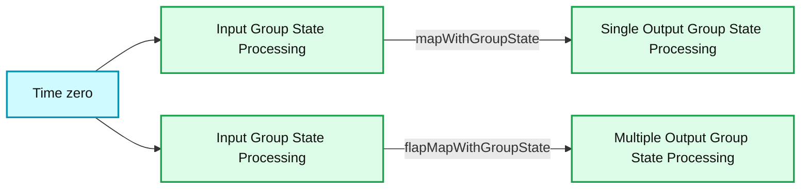

# Arbitrary Stateful Processing in Apache Spark’s Structured Streaming

*Part 7 of Scalable Data @ Databricks*

- Source: https://www.databricks.com/blog/2017/10/17/arbitrary-stateful-processing-in-apache-sparks-structured-streaming.html
- Published: 2017-10-17
- Authors: Bill Chambers, Jules Damji
- Categories: engineering, open-source, data-engineering
- Images: 1 total, 1 extracted as architecture

*This is the seventh post in a multi-part series about how you can perform complex [streaming analytics](https://www.databricks.com/glossary/streaming-analytics) using Apache Spark and Structured Streaming.*

## Introduction

Most data streams, though continuous in flow, have discrete events within streams, each marked by a timestamp when an event transpired. As a consequence, this idea of “event-time” is central to how [Structured Streaming](https://www.databricks.com/glossary/what-is-structured-streaming) APIs are fashioned for event-time processing—and the functionality they offer to process these discrete events.

[Event-time basics and event-time processing](https://www.databricks.com/blog/2017/05/08/event-time-aggregation-watermarking-apache-sparks-structured-streaming.html) are adequately covered in [Structured Streaming documentation](https://spark.apache.org/docs/latest/structured-streaming-programming-guide.html) and our [anthology of technical assets on Structure Streaming](https://www.databricks.com/blog/2017/08/24/anthology-of-technical-assets-on-apache-sparks-structured-streaming.html). So for brevity, we won’t cover them here. Built on the concepts developed (and tested at scale) in event-time processing, such as sliding windows, tumbling windows, and watermarking, this blog will focus on two topics:

1. How to handle duplicates in your event streams
2. How to handle arbitrary or custom stateful processing

## Dropping Duplicates

No streaming events are free of duplicate entries. Dropping duplicate entries in record-at-a-time systems is imperative—and often a cumbersome operation for a couple of reasons. First, you’ll have to process small or large batches of records at time to discard them. Second, some events, because of network high latencies, may arrive out-of-order or late, which may force you to reiterate or repeat the process. How do you account for that?

Structured Streaming, which ensures exactly once-semantics, can drop duplicate messages as they come in based on arbitrary keys. To deduplicate data, Spark will maintain a number of user-specified keys and ensure that duplicates, when encountered, are discarded.

Just as other stateful processing APIs in Structured Streaming are bounded by declaring [watermarking for late data](https://www.databricks.com/blog/2017/05/08/event-time-aggregation-watermarking-apache-sparks-structured-streaming.html) semantics, so is dropping duplicates. Without watermarking, the maintained state can grow infinitely over the course of your stream.

The API to instruct Structured Streaming to drop duplicates is as simple as all other APIs we have shown so far in our blogs and documentation. Using the API, you can declare arbitrarily columns on which to drop duplicates—for example, user_id and timestamp. An entry with same timestamp and user_id is marked as duplicate and dropped, but the same entry with two different timestamps is not.
 Let’s see an example how we can use the simple API to drop duplicates.

Over the course of the query, if you were to issue a SQL query, you will get an accurate results, with all duplicates dropped.

Next, we will expand on how to implement a customized stateful processing using two Structured Streaming APIs.

## Working with Arbitrary or Custom Stateful Processing

Not all event-time based processing is equal or as simple as aggregating a specific data column within an event. Others events are more complex; they require processing by rows of events ascribed to a group; and they only make sense when processed in their entirety by emitting either a single result or multiple rows of results, depending on your use cases.

Consider these use-cases where arbitrary or customized stateful processing become imperative:
 1. We want to emit an alert based on a group or type of events if we observe that they exceed a threshold over time
 2. We want to maintain user sessions, over definite or indefinite time and persist those sessions for post analysis.

All of the above scenarios require customized processing. Structured Streaming APIs offer a set of APIs to handle these cases: `mapGroupsWithState` and `flatMapGroupsWithState.` `mapGroupsWithStat`e can operate on groups and output only a single result row for each group, whereas `flatMapGroupsWithState` can emit a single row or multiple rows of results per group.

**Summary:** The diagram compares single-output and multiple-output group state processing over time using Spark Structured Streaming APIs.

**Components:**

- Input Group State Processing
- `mapWithGroupState`
- Single Output Group State Processing
- Input Group State Processing
- `flapMapWithGroupState`
- Multiple Output Group State Processing
- Time axis

**Flows:**

- Input Group State Processing -> Single Output Group State Processing: one output result per group
- Input Group State Processing -> Multiple Output Group State Processing: one or multiple output results per group
- Time axis -> Input Group State Processing: processing begins at time zero

**Numbers:** 0, 1, 2, 3, 4, 5, 6, 7, 8, 9

source image: https://www.databricks.com/wp-content/uploads/2017/10/workflow_uap_blog_2.jpg

### Timeouts and State

One thing to note is that because we manage the state of the group based on user-defined concepts, as expressed above for the use-cases, the semantics of watermark (expiring or discarding an event) may not always apply here. Instead, we have to specify an appropriate timeout ourselves. Timeout dictates how long we should wait before timing out some intermediate state.

Timeouts can either be based on processing time `(GroupStateTimeout.ProcessingTimeTimeout)` or event time `(GroupStateTimeout.EventTimeTimeout).` When using timeouts, you can check for timeout first before processing the values by checking the flag `state.hasTimedOut.`

To set processing timeout, use `GroupState.setTimeoutDuration(...)` method. That means the timeout guarantee will occur under the following conditions:

- Timeout will never occur before the clock has advanced **X ms** specified in the method
- Timeout will eventually occur when there is a trigger in the query, after **X ms**

To set event time timeout, use `GroupState.setTimeoutTimestamp(...)`. Only for timeouts based on event time must you specify watermark. As such all events in the group older than watermark will be filtered out, and the timeout will occur when the watermark has advanced beyond the set timestamp.

When timeouts occur, your function supplied in the streaming query will be invoked with arguments: the key by which you keep the state; an iterator rows of input, and an old state. The example with `mapGroupsWithState` below defines a number of functional classes and objects used.

### Example with mapGroupsWithState

Let’s take a simple example where we want to find out when (timestamp) a user performed his or her first and last activity in a given dataset in a stream. In this case, we will group on (or map on) on a user key and activity key combination.

But first, `mapGroupsWithState` requires a number of functional classes and objects:
 1. Three class definitions: an input definition, a state definition, and optionally an output definition.
 2. An update function based on a key, an iterator of events, and a previous state.
 3. A timeout parameter as described above.

So let’s define our input, output, and state data structure definitions.

Based on a given input row, we define our update function

And finally, we write our function that defines the way state is updated based on an epoch of rows.

With these pieces in place, we can now use them in our query. As discussed above, we have to specify our timeout so that the method can timeout a given group’s state and we can control what should be done with the state when no update is received after a timeout. For this illustration, we will maintain state indefinitely.

We can now query our results in the stream:

And our sample result that shows user activity for the first and last time stamp:

## What's Next

In this blog, we expanded on two additional functionalities and APIs for advanced streaming analytics. The first allows removing duplicates bounded by a watermark. With the second, you can implement customized stateful aggregations, beyond [event-time basics](https://spark.apache.org/docs/latest/structured-streaming-programming-guide.html#handling-event-time-and-late-data) and [event-time processing](https://spark.apache.org/docs/latest/structured-streaming-programming-guide.html#window-operations-on-event-time).

Through an example using mapGroupsWithState APIs, we demonstrated how you can implement your customized stateful aggregation for events whose processing semantics can be defined not only by timeout but also by user semantics and business logic.

Our next blog in this series, we will explore advanced aspects of `flatMapGroupsWithState` use cases, as will be discussed at the [Spark Summit EU](https://www.databricks.com/sparkaisummit/europe), in Dublin, in a [deep dive session on Structured Streaming](https://www.databricks.com/blog/2017/09/01/streaming-etl-scale-apache-sparks-structured-streaming.html).

## Read More

Over the course of Structured Streaming development and release since Apache Spark 2.0, we have compiled a comprehensive compendium of technical assets, including our Structured Series blogs. You can read the relevant assets here:

- [Anthology of Technical Assets on Apache Spark’s Structured Streaming](https://www.databricks.com/blog/2017/08/24/anthology-of-technical-assets-on-apache-sparks-structured-streaming.html)

Try Apache Spark’s Structured Streaming latest APIs on Databricks’ [Data Lakehouse Platform](https://www.databricks.com/product/data-lakehouse).
