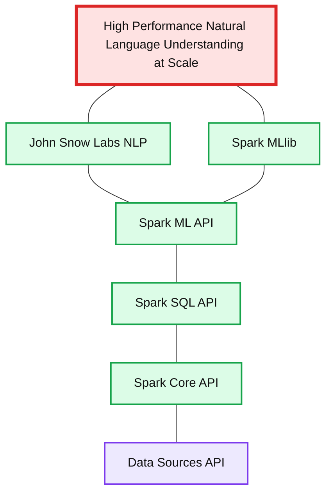
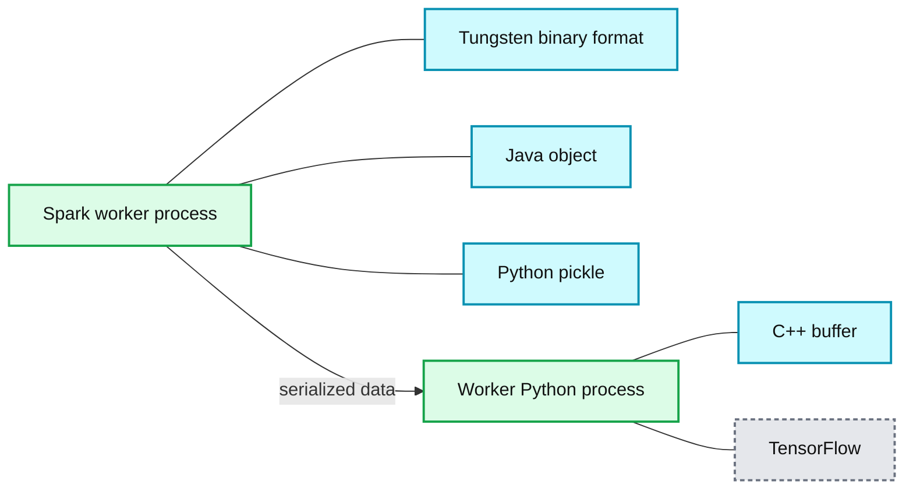

# Introducing the Natural Language Processing Library for Apache Spark

- Source: https://www.databricks.com/blog/2017/10/19/introducing-natural-language-processing-library-apache-spark.html
- Published: 2017-10-19
- Authors: David Talby
- Categories: solutions, engineering, open-source, data-science-machine-learning
- Images: 3 total, 3 extracted as architecture

*This is a community blog and effort from the engineering team at John Snow Labs, explaining their contribution to an open-source Apache Spark Natural Language Processing (NLP) library. The blog expounds on three top-level technical requirements and considerations for this library.*

Apache Spark is a general-purpose cluster computing framework, with native support for distributed SQL, streaming, graph processing, and machine learning. Now, the Spark ecosystem also has an [Spark Natural Language Processing library](https://nlp.johnsnowlabs.com/).

Get it on [GitHub](https://github.com/johnsnowlabs/spark-nlp)

The John Snow Labs NLP Library is under the Apache 2.0 license, written in Scala with no dependencies on other NLP or ML libraries. It natively extends the Spark ML Pipeline API. The framework provides the concepts of annotators, and comes out of the box with:

- Tokenizer
- Normalizer
- Stemmer
- Lemmatizer
- Entity Extractor
- Date Extractor
- Part of Speech Tagger
- Named Entity Recognition
- Sentence boundary detection
- Sentiment analysis
- Spell checker

In addition, given the tight integration with Spark ML, there is a lot more you can use right away when building your NLP pipelines. This includes word embeddings, topic modeling, stop word removal, a variety of feature engineering functions (tf-idf, n-grams, similarity metrics, …) and using NLP annotations as features in machine learning workflows. If you’re not familiar with these terms, this [guide to understanding NLP tasks](https://www.analyticsvidhya.com/blog/2017/01/ultimate-guide-to-understand-implement-natural-language-processing-codes-in-python/) is a good start.

**Summary:** High Performance Natural Language Understanding at Scale is presented as a layered stack combining John Snow Labs NLP, Spark MLlib, and Spark APIs.

**Components:**

- John Snow Labs: Part of Speech Tagger, Named Entity Recognition, Sentiment Analysis, Spell Checker, Tokenizer, Stemmer, Lemmatizer, Entity Extraction
- Spark MLlib: Topic Modeling, Word2Vec, TF-IDF, String Distance Calculation, N-grams Calculation, Stop Word Removal, Train/Test and Cross-Validate Ensembles
- Spark ML API: Pipeline, Transformer, Estimator
- Spark SQL API: DataFrame, Catalyst Optimizer
- Spark Core API: RDDs, Project Tungsten
- Data Sources API
- High Performance Natural Language Understanding at Scale: overall system capability

**Flows:**

- none visible

**Numbers:** none

source image: https://www.databricks.com/wp-content/uploads/2017/10/image3-3.png

Our virtual team has been building commercial software that heavily depends on natural language understanding for several years now. As such, we have hands-on experience with [spaCy](https://spacy.io/), [CoreNLP](https://stanfordnlp.github.io/CoreNLP/), [OpenNLP](https://opennlp.apache.org/), [Mallet](https://mimno.github.io/Mallet/index), [GATE](https://gate.ac.uk/), [Weka](https://www.cs.waikato.ac.nz/ml/weka/), [UIMA](https://uima.apache.org/), [nltk](https://www.nltk.org/), [gensim](https://radimrehurek.com/gensim/), Negex, [word2vec](https://code.google.com/archive/p/word2vec/), [GloVe](https://nlp.stanford.edu/projects/glove/), and a few others. We are big fans, and the many places where we’ve imitated these libraries are intended as the sincere form of flattery that they are. But we’ve also banged our heads too many times against their limitations - when we’ve had to deliver scalable, high-performance, high-accuracy software for real production use.

This post describes the advantage of the John Snow Labs NLP library and the use cases for which you should consider it for your own projects.

## Performance

The first of three top-level requirements we tackled is runtime performance. You’d think this was largely a solved problem with the advent of [spaCy and its public benchmarks](https://spacy.io/api/) which reflect a well thought-out and masterfully implemented set of tradeoffs. However, when building [Spark applications](https://www.databricks.com/glossary/what-are-spark-applications) on top of it, you’d still get unreasonably subpar throughput.

To understand why, consider that an NLP pipeline is always just a part of a bigger data processing pipeline: For example, question answering involves loading training, data, transforming it, applying NLP annotators, building features, training the value extraction models, evaluating the results (train/test split or cross-validation), and hyper-parameter estimation.

Splitting your data processing framework (Spark) from your NLP frameworks means that most of your processing time gets spent serializing and copying strings.

A great parallel is [TensorFrames](https://github.com/databricks/tensorframes) - which greatly improves the performance of running [TensorFlow](https://www.databricks.com/glossary/what-is-tensorflow) workflows on Spark data frames. This image is credited to [Tim Hunter’s excellent TensorFrames overview](https://www.slideshare.net/databricks/tensorframes-google-tensorflow-on-apache-spark):

**Summary:** The diagram shows data flowing from a Spark worker process to a worker Python process through serialized formats.

**Components:**

- Spark worker process using Apache Spark
- Tungsten binary format
- Java object
- Python pickle
- Worker Python process using Python
- C++ buffer
- TensorFlow

**Flows:**

- Spark worker process -> Worker Python process: serialized data through an inter-process communication arrow

**Numbers:** 20

source image: https://www.databricks.com/wp-content/uploads/2017/10/image1-3.png

Both Spark and TensorFlow are optimized to the extreme for performance and scale. However, since DataFrames live in the JVM and TensorFlow runs in a Python process, any integration between the two frameworks means that every object has to be serialized, go through inter-process communication (!) in both ways, and copied at least twice in memory. TensorFrames public benchmarks report a 4x speedup by just copying the data within the JVM process (and much more when using GPUs).

We see the same issue when using spaCy with Spark: Spark is highly optimized for loading & transforming data, but running an NLP pipeline requires copying all the data outside the Tungsten optimized format, serializing it, pushing it to a Python process, running the NLP pipeline (this bit is lightning fast), and then re-serializing the results back to the JVM process. This naturally kills any performance benefits you would get from Spark’s caching or execution planner, requires at least twice the memory, and doesn’t improve with scaling. Using CoreNLP eliminates the copying to another process, but still requires copying all text from the data frames and copying the results back in.

So our first order of business is to perform the analysis directly on the optimized data frames, as Spark ML already does (credit: [ML Pipelines introduction post by Databricks](https://www.databricks.com/blog/2015/01/07/ml-pipelines-a-new-high-level-api-for-mllib.html)):

**Summary:** Spark NLP pipeline transforming an input data set through tokenization, hashing TF, and logistic regression to produce an output data set.

**Components:**

- ds0: input Spark DataFrame
- tokenizer: tokenizer transformer
- ds1: tokenized Spark DataFrame
- hashingTF: hashing TF transformer
- ds2: feature DataFrame
- lr: logistic regression estimator
- lr.model: trained logistic regression model
- ds3: output Spark DataFrame
- pipeline model: Spark ML pipeline boundary

**Flows:**

- ds0 -> tokenizer: input text data
- tokenizer -> ds1: tokenized data
- ds1 -> hashingTF: tokenized data
- hashingTF -> ds2: hashed term features
- ds2 -> lr: training features
- lr -> lr.model: trained model
- ds2 -> lr.model: feature data
- lr.model -> ds3: predictions

**Numbers:** none

source image: https://www.databricks.com/wp-content/uploads/2017/10/image2-3.png

```mermaid
%% Shows a Spark NLP pipeline with tokenization, feature hashing, and logistic regression
flowchart LR
    ds0[(ds0)] -->|input text data| tokenizer[tokenizer]
    tokenizer -->|tokenized data| ds1[(ds1)]
    ds1 -->|tokenized data| hashingTF[hashingTF]
    hashingTF -->|hashed term features| ds2[(ds2)]
    ds2 -.->|training features| lr[lr]
    lr -.->|trained model| lrmodel[lr model]
    ds2 -->|feature data| lrmodel
    lrmodel -->|predictions| ds3[(ds3)]

    subgraph pipeline[pipeline model]
        tokenizer
        ds1
        hashingTF
        ds2
        lr
        lrmodel
    end

    classDef client fill:#dbeafe,stroke:#2563eb,stroke-width:2px,color:#111
    classDef service fill:#dcfce7,stroke:#16a34a,stroke-width:2px,color:#111
    classDef store fill:#ede9fe,stroke:#7c3aed,stroke-width:2px,color:#111
    classDef cache fill:#fef3c7,stroke:#d97706,stroke-width:2px,color:#111
    classDef queue fill:#cffafe,stroke:#0891b2,stroke-width:2px,color:#111
    classDef critical fill:#fee2e2,stroke:#dc2626,stroke-width:4px,color:#111
    classDef external fill:#e5e7eb,stroke:#6b7280,stroke-width:2px,color:#111,stroke-dasharray:4 3
    classDef decision fill:#fce7f3,stroke:#db2777,stroke-width:2px,color:#111

    class ds0,ds1,ds2,ds3 store
    class tokenizer,hashingTF,lr,lrmodel service
```

## Ecosystem

Our second core requirement was frictionless reuse of existing Spark libraries. Part of it is our own pet peeve - why does every NLP library out there have to build its own topic modeling and word embedding implementations? The other part is pragmatic - we’re a small team under tight deadlines and need to make the most of what’s already there.

When we started thinking about a Spark NLP library, we first asked Databricks to point us to whoever is already building one. When the answer came there there isn’t one, the next ask was to help us make sure the design and API of the library fully meet Spark ML’s API guidelines. The result of this collaboration is that the library is a seamless extension of Spark ML, so that for example you can build this kind of pipeline:

In this code, the document assembler, tokenizer, and stemmer come from the Spark NLP library - the com.jsl.nlp.* package. The `TF hasher`, `IDF` and `labelDeIndex` all come from MLlib’s`org.apache.spark.ml.feature.*` package. The dtree stage is a `spark.ml.classification.DecisionTreeClassifier`. All these stages run within one pipeline that is configurable, serializable and testable in the exact same way. They also run on a data frame without any copying of data (unlike [spark-corenlp](https://spark-packages.org/package/databricks/spark-corenlp)), enjoying Spark’s signature in-memory optimizations, parallelism and distributed scale out.

What this means is the John Snow Labs NLP library comes with fully distributed, heavily tested and optimized [topic modeling](https://medium.com/zero-gravity-labs/lda-topic-modeling-in-spark-mllib-febe84b9432), [word embedding](https://spark.apache.org/docs/latest/mllib-feature-extraction.html#word2vec), n-gram generation, and cosine similarity out of the box. We didn't have to build them though - they come with Spark.

Most importantly, it means that your NLP and [ML pipelines](https://www.databricks.com/glossary/what-are-ml-pipelines) are now unified. The above code sample is typical, in the sense that it’s not “just” an NLP pipeline - NLP is used to generate features which are then used to train a decision tree. This is typical of question answering tasks. A more complex example would also apply named entity recognition, filtered by POS tags and coreference resolution; train a random forest, taking into account both NLP-based features and structured features from other sources; and use grid search for hyper-parameter optimization. Being able to use a unified API pays dividends whenever you need to test, reproduce, serialize or publish such a pipeline - even beyond the performance and reuse benefits.

## Enterprise Grade

Our third core requirement is delivering a mission-critical, enterprise-grade NLP library. We make our living building production software. Many of the most popular NLP packages today have academic roots - which shows in design trade-offs that favor ease of prototyping over runtime performance, breadth of options over simple minimalist API’s, and downplaying of scalability, error handling, frugal memory consumption and code reuse.

The John Snow Labs NLP library is written in Scala. It includes Scala and Python APIs for use from Spark. It has no dependency on any other NLP or ML library. For each type of annotator, we do an academic literature review to find the state of the art, have a team discussion and decide which algorithm(s) to implement. Implementations are evaluated on three criteria:

- **Accuracy** - there’s no point in a great framework, if it has sub-par algorithms or models.
- **Performance** - runtime should be on par or better than any public benchmark. No one should have to give up accuracy because annotators don’t run fast enough to handle a streaming use case, or don’t scale well in a cluster setting.
- **Trainability or Configurability** - NLP is an inherently domain-specific problem. Different grammars and vocabularies are used in social media posts vs. academic papers vs. SEC filings vs. electronic medical records vs. newspaper articles.

The library is already in use in enterprise projects - which means that the first level of bugs, refactoring, unexpected bottlenecks and serialization issues have been resolved. Unit test coverage and reference documentation are at a level that made us comfortable to make the code open source.

[John Snow Labs](https://www.johnsnowlabs.com/) is the company leading and sponsoring the development of the Spark NLP library. The company provides commercial support, indemnification and consulting for it. This provides the library with long-term financial backing, a funded active development team, and a growing stream of real-world projects that drives robustness and roadmap prioritization.

## Getting involved

If you need NLP for your current project, head to the [John Snow Labs NLP for Apache Spark homepage](https://nlp.johnsnowlabs.com/) or quick start guide and give it a try. Prebuilt maven central (Scala) and pip install (Python) versions are available. Send us questions or feedback to nlp@johnsnowlabs.com or via Twitter, LinkedIn or GitHub.

Let us know what functionality you need next. Here are some of the requests we’re getting, and are looking for more feedback to design and prioritize:

- Provide a SparkR client
- Provide “Spark-free” Java and Scala versions
- Add a state of the art annotator for coreference resolution
- Add a state of the art annotators for polarity detection
- Add a state of the art annotator for temporal reasoning
- Publish sample applications for common use cases such as question answering, text summarization or information retrieval
- Train and publish models for new domains or languages
- Publish reproducible, peer reviewed accuracy and performance benchmarks

If you’d like to extend or contribute to the library, start by cloning the [John Snow Labs NLP for Spark GitHub](https://github.com/johnsnowlabs/spark-nlp) repository. We use pull requests and GitHub’s issue tracker to manage code changes, bugs and features. The library is still in its early days and we highly appreciate contribution and feedback of any kind.

## Acknowledgements

Alex Thomas from Indeed and David Talby from Pacific AI for the initial design and code of this library.

Saif Addin Ellafi from John Snow Labs for building the first client-ready version of the library.

Eduardo Munoz, Navneet Behl and Anju Aggarwal from John Snow Labs for expanding the production grade codebase and functionality, and for managing the project.

Joseph Bradley and Xiangrui Meng from Databricks, for guidance on the Spark ML API extension guidelines.

Claudiu Branzan from G2 Web Services, for design contributions and review.

Ben Lorica from O’Reilly, for driving me to move this from idea to reality.
