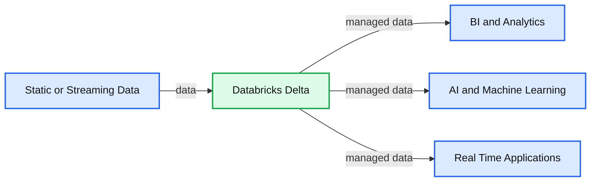

# Databricks Delta: A Unified Data Management System for Real-time Big Data

- Source: https://www.databricks.com/blog/2017/10/25/databricks-delta-a-unified-management-system-for-real-time-big-data.html
- Published: 2017-10-25
- Authors: Michael Armbrust, Bill Chambers, Matei Zaharia
- Categories: platform, product, announcements, engineering, company
- Images: 2 total, 2 extracted as architecture

*Combining the best of data warehouses, data lakes and streaming*

>  For an in-depth look and demo, [join the webinar](https://pages.databricks.com/Reg-Unified-Data-Management-Warehouses.html).

Today we are proud to introduce Databricks Delta, a unified data management system to simplify large-scale data management. Currently, organizations build their big data architectures using a mix of systems, including data warehouses, [data lakes](https://www.databricks.com/discover/data-lakes/introduction) and streaming systems. This greatly increases cost and, more consequentially, operational complexity as systems become hard to connect and maintain.

Databricks Delta is a single data management tool that combines the scale of a data lake, the reliability and performance of a data warehouse, and the low latency of streaming in a single system for the first time. Together with the rest of the [Databricks Unified Analytics Platform](https://www.databricks.com/product/data-lakehouse), Delta makes it dramatically easier to build, manage, and put big data applications into production.

### The Problem with Current Data Architectures

Before we dive into Delta, let’s discuss what makes current big data architectures hard to build, manage, and maintain. Most modern data architectures use a mix of at least three different types of systems: streaming systems, data lakes, and data warehouses.

**Summary:** The diagram shows data flowing from streaming systems through data lakes into data warehouses.

**Components:**

- Streaming Systems using Amazon Kinesis or Apache Kafka
- Data Lakes using Apache Hadoop or Amazon S3
- Data Warehouses

**Flows:**

- Streaming Systems -> Data Lakes: business data
- Data Lakes -> Data Warehouses: stored data

**Numbers:** none

source image: https://www.databricks.com/wp-content/uploads/2017/10/Screen-Shot-2017-10-25-at-00.59.41.png

```mermaid
%% Shows data flowing from streaming systems to data lakes to data warehouses
flowchart LR
    A[Streaming Systems] -->|Business data| B[Data Lakes]
    B -->|Stored data| C[Data Warehouses]

    class A client
    class B store
    class C store

    classDef client fill:#dbeafe,stroke:#2563eb,stroke-width:2px,color:#111
    classDef service fill:#dcfce7,stroke:#16a34a,stroke-width:2px,color:#111
    classDef store fill:#ede9fe,stroke:#7c3aed,stroke-width:2px,color:#111
    classDef cache fill:#fef3c7,stroke:#d97706,stroke-width:2px,color:#111
    classDef queue fill:#cffafe,stroke:#0891b2,stroke-width:2px,color:#111
    classDef critical fill:#fee2e2,stroke:#dc2626,stroke-width:4px,color:#111
    classDef external fill:#e5e7eb,stroke:#6b7280,stroke-width:2px,color:#111,stroke-dasharray:4 3
    classDef decision fill:#fce7f3,stroke:#db2777,stroke-width:2px,color:#111
```

Business data arrives through streaming systems such as Amazon Kinesis or Apache Kafka, which largely focus on rapid delivery. Data is then stored long-term in data lakes, such as Apache Hadoop or Amazon S3, which are optimized for large-scale, ultra low-cost storage. Unfortunately, data lakes alone do not have the performance and features needed to support high-end business applications: thus, the most valuable data is uploaded to data warehouses, which are optimized for high performance, concurrency and reliability at a much higher storage cost than data lakes.

This conventional architecture creates several challenges that all enterprises struggle with. First, the Extract-Transform-Load (ETL) process between these storage systems is error-prone and complex. Data teams spend a large fraction of their time building ETL jobs. If these jobs miss some input data one day or upload data containing errors, all downstream applications suffer. Second, the ETL process adds considerable latency, meaning it can take hours from when a record arrived to when it appears in a data warehouse.

Greg Rokita, executive director of technology at Edmunds.com, describes the problem well: “At Edmunds, obtaining real-time customer and revenue insights is critical to our business. But we’ve always been challenged with complex ETL processing that slows down our access to data.”

At Databricks, we’ve seen these problems throughout organizations of all sizes since we started the company. Based on this experience, we’ve been looking for ways to radically simplify data management. In short, what if we could provide the main benefits of each type of system---data lakes, data warehouses and streaming---in one [unified platform](https://www.databricks.com/glossary/what-is-unified-analytics), without expensive and error-prone ETL? This is exactly what we built in Delta.

### Databricks Delta: Unified Data Management

Delta is a new type of *unified* data management system that combines the best of data warehouses, data lakes, and streaming. Delta runs over Amazon S3 and stores data in open formats like Apache Parquet. However, Delta augments S3 with several extensions, allowing it to meet three goals:

1. **The reliability and performance of a data warehouse:** Delta supports transactional insertions, deletions, upserts, and queries; this enables reliable concurrent access from hundreds of applications. In addition, Delta automatically indexes, compacts and caches data; this achieves up to 100x improved performance over Apache Spark running over Parquet or [Apache Hive](https://www.databricks.com/glossary/apache-hive) on S3.
2. **The speed of streaming systems:** Delta transactionally incorporates new data in seconds and makes this data immediately available for high-performance queries using either streaming or batch.
3. **The scale and cost-efficiency of a data lake:** Delta stores data in cloud blob stores like S3. From these systems it inherits low cost, massive scalability, support for concurrent accesses, and high read and write throughput.

**Summary:** Databricks Delta receives static or streaming data and supports BI, analytics, AI, machine learning, and real-time applications.

**Components:**

- Static or Streaming Data - data input
- Databricks Delta - unified data management system
- BI and Analytics - analytics consumers
- AI and Machine Learning - machine learning consumers
- Real Time Applications - real-time application consumers

**Flows:**

- Static or Streaming Data -> Databricks Delta: data
- Databricks Delta -> BI and Analytics: managed data
- Databricks Delta -> AI and Machine Learning: managed data
- Databricks Delta -> Real Time Applications: managed data

**Numbers:** none

source image: https://www.databricks.com/wp-content/uploads/2017/10/Screen-Shot-2017-10-25-at-01.15.08.png

With Delta, organizations no longer need to make a tradeoff between storage system properties, or spend their resources moving data across systems. Hundreds of applications can now reliably upload, query and update data at massive scale and low cost.

From a technical standpoint, Delta achieves these goals by implementing two fundamental extensions over S3:

- ACID transactions and
- automatic data indexing (integrated with Delta transactions).

These extensions let Delta perform a wide variety of optimizations, while still providing reliable data access for applications, on behalf of the user. Delta plugs into any Spark job as a data source, stores data in each user’s individual S3 account, and integrates with Databricks Enterprise Security to provide a complete data management platform.

Stay tuned for a more detailed technical discussion of Delta in future blog posts.

### A Sample Use Case: Real-Time InfoSec

As Ali Ghodsi, CEO Databricks, mentioned in his keynote at [Spark Summit Europe](https://www.databricks.com/sparkaisummit/europe), Delta is already in use with some of our largest customers. Let’s walk through the use case of a Databricks Fortune 100 customer already processing trillions of records per day in production with Delta. Here are their requirements:

- **Large ingest volume at low latency**: Delta tables need to be able to ingest trillions of records per day with second to minute latency.
- **Data correctness and transactional updates**: Data must be correct and consistent. Partial and failed writes should never show up in end user queries.
- **Fast, flexible queries on current and historical data**: Analysts need to analyze petabytes of data with general purpose languages like Python; in addition to SQL.

It took a team of twenty engineers over six months to build their legacy architecture that consisted of various data lakes, data warehouses, and ETL tools to try to meet these requirements. Even then, the team was only able to store two weeks of data in its data warehouses due to cost, limiting its ability to look backward in time. Furthermore, the data warehouses chosen were not able to run machine learning.

**Using Delta, this company was able to put their Delta-based architecture into production in just two weeks with a team of five engineers.**

Their new architecture is simple and performant. End-to-end latency is low (seconds to minutes) and the team saw up to 100x query speed improvements over open source Apache Spark on Parquet. Moreover, using Delta, the team is now able to run interactive queries on all its historical data — not just two weeks worth — while gaining the ability to leverage Apache Spark for machine learning and advanced analytics.

### Getting Started with Delta

Delta is currently in the technical preview phase with multiple Databricks customers. This means that it is currently running in production, but we’re still ironing out some of the details on particularly challenging use cases with passionate customers. Delta won’t be generally available until early next year but if you’re interested in participating in the technical preview, [please sign up on the Delta product page and we will be in touch!](https://www.databricks.com/product/delta-lake-on-databricks)

### Conclusion

While big data applications have become essential to all businesses, they are still too complex to build and slow to deliver. New models such as data lakes and the [Lambda architecture](https://www.databricks.com/glossary/lambda-architecture) have continuously been proposed to simplify data management. With Databricks Delta, we think we have finally made a significant leap towards this goal. Instead of *adding* new storage systems and data management steps, Delta lets organizations *remove* complexity by getting the benefits of multiple storage systems in one. By combining the best attributes of existing systems over scalable, low-cost cloud storage, we believe Delta will enable dramatically simpler data architectures that let organizations focus on extracting value from their data.

**Interested in the open source Delta Lake?**
[Visit the Delta Lake online hub](https://delta.io?utm_source=delta-blog) to learn more, download the latest code and join the Delta Lake community.
