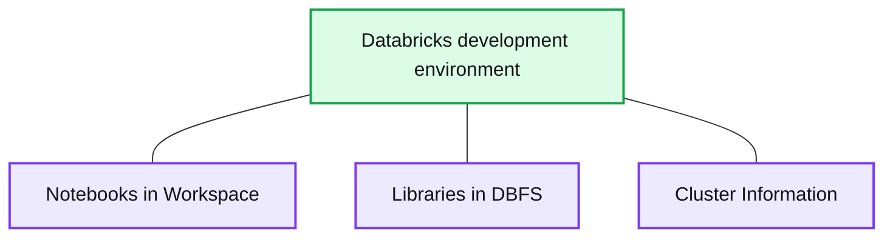
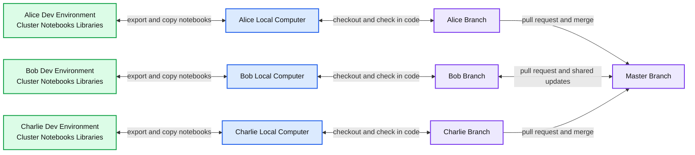
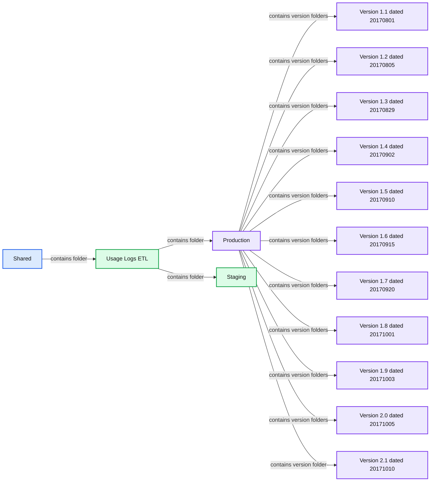

# Continuous Integration & Continuous Delivery with Databricks

- Source: https://www.databricks.com/blog/2017/10/30/continuous-integration-continuous-delivery-databricks.html
- Published: 2017-10-30
- Authors: Yu Peng, Andrew Chen, Prakash Chockalingam
- Categories: platform, product, engineering, company
- Images: 10 total, 5 extracted as architecture

Continuous integration and continuous delivery (CI/CD) is a practice that enables an organization to rapidly iterate on software changes while maintaining stability, performance and security. Continuous Integration (CI) practice allows multiple developers to merge code changes to a central repository. Each merge typically triggers an automated build that compiles the code and runs unit tests. Continuous delivery (CD) expands on CI by pushing code changes to multiple environments like QA and staging after build has been completed so that new changes can be tested for stability, performance and security. CD typically requires manual approval before the new changes are pushed to production. Continuous deployment automates the production push as well.

*Figure 1: A CI/CD pipeline.*

**Summary:** The diagram shows a CI/CD pipeline progressing from source changes through build, staging, and production deployment.

**Components:**

- Source: developers commit changes. Technology not specified.
- Build: builds code and runs tests. Technology not specified.
- Staging: deploys code to staging and verifies behavior and stability. Technology not specified.
- Production: deploys code to production. Technology not specified.

**Flows:**

- Source -> Build: committed code changes
- Build -> Staging: built and tested code
- Staging -> Production: verified code approved for production

**Numbers:** none

source image: https://www.databricks.com/wp-content/uploads/2017/10/CI-CD-BLOG4@2x.png

```mermaid
%% Shows the CI/CD pipeline from source changes to production deployment
flowchart LR
    A[Source<br/>Developers commit changes] -->|committed code changes| B[Build<br/>Build code and run tests]
    B -->|built and tested code| C[Staging<br/>Deploy code to staging and verify behavior and stability]
    C -->|verified code approved for production| D[Production<br/>Deploy code to production]

    classDef client   fill:#dbeafe,stroke:#2563eb,stroke-width:2px,color:#111
    classDef service  fill:#dcfce7,stroke:#16a34a,stroke-width:2px,color:#111
    classDef store    fill:#ede9fe,stroke:#7c3aed,stroke-width:2px,color:#111
    classDef cache    fill:#fef3c7,stroke:#d97706,stroke-width:2px,color:#111
    classDef queue    fill:#cffafe,stroke:#0891b2,stroke-width:2px,color:#111
    classDef critical fill:#fee2e2,stroke:#dc2626,stroke-width:4px,color:#111
    classDef external fill:#e5e7eb,stroke:#6b7280,stroke-width:2px,color:#111,stroke-dasharray:4 3
    classDef decision fill:#fce7f3,stroke:#db2777,stroke-width:2px,color:#111

    class A,B,C,D service
```

Figure 1: A CI/CD pipeline.

Many organizations have adopted various tools to follow the best practices around CI/CD to improve developer productivity, code quality, and deliver software faster. As we are seeing massive adoption of Databricks amongst our customer base for data engineering and machine learning, one common question that comes up very often is how to follow the CI/CD best practices for data pipelines built on Databricks.

In this blog, we outline the common integration points for a data pipeline in the CI/CD cycle and how you can leverage functionalities in Databricks to integrate with your systems. Our own internal data pipelines follow the approach outlined in this blog to continuously deliver audit logs to our customers.

### Key challenges for CI/CD in building a data pipeline

Following are the key phases and challenges in following the best practices of CI/CD for a data pipeline:

*Figure 2: A high level workflow for CI/CD of a data pipeline with Databricks.*

**Summary:** High-level Databricks CI/CD workflow connecting local development, version control, a build server, and staging and production environments.

**Components:**

- Development Environment: Databricks development workspace
- Local Development: Local development environment
- Version Control: Branch and Master repositories
- Build Server: CI/CD build server
- Staging Environment: Databricks staging workspace
- Production Environment: Databricks production workspace

**Flows:**

- Development Environment -> Local Development: Import
- Local Development -> Development Environment: Export
- Local Development -> Branch: Check In
- Branch -> Local Development: Check Out
- Branch <-> Master: Version-control synchronization
- Master -> Build Server: Source code
- Build Server -> Staging Environment: Deployment
- Build Server -> Production Environment: Deployment

**Numbers:** none

source image: https://www.databricks.com/wp-content/uploads/2017/10/CI-CD-BLOG1@2x.png

```mermaid
%% Shows the Databricks continuous integration and continuous delivery workflow
flowchart LR
    Dev[Development Environment]
    Local[Local Development]
    Branch[Branch]
    Master[Master]
    Build[Build Server]
    Stage[Staging Environment]
    Prod[Production Environment]

    Dev -->|Import| Local
    Local -->|Export| Dev
    Local -->|Check In| Branch
    Branch -->|Check Out| Local
    Branch <-->|Version control| Master
    Master -->|Source code| Build
    Build -->|Deploy| Stage
    Build -->|Deploy| Prod

    %% Legend
    %% client = clients, edge, gateway, or load balancer
    %% service = stateless compute
    %% store = databases or durable storage
    %% cache = Redis, CDN, or losable data
    %% queue = Kafka, streams, or asynchronous pipes
    %% critical = bottleneck or single point of failure
    %% external = third-party system
    %% decision = trade-off point

    classDef client fill:#dbeafe,stroke:#2563eb,stroke-width:2px,color:#111
    classDef service fill:#dcfce7,stroke:#16a34a,stroke-width:2px,color:#111
    classDef store fill:#ede9fe,stroke:#7c3aed,stroke-width:2px,color:#111
    classDef cache fill:#fef3c7,stroke:#d97706,stroke-width:2px,color:#111
    classDef queue fill:#cffafe,stroke:#0891b2,stroke-width:2px,color:#111
    classDef critical fill:#fee2e2,stroke:#dc2626,stroke-width:4px,color:#111
    classDef external fill:#e5e7eb,stroke:#6b7280,stroke-width:2px,color:#111,stroke-dasharray:4 3
    classDef decision fill:#fce7f3,stroke:#db2777,stroke-width:2px,color:#111

    class Dev,Stage,Prod external
    class Local,Build service
    class Branch,Master store
```

Figure 2: A high level workflow for CI/CD of a data pipeline with Databricks.

- **Data exploration:** Databricks’ interactive workspace provides a great opportunity for exploring the data and building ETL pipelines. When multiple users need to work on the same project, there are many ways a project can be set up and developed in this collaborative environment. Often users find it hard to get the right approach with notebooks.
- **Iterative development with unit tests:** As you are building ETL prototypes by exploring data in notebooks and moving towards maturity, code can get quickly unwieldy and writing unit tests can become a problem.
- **Continuous integration and build:** As new code is getting merged, the build server must be able to pull the latest changes and run the unit tests for various components and publish the latest artifacts.
- **Pushing data pipeline to staging environment:** Once all the unit tests have passed, the build server must be able to push the data pipeline to a staging environment to test the pipeline on a much larger data set that resembles production data for performance and data quality.
- **Pushing data pipeline to production environment:** The final phase is pushing the data pipeline in staging into production so that the next run of the pipeline picks the latest code and generates the new data set in production.

In the rest of the blog, we will walk through each of these phases and how you can leverage Databricks for building your data pipeline.

### Development in Databricks’ Interactive Workspace

Lets pick a scenario where three data engineers are planning to work on Project X. Let’s say Project X is planned to enhance an existing [ETL pipeline](https://www.databricks.com/glossary/extract-transform-load) that has source code in notebooks and libraries.

The development environment in Databricks typically consists of:

**Summary:** Development environment in Databricks consists of workspace notebooks, DBFS libraries, and cluster information.

**Components:**

- Databricks development environment
- Notebooks in Workspace
- Libraries in DBFS
- Cluster Information

**Flows:**

- none

**Numbers:** none

source image: https://www.databricks.com/wp-content/uploads/2017/10/CI-CD-BLOG3B@2x.png

The recommended approach is to set up a development environment per user. Each user pushes the notebook to their own personal folders in the interactive workspace. They work on their own copies of the source code in the interactive workspace. They then export it via API/CLI to their local development environment and then check-in to their own branch before making a pull request against the master branch. They also have their own small clusters for the development.

*Figure 3: A recommended setup for multiple data engineers developing on a same project.*

**Summary:** Recommended Databricks CI/CD setup where each data engineer uses a personal development environment, local computer, and Git branch connected to a shared master branch.

**Components:**

- Alice’s Dev Environment: Databricks cluster, notebooks, and libraries
- Bob’s Dev Environment: Databricks cluster, notebooks, and libraries
- Charlie’s Dev Environment: Databricks cluster, notebooks, and libraries
- Alice’s Local Computer: local development environment
- Bob’s Local Computer: local development environment
- Charlie’s Local Computer: local development environment
- Alice’s Branch: version control branch
- Bob’s Branch: version control branch
- Charlie’s Branch: version control branch
- Master Branch: shared version control branch
- Version Control System: source-code repository

**Flows:**

- Alice’s Dev Environment -> Alice’s Local Computer: export notebooks and source code
- Alice’s Local Computer -> Alice’s Dev Environment: copy notebooks to workspace
- Bob’s Dev Environment -> Bob’s Local Computer: export notebooks and source code
- Bob’s Local Computer -> Bob’s Dev Environment: copy notebooks to workspace
- Charlie’s Dev Environment -> Charlie’s Local Computer: export notebooks and source code
- Charlie’s Local Computer -> Charlie’s Dev Environment: copy notebooks to workspace
- Alice’s Local Computer -> Alice’s Branch: check in source code
- Alice’s Branch -> Alice’s Local Computer: checkout source code
- Bob’s Local Computer -> Bob’s Branch: check in source code
- Bob’s Branch -> Bob’s Local Computer: checkout source code
- Charlie’s Local Computer -> Charlie’s Branch: check in source code
- Charlie’s Branch -> Charlie’s Local Computer: checkout source code
- Alice’s Branch -> Master Branch: pull request and merge
- Bob’s Branch -> Master Branch: pull request and merge
- Master Branch -> Bob’s Branch: shared branch updates
- Charlie’s Branch -> Master Branch: pull request and merge

**Numbers:** none

source image: https://www.databricks.com/wp-content/uploads/2017/10/CI-CD-BLOG2@2x.png

Figure 3: A recommended setup for multiple data engineers developing on a same project.

#### Setting up a dev environment in Databricks

To setup the dev environment, users can do the following:

- Create a branch and checkout the code to their computer.
- Copy the notebooks from local directory to Databricks’ workspace using the [workspace command line interface](https://docs.databricks.com/dev-tools/cli/index.html#databricks-cli) (CLI)

- Copy the libraries from local directory to DBFS using the [DBFS CLI](https://docs.databricks.com/dev-tools/cli/index.html#dbfs-cli-examples)

- Create a cluster using the API or UI.
- Attach the libraries in DBFS to a cluster using the [libraries API](https://docs.databricks.com/dev-tools/api/latest/libraries.html#install)

#### Iterative development

It is easy to modify and test the change in the Databricks workspace and iteratively test your code on a sample data set. After the iterative development, when you want to check in your changes, you can do the following:

- Download the notebooks

- Create a commit and make a pull request in version control for code review.

#### Productionize and write unit test

As you are moving from prototype to a mature stage in the development phase, modularizing code and unit testing them is essential. Following are some of the best practices you can consider during your development:

- Download some of the notebooks that has core logic into your computer and refactor them as Java / Scala classes or Python packages in your favorite IDE with [dependency injection principles.](https://en.wikipedia.org/wiki/Dependency_injection)
- Write unit tests for those classes.
- Keep the lightweight business logic that might change frequently in notebooks.
- Package the core logic as libraries and upload back to Databricks and keep iterating in notebooks by calling the core logic.

Figure 4: An example code in notebook calling core logic in libraries.

#### **Why not package all code into a library?**

Some developers prefer putting all code into a library and directly run with Databricks Jobs in staging and production. While you can do that, there are some significant advantages of using the hybrid approach of having core logic in libraries and using notebooks as a wrapper that stitches everything together:

- **Parameterization:** You can very quickly change the input parameters in a notebook and run your core logic in libraries. Just for a configuration change, you don’t need to compile your jar and re-upload and run them again.

*Figure 5: Easily parameterize and run your data pipeline.*

- **Simple chaining:** You can chain a simple linear workflow with fail fast mechanisms. The workflow could be chaining different code blocks from the same library or chaining different libraries too.
- **Easy performance analysis:** You can easily look at the performance of different stages by having the code broken down into different cells and looking at the time taken for each cell to execute as shown in Figure 6.
- **Visual troubleshooting of intermediate stages:** You can easily look at the intermediate results instead of searching through a lot of logs for your debug statements.

*Figure 6: Leveraging notebooks to easily look at output statements and performance of intermediate stages.*

- **Return results from the job: **You can programmatically get the exit status of the notebook and take corresponding action in your workflow externally.

### Continuous integration and build

Once the code is properly refactored as libraries and notebooks, the build server can easily run all the unit tests on them to make sure the code is of high quality. The build server will then push the artifacts (libraries and notebooks) to a central location (Maven or cloud storage like S3).

### Pushing data pipeline to staging environment

Pushing a data pipeline to a staging environment in Databricks involves the following things:

- **Libraries: **The build server can programmatically push the libraries to a staging folder in DBFS in Databricks using the [DBFS API](https://docs.databricks.com/dev-tools/api/latest/dbfs.html).
- **Notebooks: **The build server can also programmatically push the notebooks to a staging folder in the Databricks workspace through the [Workspace API](https://docs.databricks.com/dev-tools/api/latest/workspace.html).
- **Jobs and cluster configuration: **The build server can then leverage the [Jobs API](https://docs.databricks.com/dev-tools/api/latest/jobs.html) to create a staging job with a certain set of configuration, [provide the libraries in DBFS](https://docs.databricks.com/dev-tools/api/latest/libraries.html#managedlibrarieslibrary) and [point to the main notebook](https://docs.databricks.com/dev-tools/api/latest/jobs.html#jobsnotebooktask) to be triggered by the job.
- **Results:** The build server can also [get the output of the run](https://docs.databricks.com/dev-tools/api/latest/jobs.html#runs-get-output) and then take further actions based on that.

### Blue/green deployment to production environment

A production environment would be very akin to the staging environment. Here we recommend doing the blue/green deployment for easy rollback in case of any issues. You can also do an in-place rollout.

Here are the steps required to do a blue/green deployment:

- Push the new production ready libraries to a new DBFS location.
- Push the new production ready notebooks to a new folder under a restricted production folder in Databricks’ workspace.
- Modify the job configuration to point to the new notebook and library location so that the next run of the job can pick them up and run the pipeline with the new code.

*Figure 8: Code snippet that demonstrates the blue/green deployment.*

 

**Summary:** Shows a Databricks workspace folder hierarchy with shared, ETL, staging, and versioned production folders.

**Components:**

- Shared workspace folder
- Usage Logs ETL folder
- Production folder
- Staging folder
- Version 1.1 dated 20170801
- Version 1.2 dated 20170805
- Version 1.3 dated 20170829
- Version 1.4 dated 20170902
- Version 1.5 dated 20170910
- Version 1.6 dated 20170915
- Version 1.7 dated 20170920
- Version 1.8 dated 20171001
- Version 1.9 dated 20171003
- Version 2.0 dated 20171005
- Version 2.1 dated 20171010

**Flows:**

- Shared -> Usage Logs ETL: contains folder
- Usage Logs ETL -> Production: contains folder
- Usage Logs ETL -> Staging: contains folder
- Production -> Version folders: contains versioned deployment folders

**Numbers:** 1.1, 20170801, 1.2, 20170805, 1.3, 20170829, 1.4, 20170902, 1.5, 20170910, 1.6, 20170915, 1.7, 20170920, 1.8, 20171001, 1.9, 20171003, 2.0, 20171005, 2.1, 20171010

source image: https://www.databricks.com/wp-content/uploads/2017/10/ci-cd-5.png

*Figure 9: A production folder that has different sub-folders for each production push. The production folder has access only to very few people.*

### Conclusion and Next Steps

We walked through the different stages of CI/CD for a data pipeline and the key challenges.  There are a myriad of ways best practices of CI/CD can be followed. We outlined a recommended approach with Databricks that we internally follow.

Different users have adopted different variants of the above approach. For example, you can look at how Metacog continuously integrate and deliver Apache Spark pipelines [here](https://www.databricks.com/blog/2016/04/06/continuous-integration-and-delivery-of-apache-spark-applications-at-metacog.html).

If you are interested in adopting Databricks as your big data compute layer, [sign up for a free trial of Databricks](https://accounts.cloud.databricks.com/registration.html#signup) and try it for yourself. If you need a demo of the above capabilities, you can [contact us](https://www.databricks.com/company/contact).
