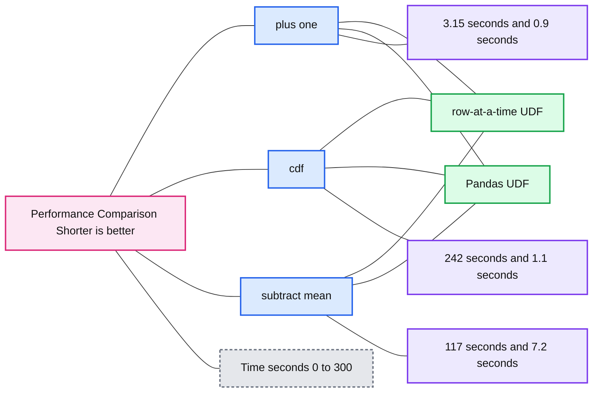

# Introducing Pandas UDF for PySpark

*How to run your native Python code with PySpark, fast.*

- Source: https://www.databricks.com/blog/2017/10/30/introducing-vectorized-udfs-for-pyspark.html
- Published: 2017-10-30
- Authors: Li Jin
- Categories: solutions, engineering, open-source, data-science-machine-learning
- Images: 1 total, 1 extracted as architecture

*Free Edition has replaced Community Edition, offering enhanced features at no cost. Start using *[*Free Edition *](https://login.databricks.com/?intent=SIGN_UP&amp;signup_experience_step=EXPRESS&amp;provider=DB_FREE_TIER&amp;dbx_source=www)*today.*
 

> NOTE: Spark 3.0 introduced a new pandas UDF. You can find more details in the following blog post: [New Pandas UDFs and Python Type Hints in the Upcoming Release of Apache Spark 3.0](https://www.databricks.com/blog/2020/05/20/new-pandas-udfs-and-python-type-hints-in-the-upcoming-release-of-apache-spark-3-0.html)

*This is a guest community post from Li Jin, a software engineer at Two Sigma Investments, LP in New York. This blog is also posted on *[*Two Sigma*](https://www.twosigma.com/articles/introducing-pandas-udfs-for-pyspark/)

[Try this notebook in Databricks](https://databricks-prod-cloudfront.cloud.databricks.com/public/4027ec902e239c93eaaa8714f173bcfc/1281142885375883/2174302049319883/7729323681064935/latest.html)

**UPDATE**: This blog was updated on Feb 22, 2018, to include some changes.

This blog post introduces the Pandas UDFs (a.k.a. Vectorized UDFs) feature in the upcoming Apache Spark 2.3 release that substantially improves the performance and usability of user-defined functions (UDFs) in Python.

Over the past few years, Python has become the [default language](https://stackoverflow.blog/2017/09/14/python-growing-quickly/) for data scientists. Packages such as [pandas](https://pandas.pydata.org/), [numpy](https://numpy.org/), [statsmodel](https://www.statsmodels.org/stable/index.html), and [scikit-learn](https://scikit-learn.org/stable/) have gained great adoption and become the mainstream toolkits. At the same time, [Apache Spark](https://www.databricks.com/glossary/what-is-apache-spark) has become the de facto standard in processing big data. To enable data scientists to leverage the value of big data, Spark added a Python API in version 0.7, with support for [user-defined functions](https://docs.databricks.com/spark/latest/spark-sql/udf-python.html). These user-defined functions operate one-row-at-a-time, and thus suffer from high serialization and invocation overhead. As a result, many data pipelines define UDFs in Java and Scala and then invoke them from Python.

Pandas UDFs built on top of [Apache Arrow](https://arrow.apache.org/) bring you the best of both worlds—the ability to define low-overhead, high-performance UDFs entirely in Python.

In Spark 2.3, there will be two types of Pandas UDFs: scalar and grouped map. Next, we illustrate their usage using four example programs: Plus One, Cumulative Probability, Subtract Mean, Ordinary Least Squares Linear Regression.

## Scalar Pandas UDFs

Scalar Pandas UDFs are used for vectorizing scalar operations. To define a scalar Pandas UDF, simply use `@pandas_udf` to annotate a Python function that takes in `pandas.Series` as arguments and returns another `pandas.Series` of the same size. Below we illustrate using two examples: Plus One and Cumulative Probability.

### Plus One

Computing **v + 1** is a simple example for demonstrating differences between row-at-a-time UDFs and scalar Pandas UDFs. Note that built-in column operators can perform much faster in this scenario.

Using row-at-a-time UDFs:

Using Pandas UDFs:

The examples above define a row-at-a-time UDF "plus_one" and a scalar Pandas UDF "pandas_plus_one" that performs the same "plus one" computation. The UDF definitions are the same except the function decorators: "udf" vs "pandas_udf".

In the row-at-a-time version, the user-defined function takes a double "v" and returns the result of "v + 1" as a double. In the Pandas version, the user-defined function takes a `pandas.Series` "v" and returns the result of "v + 1" as a `pandas.Series`. Because "v + 1" is vectorized on `pandas.Series`, the Pandas version is much faster than the row-at-a-time version.

Note that there are two important requirements when using scalar pandas UDFs:

- The input and output series must have the same size.
- How a column is split into multiple `pandas.Series` is internal to Spark, and therefore the result of user-defined function must be independent of the splitting.

## Cumulative Probability

This example shows a more practical use of the scalar Pandas UDF: computing the [cumulative probability](https://en.wikipedia.org/wiki/Cumulative_distribution_function) of a value in a normal distribution N(0,1) using [scipy](https://scipy.org/) package.

`stats.norm.cdf`works both on a scalar value and `pandas.Series`, and this example can be written with the row-at-a-time UDFs as well. Similar to the previous example, the Pandas version runs much faster, as shown later in the "Performance Comparison" section.

## Grouped Map Pandas UDFs

Python users are fairly familiar with the split-apply-combine pattern in data analysis. Grouped map Pandas UDFs are designed for this scenario, and they operate on all the data for some group, e.g., "for each date, apply this operation".

Grouped map Pandas UDFs first splits a Spark `DataFrame` into groups based on the conditions specified in the groupby operator, applies a user-defined function (`pandas.DataFrame` -> `pandas.DataFrame`) to each group, combines and returns the results as a new Spark `DataFrame`.

Grouped map Pandas UDFs uses the same function decorator `pandas_udf` as scalar Pandas UDFs, but they have a few differences:

- **Input of the user-defined function:**
  - Scalar: `pandas.Series`
  - Grouped map: `pandas.DataFrame`
- **Output of the user-defined function:**
  - Scalar: `pandas.Series`
  - Grouped map: `pandas.DataFrame`
- **Grouping semantics:**
  - Scalar: no grouping semantics
  - Grouped map: defined by "groupby" clause
- **Output size:**
  - Scalar: same as input size
  - Grouped map: any size
- **Return types in the function decorator:**
  - Scalar: a `DataType` that specifies the type of the returned `pandas.Series`
  - Grouped map: a `StructType` that specifies each column name and type of the returned `pandas.DataFrame`

Next, let us walk through two examples to illustrate the use cases of grouped map Pandas UDFs.

### Subtract Mean

This example shows a simple use of grouped map Pandas UDFs: subtracting mean from each value in the group.

In this example, we subtract mean of v from each value of v for each group. The grouping semantics is defined by the "groupby" function, i.e, each input `pandas.DataFrame` to the user-defined function has the same "id" value. The input and output schema of this user-defined function are the same, so we pass "df.schema" to the decorator `pandas_udf` for specifying the schema.

Grouped map Pandas UDFs can also be called as standalone Python functions on the driver. This is very useful for debugging, for example:

In the example above, we first convert a small subset of Spark `DataFrame` to a `pandas.DataFrame`, and then run *subtract_mean* as a standalone Python function on it. After verifying the function logics, we can call the UDF with Spark over the entire dataset.

### Ordinary Least Squares Linear Regression

The last example shows how to run OLS linear regression for each group using statsmodels. For each group, we calculate beta *b = (b1, b2) for X = (x1, x2)* according to statistical model *Y = bX + c*.

This example demonstrates that grouped map Pandas UDFs can be used with any arbitrary python function: `pandas.DataFrame -> pandas.DataFrame`. The returned `pandas.DataFrame` can have different number rows and columns as the input.

## Performance Comparison

Lastly, we want to show performance comparison between row-at-a-time UDFs and Pandas UDFs. We ran micro benchmarks for three of the above examples (plus one, cumulative probability and subtract mean).

### Configuration and Methodology

We ran the benchmark on a single node Spark cluster on Databricks Community Edition.

Configuration details:
Data: A 10M-row DataFrame with a Int column and a Double column
Cluster: 6.0 GB Memory, 0.88 Cores, 1 DBU
[Databricks runtime](https://www.databricks.com/glossary/what-is-databricks-runtime) version: Latest RC (4.0, Scala 2.11)

For the detailed implementation of the benchmark, check the [Pandas UDF Notebook](https://databricks-prod-cloudfront.cloud.databricks.com/public/4027ec902e239c93eaaa8714f173bcfc/1281142885375883/2174302049319883/7729323681064935/latest.html).

**Summary:** Benchmark chart comparing row-at-a-time UDF and Pandas UDF execution times across three workloads.

**Components:**

- Row-at-a-time UDF
- Pandas UDF
- Plus one workload
- CDF workload
- Subtract mean workload
- Time in seconds axis
- Performance Comparison chart

**Flows:**

- None visible.

**Numbers:** 0, 50, 100, 150, 200, 250, 300, 3.15, 0.9, 242, 1.1, 117, 7.2

source image: https://www.databricks.com/wp-content/uploads/2017/10/image1-4.png

As shown in the charts, Pandas UDFs perform much better than row-at-a-time UDFs across the board, ranging from **3x to over 100x.**

## Conclusion and Future Work

The upcoming Spark 2.3 release lays down the foundation for substantially improving the capabilities and performance of user-defined functions in Python. In the future, we plan to introduce support for Pandas UDFs in aggregations and window functions. The related work can be tracked in [SPARK-22216](https://issues.apache.org/jira/browse/SPARK-22216).

Pandas UDFs is a great example of the Spark community effort. We would like to thank Bryan Cutler, Hyukjin Kwon, Jeff Reback, Liang-Chi Hsieh, Leif Walsh, Li Jin, Reynold Xin, Takuya Ueshin, Wenchen Fan, Wes McKinney, Xiao Li and many others for their contributions. Finally, special thanks to Apache Arrow community for making this work possible.

## What's Next

You can try the [Pandas UDF notebook](https://databricks-prod-cloudfront.cloud.databricks.com/public/4027ec902e239c93eaaa8714f173bcfc/1281142885375883/2174302049319883/7729323681064935/latest.html) and this feature is now available as part of [Databricks Runtime 4.0 beta](https://www.databricks.com/try-databricks).
