# Access Control for Databricks Jobs

- Source: https://www.databricks.com/blog/2017/11/01/access-control-databricks-jobs.html
- Published: 2017-11-01
- Authors: Yandong Mao, Yu Peng, Andrew Chen, Prakash Chockalingam
- Categories: company, product, engineering, announcements, platform
- Images: 6 total, 1 extracted as architecture

*Secure your production workloads end-to-end with Databricks’ comprehensive access control system*

---

Databricks offers role-based access control for clusters and workspace to secure infrastructure and user code. Today, we are excited to announce role-based access control for Databricks Jobs as well so that users can easily control who can access the job output and control the execution of their production workloads.

A Databricks Job consists of a built-in scheduler, the task that you want to run, logs, output of the runs, alerting and monitoring policies. Databricks Jobs allows users to easily schedule [Notebooks](https://docs.databricks.com/dev-tools/api/latest/jobs.html#jobsnotebooktask), [Jars from S3](https://docs.databricks.com/dev-tools/api/latest/jobs.html#jobssparkjartask), [Python files from S3](https://docs.databricks.com/dev-tools/api/latest/jobs.html#jobssparkpythontask) and also offers support for [spark-submit](https://docs.databricks.com/dev-tools/api/latest/jobs.html#jobssparksubmittask). Users can also trigger their jobs from external systems like Airflow or Jenkins.

## Sensitivities with scheduled production jobs

When running production workloads, users want to control who can access part of the scheduled jobs and actions. For example:

- **Securing job output:** A phenomenal advantage of Databricks Jobs is that it allows users to easily schedule notebooks and view the results of different runs as shown below. These outputs can contain personally identifiable information (PII) data or other sensitive information. Users want only certain colleagues to look at this information but without giving them any other controls on the job.

**Summary:** A Databricks Spark notebook displays historical streaming log counts over time.

**Components:**

- Databricks notebook
- Spark
- `streaming.logs`
- `usageLogsHistorical` dataset
- Timestamp conversion and aggregation query
- Time-series count chart

**Flows:**

- `usageLogsHistorical` -> Timestamp conversion: converts timestamps from UTC
- Timestamp conversion -> Aggregation query: filters and counts records
- Aggregation query -> Time-series count chart: orders results by time and displays counts

**Numbers:** 844; 80,000,000; 60,000,000; 40,000,000; 20,000,000; 0; 2016-11-28; 2017-01-04; 2017-02-10; 2017-03-19; 2017-04-25; 2017-06-01; 2017-07-08

```mermaid
%% Shows the Databricks Spark log analysis flow
flowchart LR
    A[Databricks notebook] -->|runs query| B[Spark]
    B -->|reads logs| C[streaming.logs]
    C -->|provides records| D[usageLogsHistorical]
    D -->|converts timestamps| E[Aggregation query]
    E -->|counts by time| F[Time series count chart]

    classDef client   fill:#dbeafe,stroke:#2563eb,stroke-width:2px,color:#111
    classDef service  fill:#dcfce7,stroke:#16a34a,stroke-width:2px,color:#111
    classDef store    fill:#ede9fe,stroke:#7c3aed,stroke-width:2px,color:#111
    classDef cache    fill:#fef3c7,stroke:#d97706,stroke-width:2px,color:#111
    classDef queue    fill:#cffafe,stroke:#0891b2,stroke-width:2px,color:#111
    classDef critical fill:#fee2e2,stroke:#dc2626,stroke-width:4px,color:#111
    classDef external fill:#e5e7eb,stroke:#6b7280,stroke-width:2px,color:#111,stroke-dasharray:4 3
    classDef decision fill:#fce7f3,stroke:#db2777,stroke-width:2px,color:#111

    class A client
    class B,E service
    class C,D store
    class F service
```

source image: https://www.databricks.com/wp-content/uploads/2017/11/figure-1.png

- **Securing logs:** Logs can contain sensitive information and users don’t want unprivileged users to view the logs.
- **Controlling job execution: **As an owner of a job, you want to restrict access to team members so only they can cancel any bad runs or trigger some manual runs for troubleshooting.
- **Controlling access to job properties: **Databricks Jobs offers many great functionalities like custom alerting, monitoring, timeouts for job runs, etc. Users don’t want others changing the properties of their jobs.
- **Job ownership: **Every Databricks Job has an owner on behalf of whom all the scheduled runs are executed. When an owner leaves an organization, there needs to be an easy way to switch the ownership, so that jobs are not left as orphans. **

**

## Securing your production workloads in Databricks

We are excited to introduce fine-grained access control for Databricks Jobs to safeguard different aspects of your production workloads from unprivileged users in the organization.

#### **Enabling Jobs Access Control**

Admins can enable access control for jobs along with the clusters in the admin console.

#### **Permission Levels**

Once Jobs ACLs are enabled, each user or group can have one of five different permission levels on a Databricks Job. Admin or job owner can give other users or groups one or more of these permissions. The permission levels form a lineage where a user with higher permission level can do anything the lower levels allow. The below table captures the permission levels in order and what they entail.

| **Permissions** | **What do the permissions allow?** |
|---|---|
| Default | Allows a user only to look at the job settings and run metadata. The user cannot view any other sensitive information like job output or logs. |
| Can View | Allows the user only to look at the job output and logs along with job settings. The user cannot control the job execution. |
| Manage Runs | Allows the user to view the output and also cancel and trigger individual runs. |
| Owner | Allows the user to edit job settings. |
| Admin | Allows the user to change job owner. |

 

These permissions can be given from the ‘Advanced’ section in the job details page as shown below:

#### **Job Ownership**

Only a job owner can change the job settings. If a job owner leaves the organization or wishes to transfer the ownership, the admin can easily switch the owner of that job. There can be only one owner for the job.

#### **User Role and Actions **

The below table summarizes the different user roles and what actions they are allowed.

| ***User Role→*** ***Actions↓*** | **Default** | **User with view permission** | **User with manage run permission** | **Job owner** | **Admins** |
|---|---|---|---|---|---|
| View job settings | ✅ | ✅ | ✅ | ✅ | ✅ |
| View current and historical job output |  | ✅ | ✅ | ✅ | ✅ |
| View current and historical logs |  | ✅ | ✅ | ✅ | ✅ |
| Trigger a new run |  |  | ✅ | ✅ | ✅ |
| Cancel current runs |  |  | ✅ | ✅ | ✅ |
| Modify cluster & job settings |  |  |  | ✅ | ✅ |
| Modify job permissions |  |  |  | ✅ | ✅ |
| Delete the job |  |  |  | ✅ | ✅ |
| Change owner to someone else |  |  |  |  | ✅ |

## End-to-end comprehensive access control system

Users can control access to infrastructure, code and data by leveraging all of the access control mechanisms provided by Databricks:

- **Cluster ACLs:** All jobs require clusters and users can separately give fine-grained access control to users and groups on what permissions they have on the underlying infrastructure on which the production jobs run.
- **Workspace ACLs:** Users can schedule notebooks from the Databricks workspace. Using the workspace ACLs, users can control who can read/run/modify their production code.
- **Data ACLs**: Access control to data is offered through Amazon’s IAM roles. Databricks also supports access control on IAM roles so that admins can control which users are entitled to use what IAM roles in Databricks.
- **Jobs ACLs**: As illustrated above, access control on jobs themselves empower users to secure their production jobs from unprivileged users.

## What’s next?

Start running your Spark jobs on Databricks by [signing up for a free trial of Databricks](https://accounts.cloud.databricks.com/registration.html#signup).

If you have any questions, you can [contact us with your questions](https://www.databricks.com/company/contact).
