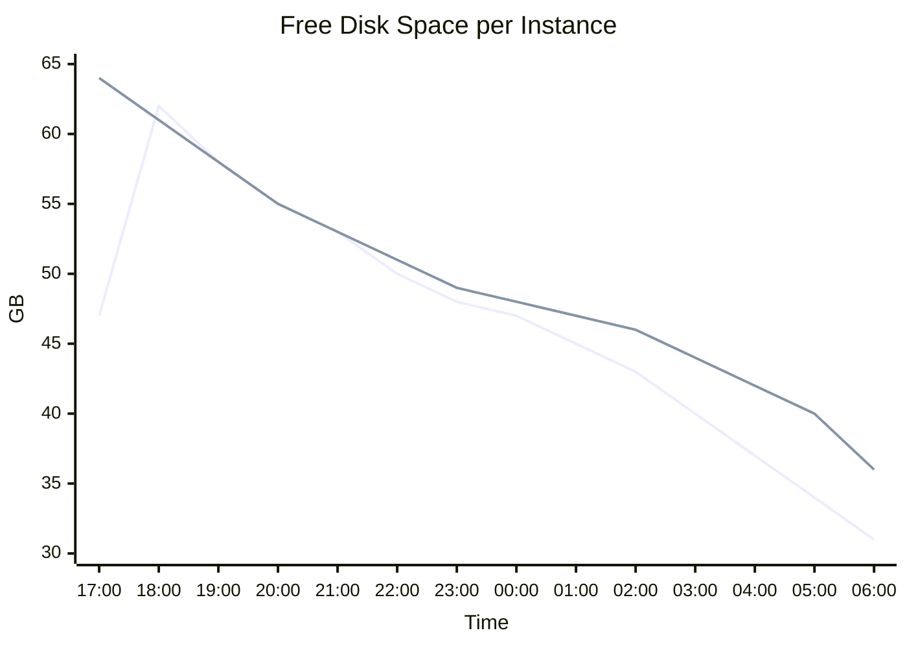

# Transparent Autoscaling of Instance Storage

- Source: https://www.databricks.com/blog/2017/12/01/transparent-autoscaling-of-instance-storage.html
- Published: 2017-12-01
- Authors: Greg Owen, Srinath Shankar, Prakash Chockalingam
- Categories: platform, product, engineering, company
- Images: 4 total, 3 extracted as architecture

Big data workloads require access to disk space for a variety of operations, generally when intermediate results will not fit in memory. When the required disk space is not available, the jobs fail. To avoid job failures, data engineers and scientists typically waste time trying to estimate the necessary amount of disk via trial and error: allocate a fixed amount of EBS storage, run the job, and look at system metrics to see if the job is likely to run out of disk. This experimentation - which becomes especially complicated when multiple jobs are running on a single cluster - is expensive and distracts these professionals from their real goals.

With Databricks’ unified analytics platform, you can say goodbye to this problem forever. The platform now allows instance storage to transparently autoscale independently from compute resources so that data scientists and engineers can focus on finding the correct algorithms rather than the correct amount of disk space. As part of the [Databricks Serverless](https://www.databricks.com/blog/2017/06/07/databricks-serverless-next-generation-resource-management-for-apache-spark.html) infrastructure, storage auto-scaling makes big data simple for all users.

### Why is instance storage required?

When Apache Spark processes data, it needs to generate and store intermediate results for reliability and performance. Typically, they are stored in memory and when memory gets filled, they are spilled to disk. Some examples of intermediate data that are stored in memory backed by disk include:

- **Shuffle:** When data is exchanged between executors as the result of operations like joins and aggregations, Spark stores that data as shuffle files.
- **Broadcast caching:** Spark sometimes broadcasts data to different workers so that they can be stored in the worker nodes and accessed quickly when needed.
- **Data caching:** Spark caches data that is frequently accessed from S3 in the local disk of the cluster. This is done to boost I/O performance.

### Problems with provisioning instance storage

- **Hard to predict: **The amount of disk space that Spark will require has an indirect relationship to the size of the data being operated on: it depends on factors like data compression, data distribution, and the number of joins, aggregates and sorts in the job. As a result, it is very difficult for end users to predict in advance how much disk space they will need. Data engineers typically spend time in trial and error to come up with the right amount of disk space for their job. This process is extremely painful as the trial and error approach can take sometimes days to get a large Spark job working without any errors. Because it is so difficult to estimate, we commonly see users "play it safe" by provisioning significantly more disk space than they think will be necessary, which increases costs.

**Summary:** The chart shows free disk space per instance steadily decreasing from about 64 GB to 0 GB over time.

**Components:**

- Free disk space per instance: instance storage capacity measured in GB

**Flows:**

- none

**Numbers:** 0, 10, 20, 30, 40, 50, 60, 70 GB; 16:16, 16:18, 16:20, 16:22, 16:24, 16:26, 16:28, 16:30, 16:32, 16:34, 16:36, 16:38, 16:40, 16:42, 16:44, 16:46, 16:48, 16:50, 16:52; approximately 64 GB maximum and 0 GB minimum

source image: https://www.databricks.com/wp-content/uploads/2017/12/Disk-getting-filled.png

Figure 1. Graph showing the disk space for an instance getting filled. When the free disk space reaches 0, the job will fail.

- **Data skew and disk utilization:** Within a single job, some workers may require more disk space than others. For example, a join of two data sets may leave some workers with many more rows than other workers if the join keys are not evenly distributed. In a world of statically-allocated disk space, a data engineer must give every worker enough disk space to cover the load of the most-burdened worker. This is not optimum utilization and will be expensive when processing large volumes of data.

**Summary:** The chart compares free disk space over time for two instances in the same cluster, showing data skew as one instance loses disk space faster than the other.

**Components:**

- Instance one, technology not specified
- Instance two, technology not specified
- Free disk space metric, measured in GB
- Time axis, spanning approximately 17:00 to 06:00

**Flows:**

- none

**Numbers:** 65 GB, 60 GB, 55 GB, 50 GB, 45 GB, 40 GB, 35 GB, 30 GB; 17:00, 18:00, 19:00, 20:00, 21:00, 22:00, 23:00, 00:00, 01:00, 02:00, 03:00, 04:00, 05:00, 06:00; 2 instances

source image: https://www.databricks.com/wp-content/uploads/2017/12/data-scew.png

Figure 2. Graph showing the free disk space for 2 instances in the same cluster. Because of data skew, one of the instance’s disk space gets filled while the other still has disk space left.

- **Encryption of data at rest:** Security compliance typically requires all data at rest to be encrypted. Today, Amazon does not provide an easy way to encrypt instance local storage by default. To comply with their organization's security requirements, we typically see users provision encrypted EBS volumes and make sure Spark does not use the local disks attached to the instances. For instance types with highly-performant disks, this leads to a loss in performance.

### Autoscaling Instance Storage

Databricks’ new autoscaling instance storage leverages Logical Volume Manager (LVM) in Linux and the ability to add storage resources (e.g. EBS in AWS) to running instances in order to dynamically increase available storage without adding more instances. It addresses all three of the above problems:

- **Automatic Provisioning:** As an instance runs out of free disk space, we will automatically provision and attach new EBS volumes to the instance (the volumes will be automatically released when the load on the cluster reduces and we spin down the instances). Users  no longer need to worry about how much disk space is required for their jobs.

**Optimal Provisioning: **These EBS volumes are provisioned only for the workers that need them. For large data sets with heavy skew, attaching additional volumes only when they are needed will tremendously reduce EBS costs.

**Summary:** The chart shows free disk space per instance repeatedly falling and jumping upward as additional EBS volumes are attached.

**Components:**

- Instance free disk space, measured in GB
- EBS volume provisioning and attachment

**Flows:**

- Instance free disk space -> EBS volume provisioning: free space drops below the minimum threshold
- EBS volume provisioning -> Instance free disk space: attach another volume and increase available space

**Numbers:** 1.4 K GB, 1.2 K GB, 1.0 K GB, 800 GB, 600 GB, 400 GB, 200 GB, 0 GB; 18:00, 20:00, 22:00, 00:00, 02:00, 04:00, 06:00, 08:00, 10:00, 12:00, 14:00, 16:00, 18:00, 20:00, 22:00, 00:00

source image: https://www.databricks.com/wp-content/uploads/2017/12/Provisioning.png

Figure 3. Graph showing the free disk space for an instance with autoscaling local storage turned on. Whenever the free disk space drops below our minimum threshold, we request another EBS volume and attach it to the instance. Subsequent requests allocate ever-larger EBS volumes until we hit a pre-configured maximum total disk space.

- **Secure Provisioning: **Users can optionally choose to encrypt all the data in the instance storage - both local storage and EBS volumes. This means that:
  - Users no longer need to worry about meeting their security compliance requirements. All data at rest is encrypted.
  - Security-conscious users can take advantage of instances with high-throughput local disks, since the data stored in the local storage will be encrypted.

### Serverless and Autoscaling Instance Storage

We [announced Databricks Serverless in Spark Summit](https://www.google.com/url?q=https://www.databricks.com/blog/2017/06/07/databricks-serverless-next-generation-resource-management-for-apache-spark.html&sa=D&ust=1512151146389000&usg=AFQjCNGnH8zoOouJBDiecID5l6j-F9AkZg) in June 2017 with the goal of making it easier than ever for multiple data scientists to access the full power of Apache Spark without having to deal with cumbersome infrastructure setup. Autoscaling instance storage is automatically enabled in Serverless, which complements Serverless' auto-scaling compute resources.

### Conclusion

Databricks’ autoscaling instance storage allows users to run jobs without worrying about how much disk space they will need. Autoscaling local storage takes the guesswork out of provisioning disk, adds storage only for instances that need them, and makes instance local disks available for security-conscious users by encrypting all data stored in the instance storage. The result is a simpler, cheaper, more secure way to get value from your data.

[Sign up for a free trial of Databricks](https://www.google.com/url?q=https://accounts.cloud.databricks.com/registration.html%23signup&sa=D&ust=1512151146390000&usg=AFQjCNEGs4uy9R3R3ZHijSweelKI2ITTSQ) to see autoscaling instance storage in action. If you would like to see a demo, [register here](https://www.databricks.com/company/contact).
